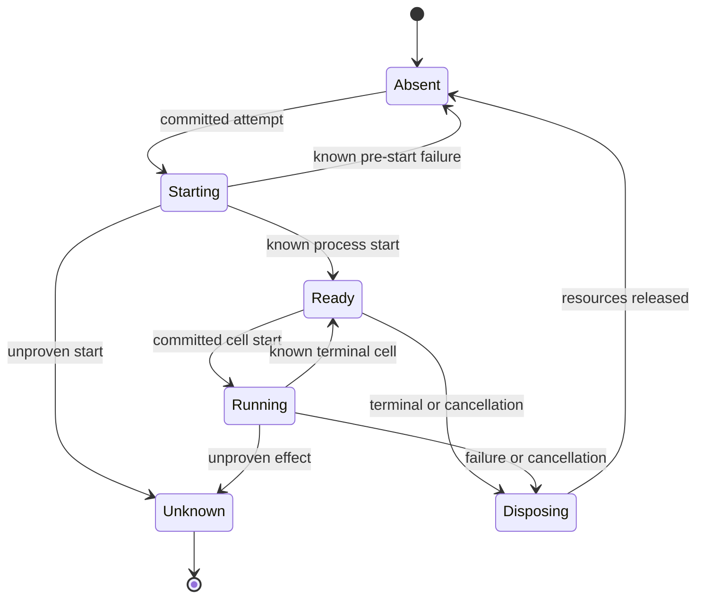

# Run-Scoped IPython Kernel Lifecycle

## Status and scope

**Approved future architecture, documentation-only.** This document is the sole
detailed owner for future run-scoped IPython kernel epochs, foreground cells,
namespace checkpoints, kernel-local background work, safe kernel projections,
and kernel recovery. It does not authorize a crate, Python/Jupyter dependency,
listener, storage migration, wire implementation, process supervisor, or
production kernel execution.

It applies only to future Mandate and VerifierMandate execution. M3/M4 bytes,
IDs, UUIDs, digests, cursors, events, snapshots, queue tickets, provider
behavior, replay, recovery, and M4 `ToolCallRecorded -> tool_execution_unavailable`
retain their recorded ordinary semantics. Retained session-scoped IPython/RLM
material remains research provenance and historical-only where it conflicts with
architectures 13--19.

## Ownership and non-authorities

Architecture 13 owns Mandate lifecycle, fresh admission, uncertainty, and exact
reconciliation. Architecture 14 owns canonical execution meaning and decode
compatibility. Architecture 15 owns registry selection, direct tool admission,
`ToolCallId`, generic tool-loop facts, `ToolCallStarted`, and publication.
Architecture 16 owns readiness-driven admission. Architecture 17 owns child
graph and verifier authority. Architecture 18 owns MCP lifecycle. Architecture
19 owns bridge negotiation, grants, operation identity, ingress, delivery, and
bridge recovery.

This document owns only private sidecar creation/disposal, kernel epochs,
foreground cells, namespace/checkpoint lifecycle, safe output normalization,
kernel-local background restrictions, kernel readiness/capacity, and
kernel-specific attempt evidence. A kernel is not a daemon, registry, tool,
provider, scheduler, persistence authority, child executor, verifier, MCP client,
sandbox, or OS privilege boundary. Namespace, checkpoint, Python value, output,
kernel epoch, task, process, or resource never grants lifecycle, scheduling,
tool, child, verifier, MCP, or reconciliation authority.

## Immutable selection and run scope

Architecture 14 owns canonical framing. This document owns the semantic fields
of the credential-free kernel selection in future Mandate execution meaning:

```text
MandateKernelSelectionV1
  kernel_contract_revision
  runtime_family = IPython
  interpreter_contract_revision
  namespace_contract_revision
  checkpoint_contract_revision
  checkpoint_policy = Disabled | Optional | Required
  host_request_contract_revision
  safe_projection_revision
  canonical_kernel_selection_digest
```

The selection freezes executable contract, never a live process or namespace. It
excludes process/kernel/daemon epoch identities, bridge grants, channels, task or
socket handles, namespace values, checkpoint payload, credentials, endpoints,
current interpreter/environment, registry, readiness, child graph, and MCP state.
Unknown, corrupt, unsupported, or mismatched selection blocks dependent kernel
work before process creation or restoration and never falls back to current state.

One live `KernelEpochId` belongs to exactly one admitted `RunId`. It is created
lazily only after recovery completes, a supported active Mandate run is reread,
the exact kernel/bridge/tool selections validate, required live capacity exists,
and no cancellation or uncertainty gate applies. A fresh run never reuses a live
kernel or namespace. Process creation occurs outside semantic transactions.



`Unknown` is attempt evidence, not a kernel-owned product state. Architecture 13
uses exact unproven started evidence to pause only the owning Mandate.

## Foreground cells, output, and host requests

One epoch executes at most one foreground cell at a time. A cell binding is
immutable and typed:

```text
KernelExecutionBindingV1
  kernel_execution_id
  mandate_id
  mandate_revision
  run_id
  model_step_id
  kernel_selection_reference
  kernel_epoch_id
  typed_source_digest
  operation_identity
  attempt_reference
```

It excludes raw source from public/durable projections. No Python execution
occurs in the binding transaction. A kernel-specific cell start records private
attempt evidence for direct Python/process effects; it does not replace
architecture 15's `ToolCallStarted` for any routed host operation.

Safe output is a closed text-only family, such as `Stdout`, `Stderr`,
`DisplayText`, and safe `Error`. Raw Jupyter frames, rich MIME, binary data,
arbitrary metadata, raw tracebacks, Python objects, resources, and implementation
errors remain private. Output uses architecture 15's existing run/tool-loop
facts, cursor, terminal result, post-commit reread, and publication gate. Partial
output is observational only; only a complete safe terminal projection may enter
a later model step. Unrepresentable output fails before public publication without
truncation or partial commit.

Kernel host requests consume architecture 19. Every request carries a current
grant and new `BridgeOperationId`; architecture 19 binds the operation and
architecture 15 assigns `ToolCallId`, admits, starts, records, and publishes the
tool action. The kernel cannot create a listener, registry, direct primitive path,
sequence, or result channel. Equal operation reuse returns durable evidence;
changed reuse fails before effect. Grant expiry, cell closure, cancellation,
kernel disposal, and restart prevent new host requests.
## Checkpoints and replacement kernels

A verified checkpoint may be created only after a known successful foreground
cell and no cell-originated host attempt remains unresolved. It is private
convenience state, not durable application progress, an external-effect proof,
or a replacement for run facts/tool results.

```text
KernelCheckpointMetadataV1
  checkpoint_id
  kernel_selection_reference
  namespace_contract_revision
  serializer_revision
  source_kernel_epoch
  source_execution_id
  source_run_id
  source_mandate_revision
  parent_checkpoint_reference
  payload_digest
  bounded_size
  verification_status
  omission_summary
  canonical_metadata_digest
```

Payload is deterministic, typed, versioned, bounded, and private. It contains no
executable payload, open file/process/socket/task handle, provider/MCP/Jupyter
resource, bridge grant, credential, endpoint, raw traceback, or implementation
resource. Unsupported values are explicitly omitted with safe metadata, never
guessed or stringified. Payload, metadata, verification, generation promotion,
and publication are atomic: a failed generation leaves the prior verified one
intact and never becomes latest verified.

Only a selected verified checkpoint may seed a replacement kernel for a new run.
`Required` restoration failure blocks dependent work before effect. `Optional`
restoration failure starts an empty namespace only in that new run with a typed
degraded-restoration result. Restoration never revives a grant, operation, task,
process, provider request, child, MCP resource, unfinished run, or external
effect.

## Background work, cancellation, and recovery

Background computation is private kernel convenience work only. It cannot create
a trigger, child, scheduler candidate, durable continuation, or independent tool
authority. It may use a host request only while carrying the current foreground
grant. Expired-grant requests fail immediately and are never queued. Tasks and
their output are discarded on cell/run/epoch termination and are excluded from
checkpoints.

Cancellation terminates the attached epoch without claiming rollback. Before
start it records known pre-effect cancellation/interruption. After start, known
terminal proof remains known; absent proof is exact `ExternalEffectUnknown` under
architecture 13. Late cell output, host responses, fragments, and results after
cancellation, terminalization, epoch replacement, grant expiry, or restart are
non-authoritative and cannot append facts or repair uncertainty.

Recovery completes before kernel readiness, attachment, scheduling, or admission.
It invalidates grants, refuses old-sidecar adoption, classifies unfinished kernel
attempts from durable evidence, disposes discoverable private resources without a
rollback claim, and verifies stored checkpoints without executing them. It never
resumes, retries, reattaches, reruns, polls, or redisplays old kernel/cell/task/
bridge/tool/child/MCP work. Later work requires a new RunId, epoch, grant, cell
identity, and operation identities.

## Child, verifier, MCP, protocol, and compatibility boundaries

A child, verifier, or unrelated Mandate never receives a live kernel, namespace,
grant, task, process, connection, MCP selection, or unfinished effect. A child
may receive only a separately selected verified checkpoint copy; it is
non-authorizing, independent, and child-local. Kernel state/evidence never
widens verifier authority or mutates a target. Kernel-originated MCP work still
uses the fixed `mcp` slot through architectures 19, 15, and 18; checkpoints never
contain live MCP state and later runs reacquire capabilities.

Future kernel delivery is separately negotiated, correlated initial replay or
typed resync/error followed by history-before-live frames under existing durable
sequence owners. It is read-only: replay/reconnect cannot create a kernel,
restore a namespace, execute a cell, issue a grant, repeat a host request, start
a child, or invoke MCP. Unnegotiated peers fail closed.

M3/M4 and retained IPython/RLM records gain no kernel selection, epoch,
checkpoint, grant, operation, Mandate, child, verifier, MCP, activity, policy, or
execution-kind state. M4 tool calls remain denial evidence. No current kernel,
process, checkpoint, registry, configuration, bridge, provider, model, graph, or
UI state may reconstruct missing meaning. The trusted-local model remains
explicit: direct Python OS APIs can bypass the facade and are not sandboxed or
fully observable.

## Dependencies, non-goals, and evidence

This document depends on architectures 13--19 and decisions 0001--0011. It does
not define Python/Jupyter dependencies, process supervision implementation,
storage/wire tags, migrations, retention, encryption, resource-limit values, RLM
executor topology, continual harness, Skills/Goals/context, provider evolution,
session forks, activity/UI, direct MCP administration, Cargo, Makefile/CI, or
production activation.

A later activating specification must declare exact crate owners, test targets,
coverage tiers, feature profiles, storage/wire versions, dependency policy, and
architecture fixtures, then pass `make quick`, `make verify`, and Linux/Windows
CI. It must cover:

- canonical selection/checkpoint metadata goldens and invalid vectors;
- run-scoped lazy creation, epoch fencing, no sharing, required/optional restore,
  and no-current-state reconstruction;
- binding/start/output/result/checkpoint/publish fault injection and no effect
  inside transactions;
- cell/host-request/process/cancellation/crash/late-message/restart/no-resume
  matrices and exact uncertainty/reconciliation;
- bridge-only host operations, idempotency, changed reuse, stale grants/tasks,
  and no-bypass fixtures;
- child checkpoint-copy isolation, verifier non-authority, MCP reacquisition,
  negotiated replay/resync/history-before-live, and zero-effect reconnect;
- M3/M4 and retained IPython/RLM byte/meaning/recovery/provider/tool-denial
  preservation and historical startup; and
- fake-secret, Python value, traceback, Jupyter frame, path, handle, process,
  checkpoint-payload, resource, and corrupt-byte absence from every public or
  durable surface.

Architecture 21 owns Goal, Skill, context, memory, and compaction semantics. Kernel steps consume only immutable safe context projections; context cannot create an epoch, disclose private namespace/checkpoint state, issue a host request, or reconstruct missing kernel meaning.

Architecture 22 owns provider profile/capability semantics. Kernel state,
checkpoints, and namespaces cannot select a provider, retain a provider
continuation, or carry private provider clients/resources.
