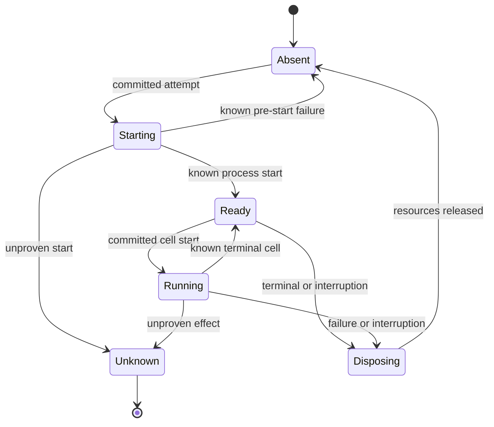

# Run-Scoped IPython Kernel Lifecycle

**Approved future design. Not implemented; activation requires an activating specification.**

Owner: architecture 20.

This document owns future run-scoped IPython kernel epochs, foreground cells, namespace checkpoints, kernel-local
background work, safe kernel projections, and kernel recovery. It applies only to future run execution. Retained
session-scoped IPython/RLM material remains research provenance and historical-only where it conflicts with
architectures 15--19.

## Ownership and non-authorities

The removed execution-meaning machinery ([architecture
02](02-dto-and-contract-policy.md)) leaves no live path; 15 owns frozen tool
selection, direct tool admission, `ToolCallId`, generic tool-loop records, the committed call start, and publication;
18 owns MCP lifecycle; 19 owns bridge attachment, grants, operation identity, ingress, delivery, and bridge recovery.

This document owns only private sidecar creation/disposal, kernel epochs, foreground cells, namespace/checkpoint
lifecycle, safe output normalization, kernel-local background restrictions, kernel readiness/capacity, and
kernel-specific attempt evidence. A kernel is not a daemon, registry, tool, provider, persistence authority,
child executor, MCP client, sandbox, or OS privilege boundary. Namespace, checkpoint, Python value, output, kernel
epoch, task, process, or resource never grants lifecycle, tool, child, MCP, or reconciliation authority.

## Immutable selection and run scope

One live `KernelEpochId` belongs to exactly one admitted `RunId`. A persistent process, if retained for operational
reasons, is not an executable epoch and cannot carry a usable namespace across runs. A new run receives a fresh epoch;
only an explicitly verified checkpoint projection may seed it. Session-scoped kernel and fixed idle/concurrency limits
in retained research are historical provenance, not future run policy.

This document owns the semantic fields of the credential-free kernel selection in the future typed run record
(typed serde JSON, [architecture 02](02-dto-and-contract-policy.md)):

```text
KernelSelectionV1
  kernel_contract_revision
  runtime_family = IPython
  interpreter_contract_revision
  namespace_contract_revision
  checkpoint_contract_revision
  checkpoint_policy = Disabled | Optional | Required
  host_request_contract_revision
  safe_projection_revision
  script_library_reference
```

The selection freezes executable contract, never a live process or namespace, and excludes process/kernel/daemon epoch
identities, bridge grants, channels, task or socket handles, namespace values, checkpoint payload, credentials,
endpoints, current interpreter/environment, registry, readiness, child graph, and MCP state. Unknown, corrupt,
unsupported, or mismatched selection blocks dependent kernel work before process creation or restoration and never falls
back to current state.

One additive bounded reference joins the selection: `script_library_reference` points at a `KernelScriptLibraryV1` value
(contract, import-surface, and evidence revisions for the logical workspace-relative path `.ir/scripts`). It is
credential-free and content-free, carries no
absolute or symlink-target path, and its absence means an empty import surface.

A `KernelEpochId` is created lazily only after a supported active run is reread, the exact kernel/bridge/tool selections
validate, required live capacity exists, and no cancellation gate applies.
A fresh run never reuses a live kernel or namespace. Process creation occurs outside semantic transactions.


```mermaid
stateDiagram
  [*] --> Absent
  Absent --> Starting: committed attempt
  Starting --> Ready: known process start
  Starting --> Absent: known pre-start failure
  Starting --> Unknown: unproven start
  Ready --> Running: committed cell start
  Running --> Ready: known terminal cell
  Running --> Unknown: unproven effect
  Ready --> Disposing: terminal or interruption
  Running --> Disposing: failure or interruption
  Disposing --> Absent: resources released
  Unknown --> [*]
```

`Unknown` is attempt evidence, not a kernel-owned product state. A started kernel attempt without terminal proof commits
a bounded partial result.

## Foreground cells, output, and host requests

One epoch executes at most one foreground cell at a time. A cell binding is immutable and typed:

```text
KernelExecutionBindingV1
  kernel_execution_id
  run_id
  model_step_index
  kernel_selection_reference
  kernel_epoch_id
  typed_source_reference
  operation_identity
  attempt_reference
```

It excludes raw source from public/durable projections. No Python execution occurs in the binding transaction. A
kernel-specific cell start records private attempt evidence for direct Python/process effects; it does not replace
architecture 15's committed call start for any routed host operation.

Safe output is a closed text-only family, such as `Stdout`, `Stderr`, `DisplayText`, and safe `Error`; output normalizes
Jupyter `stream`, `execute_result`, `display_data`, and `error` into ordered typed `KernelOutputChunkDto` values with
closed kind `Stdout`, `Stderr`, `DisplayText`, or `Error`, becoming the same post-commit content stream and one terminal
typed result. Raw Jupyter frames, rich MIME, binary data, arbitrary display metadata,
raw tracebacks, Python objects, resources, and implementation errors remain private. Output uses architecture 15's
existing run/tool-loop stream, terminal result, and publication gate. Partial output is
observational only; only a complete safe terminal projection may enter a later model step. Unrepresentable output
produces `kernel_output_unrepresentable` before public publication, without truncation or partial commit, and
the terminal result is never reconstructed from a formatted footer. Rich MIME/raw kernel output projection is an
accepted post-M5 future direction,
to be executed in Milestone 5+ as a bounded, credential-free surface that never substitutes for this closed text-only
safe projection and never crosses public or durable boundaries unredacted; it is not activated here.

Kernel host requests consume architecture 19. Every request carries a current grant and new `BridgeOperationId`;
architecture 19 binds the operation and architecture 15 assigns `ToolCallId`, admits, starts, records, and publishes the
tool action. The kernel cannot create a listener, registry, direct primitive path, or result channel. Equal
operation reuse returns durable evidence; changed reuse fails before effect. Grant expiry, cell closure, cancellation,
kernel disposal, and restart prevent new host requests.

## Project script library and script evidence

Agent-authored reusable modules live as ordinary project files under the logical workspace-relative path `.ir/scripts`
(`.ir` is the project-local hidden root), created and edited only through the frozen `write` and `edit` descriptors and
run through `execute` or a foreground cell.
The library is file material, not kernel state: it is never a namespace, checkpoint, epoch, task, or host-request
resource, and no selection, cell, or checkpoint carries its source.

An epoch's import surface is exactly the library directory named by `script_library_reference`; the parent, the
workspace root as a second library, and any other path never enter it. The directory is addressed as
`WorkspaceRoot.join('.ir/scripts')`; `WorkspaceRoot` is an addressing anchor and not a security boundary
([architecture 05](05-tools-workspace-and-hooks.md)), so
no lexical symlink or containment check gates the surface. A missing library directory yields an empty import surface,
so a project without saved modules behaves as if the capability were absent; an unreadable library directory fails
before effect with `kernel_script_library_unavailable`. Python-level import errors inside a cell stay ordinary safe
`Error` output under the closed text-only projection. A fresh run reuses a module by reading the file inside its own
epoch; namespace, cell, task, grant, and checkpoint state are never carried over to provide reuse, and the trusted-local
model is unchanged: library code is project material, not a sandbox, and direct Python OS APIs remain outside the
facade. A library path, an import, or a persisted module grants no lifecycle, tool, MCP, bridge, or confirmation
authority, and it never substitutes for a frozen registry selection. No secret material enters the library: credentials,
tokens, endpoints, and provider values are never written into it, and the redaction rules of [architecture
09](09-configuration-security-and-observability.md) apply to every path and error this capability produces.

Every foreground cell that imports library modules records bounded script-import evidence: for each imported module the
logical workspace-relative path, inside bounded counts and sizes. Evidence contains no source text, no absolute or
symlink-target path, and no Python value, and it is published as run facts through architecture 15's post-commit
publication gate under this document's cell rules. Evidence that cannot be represented inside its bounds fails before
publication with `kernel_script_library_unavailable`; it is never truncated, sampled, or stringified. Verified
checkpoint metadata may record the script-library reference as safe verification metadata, while checkpoint payload and
metadata keep excluding script source and any executable payload. Deleting a module stays an explicit user or agent
action through the ordinary tools; idle disposal, checkpoint promotion, and restart never collect one.

## Checkpoints and replacement kernels

A verified checkpoint may be created only after a known successful foreground cell and no cell-originated host attempt
remains unresolved. It is private convenience state, not durable application progress, an external-effect proof, or a
replacement for run facts/tool results.

```text
KernelCheckpointMetadataV1
  checkpoint_id
  kernel_selection_reference
  namespace_contract_revision
  serializer_revision
  source_kernel_epoch
  source_execution_id
  source_run_id
  parent_checkpoint_reference
  bounded_size
  verification_status
  omission_summary
```

Payload is deterministic, typed, versioned, bounded, and private. The first-scope checkpoint representation is
`kernel-state-snapshot-v1`: a typed, deterministic, size-bounded collection of values accepted by the code-owned
serializer. Payload and metadata contain no executable payload or code, open file/process/socket/task handle,
provider/MCP/Jupyter resource, raw Jupyter frame, provider SDK object, bridge grant, credential, endpoint, raw
traceback, or implementation resource; unsupported or non-serializable values are explicitly omitted with typed safe
metadata, never guessed or stringified. Verified metadata may additionally carry the project script-library reference;
the payload never carries script source.
Payload, metadata, verification, generation promotion, and publication are atomic: a failed generation leaves the prior
verified one intact and never becomes latest verified. Checkpoint payload stays private to the daemon-owned session
kernel service; public artifacts contain only safe generation, schema, bounded size, and restoration status.

Only a selected verified checkpoint may seed a replacement kernel for a new run. `Required` restoration failure blocks
dependent work before effect; `Optional` restoration failure starts an empty namespace only in that new run with a typed
degraded-restoration result. Restoration never revives a grant, operation, task, process, provider request, child, MCP
resource, unfinished run, or external effect. An uncreatable or unverifiable checkpoint after a successful cell produces
`kernel_checkpoint_unavailable`; the cell is not rerun and the run cannot silently continue. On restart, no execution or
action resumes; the next explicit execution may create a new kernel and restore only the latest verified checkpoint;
missing, corrupt, incompatible, or over-limit state produces `kernel_state_restore_unavailable`, the namespace starts
empty, and durable history remains readable.

## Background work, interruption, and recovery

Background computation is private kernel convenience work only. It cannot create a run, child, durable continuation, or
independent tool authority. It may use a host request only while carrying the current foreground grant; every bridge
request by background code must carry the grant of the currently attached foreground execution, and after expiry it
fails immediately and is never queued. Tasks and their output are discarded on
cell/run/epoch termination and are excluded from checkpoints; they are terminated by cancellation, kernel failure, idle
disposal, daemon shutdown, or checkpoint restoration. Their in-memory results may be captured only by a later successful
foreground cell.

Interruption terminates the attached epoch without claiming rollback. Before start it records known pre-effect
interruption; after start, known terminal proof remains known and absent proof commits a bounded `Partial` result with
its notice. `run.interrupt` (`InterruptRunCommandDto`) remains the only first-scope run interruption command: the daemon
signals the in-flight operation, then terminates the attached kernel epoch rather than merely leaving a potentially
modified namespace alive. The run stays `Running`, the stopped cell commits its bounded `Partial` result with its
notice, and the model receives the next step; the daemon does not
wait for the cell to acknowledge an interrupt. Late cell output, host responses, fragments, and results after
interruption, terminalization, epoch replacement, grant expiry, or restart are non-authoritative and cannot append
durable records.

Kernel recovery invalidates grants, refuses old-sidecar adoption, classifies unfinished kernel attempts from durable
evidence, disposes discoverable private resources without a rollback claim, and verifies stored checkpoints without
executing them. It never resumes, retries,
reattaches, reruns, polls, or redisplays old kernel/cell/task/bridge/tool/child/MCP work; later work requires a new
RunId, epoch, grant, cell identity, and operation identities.

## Child, MCP, protocol, and compatibility boundaries

A child or unrelated run never receives a live kernel, namespace, grant, task, process, connection, MCP selection, or
unfinished effect; a child may receive only a separately selected verified checkpoint copy, which is non-authorizing,
independent, and child-local. Kernel-originated MCP work still uses the fixed `mcp` `ToolId` through
architectures 19, 15, and 18; checkpoints never contain live MCP state and later runs reacquire capabilities.

Future kernel delivery uses typed JSON-RPC 2.0 methods ([architecture 03](03-daemon-transport-and-adapters.md)):
correlated results followed by live notifications.
Reconnect re-reads current state; there is no event tail, cursor, or resynchronization. Delivery is read-only: it cannot
create a kernel, restore a namespace, execute a cell, issue a grant, repeat a host request, start a child, or invoke
MCP. Partial delivery is never permitted. M3/M4 and retained IPython/RLM records gain no kernel selection, epoch,
checkpoint, grant, operation, child, MCP, activity, or policy state; M4 tool calls remain denial evidence, and no
current kernel, process, checkpoint, registry, configuration, bridge, provider, model,
graph, or UI state may reconstruct missing meaning. The trusted-local model remains explicit: direct Python OS APIs can
bypass the facade and are not sandboxed or fully observable.

## Kernel detail: DTO family, bounds, and safe failures

The first-scope versioned typed DTO family for kernel execution is conceptually:

```text
KernelExecutionRequestDto
KernelExecutionResultDto
KernelOutputChunkDto
KernelStatusDto
KernelStateSnapshotDto
KernelHostRequestDto
KernelHostResponseDto
KernelScriptLibraryDto
KernelScriptImportEvidenceDto
```

A kernel is session-scoped: one daemon-owned session actor owns at most one IPython kernel, never shared across
sessions/projects/users/daemon instances, inheriting the session's `WorkspaceRoot` as context metadata without owning
it. It is created lazily on the first admitted IPython execution and disposed on archive, idle expiry, shutdown, or
clean restart. Idle disposal discards the kernel's in-memory namespace after recording only the safe checkpoint metadata
that already exists; it does not cancel or alter a durable run unrelated to that kernel. The first-scope kernel policy
is:

- an idle kernel is disposed of rather than retained indefinitely;
- kernels consume finite runtime capacity, and unavailable capacity fails before Python execution with
`kernel_concurrency_limit_exceeded`; and
- the daemon does not wait indefinitely for a foreground cell.

Kernel execution policy changes no transport, storage, or host-streaming safeguard owned by another document. Idle
disposal measures the absence of a foreground cell and of tracked kernel-local background tasks. Kernel diagnostics
contain only safe status, bounded sizes, failure codes, and correlation references; they never include raw output,
Python values, tracebacks, frames, or implementation resources.

The closed kernel safe failures through `ErrorDto` are:

```text
kernel_concurrency_limit_exceeded
kernel_execution_unavailable
kernel_execution_timeout
kernel_output_unrepresentable
kernel_script_library_unavailable
kernel_checkpoint_unavailable
kernel_state_restore_unavailable
```

They disclose no credential, path, Python value, Jupyter frame, raw traceback, process resource, grant, or
implementation detail.

## Dependencies, non-goals, and evidence

This document depends on architectures 15, 18, and 19 and owns the project script library path, selection, and
evidence contract. It does not define Python/Jupyter dependencies, process supervision, storage/wire
tags, migrations, retention, encryption, resource-limit values, RLM executor topology, Skills/Goals/context, provider
evolution, session forks, activity-journal and UI delivery, direct MCP administration, Cargo, Makefile/CI, or production
activation.

Evidence: activating specification per [architecture 12](12-quality-gates-and-makefile.md).

Architecture 21 owns Goal, Skill, context, memory, and compaction; kernel steps consume only immutable safe context
projections, and context cannot create an epoch, disclose private namespace/checkpoint state, issue a host request, or
reconstruct missing kernel meaning. Architecture 22 owns provider profile/capability semantics; kernel state,
checkpoints, and namespaces cannot select a provider, retain a provider continuation, or carry private provider
clients/resources. Architecture 23 owns ordinary Session forks; no live kernel epoch, grant, task, process, namespace,
checkpoint authority, or unfinished effect crosses a fork. Architecture 03 may expose safe kernel outcome provenance
only; it cannot create a kernel, restore a checkpoint, issue a grant, or disclose live kernel state.
