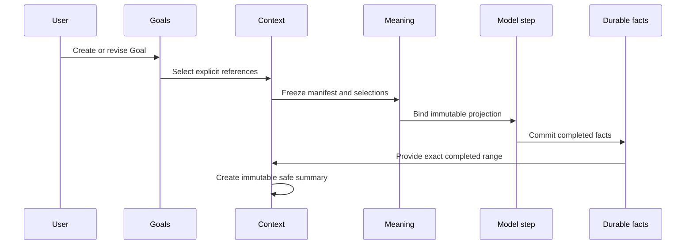

# Goals, Skills, Context, Memory, and Compaction

## Status and scope

**Approved future architecture, documentation-only.** This document is the sole
detailed owner for future Goal scope and evidence, Skill selection and safe
disclosure, context-source manifests, model-step projections, typed memory
records, and immutable compaction. It does not authorize a crate, retrieval
engine, vector index, prompt builder, storage migration, wire implementation,
retention/deletion/encryption policy, or production context behavior.

It applies only to future Mandate and VerifierMandate execution. M3/M4 bytes,
IDs, UUIDs, digests, cursors, events, snapshots, queue tickets, provider
behavior, replay, recovery, and M4 `ToolCallRecorded -> tool_execution_unavailable`
retain their recorded ordinary semantics. Retained Goal, Skill, memory, or
compaction material remains research provenance and historical-only where it
conflicts with architectures 13--20.

## Ownership and non-authorities

Architecture 13 owns Mandate lifecycle, fresh admission, uncertainty, and exact
reconciliation. Architecture 14 owns execution-envelope framing, canonical
encoding, digest validation, decoding, and compatibility classes. Architecture
15 owns the registry, frozen direct-tool selection, tool admission, model-tool
loop, `ToolCallId`, and generic effect facts. Architecture 16 owns scheduler
reevaluation and readiness. Architecture 17 owns child graph and verifier
authority. Architecture 18 owns MCP lifecycle. Architecture 19 owns bridge
grants, ingress, operation correlation, and bridge delivery. Architecture 20
owns kernel epochs, cells, checkpoints, and kernel-local safe projection.

This document owns only future non-authorizing context/evidence selection and
safe representation. A Goal, Skill, source manifest, projection, memory record,
card, disclosure, summary, omission, or compaction never creates or mutates a
`RunId`, Mandate reason, lifecycle state, scheduler eligibility, tool permission,
registry slot, `WorkspaceRoot`, child edge, verifier authority, MCP capability,
bridge grant, kernel epoch, provider route, or reconciliation decision. Context
is not a hidden prompt-mutation channel, sandbox, policy engine, or continuation
mechanism.

## Immutable selection and Goal scope

Architecture 14 owns canonical framing. This document owns detailed semantics of
these credential-free nested future Mandate-meaning fields:

| Architecture 14 field | Selection owner | Meaning |
| ---: | --- | --- |
| 5 | Context projection selection | Admission source-manifest and projection contract. |
| 7 | Goal context selection | Selected scoped Goal revisions and applicability links. |
| 14 | Skill selection | Selected immutable Skill revisions and disclosure contract. |

Each optional selection remains exactly `Disabled` or `Selected`. Unknown,
corrupt, unsupported, mismatched, or unavailable required selection blocks
dependent future work before a model, provider, tool, process, bridge, kernel,
child, or MCP effect. No current file, catalog, index, Goal, Skill, memory,
configuration, UI, ancestry, model, provider, bridge, kernel, or MCP state may
repair missing meaning.

A Goal is a user-managed, immutable revisioned acceptance/evidence record. It is
not an instruction channel or execution authority. A Goal has exactly one scope:
`Project` or `Session`. A project-scoped Goal applies to a session only through
an explicit immutable project-Goal-to-session applicability link selected at
admission. There is no implicit project-wide inheritance. A session-scoped Goal
does not silently become project-scoped.

```text
GoalContextSelectionV1
  selection_contract_revision
  ordered_goal_references
  ordered_applicability_link_references
  safe_acceptance_projection_revision
  canonical_goal_selection_digest
```

A selected reference freezes typed identity, revision, scope, canonical digest,
and safe acceptance/evidence projection. A later edit creates a new Goal
revision; it cannot rewrite admitted or model-step context. Goal evidence may be
referenced by a verifier baseline only through architecture 17's separately
issued authority. A Goal cannot create a verifier, target, verdict, target
mutation, child, or lifecycle transition.

## Skills and progressive disclosure

A Skill is immutable, versioned, untrusted instructional content with typed
provenance, declared audience, selection digest, and safe disclosure policy. A
Skill cannot contain executable authority, hidden tool permissions, registry
mutation, provider credential, bridge/kernel/MCP resource, or implicit
child/verifier/scheduler/lifecycle power.

```text
SkillSelectionV1
  skill_contract_revision
  ordered_skill_references
  disclosure_policy_revision
  safe_projection_revision
  canonical_skill_selection_digest
```

A model step receives only its explicitly selected bounded safe Skill projection.
Full source remains private unless the selection's disclosure policy expressly
permits its safe representation. Omitted, incompatible, or unsafe material is
recorded as a typed omission/degradation outcome; it is never silently replaced
with current catalog content or hidden injected text.

## Context sources, projections, and memory

Admission freezes an exact typed manifest before a dependent model step begins:

```text
ContextSourceManifestV1
  manifest_contract_revision
  ordered_source_references
  source_revision_and_digest
  declared_audience
  representation_policy_revision
  omission_references
  canonical_manifest_digest

ModelContextProjectionV1
  projection_contract_revision
  manifest_reference
  model_step_id
  ordered_safe_items
  disclosure_decisions
  omission_or_degradation_evidence
  canonical_projection_digest
```

The manifest binds identities, revisions, digests, audience, safe
representation policy, declared semantic order, and typed omission reasons. A
projection binds one model step to an ordered safe representation of that exact
manifest. It is immutable before the step begins. A source or card may be
narrower than its original content but can never be broader or visible to a
wider audience.

Memory uses immutable typed records, not mutable hidden prompt state. A memory
record has provenance, scope, safe card, audience, explicit disclosure status,
and supersession/replacement/rollback references. Retrieval and disclosure may
refuse safely or omit a record with typed reason. They cannot infer conflicts,
mutate historical context, inject undisclosed content, or leak source material.
A replacement creates a new immutable record and explicit relation; rollback
selects an earlier record explicitly and does not erase either record.

## Compaction, cancellation, and recovery

Compaction creates an immutable safe summary over an exact ordered set of
**completed** durable history. It retains source ranges/digests, compaction
policy/version, summary digest, safe audience, omission evidence, and exact
uncompacted suffix. Original durable facts remain authoritative and are never
deleted, replaced, or reinterpreted by a summary. A compaction cannot cover
unfinished or unknown effects, synthesize completion, reorder history, create
authority, or become continuation/recovery state.



Cancellation, terminalization, selection replacement, audience revocation, or
restart blocks later disclosure and model steps as applicable but cannot rewrite
an already committed projection or summary. Late source, card, retrieval,
disclosure, or compaction output after cancellation, terminalization, replacement,
or restart is non-authoritative and cannot append facts or repair uncertainty.

Recovery completes before new context-driven admission or step construction. It
may validate persisted supported references, but never rediscloses, recompacts,
fetches current catalog/file/index content, resumes/retries work, or reconstructs
projections from mutable state. Unsupported, corrupt, or missing selected context
blocks only dependent future work before effect; unrelated readable history stays
isolated.

## Child, verifier, MCP, bridge, kernel, protocol, and compatibility boundaries

A child receives only separately selected frozen safe references. It never
inherits a live manifest, undisclosed memory, Goal applicability, Skill source,
bridge grant, kernel namespace/checkpoint, provider continuation, MCP selection,
connection, process, or unfinished effect. Child context is independent and
non-authorizing. A verifier receives only architecture-17-authorized safe
baseline/evidence references; context cannot widen verifier authority or mutate
a target.

MCP, bridge, and kernel context is safe projection only. Context cannot discover
or invoke MCP, issue a bridge grant/operation, create a kernel epoch, restore a
checkpoint, or cause a host request. Future delivery is separately negotiated,
correlated, history-before-live, read-only safe projection or typed resync/error.
Replay, reconnect, or audit cannot create a Goal, disclose memory, recompact,
execute a model step, invoke a tool, start a child, issue authority, or perform
external work. Unnegotiated peers fail closed.

M3/M4 and retained records gain no Goal, Skill, source-manifest, projection,
memory, disclosure, summary, applicability link, Mandate, child, verifier, MCP,
activity, policy, or execution-kind state. Historical M4 tool calls remain denial
evidence. No current mutable state may reconstruct missing future context
meaning.

## Dependencies, non-goals, and evidence

This document depends on architectures 13--20 and decisions 0001--0012. It does
not define actual Goal persistence, search/index/vector retrieval, prompt
assembly, SQL/wire tags, migrations, retention/deletion/encryption, source-page
sizes, resource values, provider evolution, architecture-23 session branching, activity/UI, physical
Plan artifacts, direct MCP administration, Python/Jupyter process behavior,
Cargo, Makefile/CI, or production activation.

A later activating specification must declare exact crate owners, test targets,
coverage tiers, feature profiles, storage/wire versions, retention/deletion/
encryption policy, and intrinsic versus capacity bounds. It must pass `make
quick`, `make verify`, and Linux/Windows CI, and cover:

- canonical and negative vectors for Goal scope/applicability, Skills, manifests,
  projections, memory cards/disclosures/supersession, and summary provenance;
- admission/model-step fault injection proving no dependent external effect
  occurs before immutable selection and projection binding;
- project-to-session link validation, session isolation, no implicit inheritance,
  revision immutability, and Goal/verifier non-authority;
- untrusted Skill/progressive-disclosure cases with no hidden authority or
  sensitive-content leakage;
- no-current-state-reconstruction across Goals, Skills, files, indexes, memory,
  configuration, UI, ancestry, provider, bridge, kernel, and MCP state;
- typed memory refusal/disclosure/replacement/rollback without audience widening
  or hidden prompt mutation;
- compaction order/provenance/suffix/incomplete-history/corruption cases that
  preserve original facts and exclude continuation authority;
- recovery, cancellation, replay/resync, child/verifier/MCP/bridge/kernel
  isolation, late-data rejection, and zero-effect reconnect outcomes;
- M3/M4 and retained-history byte/meaning/startup/replay/recovery/tool-denial
  preservation; and
- fake-secret, raw source, memory payload, corrupt bytes, private references,
  paths, handles, provider material, and unsafe output absence from all public or
  durable surfaces.

Architecture 22 owns provider kind/profile/capability/reasoning normalization.
Provider may declare compatible reasoning input requirements, but only this
document selects sources, audiences, disclosures, and model-step context
projections; provider cannot scan or inject historical context.
