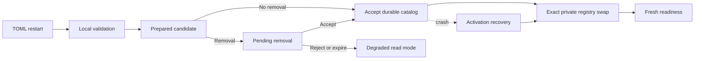

# Provider Evolution, Profiles, and Reasoning

## Status and scope

## Traceability

- Normative owner: architecture 22.
- Decision record: [`0014`](../decisions/0014-provider-evolution-profiles-and-reasoning.md).
- Detail decisions: [`0028`](../decisions/0028-provider-reasoning-and-catalog-detail-directions.md) (reasoning and catalog detail), [`0032`](../decisions/0032-accepted-deferred-directions-activity-metadata-content-inspection-per-call-cancellation.md) (semantic content inspection direction).
- Reconciliation topics: `PRV-001..012, RSN-001..015`.
- Research provenance: [`m4plus_concept2.md`](../m4plus_concept2.md).
- Status: documentation-approved; implementation-authorized work requires a later activating specification.


**Approved future architecture, documentation-only.** This document is the sole
detailed owner for future provider kinds, profiles and catalog lifecycle,
provider/model-capability selections, endpoint and credential-transport
semantics, driver-contract compatibility, provider-local availability, and
normalized textual reasoning. It does not authorize a crate, SDK, parser,
storage migration, wire implementation, catalog database, profile UI, or
production provider behavior.

It applies only to future Mandate and VerifierMandate execution. M3/M4 bytes,
IDs, UUID `ConfigRevisionId` values, provider kinds, configuration snapshots,
retries, model facts, cursors, snapshots, replay, recovery, and M4
`ToolCallRecorded -> tool_execution_unavailable` retain their recorded ordinary
semantics. `openrouter` and `generic-chat-completion-api` remain the only M4
kinds. Retained provider/profile/reasoning material is research provenance where
it conflicts with architectures 13--21.

The configuration/provider control-plane cluster (profile UI/control plane,
live reload, credential rotation, discovery, pricing, health checks) is owned
by [architecture 25](25-configuration-provider-control-plane.md), adopted as
accepted future directions by [ADR 0020](../decisions/0020-configuration-provider-control-plane-directions.md),
and activated under [Milestone 5+](11-implementation-roadmap.md#milestone-5-post-m5-retrospective-alignment).

## Ownership and non-authorities

Architecture 13 owns Mandate lifecycle, fresh admission, uncertainty, and exact
reconciliation. Architecture 14 owns execution-envelope framing, `IRCR`
canonical records, digests, decode classes, and historical compatibility.
Architecture 15 owns the registry, tool loop, model-step identities, and local
tool exchange. Architecture 16 owns scheduler readiness reevaluation.
Architecture 17 owns child/verifier authority. Architecture 18 owns MCP.
Architecture 19 owns bridge ingress. Architecture 20 owns kernel lifecycle.
Architecture 21 owns source selection, audience, disclosure, and immutable
model-context projection.

This document owns only provider selection, compatibility, catalog, private
adapter translation, and provider-local availability. A provider/profile/kind,
model ID, endpoint, capability, reasoning value, catalog entry, driver, output,
or availability observation cannot create a Mandate reason, `RunId`, lifecycle
transition, scheduler candidate, tool permission, child edge, verifier authority,
MCP capability, bridge grant, kernel epoch, context projection, branch, or
reconciliation result. It is not a second runtime, tool registry, context
builder, scheduler, persistence authority, profile UI, or sandbox.

## Immutable provider and capability selections

Architecture 14 owns canonical bytes, tags, field framing, and digest validation.
This document owns the semantic fields of future `MandateRunExecutionMeaningV1`
fields 2 and 3. Every record below uses architecture 14's `IRCR` /
`typed-tlv-v1` / SHA-256 policy. The retained `IRCD` framing is research-only
and cannot become a second provider codec.

```text
ProviderDriverContractRevisionDto
  driver_family
  major
  minor

ProviderKindDescriptorRevisionV1
  kind_id
  descriptor_family
  ordered_protocol_part_revisions
  endpoint_policy
  credential_transport_contract
  model_capability_envelope
  driver_contract_family

ProviderProfileRevisionV1
  profile_id
  kind_id
  kind_descriptor_revision
  model_id
  normalized_effective_endpoint
  credential_transport_metadata
  declared_model_capability_subset
  resolved_reasoning_policy
  effective_provider_execution_policy
  applicable_loopback_policy

ProviderSelectionV1
  profile and profile-revision references
  kind and descriptor-revision references
  exact model and normalized endpoint
  safe credential-transport metadata
  effective execution and loopback policy
  driver-contract revision

ModelCapabilitySelectionV1
  taxonomy_version
  descriptor capability envelope
  exact model subset
  validated capability intersection
  resolved request/reasoning policy
  cross-binding profile/descriptor/driver references
```

Selections are credential-free immutable evidence bound atomically at fresh
admission. They exclude credential literals, display names, enabled state,
whole catalog, current default, current readiness, SDK/client resources,
provider-native IDs, remote continuation state, raw provider payloads, and
current configuration. Catalog revision and selection source may be immutable
audit provenance but do not change otherwise equal execution semantics.

The resolved capability set is exactly:

```text
descriptor envelope ∩ explicitly declared exact-model subset
```

The selected driver contract must explicitly support the entire resolved set; it
is compatibility proof, not a second capability authority. A driver cannot
silently narrow, add, or reinterpret capabilities. Unknown taxonomy, invalid
intersection, mismatched cross-binding, or unsupported driver contract blocks
provider work before effect without current-state fallback.

The initial closed taxonomy is text-only:

```text
ModelCapabilitySetV1
  input = TextOnly
  text_streaming = Enabled | Disabled
  structured_output = Unsupported
  reasoning = Disabled | TextualReasoningV1 { ... }
  tool_exchange = Disabled | ModelToolLoopV1 { translation_revision }
  context_preservation = LocalDurableHistoryV1 { reasoning_input_contract }
```

Non-text input and structured output require a new taxonomy version. Capability,
provider kind, endpoint, driver, or execution kind is never inferred from a
model ID, including `gpt-*`, `o*`, or `codex*`.

## Provider kinds, profiles, credentials, and endpoints

Future first-party kinds are `openrouter`, `generic-chat-completion-api`, and
`responses`. `responses` is a distinct Responses wire/semantic contract, never
a generic Chat Completion variant. In a future catalog parser only, input
`kind = "openai"` normalizes immediately to `responses`; it never enters a DTO,
canonical record, digest, durable fact, diagnostic, or M3/M4 record. An input
that cannot be represented by the Responses descriptor fails
`legacy_config_cannot_represent_active_catalog` and never falls back to Generic
Chat.

Generic Chat remains narrow. A divergent reasoning protocol requires a separate
first-party descriptor or user-declared typed kind. A user kind is an immutable
composition of closed binary-owned protocol parts accepted by a code-owned
compatibility matrix. It cannot be a plugin, executable configuration, arbitrary
driver/parser, raw HTTP/JSON template, arbitrary header map, or secret
interpolation. Reserved first-party IDs cannot be replaced.

A `ProviderProfileId` is immutable and never reused. Profile removal creates a
permanent tombstone; rename means removal plus new identity. A display name is
safe presentation metadata, not execution identity. Profile semantic revisions
are append-only. A profile revision changes for its kind/descriptor, model,
endpoint, credential transport, capability subset, reasoning/execution policy,
or applicable loopback policy, but not credential-only replacement, display
name, enabled state, TOML whitespace/order, source path, or capture time.

Every profile holds one opaque literal credential in private composition state.
The only selected transports are bearer authorization or one descriptor-selected
validated header whose complete value is that credential. Credentials are
non-serde and non-`Debug`, never compared/deduplicated, and absent from canonical
bytes/digests, persistence, protocol, logs, diagnostics, adapter projections,
and model context. Credential-only replacement may supply fresh private material
after restart when every safe selected field still matches. It is not credential
rotation and never resumes old work.

An endpoint is credential-free execution metadata only after strict validation:
absolute HTTPS with a non-root API base path. HTTP is permitted only under an
explicit loopback policy for exactly `localhost`, `127.0.0.1`, or `[::1]`.
Reject userinfo, query, fragment, controls, malformed percent escapes, aliases,
and private-LAN expansion. `responses` defaults to `https://api.openai.com/v1`
and may use a compatible explicit override; Generic Chat and user kinds require
an endpoint; OpenRouter has no first-scope override. Raw or secret-bearing URL
input is never public or durable identity.

## Driver compatibility and catalog lifecycle

A driver contract is code-owned `family + major.minor`. Breaking request
construction, normalization, event ordering, capability meaning, or credential
transport requires a new major. Every executable older minor requires explicit
support and fixtures. Same family/major is insufficient. Composition alone
resolves private driver entries by exact profile revision, descriptor revision,
and driver contract; no SDK/client/credential resource crosses a boundary.

The catalog is startup-only and all-or-nothing:



Candidate construction may parse endpoints and create private clients but may
not perform DNS, HTTP, credential testing, telemetry, model discovery, or
background provider work. A semantically equal safe catalog creates no new
revision. Valid non-removal changes may auto-accept at startup. A removal creates
one pending candidate requiring explicit accept/reject against exact revisions;
rejection/expiry cannot reconstruct omitted credentials or prior readiness.

Acceptance atomically writes safe revisions, tombstones, current projection, and
a separate configuration-audit sequence. Registry activation then swaps the exact
accepted private entries. A crash after acceptance but before activation leaves
`activation_recovery_required`; a changed current file cannot be adopted. Fresh
provider readiness is unavailable until exact recovery succeeds. Catalog/default/
enablement changes affect fresh selection only. They neither rewrite stored
selection nor revoke an already admitted run; explicit Run/Mandate cancellation
remains the stopping authority. No private binding survives restart.

The audit taxonomy is candidate prepared, removal pending/accepted/rejected/
expired, catalog accepted/activated, activation recovery required, and recovery
completed. It is neither Session, Run, Mandate, MCP, lineage, nor activity
sequence. Numeric catalog/parser/page bounds must be explicitly classified as
intrinsic representation bounds, protocol bounds, or actual capacity, never
Mandate admission quotas.

## Availability, attempts, cancellation, and recovery

Compatibility and availability are distinct. Corrupt/missing meaning, digest
mismatch, unknown version/taxonomy, invalid intersection, descriptor mismatch,
or incompatible driver blocks execution before effect. Exact compatible private
material that is absent, disabled, tombstoned, or unavailable is live
availability evidence. For a Mandate it retains the existing reason and creates
no `RunId`; readiness restoration only wakes architecture-16 reevaluation.
Neither outcome allows default, same-model, alternate endpoint, kind, driver, or
current-TOML fallback.

Future provider attempts use architecture 13's admitted-before-start, started,
known-terminal, and unknown-terminal law. `Started` commits before an outbound
boundary and never inside an external-effect transaction. A known terminal or
pre-start failure remains known. A started request without durable terminal proof
after loss, cancellation, timeout, or restart becomes `ExternalEffectUnknown`;
architecture 13 pauses only the owning Mandate. Late provider data is
non-authoritative. Recovery terminalizes admitted-before-start work as known
interruption, recovers exact catalog activation, establishes new readiness, and
permits only fresh admission with a new `RunId`.

A future retry may follow only a frozen-policy, durably known retryable terminal
or pre-start outcome. Any accepted text, reasoning, summary, usage, tool, or
terminal fact prevents retry. A post-dispatch timeout/loss without terminal proof
is unknown, not retryable. M4 retry and timeout semantics remain historical.

## Reasoning and Responses

Provider descriptors own closed request dialect and native stream normalization,
not context sourcing. Architecture 21 alone selects safe source references,
audience, disclosure, omissions, and model-step context. A provider cannot scan
sessions/ancestors/siblings, construct history from current state, inject prior
reasoning, compact content, or broaden an audience.

The future normalized stream uses one `RunEventCursorDto` for text, reasoning,
summaries, tool calls, usage, and terminal facts:

```text
ReasoningFragmentCategoryDto
  Primary
  Detail

ReasoningDeltaDto
  category
  content

ReasoningSummaryDeltaDto
  content
```

Accepted fragments commit individually; equal text is not deduplicated and
adjacent fragments are not merged. Summaries are distinct from reasoning, never
raw chain-of-thought, and never automatic model context. Malformed,
duplicate-where-forbidden, out-of-order, unknown, or post-terminal values fail
safely with the closed `provider_reasoning_stream_invalid` failure and without
raw native publication. Reasoning representation bounds reject without
truncation or partial fact commit and are never Mandate quotas.

The future provider/model, domain, and durable representations are closed and
corresponding: `ModelEventDto::ReasoningDelta { category, content }` and
`ModelEventDto::ReasoningSummaryDelta { content }` normalize provider input;
`ModelRunFactInputDto::ReasoningDeltaRecorded { category, content }` and
`ModelRunFactInputDto::ReasoningSummaryDeltaRecorded { content }` persist it;
and the domain taxonomy has matching `ReasoningDeltaRecorded` and
`ReasoningSummaryDeltaRecorded` event variants. `ReasoningHistoryBound` is a
separate closed durable fact, never a provider stream event. A supported legacy
M4 `ReasoningDeltaRecorded { content }` decodes as historical `Primary`
reasoning evidence without rewriting its stored bytes; it has no synthetic
summary, category field, or history manifest.

The existing 512 KiB canonical individual-fact bound remains in force. The
combined canonical reasoning fragments and summaries of one run have a fixed
4 MiB bound. A fragment that would exceed the individual bound fails with the
existing fact-size failure; a fragment that would exceed the combined bound
fails with `reasoning_output_limit_exceeded`. Neither case truncates or
partially writes the fragment. This contract does not add content inspection,
secret substitution, or a new reasoning redaction algorithm; existing central
redaction and credential, provider-payload, SDK-resource, and diagnostic
exclusion rules remain in force. Semantic content inspection of reasoning or
provider content is an accepted future direction under
[ADR 0032](../decisions/0032-accepted-deferred-directions-activity-metadata-content-inspection-per-call-cancellation.md);
it is not activated here and never substitutes for central redaction.

`responses` is local-history-first. Every request uses `store: false`; Conversations,
`previous_response_id`, remote continuation, encrypted/opaque reasoning,
provider-managed history, persisted opaque response items, and provider-built-in
tools are excluded. Closed effort/mode/summary values are capability checked.
Function calls normalize only when frozen capability selection declares
`model_tool_loop_v1`; otherwise unexpected calls fail safely before a local tool
action.

Future provider/reasoning delivery is separately negotiated and history-before-
live. It exposes only safe typed projections, never raw canonical bytes, native
payloads, remote IDs, credentials, or private resources. Unnegotiated peers fail
closed for future facts; M3/M4 replay remains unchanged.

## Reasoning capability slice and bounded `responses` v1

The initial versioned capability slice selects text streaming, textual
reasoning output, the closed supported sets of `reasoning_effort` and
`reasoning.mode`, reasoning-summary support, and custom function-call
admission. A kind descriptor declares the maximum protocol capability envelope;
each profile explicitly declares a safe subset for its exact configured model,
including reasoning availability, supported effort and mode values, summary
availability, and custom-function-call availability. Model identifiers remain
byte-exact and are never used to infer capabilities. Preflight rejects a
requested capability or value that is absent from either level before any
outbound work occurs.

The resolved reasoning policy includes the closed fragment-category and
summary support, the `ReasoningHistoryTransferDto` mode, and `compatibility_id`
when transfer is enabled. It also records the fixed 4 MiB output/history limits
and the optional reasoning-usage interpretation. A selection that cannot
represent the descriptor's declared history transfer fails preflight before
provider work; it never falls back to a different transfer policy.

`responses` v1 is local-history-first. Every request sets `store: false`; the
daemon continues to construct model context from Intention Relay durable
history and does not use OpenAI Conversations or `previous_response_id`. It
must neither request nor persist, publish, replay, or depend on encrypted
reasoning, opaque response output items, remote conversation identifiers, or
provider-managed history state. The provider-neutral contract adds closed
`ReasoningEffortDto` values (`none`, `minimal`, `low`, `medium`, `high`,
`xhigh`, and `max`) and a Responses-specific closed reasoning-mode projection
(`standard` or `pro`). A profile may select only values declared in its model
subset; an unsupported effort or mode fails preflight. The resolved execution
policy records those values as immutable safe provenance.

For a `responses` profile whose model subset declares summary support, the
default request asks for an automatic provider reasoning summary. A returned
summary becomes a distinct tail-only `ReasoningSummaryDelta` and corresponding
durable fact. It is not a `ReasoningDelta`, is never raw chain-of-thought, and
does not enter model context or a run snapshot. It follows the normalized
reasoning cursor order, the 4 MiB per-run reasoning bound, the existing tail
replay and publication rules, and the selected initial-delivery contract. It
enters a typed `TextualHistoryV1` transfer together with the selected response's
textual reasoning fragments.

## Typed cross-turn reasoning history

The closed transfer policy is:

```text
ReasoningHistoryTransferDto
  Disabled
  TextualHistoryV1 { compatibility_id }
```

`compatibility_id` is code-owned descriptor and compatibility-matrix metadata,
never inferred from a model name, endpoint, or equal text. Under
`TextualHistoryV1`, a run receives all causally preceding completed compatible
assistant responses in causal `RunStarted` order, then each response's facts in
original run-cursor order; it receives both `Primary` and `Detail` fragments and
all summaries, placed in a separate typed reasoning history associated with the
assistant response, never converted into ordinary `ModelMessageDto` text.
Sharing requires the same declared `compatibility_id` and the same transfer
semantics. Encrypted, opaque, remote-provider, or unrepresentable material is
never transferred. Missing, corrupt, incompatible, or over-limit required
references block only the dependent run before any provider call. The closed
results are `reasoning_history_unavailable` (missing/corrupt durable material),
`reasoning_history_incompatible` (transfer-policy/compatibility mismatch), and
`reasoning_history_too_large` (aggregate bound). A run is never silently sent
without required history.

Every dependent run receives an immutable `ReasoningHistoryManifestDto` in the
same durable transaction as its `RunStarted` fact (including repository-owned
queued-turn promotion): schema and transfer policy, compatibility identity,
ordered source-response references, per-entry digests and sizes, and one
canonical manifest digest; no duplicate reasoning text. One source reference
carries the source session/run, completed sequence, final assistant-turn
identity when present, and ordered reasoning fact cursor/category/digest/size
references. A compatible completed response with no reasoning is a typed empty
reference, never an invented fragment. The same transaction appends the closed
`ReasoningHistoryBound` audit fact with only the manifest digest, transfer
policy, compatibility identity, source-entry count, and aggregate canonical
size; no reasoning text. Execution verifies the manifest and referenced durable
facts and constructs the separate typed history without rescanning a live
session, ancestor, or sibling. `ReasoningHistoryBound` is an ordinary run-scoped
domain audit event in the same session transaction as `RunStarted`; it is not a
`ModelRunFactDto`, not a provider-stream event, not in a live batch, and leaves
the new run's model-fact cursor at zero (preserving the M4 rule that only
accepted model facts advance `RunEventCursorDto`). The complete required history
is bounded at **4 MiB** of canonical data and must transfer as a whole or the
dependent run is rejected before provider work. Historical M4 runs remain
readable with no synthetic manifests.

## Reasoning usage and initial delivery

`UsageDto::Reported` includes an optional typed `ReasoningUsageDto` with optional
input and output token counts; a missing value means the provider did not report
that component, never zero. Reported reasoning values are components of the
corresponding total input/output counts, not additional usage. Reconnect,
replay, inheritance, and tree aggregation must not charge or count the same
source `RunId` twice. There is no price, currency, or inferred cost.

The negotiated `normalized_reasoning_stream_v1` capability provides automatic
initial reasoning delivery through uncorrelated `RunReasoningHistoryPageDto` and
`RunReasoningHistoryCompletedDto` frames after the existing correlated
authoritative `RunReplayDto` snapshot response. A page carries a fixed
session/run identity, a captured upper run cursor, and a non-empty ascending list
of only reasoning fragment or summary facts; cursors may be sparse but strictly
increasing across all initial pages. The completion frame repeats the fixed
identities and captured upper cursor. Under the serialized publication gate, the
daemon captures the upper cursor, registers the subscriber, enqueues the
correlated snapshot response, every history page through the cursor, and the
completion frame before any later live fact; live frames begin strictly after
the captured cursor, and a client never receives live reasoning before the
initial history completes. Pages expose both categories and summaries in the same
ordinary run-subscription visibility class as live facts; the existing tail
bounds of at most **256 facts** and **512 KiB** of canonical fact data apply and
may be sparse relative to the shared run cursor. Unavailable or incomplete
initial history requires typed resynchronization with no client guessing. A
non-negotiating client subscribing to a run using post-M4 reasoning facts fails
closed with `normalized_reasoning_stream_required`. Legacy M4 runs retain
existing subscription behavior.

## Reasoning in branches

`ForkBaseSnapshotDto` stores only immutable typed references to required
completed source response facts under `inherited_reasoning_history_references`;
it never copies reasoning text into the snapshot. Each
`InheritedReasoningHistoryReferenceDto` carries the source session/run and
completed-sequence identity, final assistant-turn identity when present,
ordered reasoning fact cursor/category/digest/size references, and the source
descriptor's `compatibility_id`. `fork-model-context-v1` remains a text-only
projection and does not add reasoning or summaries to ordinary model messages. A
child run combines frozen references with its own completed compatible responses
to construct its own `ReasoningHistoryManifestDto`; it never rescans the source
or a sibling. An unavailable required reference blocks only the dependent
action.

## Typed stateless reasoning dialect catalog

The initial user-kind catalog is broad in typed stateless textual coverage but
closed, subject to the compatibility matrix and the profile's declared model
subset:

- Chat Completions SSE and explicitly supported native streaming framing,
  including Ollama-native framing where a dedicated descriptor owns it;
- textual reasoning fields `reasoning_content`, `reasoning`,
  `reasoning_details[].text`, and `message.thinking`;
- thinking activation as `thinking` with closed `enabled`/`adaptive`,
  `enable_thinking`, or `think` with a closed boolean or supported closed effort
  string, or no activation field; and
- closed `reasoning_effort`, `thinking_budget`, and `thinking_token_budget`
  request fields only where a descriptor declares each field and its allowed
  values.

Each accepted fragment maps to the future normalized reasoning path. No
encrypted/opaque provider payloads, server-side vLLM/SGLang parser config, raw
provider JSON, or generic request templates. Cross-turn policy is limited to the
explicit typed textual history contract; provider-native `preserve_thinking`,
`thinking.keep`, remote continuation identifiers, and non-fitting
assistant-history requirements are excluded. The current `async-openai` core
Chat Completions adapter is not assumed sufficient for every descriptor; a future
implementation must choose a pinned private SDK or an explicitly specified
private typed decoder per closed descriptor. The descriptor registry never
authorizes arbitrary network protocol handling, unbounded parsing, or provider
SDK data outside its owner adapter.

## Catalog lifecycle detail: limits, tombstones, and audit

The first-scope fixed code-owned catalog limits are:

| Subject | Limit | Enforcement |
| --- | ---: | --- |
| `ProviderProfileId` and user `ProviderKindId` length | 63 ASCII characters | Reject the field before canonical revision construction. |
| Validated `display_name` length | 128 Unicode scalar values after trim and NFC normalization | Reject the field before catalog-digest construction. |
| Profiles in one catalog | 128 | Reject the candidate as oversized. |
| User-declared kinds in one catalog | 32 | Reject the candidate as oversized. |
| Raw candidate input | 512 KiB | Reject before unbounded parsing or private driver construction. |
| Safe validation issues returned | 32 | Return the first 32 deterministic issues, total count, and `truncated`. |
| Active private registry entries | 128 | One entry per enabled profile; reject an impossible over-capacity candidate. |
| Catalog page and removal-preview examples | 32 entries | Reject an oversized requested page; truncate examples with total count. |
| Pending-removal lifetime | 30 minutes | Expire the candidate as specified. |
| Unavailable queue promotions per terminal transition | 8 | Stop the cascade and persist reconciliation-needed evidence. |
| Queue-reconciliation page | 32 selections | Process at most that many currently unavailable selections. |

`ProviderKindId` is immutable after its first accepted declaration; changing
closed stream/reasoning/activation/budget-effort/credential-transport parts
fails with `provider_kind_immutable_mismatch`; the valid path is a new kind ID
plus reassignment. Credential-free catalog/profile-revision rows are immutable
append-only SQLite history. Removal writes a permanent `ProviderProfileTombstoneDto`
(safe identity, removed catalog revision/time, provenance); a tombstoned ID
cannot be reintroduced. Kind removal while referenced fails
`provider_kind_has_dependents`; after removing or reassigning all dependents in
the same candidate, accepted kind removal writes a permanent
`ProviderKindTombstoneDto`. The audit taxonomy is:

```text
ProviderCatalogCandidatePrepared
ProviderCatalogRemovalPending
ProviderCatalogRemovalAccepted
ProviderCatalogCandidateRejected
ProviderCatalogCandidateExpired
ProviderCatalogAccepted
ProviderCatalogActivated
ProviderCatalogActivationRecoveryRequired
ProviderCatalogRecoveryCompleted
```

Ordering: every successful preparation appends `ProviderCatalogCandidatePrepared`;
a removal candidate appends `ProviderCatalogRemovalPending`; acceptance orders
`ProviderCatalogRemovalAccepted`, `ProviderCatalogAccepted`,
`ProviderCatalogActivated` (no-removal: `ProviderCatalogAccepted` then
`ProviderCatalogActivated`); rejection/expiry never emit acceptance/activation; a
crash after acceptance orders `ProviderCatalogActivationRecoveryRequired`,
replacement `ProviderCatalogActivated`, and `ProviderCatalogRecoveryCompleted`
only when the exact accepted registry is active. The gate serializes catalog
acceptance, session default changes, turn/fork admission, and registry lookups
and never blocks active model tasks. Private enabled entries are keyed by the
exact `(ProviderProfileId, ProviderProfileRevisionId,
ProviderKindDescriptorRevisionId, ProviderDriverContractRevisionDto)`; each
profile owns an independent private client/driver entry, and no SDK/credential/
client/handle crosses a DTO, persistence, protocol, runtime public API, or
adapter boundary.

## Legacy M4 selection bridge

Migration eagerly maps every persisted legacy M4 `ConfigRevisionId` to one
immutable `LegacyM4SelectionBindingDto` for its supported safe snapshot; equal
snapshots may share one equivalent binding. The binding references the original
legacy ID and snapshot bytes unchanged, records validation of the supported M4
snapshot schema, materializes a deterministic first-party `default` profile ID,
profile revision, kind descriptor revision, capability subset, execution policy,
and M4 driver-contract revision, and protects the bridge fields with a canonical
binding digest; it is never recomputed from future TOML. An old queued run
executes only when the active `default` entry exactly matches the binding AND
the current driver explicitly supports the materialized M4 contract; otherwise
the same closed unavailable outcome applies. It preserves the original `RunId`,
legacy `ConfigSnapshotDto`, event history, and replay data; the old snapshot JSON
and old UUID are never replaced with a SHA ID. A missing, malformed, or
digest-inconsistent binding is `historical_selection_corrupt`; replay remains
readable where possible and is never reconstructed from current TOML.

## Session selection, degraded recovery, and protocol

The provider session-selection layer (session default, per-turn/fork overrides,
unavailable-queue promotion and reconciliation, profile-keyed usage,
`provider_profiles_v1`, pending-removal accept/reject, and held recovered-run
admission) is owned by [architecture 29](29-provider-session-and-profiles-protocol.md)
and adopted by [ADR 0024](../decisions/0024-provider-session-and-profiles-protocol-directions.md).
This document no longer excludes "session defaults/overrides"; the detail lives
in architecture 29 and is activated under Milestone 5+.

## Child, verifier, MCP, bridge, kernel, context, and compatibility boundaries

Every child or verifier fresh run has its own immutable provider selection.
Provider output is evidence only and cannot confer child/verifier authority.
Provider work cannot discover/invoke MCP, issue a bridge grant, create a kernel,
or execute a tool. Bridge and kernel paths consume immutable provider selections
only through their existing owners. A kernel never carries provider continuation
or private driver resources.

M3/M4 records gain no `responses`, `openai` alias, profile, catalog, capability
taxonomy, categorized reasoning, summary, provider-selection, or execution-kind
state. Historical generic model IDs remain generic. A later explicit ordinary
bridge may reference exact legacy bytes and schema class but cannot fabricate a
profile/catalog membership, normalize historical selection, or rebuild it from
current configuration. Existing M4 reasoning retains its recorded untagged
meaning and gains no synthetic category, summary, or history.

## Dependencies, non-goals, and evidence

This document depends on architectures 13, 14, 15, 16, and 21 plus decisions
0001--0013. It does not define a Responses SDK/driver, user-kind parser, catalog
database, wire tags, migrations, profile picker/editor, credential entry/keychain/
rotation, health test, discovery, pricing, telemetry, live reload, multimodal or
structured output, arbitrary headers, plugin drivers, remote continuation,
provider-side parser administration, while architecture 23 owns forks and lineage,
architecture 29 owns session defaults/overrides and the profiles protocol,
UI, Cargo, Makefile/CI, or production activation.

Semantic content inspection of reasoning or provider content is an accepted
post-M5 future direction under
[ADR 0032](../decisions/0032-accepted-deferred-directions-activity-metadata-content-inspection-per-call-cancellation.md),
bound to Milestone 5+; it is not activated here, never substitutes for central
redaction, and never rewrites stored facts.

The profile picker/editor, credential rotation, health test, discovery,
pricing, telemetry, and live reload items are accepted post-M5 directions
owned by [architecture 25](25-configuration-provider-control-plane.md) and
activated under [Milestone 5+](11-implementation-roadmap.md#milestone-5-post-m5-retrospective-alignment);
they are not activated here.

A later activating specification must declare exact crates, dependencies, test
targets, coverage tiers, feature profiles, storage/wire schema, retention, and
bounds, then pass `make quick`, `make docs-check`, `make architecture`, `make
verify`, and Linux/Windows CI. Required evidence includes:

- IRCR canonical positive/negative goldens and cross-platform digests for
  descriptor/profile/catalog/selection/capability/driver records;
- M3/M4 byte/meaning/replay/recovery preservation, no model-name routing, and
  no synthetic profiles or Responses state;
- alias normalization, local-only catalog validation, credential/endpoint
  redaction, capability intersection, driver compatibility, and zero outbound
  calls on preflight failure;
- Responses `store: false`, no remote continuation, reasoning normalization,
  tool-loop gating, representation bounds, and no raw payload publication;
- catalog/activation fault injection, exact recovery, no fallback, no-resume,
  cancellation/timeout/retry matrices, and retained-reason readiness outcomes;
- negotiated provider/reasoning replay/resync/history-before-live, zero-effect
  reconnect, and old-peer failure behavior; and
- secret, raw TOML, private endpoint input, SDK/client/resource, remote ID,
  corrupt-byte, and unsafe diagnostic absence from all public/durable surfaces.

Architecture 24 owns activity/UI projections. Provider and reasoning facts may
be safely projected only through their existing owners and never expose raw
native data, select a provider, or create activity authority.
