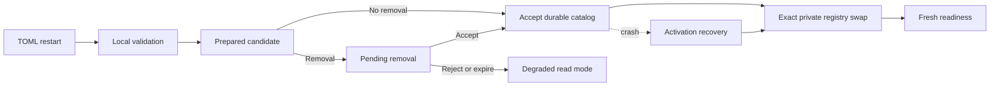

# Provider Evolution, Profiles, and Reasoning

## Status and scope

## Traceability

- Normative owner: architecture 22.
- Decision record: [`0014`](../decisions/0014-provider-evolution-profiles-and-reasoning.md).
- Reconciliation topics: `PRV-001..012, RSN-001..006`.
- Research provenance: [`m4plus_concept2.md`](../m4plus_concept2.md).
- Status: documentation-approved; implementation-authorized work requires a later activating specification.


**Approved future architecture, documentation-only.** This document is the sole
detailed owner for future provider kinds, profiles and catalog lifecycle,
provider/model-capability selections, endpoint and credential-transport
semantics, driver-contract compatibility, provider-local availability, and
normalized textual reasoning. It does not authorize a crate, SDK, parser,
storage migration, wire implementation, catalog database, profile UI, or
production provider behavior.

It applies only to future Mandate and VerifierMandate execution. M3/M4 bytes,
IDs, UUID `ConfigRevisionId` values, provider kinds, configuration snapshots,
retries, model facts, cursors, snapshots, replay, recovery, and M4
`ToolCallRecorded -> tool_execution_unavailable` retain their recorded ordinary
semantics. `openrouter` and `generic-chat-completion-api` remain the only M4
kinds. Retained provider/profile/reasoning material is research provenance where
it conflicts with architectures 13--21.

## Ownership and non-authorities

Architecture 13 owns Mandate lifecycle, fresh admission, uncertainty, and exact
reconciliation. Architecture 14 owns execution-envelope framing, `IRCR`
canonical records, digests, decode classes, and historical compatibility.
Architecture 15 owns the registry, tool loop, model-step identities, and local
tool exchange. Architecture 16 owns scheduler readiness reevaluation.
Architecture 17 owns child/verifier authority. Architecture 18 owns MCP.
Architecture 19 owns bridge ingress. Architecture 20 owns kernel lifecycle.
Architecture 21 owns source selection, audience, disclosure, and immutable
model-context projection.

This document owns only provider selection, compatibility, catalog, private
adapter translation, and provider-local availability. A provider/profile/kind,
model ID, endpoint, capability, reasoning value, catalog entry, driver, output,
or availability observation cannot create a Mandate reason, `RunId`, lifecycle
transition, scheduler candidate, tool permission, child edge, verifier authority,
MCP capability, bridge grant, kernel epoch, context projection, branch, or
reconciliation result. It is not a second runtime, tool registry, context
builder, scheduler, persistence authority, profile UI, or sandbox.

## Immutable provider and capability selections

Architecture 14 owns canonical bytes, tags, field framing, and digest validation.
This document owns the semantic fields of future `MandateRunExecutionMeaningV1`
fields 2 and 3. Every record below uses architecture 14's `IRCR` /
`typed-tlv-v1` / SHA-256 policy. The retained `IRCD` framing is research-only
and cannot become a second provider codec.

```text
ProviderDriverContractRevisionDto
  driver_family
  major
  minor

ProviderKindDescriptorRevisionV1
  kind_id
  descriptor_family
  ordered_protocol_part_revisions
  endpoint_policy
  credential_transport_contract
  model_capability_envelope
  driver_contract_family

ProviderProfileRevisionV1
  profile_id
  kind_id
  kind_descriptor_revision
  model_id
  normalized_effective_endpoint
  credential_transport_metadata
  declared_model_capability_subset
  resolved_reasoning_policy
  effective_provider_execution_policy
  applicable_loopback_policy

ProviderSelectionV1
  profile and profile-revision references
  kind and descriptor-revision references
  exact model and normalized endpoint
  safe credential-transport metadata
  effective execution and loopback policy
  driver-contract revision

ModelCapabilitySelectionV1
  taxonomy_version
  descriptor capability envelope
  exact model subset
  validated capability intersection
  resolved request/reasoning policy
  cross-binding profile/descriptor/driver references
```

Selections are credential-free immutable evidence bound atomically at fresh
admission. They exclude credential literals, display names, enabled state,
whole catalog, current default, current readiness, SDK/client resources,
provider-native IDs, remote continuation state, raw provider payloads, and
current configuration. Catalog revision and selection source may be immutable
audit provenance but do not change otherwise equal execution semantics.

The resolved capability set is exactly:

```text
descriptor envelope ∩ explicitly declared exact-model subset
```

The selected driver contract must explicitly support the entire resolved set; it
is compatibility proof, not a second capability authority. A driver cannot
silently narrow, add, or reinterpret capabilities. Unknown taxonomy, invalid
intersection, mismatched cross-binding, or unsupported driver contract blocks
provider work before effect without current-state fallback.

The initial closed taxonomy is text-only:

```text
ModelCapabilitySetV1
  input = TextOnly
  text_streaming = Enabled | Disabled
  structured_output = Unsupported
  reasoning = Disabled | TextualReasoningV1 { ... }
  tool_exchange = Disabled | ModelToolLoopV1 { translation_revision }
  context_preservation = LocalDurableHistoryV1 { reasoning_input_contract }
```

Non-text input and structured output require a new taxonomy version. Capability,
provider kind, endpoint, driver, or execution kind is never inferred from a
model ID, including `gpt-*`, `o*`, or `codex*`.

## Provider kinds, profiles, credentials, and endpoints

Future first-party kinds are `openrouter`, `generic-chat-completion-api`, and
`responses`. `responses` is a distinct Responses wire/semantic contract, never
a generic Chat Completion variant. In a future catalog parser only, input
`kind = "openai"` normalizes immediately to `responses`; it never enters a DTO,
canonical record, digest, durable fact, diagnostic, or M3/M4 record. An input
that cannot be represented by the Responses descriptor fails
`legacy_config_cannot_represent_active_catalog` and never falls back to Generic
Chat.

Generic Chat remains narrow. A divergent reasoning protocol requires a separate
first-party descriptor or user-declared typed kind. A user kind is an immutable
composition of closed binary-owned protocol parts accepted by a code-owned
compatibility matrix. It cannot be a plugin, executable configuration, arbitrary
driver/parser, raw HTTP/JSON template, arbitrary header map, or secret
interpolation. Reserved first-party IDs cannot be replaced.

A `ProviderProfileId` is immutable and never reused. Profile removal creates a
permanent tombstone; rename means removal plus new identity. A display name is
safe presentation metadata, not execution identity. Profile semantic revisions
are append-only. A profile revision changes for its kind/descriptor, model,
endpoint, credential transport, capability subset, reasoning/execution policy,
or applicable loopback policy, but not credential-only replacement, display
name, enabled state, TOML whitespace/order, source path, or capture time.

Every profile holds one opaque literal credential in private composition state.
The only selected transports are bearer authorization or one descriptor-selected
validated header whose complete value is that credential. Credentials are
non-serde and non-`Debug`, never compared/deduplicated, and absent from canonical
bytes/digests, persistence, protocol, logs, diagnostics, adapter projections,
and model context. Credential-only replacement may supply fresh private material
after restart when every safe selected field still matches. It is not credential
rotation and never resumes old work.

An endpoint is credential-free execution metadata only after strict validation:
absolute HTTPS with a non-root API base path. HTTP is permitted only under an
explicit loopback policy for exactly `localhost`, `127.0.0.1`, or `[::1]`.
Reject userinfo, query, fragment, controls, malformed percent escapes, aliases,
and private-LAN expansion. `responses` defaults to `https://api.openai.com/v1`
and may use a compatible explicit override; Generic Chat and user kinds require
an endpoint; OpenRouter has no first-scope override. Raw or secret-bearing URL
input is never public or durable identity.

## Driver compatibility and catalog lifecycle

A driver contract is code-owned `family + major.minor`. Breaking request
construction, normalization, event ordering, capability meaning, or credential
transport requires a new major. Every executable older minor requires explicit
support and fixtures. Same family/major is insufficient. Composition alone
resolves private driver entries by exact profile revision, descriptor revision,
and driver contract; no SDK/client/credential resource crosses a boundary.

The catalog is startup-only and all-or-nothing:



Candidate construction may parse endpoints and create private clients but may
not perform DNS, HTTP, credential testing, telemetry, model discovery, or
background provider work. A semantically equal safe catalog creates no new
revision. Valid non-removal changes may auto-accept at startup. A removal creates
one pending candidate requiring explicit accept/reject against exact revisions;
rejection/expiry cannot reconstruct omitted credentials or prior readiness.

Acceptance atomically writes safe revisions, tombstones, current projection, and
a separate configuration-audit sequence. Registry activation then swaps the exact
accepted private entries. A crash after acceptance but before activation leaves
`activation_recovery_required`; a changed current file cannot be adopted. Fresh
provider readiness is unavailable until exact recovery succeeds. Catalog/default/
enablement changes affect fresh selection only. They neither rewrite stored
selection nor revoke an already admitted run; explicit Run/Mandate cancellation
remains the stopping authority. No private binding survives restart.

The audit taxonomy is candidate prepared, removal pending/accepted/rejected/
expired, catalog accepted/activated, activation recovery required, and recovery
completed. It is neither Session, Run, Mandate, MCP, lineage, nor activity
sequence. Numeric catalog/parser/page bounds must be explicitly classified as
intrinsic representation bounds, protocol bounds, or actual capacity, never
Mandate admission quotas.

## Availability, attempts, cancellation, and recovery

Compatibility and availability are distinct. Corrupt/missing meaning, digest
mismatch, unknown version/taxonomy, invalid intersection, descriptor mismatch,
or incompatible driver blocks execution before effect. Exact compatible private
material that is absent, disabled, tombstoned, or unavailable is live
availability evidence. For a Mandate it retains the existing reason and creates
no `RunId`; readiness restoration only wakes architecture-16 reevaluation.
Neither outcome allows default, same-model, alternate endpoint, kind, driver, or
current-TOML fallback.

Future provider attempts use architecture 13's admitted-before-start, started,
known-terminal, and unknown-terminal law. `Started` commits before an outbound
boundary and never inside an external-effect transaction. A known terminal or
pre-start failure remains known. A started request without durable terminal proof
after loss, cancellation, timeout, or restart becomes `ExternalEffectUnknown`;
architecture 13 pauses only the owning Mandate. Late provider data is
non-authoritative. Recovery terminalizes admitted-before-start work as known
interruption, recovers exact catalog activation, establishes new readiness, and
permits only fresh admission with a new `RunId`.

A future retry may follow only a frozen-policy, durably known retryable terminal
or pre-start outcome. Any accepted text, reasoning, summary, usage, tool, or
terminal fact prevents retry. A post-dispatch timeout/loss without terminal proof
is unknown, not retryable. M4 retry and timeout semantics remain historical.

## Reasoning and Responses

Provider descriptors own closed request dialect and native stream normalization,
not context sourcing. Architecture 21 alone selects safe source references,
audience, disclosure, omissions, and model-step context. A provider cannot scan
sessions/ancestors/siblings, construct history from current state, inject prior
reasoning, compact content, or broaden an audience.

The future normalized stream uses one `RunEventCursorDto` for text, reasoning,
summaries, tool calls, usage, and terminal facts:

```text
ReasoningFragmentCategoryDto
  Primary
  Detail

ReasoningDeltaDto
  category
  content

ReasoningSummaryDeltaDto
  content
```

Accepted fragments commit individually; equal text is not deduplicated and
adjacent fragments are not merged. Summaries are distinct from reasoning, never
raw chain-of-thought, and never automatic model context. Malformed,
duplicate-where-forbidden, out-of-order, unknown, or post-terminal values fail
safely without raw native publication. Reasoning representation bounds reject
without truncation or partial fact commit and are never Mandate quotas.

`responses` is local-history-first. Every request uses `store: false`; Conversations,
`previous_response_id`, remote continuation, encrypted/opaque reasoning,
provider-managed history, persisted opaque response items, and provider-built-in
tools are excluded. Closed effort/mode/summary values are capability checked.
Function calls normalize only when frozen capability selection declares
`model_tool_loop_v1`; otherwise unexpected calls fail safely before a local tool
action.

Future provider/reasoning delivery is separately negotiated and history-before-
live. It exposes only safe typed projections, never raw canonical bytes, native
payloads, remote IDs, credentials, or private resources. Unnegotiated peers fail
closed for future facts; M3/M4 replay remains unchanged.

## Child, verifier, MCP, bridge, kernel, context, and compatibility boundaries

Every child or verifier fresh run has its own immutable provider selection.
Provider output is evidence only and cannot confer child/verifier authority.
Provider work cannot discover/invoke MCP, issue a bridge grant, create a kernel,
or execute a tool. Bridge and kernel paths consume immutable provider selections
only through their existing owners. A kernel never carries provider continuation
or private driver resources.

M3/M4 records gain no `responses`, `openai` alias, profile, catalog, capability
taxonomy, categorized reasoning, summary, provider-selection, or execution-kind
state. Historical generic model IDs remain generic. A later explicit ordinary
bridge may reference exact legacy bytes and schema class but cannot fabricate a
profile/catalog membership, normalize historical selection, or rebuild it from
current configuration. Existing M4 reasoning retains its recorded untagged
meaning and gains no synthetic category, summary, or history.

## Dependencies, non-goals, and evidence

This document depends on architectures 13, 14, 15, 16, and 21 plus decisions
0001--0013. It does not define a Responses SDK/driver, user-kind parser, catalog
database, wire tags, migrations, profile picker/editor, credential entry/keychain/
rotation, health test, discovery, pricing, telemetry, live reload, multimodal or
structured output, arbitrary headers, plugin drivers, remote continuation,
provider-side parser administration, session defaults/overrides, while architecture 23 owns forks and lineage,
UI, Cargo, Makefile/CI, or production activation.

A later activating specification must declare exact crates, dependencies, test
targets, coverage tiers, feature profiles, storage/wire schema, retention, and
bounds, then pass `make quick`, `make docs-check`, `make architecture`, `make
verify`, and Linux/Windows CI. Required evidence includes:

- IRCR canonical positive/negative goldens and cross-platform digests for
  descriptor/profile/catalog/selection/capability/driver records;
- M3/M4 byte/meaning/replay/recovery preservation, no model-name routing, and
  no synthetic profiles or Responses state;
- alias normalization, local-only catalog validation, credential/endpoint
  redaction, capability intersection, driver compatibility, and zero outbound
  calls on preflight failure;
- Responses `store: false`, no remote continuation, reasoning normalization,
  tool-loop gating, representation bounds, and no raw payload publication;
- catalog/activation fault injection, exact recovery, no fallback, no-resume,
  cancellation/timeout/retry matrices, and retained-reason readiness outcomes;
- negotiated provider/reasoning replay/resync/history-before-live, zero-effect
  reconnect, and old-peer failure behavior; and
- secret, raw TOML, private endpoint input, SDK/client/resource, remote ID,
  corrupt-byte, and unsafe diagnostic absence from all public/durable surfaces.

Architecture 24 owns activity/UI projections. Provider and reasoning facts may
be safely projected only through their existing owners and never expose raw
native data, select a provider, or create activity authority.
