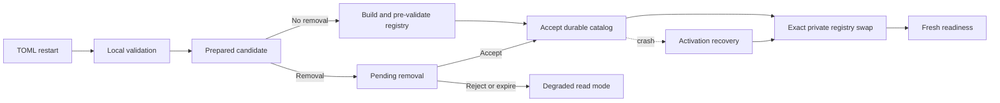

# Provider Evolution, Profiles, and Reasoning

**Approved future design. Not implemented; activation requires an activating specification.** The catalog, selection,
capability-taxonomy, reasoning-history, and header contracts are accepted directions awaiting an activating
specification; none of those surfaces exists in the tree (`responses` driver remains not activated).

Owner: architecture 22.

This document owns provider kinds, profiles and catalog lifecycle, provider/model-capability selections, endpoint and
credential-transport semantics, driver-contract compatibility, provider-local availability, and normalized textual
reasoning. It applies only to future run execution; `openrouter` and `generic-chat-completion-api` remain the only M4
kinds. Retained provider/profile/reasoning material is research provenance where it conflicts with architectures
15--21. The configuration/provider control-plane cluster (profile
UI/control plane, live reload, credential rotation, discovery, pricing, health checks) is owned by [architecture
25](25-configuration-provider-control-plane.md).

## Ownership and non-authorities

Run-execution meaning and historical compatibility left no live path: the binary codec with canonical records,
digests, and decode classes was removed under [architecture 02](02-dto-and-contract-policy.md); 15 owns the
registry, tool loop, model-step identities, and local tool exchange; 18 owns MCP; 19 owns bridge ingress; 20 owns kernel
lifecycle; 21 owns source selection, audience, disclosure, and immutable model-context projection.

This document owns only provider selection, compatibility, catalog, private adapter translation, and provider-local
availability. A provider/profile/kind, model ID, endpoint, capability, reasoning value, catalog entry, driver, output,
or availability observation cannot create a `RunId`, lifecycle transition, tool permission, MCP capability, bridge
grant, kernel epoch, context projection, branch, or reconciliation result; it is not a second runtime, tool registry,
context builder, persistence authority, profile UI, or sandbox.

## Immutable provider and capability selections

The canonical bytes, tags, field framing, digest validation, `IRCR`/`typed-tlv-v1` framing, SHA-256
policy, and the research-only `IRCD` framing were removed under [architecture
02](02-dto-and-contract-policy.md): wire and durable contracts are typed serde JSON, and no
canonical digest or identity layer exists. This document owns the provider-selection and model-capability selection
semantics that a future typed run record would carry as its provider and model-capability fields.

```text
ProviderDriverContractRevisionDto
  driver_family
  major
  minor

ProviderKindDescriptorRevisionV1
  kind_id
  descriptor_family
  ordered_protocol_part_revisions
  endpoint_policy
  credential_transport_contract
  model_capability_envelope
  driver_contract_family

ProviderProfileRevisionV1
  profile_id
  kind_id
  kind_descriptor_revision
  model_id
  normalized_effective_endpoint
  credential_transport_metadata
  declared_model_capability_subset
  resolved_reasoning_policy
  effective_provider_execution_policy
  applicable_loopback_policy

ProviderSelectionV1
  profile and profile-revision references
  kind and descriptor-revision references
  exact model and normalized endpoint
  safe credential-transport metadata
  effective execution and loopback policy
  driver-contract revision

ModelCapabilitySelectionV1
  taxonomy_version
  descriptor capability envelope
  exact model subset
  validated capability intersection
  resolved request/reasoning policy
  cross-binding profile/descriptor/driver references
```

Selections are credential-free immutable evidence bound atomically at fresh admission. They exclude credential literals,
display names, enabled state, whole catalog, current default, current readiness, SDK/client resources, provider-native
IDs, remote continuation state, raw provider payloads, and current configuration. Catalog revision and selection source
may be immutable audit provenance but do not change otherwise equal execution semantics.

The resolved capability set is exactly:

```text
descriptor envelope ∩ explicitly declared exact-model subset
```

The selected driver contract must explicitly support the entire resolved set; it is compatibility proof, not a second
capability authority. A driver cannot silently narrow, add, or reinterpret capabilities. Unknown taxonomy, invalid
intersection, mismatched cross-binding, or unsupported driver contract blocks provider work before effect without
current-state fallback.

The initial closed taxonomy is text-only, versioned by the closed value `model-capability-taxonomy-v1`:

```text
ModelCapabilitySetV1
  taxonomy_version = model-capability-taxonomy-v1
  input = TextOnly
  text_streaming = Enabled | Disabled
  structured_output = Unsupported
  reasoning = Disabled | TextualReasoningV1 { ... }
  tool_exchange = Disabled | ModelToolLoopV1 { translation_revision }
  context_preservation = LocalDurableHistoryV1 { reasoning_input_contract }
```

`reasoning_input_contract` is the selected cross-turn reasoning transfer contract (the concept2
`reasoning_history_transfer` name is research-only; architecture 22 owns the field name). Non-text input and structured
output require a new taxonomy version. Capability, provider kind, endpoint, or driver is never inferred
from a model ID, including `gpt-*`, `o*`, or `codex*`.

## Provider kinds, profiles, credentials, and endpoints

Future first-party kinds are `openrouter`, `generic-chat-completion-api`, and `responses`. `responses` is a distinct
Responses wire/semantic contract, never a generic Chat Completion variant. In a future catalog parser only, input `kind
= "openai"` normalizes immediately to `responses`; it never enters a DTO, durable record, diagnostic, or M3/M4 record.
An input that cannot be represented by the Responses descriptor fails `legacy_config_cannot_represent_active_catalog`
and never falls back to Generic Chat.

Generic Chat remains narrow. A divergent reasoning protocol requires a separate first-party descriptor or user-declared
typed kind. For the ordinary production path, the current `generic-chat-completion-api` adapter consumes the pinned
SDK's typed `reasoning_content` field as normalized `Primary` reasoning output and echoes the current round's accepted
reasoning on the same-run assistant tool-call continuation ([architecture
08](08-model-protocol-and-providers.md)); that typed field does not widen the descriptor
envelope, and any other or vendor-specific dialect still requires a separate descriptor or typed kind. A user kind is an
immutable composition of closed binary-owned protocol parts accepted by a code-owned compatibility matrix. It cannot be
a plugin, executable configuration, arbitrary driver/parser, raw HTTP/JSON template, arbitrary header map, or secret
interpolation. Reserved first-party IDs cannot be replaced.

A `ProviderProfileId` is immutable within its declared catalog. Profile removal creates an append-only removal-history
tombstone; rename means removal plus new identity, and a later accepted catalog may reintroduce a removed ID. A display
name is safe presentation metadata, not execution identity. Profile semantic revisions are append-only. A profile
revision changes for its kind/descriptor, model, endpoint, credential transport, capability subset, reasoning/execution
policy, or applicable loopback policy, but not credential-only replacement, display name, enabled state, TOML
whitespace/order, source path, or capture time.

Every profile holds one opaque literal credential in private composition state. The only selected transports are bearer
authorization or one descriptor-selected validated header whose complete value is that credential. Credentials are
non-serde and non-`Debug`, never compared/deduplicated, and absent from typed records, persistence, protocol, logs,
diagnostics, adapter projections, and model context. Credential-only replacement may supply fresh private material after
restart when every safe selected field still matches. It is not credential rotation and never resumes old work.

An endpoint is credential-free execution metadata only after strict validation: absolute HTTPS with a non-root API base
path. HTTP is permitted only under an explicit loopback policy for exactly `localhost`, `127.0.0.1`, or `[::1]`. Reject
userinfo, query, fragment, controls, malformed percent escapes, aliases, and private-LAN expansion. `responses` defaults
to `https://api.openai.com/v1` and may use a compatible explicit override; Generic Chat and user kinds require an
endpoint; OpenRouter has no first-scope override. Raw or secret-bearing URL input is never public or durable identity.

## Driver compatibility and catalog lifecycle

A driver contract is code-owned `family + major.minor`. Breaking request construction, normalization, event ordering,
capability meaning, or credential transport requires a new major; every executable older minor requires explicit support
and fixtures, and same family/major is insufficient. Composition alone resolves private driver entries by exact profile
revision, descriptor revision, and driver contract; no SDK/client/credential resource crosses a boundary.

The Slice 2 option seam applies validated, credential-free driver options (`OpenRouterDriverOptions`
and `GenericChatDriverOptions`) only through the composition's single seam translation at startup selected-provider
construction, at every catalog activation through the composition driver factory, and on credential-driven rebuilds, so
a declared option is never silently defaulted or ignored. Its closed declaration vocabulary is the profile's
credential transport (bearer, or one descriptor-selected safe header whose complete value is the credential) and an
empty reasoning-effort slot (no declaration surface; RSN-011); a declaration the executing adapter cannot
apply fails closed at the seam with the adapter's typed error, live `SafeHeader` wire injection is not activated,
and adapter applicability remains adapter-owned. The option seam and every declaration belong to the not-activated
Slice 2 and must be implemented under an activating specification.

The catalog is startup-only, and acceptance is all-or-nothing: the auto-accept path builds and pre-validates the
replacement registry and its admissions map before durable acceptance, so a build or validation failure leaves the
durable catalog revision unadvanced and only a successful build commits the acceptance and swaps the in-memory registry
and gate:


```mermaid
flowchart LR
  T[TOML restart] --> V[Local validation]
  V --> P[Prepared candidate]
  P -->|No removal| B[Build and pre-validate registry]
  P -->|Removal| W[Pending removal]
  W -->|Accept| A[Accept durable catalog]
  W -->|Reject or expire| D[Degraded read mode]
  B --> A
  A --> S[Exact private registry swap]
  S --> R[Fresh readiness]
  A -. crash .-> C[Activation recovery]
  C --> S
```

Candidate construction may parse endpoints and create private clients but cannot perform DNS, HTTP, credential
testing, telemetry, model discovery, or background provider work; a semantically equal safe catalog creates no new
revision; valid non-removal changes auto-accept at startup; and a removal creates one pending candidate requiring
explicit accept/reject against exact revisions, where rejection/expiry cannot reconstruct omitted credentials or
prior readiness.

Acceptance commits the state change in one transaction; no external action occurs inside it, and registry activation
then swaps the exact accepted private entries. A crash after acceptance but before
activation leaves `activation_recovery_required`, a changed current file cannot be adopted, and fresh provider
readiness is unavailable until exact recovery succeeds. Catalog/default/enablement changes affect fresh selection
only: they neither rewrite stored selection nor revoke an already admitted run, and explicit Run cancellation
remains the stopping authority. No private binding survives restart. The catalog, its tables, and the
configuration-audit vocabulary belong to the not-activated Slice 2: the closed audit taxonomy listed below is written
by the storage path and carried by no wire DTO. Numeric catalog/parser/page bounds must be explicitly classified as
intrinsic representation bounds, protocol bounds, or actual capacity, never admission quotas.

## Availability, attempts, cancellation, and recovery

Compatibility and availability are distinct. Corrupt/missing meaning, unknown version/taxonomy, invalid intersection,
descriptor mismatch, or incompatible driver blocks execution before effect. Exact compatible private material that is
absent, disabled, or unavailable is live availability evidence: it creates no `RunId` and permits only a later fresh
admission. Neither outcome allows default, same-model, alternate endpoint, kind, driver, or current-TOML fallback.

Future provider attempts use the admitted-before-start, started, known-terminal, and unknown-terminal law.
`Started` commits before an outbound boundary and never inside an external-effect transaction. A known terminal or
pre-start failure remains known. A started request without durable terminal proof after loss, cancellation, timeout, or
restart commits a bounded `Partial` result with its notice; nothing is retried, and a later attempt is fresh admission.
Late provider data is non-authoritative. Recovery terminalizes admitted-before-start work as known interruption,
recovers exact catalog activation, establishes new readiness, and permits only fresh admission with a new `RunId`.

A future retry may follow only a frozen-policy, durably known retryable terminal or pre-start outcome. Any accepted
text, reasoning, summary, usage, tool, or terminal record prevents retry. A post-dispatch timeout/loss without terminal
proof is unknown, not retryable. M4 retry and timeout semantics remain historical.

## Reasoning and Responses

Provider descriptors own closed request dialect and native stream normalization, not context sourcing. Architecture 21
alone selects safe source references, audience, disclosure, omissions, and model-step context. A provider cannot scan
sessions/ancestors/siblings, construct history from current state, inject prior reasoning, compact content, or broaden
an audience. The ordinary same-run continuation is not prior-reasoning injection: the runtime may attach the current
round's own accepted reasoning to the assistant tool-call message of that in-flight exchange as transient request state
([architecture 08](08-model-protocol-and-providers.md)); prior-run, cross-turn, and fork reasoning injection remains
forbidden.

The future normalized stream carries text, reasoning, summaries, tool calls, usage, and terminal events. The Slice 2
provider-neutral reasoning DTO surface is owned by `intention-model`; the
closed fragment category and the summary delta do not exist yet, and the live
normalized reasoning event is the M4 `ModelEventDto::ReasoningDelta { content }`. The Slice 2 shape is:

```text
ReasoningFragmentCategoryDto
  Primary
  Detail

ModelEventDto::ReasoningDelta
  category
  content

ModelEventDto::ReasoningSummaryDelta
  content
```

Accepted fragments commit individually; equal text is not deduplicated and adjacent fragments are not merged. `Primary`
is the main textual reasoning representation and `Detail` is a separate detailed representation; when one native
response contains both allowed representations, the descriptor emits both as separate ordered fragments. The descriptor
owns the fixed field-path and array-index order for values originating in one native response; that order is code-owned
descriptor metadata, never inferred from a model name, endpoint, or equal text. Summaries are distinct from reasoning,
never raw chain-of-thought, and never automatic model context. Malformed, duplicate-where-forbidden, out-of-order,
unknown, or post-terminal values fail safely with the closed `provider_reasoning_stream_invalid` failure and without raw
native publication. Reasoning representation bounds reject without truncation or partial reasoning-record commit and
are never admission quotas.

The future provider/model and durable representations are closed and corresponding:
`ModelEventDto::ReasoningDelta { category, content }` and `ModelEventDto::ReasoningSummaryDelta { content }` normalize
provider input, and the durable representation is one committed `messages` row per completed model step carrying the
step's assistant text and whole reasoning text ([architecture 04](04-sessions-runs-events-and-storage.md)); there is no
per-fragment durable record. `ReasoningHistoryBound` is a separate closed durable record, never a provider stream event.
Per [architecture 00](00-principles-and-scope.md), `category` is required on the wire in the model reasoning
representation with no defaulting to `Primary` and no historical decode class; reasoning never synthesizes a summary or
history manifest.

The existing 512 KiB per-fragment reasoning bound remains in force. The combined reasoning fragments and summaries of
one run have a fixed 4 MiB bound. A fragment that would exceed the per-fragment bound fails with the existing
reasoning-size failure; a fragment that would exceed the combined bound fails with `reasoning_output_limit_exceeded`.
Neither case truncates or partially writes the fragment. This contract does not add content inspection, secret
substitution, or a new reasoning redaction algorithm; existing central redaction and credential, provider-payload,
SDK-resource, and diagnostic exclusion rules remain in force. Semantic content inspection of reasoning or provider
content is an accepted future direction; it is not activated here and never substitutes for central redaction.

`responses` is local-history-first. Every request uses `store: false`; Conversations, `previous_response_id`, remote
continuation, encrypted/opaque reasoning, provider-managed history, persisted opaque response items, and
provider-built-in tools are excluded. Closed effort/mode/summary values are capability checked. Function calls normalize
only when frozen capability selection declares `model_tool_loop_v1`; otherwise unexpected calls fail safely before a
local tool action.

Future provider/reasoning delivery is history-before-live and rides the single JSON-RPC 2.0 connection without
capability or family negotiation ([architecture 03](03-daemon-transport-and-adapters.md)). It exposes only safe
typed projections, never raw provider bytes, native payloads, remote IDs, credentials, or private resources; a peer that
cannot decode a typed frame fails closed.

## Reasoning capability slice and bounded `responses` v1

The initial versioned capability slice selects text streaming, textual reasoning output, the closed supported set of
`reasoning_effort`, reasoning-summary support, and custom function-call admission. A kind descriptor declares the
maximum model capability envelope; each profile explicitly declares a safe subset for its exact configured model,
including reasoning availability, supported effort values, summary availability, and custom-function-call availability.
The current ordinary `generic-chat-completion-api` driver declares reasoning output in its `ModelCapabilitiesDto`
because it consumes and preserves `reasoning_content` ([architecture
08](08-model-protocol-and-providers.md)); that declaration is the existing driver capability
contract, not a descriptor revision, and a future descriptor that cannot represent the selected model's reasoning
dialect still requires its own closed capability declaration. Model identifiers remain byte-exact and are never used to
infer capabilities. Preflight rejects a requested capability or value that is absent from either level before any
outbound work occurs.

The resolved reasoning policy includes the closed fragment-category and summary support, the
`ReasoningHistoryTransferDto` mode, and `compatibility_id` when transfer is enabled. It also records the fixed 4 MiB
output/history limits. The optional typed reasoning-usage interpretation and its `ReasoningUsageDto` were removed by the
unconsumed-surface audit (2026-09). A selection that cannot represent the descriptor's declared history transfer fails
preflight before provider work; it never falls back to a different transfer policy.

`responses` v1 is local-history-first. Every request sets `store: false`; the daemon continues to construct model
context from Intention Relay durable history and does not use OpenAI Conversations or `previous_response_id`. It must
neither request nor persist, publish, replay, or depend on encrypted reasoning, opaque response output items, remote
conversation identifiers, or provider-managed history state. The provider-neutral contract adds closed
`ReasoningEffortLevel` values (`none`, `minimal`, `low`, `medium`, `high`, `xhigh`, and `max`). A profile may select
only values declared in its model subset; an unsupported effort fails preflight. The resolved execution policy records
the selected effort as immutable safe provenance. The former Responses-specific reasoning-mode projection and the
protocol-side effort copy were removed by the unconsumed-surface audit (2026-09).

For a `responses` profile whose model subset declares summary support, the default request asks for an automatic
provider reasoning summary. A returned summary becomes a distinct tail-only `ReasoningSummaryDelta` and corresponding
durable record. It is not a `ReasoningDelta`, is never raw chain-of-thought, and does not enter model context. It
follows the 4 MiB per-run reasoning bound and the selected initial-delivery contract. It enters a typed
`TextualHistoryV1` transfer together with the selected response's textual reasoning fragments.

## Typed cross-turn reasoning history

The closed transfer policy is:

```text
ReasoningHistoryTransferDto
  Disabled
  TextualHistoryV1 { compatibility_id }
```

`compatibility_id` is code-owned descriptor and compatibility-matrix metadata, never inferred from a model name,
endpoint, or equal text. Under `TextualHistoryV1`, a run receives all causally preceding completed compatible assistant
responses in causal `RunStarted` order, then each response's own reasoning records; it receives both
`Primary` and `Detail` fragments and all summaries, placed in a separate typed reasoning history associated with the
assistant response, never converted into ordinary `ModelMessageDto` text. Sharing requires the same declared
`compatibility_id` and the same transfer semantics. Encrypted, opaque, remote-provider, or unrepresentable material is
never transferred. Missing, corrupt, incompatible, or over-limit required references block only the dependent run before
any provider call. The closed results are `reasoning_history_unavailable` (missing/corrupt durable material),
`reasoning_history_incompatible` (transfer-policy/compatibility mismatch), and `reasoning_history_too_large` (aggregate
bound). A run is never silently sent without required history.

Every dependent run receives an immutable `ReasoningHistoryManifestDto` in the same durable transaction as its
`RunStarted` record: schema and transfer policy, compatibility identity, ordered source-response references, per-entry
references and sizes, and one manifest identity; no duplicate reasoning text. One source reference carries the source
session/run, final assistant-turn identity when present, and ordered reasoning-record category/size references. A
compatible completed response with no reasoning is a typed empty reference, never an invented fragment. The same
transaction appends the closed `ReasoningHistoryBound` audit record with only the manifest identity, transfer policy,
compatibility identity, source-entry count, and aggregate size; no reasoning text. Execution verifies the manifest and
referenced durable records and constructs the separate typed history without rescanning a live session, ancestor, or
sibling. `ReasoningHistoryBound` is an ordinary run-scoped audit record in the same session transaction as
`RunStarted`; it is not a durable model record, not a provider-stream event, and not in a live batch. The complete
required history is bounded at **4 MiB** of data and must transfer as a whole or the dependent run is rejected before
provider work. Historical M4 runs remain readable with no synthetic manifests.

## Reasoning usage and initial delivery

`UsageDto::Reported` carries only the ordinary reported input/output/total token counts; the optional typed
`ReasoningUsageDto` was removed as unconsumed by the unconsumed-surface audit (2026-09). A missing reported usage stays
`NotReported`, never a zero count. Reconnect, inheritance, and tree aggregation must not charge or count the
same source `RunId` twice. There is no price, currency, or inferred cost.

Initial reasoning delivery is an unconditional part of the ordinary run subscription: the correlated `run.subscribe`
current-state snapshot carries the committed `messages` rows (assistant text and whole reasoning), then the daemon
streams live `run.frame` notifications with `kind` `content` or `status`, so a client never receives live reasoning
before the initial snapshot completes. The snapshot exposes reasoning only in the same ordinary run-subscription
visibility class as live frames, with no duplicate or out-of-order frames; unavailable or incomplete
history is a typed error rather than a partial snapshot the client must guess at. Reconnect re-reads current state;
there is no event tail, cursor, or resynchronization. Legacy M4 runs retain existing subscription behavior.

## Reasoning in branches

`ForkBaseSnapshotDto` stores only immutable typed references to required completed source response records under
`inherited_reasoning_history_references`; it never copies reasoning text into the snapshot. Each
`InheritedReasoningHistoryReferenceDto` carries the source session/run identity, final assistant-turn identity when
present, ordered reasoning-record category/size references, and the source
descriptor's `compatibility_id`. `fork-model-context-v1` remains a text-only projection and does not add reasoning or
summaries to ordinary model messages. The ordinary same-run continuation echo is out of scope here: it attaches only the
current round's own reasoning to that round's assistant tool-call message and never adds fork or prior reasoning to
ordinary messages ([architecture 08](08-model-protocol-and-providers.md)). A child run combines frozen references
with its own completed compatible responses to construct its own `ReasoningHistoryManifestDto`; it never rescans the
source or a sibling. An unavailable required
reference blocks only the dependent action.

## Typed stateless reasoning dialect catalog

The initial user-kind catalog is broad in typed stateless textual coverage but closed, subject to the compatibility
matrix and the profile's declared model subset:

- Chat Completions SSE and explicitly supported native streaming framing, including Ollama-native framing where a
dedicated descriptor owns it;
- textual reasoning fields `reasoning_content`, `reasoning`, `reasoning_details[].text`, and `message.thinking`;
- thinking activation as `thinking` with closed `enabled`/`adaptive`, `enable_thinking`, or `think` with a closed
boolean or supported closed effort string, or no activation field; and
- closed `reasoning_effort`, `thinking_budget`, and `thinking_token_budget` request fields only where a descriptor
declares each field and its allowed values.

Each accepted fragment maps to the future normalized reasoning path. No encrypted/opaque provider payloads, server-side
vLLM/SGLang parser config, raw provider JSON, or generic request templates. Cross-turn policy is limited to the explicit
typed textual history contract; provider-native `preserve_thinking`, `thinking.keep`, remote continuation identifiers,
and non-fitting assistant-history requirements are excluded. Arbitrary authentication headers are an accepted post-M5
direction for M5+ Slice 2:
a closed code-owned typed header policy (the `intention-model` `AuthenticationHeaderPolicyV1` consumed by both
provider adapters; the protocol-only duplicate was removed by the unconsumed-surface audit (2026-09)). That policy
belongs to the not-activated Slice 2, so the direction is documentation-only until an activating
specification. The typed provider-native preservation-control and server-side-parser contracts were removed by the
unconsumed-surface audit (2026-09): no preservation-control or parser-configuration surface is activated. Live wire
header injection (`SafeHeader`) and provider-native live extraction beyond the declared paths remain not activated. The
current `async-openai` core Chat Completions adapter is not assumed sufficient for every descriptor; a future
implementation must choose a pinned private SDK or an explicitly specified private typed decoder per closed descriptor.
The same-run reasoning round trip ([architecture 08](08-model-protocol-and-providers.md)) follows this clause for the
current ordinary adapter: it keeps the pinned `async-openai` SDK and uses its private `byot` typed-stream seam with
crate-private request and chunk structs, rather than assuming the core adapter's fixed types are sufficient.
The descriptor registry never authorizes arbitrary network protocol handling, unbounded
parsing, or provider SDK data outside its owner adapter.

## Catalog lifecycle detail: limits, tombstones, and audit

The Slice 2 fixed catalog caps (profile/kind/display-name lengths, catalog and registry counts, candidate
and page sizes, validation-issue counts, pending-removal lifetime, and its queue-promotion and reconciliation pages) are
not part of the direction: the limits-by-precedent rule ([architecture
09](09-configuration-security-and-observability.md), [architecture 15](15-tool-registry-and-model-tool-loop.md)) removes
speculative contract limits and requires any future numeric bound to record the failure mode it prevents, its unit, and
its behavior at the bound. The activating specification must not restore the caps.

`ProviderKindId` is immutable after its first accepted declaration; changing closed
stream/reasoning/activation/budget-effort/credential-transport parts fails with `provider_kind_immutable_mismatch`; the
valid path is a new kind ID plus reassignment. Credential-free catalog/profile-revision rows are immutable append-only
SQLite history. Removal writes a removal-history `ProviderProfileTombstoneDto` (safe identity, removed catalog
revision/time, provenance). Durable tombstones are append-only removal events keyed by (id, removed catalog revision);
admission authority is the current active projection, so an identifier reintroduced by a later accepted catalog is
admitted again and its next removal records a fresh history row. Kind removal while referenced fails
`provider_kind_has_dependents`; after removing or reassigning all dependents in the same candidate, accepted kind
removal writes a removal-history `ProviderKindTombstoneDto`. The audit taxonomy is:

```text
ProviderCatalogCandidatePrepared
ProviderCatalogRemovalPending
ProviderCatalogRemovalAccepted
ProviderCatalogCandidateRejected
ProviderCatalogCandidateExpired
ProviderCatalogAccepted
ProviderCatalogActivated
ProviderCatalogActivationRecoveryRequired
ProviderCatalogRecoveryCompleted
```

Ordering: every successful preparation appends `ProviderCatalogCandidatePrepared`; a removal candidate appends
`ProviderCatalogRemovalPending`; acceptance orders `ProviderCatalogRemovalAccepted`, `ProviderCatalogAccepted`,
`ProviderCatalogActivated` (no-removal: `ProviderCatalogAccepted` then `ProviderCatalogActivated`); rejection/expiry
never emit acceptance/activation; a crash after acceptance orders `ProviderCatalogActivationRecoveryRequired`,
replacement `ProviderCatalogActivated`, and `ProviderCatalogRecoveryCompleted` only when the exact accepted registry is
active. The gate serializes catalog acceptance, session default changes, turn/fork admission, and registry lookups and
never blocks active model tasks. Private enabled entries are keyed by the exact `(ProviderProfileId,
ProviderProfileRevisionId, ProviderKindDescriptorRevisionId, ProviderDriverContractRevisionDto)`; each profile owns an
independent private client/driver entry, and no SDK/credential/ client/handle crosses a DTO, persistence, protocol,
runtime public API, or adapter boundary.

## Legacy M4 selection bridge (removed)

The legacy M4 selection bridge (tag `legacy-m4-selection-binding` 0x020C) was removed under [architecture
00](00-principles-and-scope.md): no `LegacyM4SelectionBindingDto` is
materialized, no `legacy_m4_selection_bindings` table exists, and provider binding identity is owned by the provider
catalog runtime and resolved through the catalog admission port. No synthetic binding or provider selection is ever
created for historical runs.

## Session selection, degraded recovery, and protocol

The provider session-selection layer (session default, per-turn/fork overrides, profile-keyed usage, and pending-removal
accept/reject) is owned by [architecture 29](29-provider-session-and-profiles-protocol.md); it belongs to the
not-activated Slice 2.

## Child, MCP, bridge, kernel, context, and compatibility boundaries

Every fresh run, including a child run, has its own immutable provider selection. Provider output is evidence only and
cannot confer execution authority. Provider work cannot discover/invoke MCP, issue a bridge grant, create a kernel, or
execute a tool. Bridge and kernel paths consume immutable provider selections only through their existing owners. A
kernel never carries provider continuation or private driver resources.

M3/M4 records gain no `responses`, `openai` alias, profile, catalog, capability taxonomy, categorized reasoning,
summary, or provider-selection state. Historical generic model IDs remain generic. A later explicit ordinary bridge
may reference exact legacy bytes and schema class but cannot fabricate a profile/catalog membership, normalize
historical selection, or rebuild it from current configuration. Existing M4 reasoning retains its recorded
untagged meaning and gains no synthetic category, summary, or history.

## Dependencies, non-goals, and evidence

This document depends on architectures 15 and 21. It does not define a
Responses SDK/driver, user-kind parser, profile picker/editor presentation, credential entry/keychain,
telemetry, multimodal or structured output, plugin drivers, or remote continuation. The catalog database, the single
current storage schema (logical version 1), credential rotation, health checks, discovery, pricing, controlled live
reload, and typed header policy belong to the not-activated Slice 2; the typed preservation-control and
server-side-parser contracts were removed as unconsumed by the unconsumed-surface audit (2026-09), and no
parser-configuration surface is activated.
Semantic content inspection of reasoning or provider content is an accepted post-M5 future direction,
bound to Milestone 5+; it is not activated here, never substitutes for central redaction, and never rewrites stored
records. The profile picker/editor, credential rotation, health test, discovery, pricing, telemetry, and live reload
items are accepted post-M5 directions owned by [architecture 25](25-configuration-provider-control-plane.md) under
[Milestone 5+](11-implementation-roadmap.md#milestone-5-post-m5-retrospective-alignment) and belong to the
not-activated Slice 2, so they are documentation-only; the profile picker/editor presentation and telemetry remain not
activated. Architecture 23 owns forks and lineage and architecture 29 owns session defaults/overrides and the profiles
protocol. UI, Cargo, Makefile/CI, or production activation beyond the accepted directions remain outside this document.

Evidence: activating specification per [architecture 12](12-quality-gates-and-makefile.md).

Architecture 03 owns the activity journal and notification list; provider and reasoning records may be safely projected
only through their existing owners and never expose raw native data, select a provider, or create activity authority.
