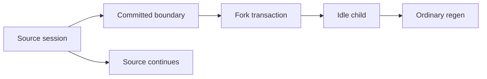

# Non-Destructive Session Branching and Regeneration

## Status and scope

## Traceability

- Normative owner: architecture 23.
- Decision record: [`0015`](../decisions/0015-non-destructive-session-branching-and-regeneration.md).
- Reconciliation topics: `FRK-001..018`.
- Research provenance: [`m4plus_concept2.md`](../m4plus_concept2.md).
- Status: documentation-approved; implementation-authorized work requires a later activating specification.

**Approved future architecture, documentation-only.** This document is the sole
detailed owner for future ordinary Session branching, conversation lineage,
frozen fork context, regeneration, lineage audit, and branch presentation. It
does not authorize a crate, storage migration, wire implementation, UI,
provider driver, or production fork behavior.

It applies to future ordinary Session branching only. M3/M4 Sessions, Runs,
turns, queues, provider selections, retries, event bytes/sequences, cursors,
snapshots, replay, recovery, and M4 `ToolCallRecorded ->
`tool_execution_unavailable` retain their recorded meaning.

## Ownership and non-authorities

Architecture 04 owns current Session/Run persistence and recovery. Architecture
13 owns Mandate lifecycle, triggers, fresh admission, uncertainty, and
reconciliation. Architecture 14 owns execution-meaning canonical framing and
compatibility. Architectures 15--20 own tool, scheduler, child/verifier, MCP,
bridge, and kernel semantics. Architecture 21 owns Goal/Skill/context source,
audience, and disclosure semantics. Architecture 22 owns provider/profile/
capability/reasoning semantics.

This document owns only ordinary Session lineage and frozen fork transfer
semantics. A conversation branch is not a Mandate child edge, verifier target,
RLM parent link, activity aggregate, provider continuation, tool permission,
scheduler reason, bridge grant, kernel epoch, MCP selection, or authority.

## Branch identity and user workflow

The Plan/Build workflow may optionally use this ordinary Session lineage for an
implementation handoff after plan approval. The default path is same-Session
continuation and is not a fork. An opted-in handoff creates an independent
child Session from the approved plan and full available safe conversational
context, then may start a fresh Build Autopilot run. It must not transfer live
runtime state, credentials, grants, queues, provider requests, or unfinished
effects. The source Session remains unchanged.

History is append-only. A user fork creates a new independent child `SessionId`
and leaves the source unchanged. “Rewind” is explanatory language only: it never
truncates, replaces, deletes, rolls back, or switches the source history or an
external effect.

Every root and descendant share one `ConversationTreeId`. A child records its
immediate `ParentSessionId`, caller-stable `ForkOperationId`, and immutable
`ForkBoundaryDto`. Roots use the selected UUIDv5 URL namespace and canonical
name `intention-relay/conversation-tree-v1/<canonical-session-uuid>`; children
copy their persisted parent's tree ID. Forks remain within one `ProjectId`,
`WorkspaceId`, and immutable `WorkspaceRoot`.

`Regenerate response` is a user-turn fork followed by a separate idempotent
ordinary `StartForkRunCommandDto`. It is not Mandate creation, trigger capture,
or fresh admission. A failed start leaves the committed idle child visible.

## Closed boundaries and frozen context

`ForkBoundaryDto` has exactly these variants:

- `CommittedUserTurn`: a non-queued committed user turn with `RunStarted`. The
  child receives that validated user text once through a new child anchor and
  receives no response fact from that run.
- `CompletedAssistantTurn`: a genuinely completed run with one valid terminal
  `Finished` fact, no terminal failure, pending interaction, or unfinished
  external action. A valid empty response adds no synthetic assistant message.

Queued turns, arbitrary events/cursors, partial assistant batches, failed,
cancelled, interrupted, incomplete, waiting, or unfinished work are ineligible.
Source activity does not block an eligible fork, but source queues, active runs,
waiting interaction, admitted work, and external effects never cross it.

`fork-model-context-v1` is a closed ordered text-only causal projection from
committed source facts at the selected boundary. It includes validated user
messages and only eligible final nonblank assistant messages. It excludes
reasoning text/summaries, attempts, usage, tool calls/results, questions,
permissions, child results, raw provider data, and opaque continuation state.
Unsupported or oversized material rejects rather than truncates, omits, or uses
current state.

## Base snapshot, reasoning references, and workspace state

Every child owns one flattened credential-free `ForkBaseSnapshotDto`; nested
forks never require runtime traversal of ancestor or sibling history. The child
context starts from its own snapshot and adds only child-owned later history.
Missing, corrupt, unknown, or incompatible data blocks dependent work before an
effect and never falls back to a live source, current catalog, provider, file,
index, memory, registry, bridge, kernel, MCP, or UI state.

The retained v1 snapshot/preview/command canonical records preserve their
recorded bytes and meaning. New fork snapshot and preview records use v2 only
when typed, ordered, compatibility-bound inherited reasoning references are
needed. References carry source identity/cursor/category/digest/size and never
reasoning text. Architecture 22 owns reasoning compatibility; this document owns
only the immutable fork-reference transfer.

`WorkspaceStateDto::Unverified` is the only initial workspace-state value. It
makes no claim about files, processes, repositories, remote systems, or effects.
A fork never clones or rolls back machine state.

## Atomic lineage and idempotency

Future storage adds fork-owned records for conversation trees, child lineage,
base snapshots, fork operations, and a separately sequenced lineage journal. It
does not alter source Session event sequences, run cursors, or ordinary replay.

One transaction validates the source head and preview digest, then atomically
creates the child projection/snapshots, lineage, base snapshot, optional anchor,
child events, lineage event, and idempotency result. No provider, scheduler,
tool, process, network, kernel, MCP, bridge, or other external work occurs in
that transaction.

Child events order as `SessionCreated`, `SessionForked`, then optional
`ForkAnchorMaterialized`. The separate journal records `ConversationTreeCreated`
and `ConversationBranchLinked`. No synthetic source `SessionForked` event is
allowed.

Equal operation identity and command digest return the same child without new
records. Changed reuse, stale source state, preview mismatch, ineligible
boundary, unavailable history, unsupported snapshot, or unavailable reference
fails closed before a side effect. A failed transaction leaves no partial child,
lineage, event, snapshot, operation binding, or rate consumption.

## Presentation, limits, and protocol

Titles and reversible archive state belong only to their ordinary Session. They
never rewrite lineage or base snapshots. Archive requires an idle session;
archived sources remain readable and forkable.

Tree depth, descendant count, and source-boundary rate limits are
ordinary-session fork policy only. They never constrain Mandate admission,
scheduler behavior, or Mandate-child creation. Snapshot, title, and page bounds
remain intrinsic representation/protocol constraints where their owning field
table requires them.

`session_fork_v1` is a separately negotiated family containing typed preview,
fork, ordinary regeneration, tree page, rename, archive, and restore DTOs. Tree
reads are bounded immediate-child projections with stable continuation order and
their own lineage sequence. They are not tree-wide event streams. Existing M3
session replay and M4 run streams remain unchanged; old peers fail closed for
this additive family.

## Compatibility, dependencies, and non-goals

M3/M4 historical sessions remain linear ordinary records until an additive
migration creates deterministic root lineage records. Migration preserves IDs,
turns, runs, queues, configuration revisions, event JSON, sequences, cursors,
and snapshots byte-for-byte. It creates no synthetic parent, anchor, run,
assistant message, or source event.

A fork begins Mandate-free. It cannot create or transfer a Mandate reason/run,
verifier authority, child edge, provider request/client/credential, tool action,
kernel task, MCP process, bridge grant, or unfinished effect. Later child runs
select their own immutable provider meaning. A profile override is allowed only
for user-turn regeneration as a safe future-default proposal, never as a current
run selection or continuation.

This document depends on architectures 04 and 13--22 plus the DTO, transport,
security, verification, and quality policies. It does not define Mandate
association, activity/UI implementation, workspace cloning/rebinding, autonomous
model/IPython forking, provider implementation, destructive deletion/GC/export,
schema, migrations, crates, Cargo, Makefile/CI, or production activation.

## Required evidence before implementation

A later activating specification must declare exact crate owners, test targets,
coverage tiers, feature profiles, storage/wire versions, and architecture
fixtures, then pass `make quick`, `make docs-check`, `make architecture`, `make
verify`, and Linux/Windows CI. It must cover canonical v1/v2 goldens, boundary
eligibility, flattened context, transaction fault injection, idempotency and
preview races, additive migration byte preservation, negotiated tree paging,
authority isolation, restart/no-resume, no-current-state fallback, archive
behavior, fake-secret redaction, and end-to-end fork/regeneration outcomes.

Architecture 24 owns activity/UI projections. `AgentActivityTreeId` remains
distinct from `ConversationTreeId`; neither tree implies the other, authority,
or rollback semantics.
