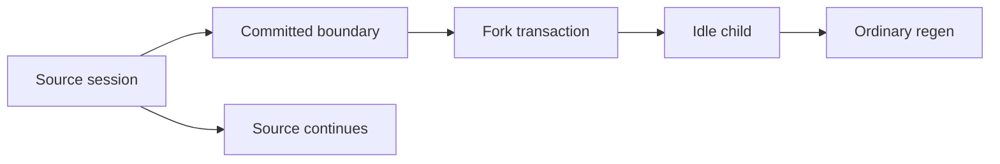

# Non-Destructive Session Branching and Regeneration

## Status and scope

## Traceability

- Normative owner: architecture 23.
- Decision record: [`0015`](../decisions/0015-non-destructive-session-branching-and-regeneration.md).
- Detail decisions: [`0026`](../decisions/0026-session-branching-detail-directions.md) (session-branching detail), [`0033`](../decisions/0033-accepted-m5plus-execution-directions.md) (tool-result/child-agent execution, export, clone/rebind).
- Reconciliation topics: `FRK-001..022`.
- Research provenance: [`m4plus_concept.md`](../m4plus_concept.md).
- Status: documentation-approved; implementation-authorized work requires a later activating specification.


**Approved future architecture, documentation-only.** This document is the sole
detailed owner for future ordinary Session branching, conversation lineage,
frozen fork context, regeneration, lineage audit, and branch presentation. It
does not authorize a crate, storage migration, wire implementation, UI,
provider driver, or production fork behavior.

It applies to future ordinary Session branching only. M3/M4 Sessions, Runs,
turns, queues, provider selections, retries, event bytes/sequences, cursors,
snapshots, replay, recovery, and M4 `ToolCallRecorded ->
`tool_execution_unavailable` retain their recorded meaning.

## Ownership and non-authorities

Architecture 04 owns current Session/Run persistence and recovery. Architecture
13 owns Mandate lifecycle, triggers, fresh admission, uncertainty, and
reconciliation. Architecture 14 owns execution-meaning canonical framing and
compatibility. Architectures 15--20 own tool, scheduler, child/verifier, MCP,
bridge, and kernel semantics. Architecture 21 owns Goal/Skill/context source,
audience, and disclosure semantics. Architecture 22 owns provider/profile/
capability/reasoning semantics.

This document owns only ordinary Session lineage and frozen fork transfer
semantics. A conversation branch is not a Mandate child edge, verifier target,
RLM parent link, activity aggregate, provider continuation, tool permission,
scheduler reason, bridge grant, kernel epoch, MCP selection, or authority.

## Branch identity and user workflow

The Plan/Build workflow may optionally use this ordinary Session lineage for an
implementation handoff after plan approval. The default path is same-Session
continuation and is not a fork. An opted-in handoff creates an independent
child Session from the approved plan and full available safe conversational
context, then may start a fresh Build Autopilot run. It must not transfer live
runtime state, credentials, grants, queues, provider requests, or unfinished
effects. The source Session remains unchanged.

History is append-only. A user fork creates a new independent child `SessionId`
and leaves the source unchanged. “Rewind” is explanatory language only: it never
truncates, replaces, deletes, rolls back, or switches the source history or an
external effect.

Every root and descendant share one `ConversationTreeId`. A child records its
immediate `ParentSessionId`, caller-stable `ForkOperationId`, and immutable
`ForkBoundaryDto`. Roots use the selected UUIDv5 URL namespace and canonical
name `intention-relay/conversation-tree-v1/<canonical-session-uuid>`; children
copy their persisted parent's tree ID. Forks remain within one `ProjectId`,
`WorkspaceId`, and immutable `WorkspaceRoot`.



`Regenerate response` is a user-turn fork followed by a separate idempotent
ordinary `StartForkRunCommandDto`. It is not Mandate creation, trigger capture,
or fresh admission. A failed start leaves the committed idle child visible.

## Closed boundaries and frozen context

`ForkBoundaryDto` has exactly these variants:

- `CommittedUserTurn`: a non-queued committed user turn with `RunStarted`. The
  child receives that validated user text once through a new child anchor and
  receives no response fact from that run.
- `CompletedAssistantTurn`: a genuinely completed run with one valid terminal
  `Finished` fact, no terminal failure, pending interaction, or unfinished
  external action. A valid empty response adds no synthetic assistant message.

Queued turns, arbitrary events/cursors, partial assistant batches, failed,
cancelled, interrupted, incomplete, waiting, or unfinished work are ineligible.
Source activity does not block an eligible fork, but source queues, active runs,
waiting interaction, admitted work, and external effects never cross it.

`fork-model-context-v1` is a closed ordered text-only causal projection from
committed source facts at the selected boundary. It includes validated user
messages and only eligible final nonblank assistant messages. It excludes
reasoning text/summaries, attempts, usage, tool calls/results, questions,
permissions, child results, raw provider data, and opaque continuation state.
Unsupported or oversized material rejects rather than truncates, omits, or uses
current state. A later implementation follows the selected
`fork-model-context-v1` rule: it uses the stored compatible schema unchanged,
defines a separately versioned compatible projection, or blocks the dependent
operation (adopted by [ADR 0026](../decisions/0026-session-branching-detail-directions.md)).

## Base snapshot, reasoning references, and workspace state

Every child owns one flattened credential-free `ForkBaseSnapshotDto`; nested
forks never require runtime traversal of ancestor or sibling history. The child
context starts from its own snapshot and adds only child-owned later history.
Missing, corrupt, unknown, or incompatible data blocks dependent work before an
effect and never falls back to a live source, current catalog, provider, file,
index, memory, registry, bridge, kernel, MCP, or UI state.

The retained v1 snapshot/preview/command canonical records preserve their
recorded bytes and meaning. New fork snapshot and preview records use v2 only
when typed, ordered, compatibility-bound inherited reasoning references are
needed. References carry source identity/cursor/category/digest/size and never
reasoning text. Architecture 22 owns reasoning compatibility; this document owns
only the immutable fork-reference transfer.

`WorkspaceStateDto::Unverified` is the only initial workspace-state value. It
makes no claim about files, processes, repositories, remote systems, or effects.
A fork never clones or rolls back machine state.

## Atomic lineage and idempotency

Future storage adds fork-owned records for conversation trees, child lineage,
base snapshots, fork operations, and a separately sequenced lineage journal. It
does not alter source Session event sequences, run cursors, or ordinary replay.

One transaction validates the source head and preview digest, then atomically
creates the child projection/snapshots, lineage, base snapshot, optional anchor,
child events, lineage event, and idempotency result. No provider, scheduler,
tool, process, network, kernel, MCP, bridge, or other external work occurs in
that transaction.

Child events order as `SessionCreated`, `SessionForked`, then optional
`ForkAnchorMaterialized`. The separate journal records `ConversationTreeCreated`
and `ConversationBranchLinked`. No synthetic source `SessionForked` event is
allowed.

Equal operation identity and command digest return the same child without new
records. Changed reuse, stale source state, preview mismatch, ineligible
boundary, unavailable history, unsupported snapshot, or unavailable reference
fails closed before a side effect. A failed transaction leaves no partial child,
lineage, event, snapshot, operation binding, or rate consumption.

## Presentation, limits, and protocol

Titles and reversible archive state belong only to their ordinary Session. They
never rewrite lineage or base snapshots. Archive requires an idle session;
archived sources remain readable and forkable.

Tree depth, descendant count, and source-boundary rate limits are
ordinary-session fork policy only. They never constrain Mandate admission,
scheduler behavior, or Mandate-child creation. Snapshot, title, and page bounds
remain intrinsic representation/protocol constraints where their owning field
table requires them.

`session_fork_v1` is a separately negotiated family containing typed preview,
fork, ordinary regeneration, tree page, rename, archive, and restore DTOs. Tree
reads are bounded immediate-child projections with stable continuation order and
their own lineage sequence. They are not tree-wide event streams. Existing M3
session replay and M4 run streams remain unchanged; old peers fail closed for
this additive family.

## Detailed protocol DTOs, field tables, and limits

The `session_fork_v1` public contract families are:

```text
ForkSessionCommandDto
ForkSessionResultDto
GetForkPreviewQueryDto
ForkPreviewDto
StartForkRunCommandDto
GetConversationTreeQueryDto
ConversationTreePageDto
ConversationBranchSummaryDto
RenameSessionCommandDto
ArchiveSessionCommandDto
RestoreSessionCommandDto
```

`ForkSessionCommandDto` contains source session identity, the typed boundary,
`ForkOperationId`, expected source sequence, expected preview digest, an
optional validated title, and an optional safe future-profile override. It never
accepts a client-selected child ID, raw snapshot, raw event, configuration path,
credential, workspace path, or opaque implementation value. `ForkSessionResultDto`
is bounded and returns child and tree identities, immediate parent, accepted
boundary, optional child-anchor `TurnId`, snapshot and context schema
versions/digests, inherited future defaults, and the closed `unverified`
workspace notice; it does not return the up-to-1-MiB base snapshot inside a
transport response.

`GetForkPreviewQueryDto` takes only a source session and a candidate typed
boundary. `ForkPreviewDto` returns a fresh source sequence, the `fork-preview`
digest, accepted boundary data, safe inherited future defaults, the
deterministic fallback title, counts and safe types of retained terminal
references, the count and aggregate canonical size of inherited
reasoning-history references, and the closed `unverified` workspace state. The
client must send the exact preview digest it accepted; it must not manufacture a
preview digest locally.

`StartForkRunCommandDto` names the child session, the immutable anchor turn, and
a separate operation ID. It is valid only for a non-archived child created from
a user-turn boundary whose anchor has not already started a fork run. It uses
the anchor already included in the frozen context, resolves one immutable
current run selection under the normal admission rules, and starts no duplicate
user message. Its failure leaves the idle child visible.

`RenameSessionCommandDto`, `ArchiveSessionCommandDto`, and
`RestoreSessionCommandDto` each carry a session ID, expected ordinary session
sequence, and a globally stable `SessionPresentationOperationId`; rename also
carries a `SessionTitleDto`. Equal repeats return the original accepted result.
A reused operation ID with different semantics fails
`session_presentation_operation_conflict`; a stale sequence fails
`session_changed`. A command that already observes its requested presentation
state succeeds with `changed = false` and appends no event. Archive still
performs its mandatory idle check before either outcome.

`GetConversationTreeQueryDto` contains a `ConversationTreeId`, optional parent
`SessionId`, optional opaque continuation token, and a requested page size from
1 through 64. It returns the root summary, at most 64 immediate child summaries,
`has_more`, and an opaque continuation after the final `(created_at,
child_session_id)` sort key. A tree is intentionally live between pages: new,
renamed, archived, restored, or otherwise changed branches may appear on later
pages, and a continuation never promises a revision-consistent tree snapshot. A
token with another tree, another parent, malformed contents, or an oversized
page fails closed with `invalid_conversation_tree_page`.

`ConversationBranchSummaryDto` exposes only branch identity, immediate parent,
creation ordering data, safe title or stable fallback, archive state, mode,
safe future-profile availability, fork point, and `unverified` workspace state.
The immutable base snapshot and its retained source content are not list data.
Tree and lineage reads validate that every named session belongs to the same
tree, project, and workspace.

`SessionTitleDto` is bounded to 128 Unicode scalar values after trim and NFC
normalization, and rejects blank, control, and bidi-override characters. An
adapter may request a title when it forks; otherwise the daemon stores a
deterministic safe title derived from the source title or its stable fallback
and the fork point. A migrated root session has no stored title and uses only
the stable presentation fallback until renamed. Rename changes one session only,
writes `SessionRenamed`, and never changes lineage, a base snapshot, or a
tree-wide title.

### Canonical field tables

The retained `fork-base-snapshot-v1`, `fork-preview-v1`, and `fork-command-v1`
records keep their existing `typed-tlv-v1` framing and SHA-256 inputs exactly.
Their v1 field tables are:

- `fork-base-snapshot`: `1 schema_version`, `2 context_schema_version`,
  `3 source_session_id`, `4 conversation_tree_id`, `5 boundary`,
  `6 source_boundary_sequence`, `7 source_run_cursors`,
  `8 effective_instruction_projection`, `9 materialized_model_messages`,
  `10 inherited_future_defaults`, `11 historical_config_policy_references`,
  `12 safe_usage_provenance`, `13 terminal_tool_result_references`,
  `14 policy_decision_references`, `15 terminal_child_result_references`,
  `16 workspace_state`.
- `fork-preview`: `1 preview_schema_version`, `2 source_session_id`,
  `3 conversation_tree_id`, `4 boundary`, `5 source_head_sequence`,
  `6 materialized_effective_instruction_projection`,
  `7 materialized_model_messages`, `8 inherited_future_defaults`,
  `9 historical_config_policy_references`, `10 safe_usage_provenance`,
  `11 terminal_tool_result_references`, `12 policy_decision_references`,
  `13 terminal_child_result_references`, `14 workspace_state`. Field 6 is the
  selected boundary sequence, not the current source head observed during the
  fork operation.
- `fork-command` (unchanged, `typed-tlv-v1`): `1 source_session_id`,
  `2 boundary`, `3 expected_source_sequence`, `4 expected_preview_digest`,
  `5 title_present`, `6 requested_title`, `7 future_profile_override_present`,
  `8 future_profile_override`.

`typed-tlv-v2` preserves the v1 framing, type tags, length encoding, collection
ordering, SHA-256 construction, and rejection behavior, changing only the
canonicalization-version byte and the fixed field tables. New forks use
`fork-base-snapshot-v2` and `fork-preview-v2`:

- base: `1 schema_version`, `2 context_schema_version`, `3 source_session_id`,
  `4 conversation_tree_id`, `5 boundary`, `6 source_boundary_sequence`,
  `7 source_run_cursors`, `8 effective_instruction_projection`,
  `9 materialized_model_messages`, `10 inherited_future_defaults`,
  `11 historical_config_policy_references`,
  `12 inherited_reasoning_history_references`, `13 safe_usage_provenance`,
  `14 terminal_tool_result_references`, `15 policy_decision_references`,
  `16 terminal_child_result_references`, `17 workspace_state`.
- preview: `1 preview_schema_version`, `2 source_session_id`,
  `3 conversation_tree_id`, `4 boundary`, `5 source_head_sequence`,
  `6 materialized_effective_instruction_projection`,
  `7 materialized_model_messages`, `8 inherited_future_defaults`,
  `9 historical_config_policy_references`,
  `10 inherited_reasoning_history_references`, `11 safe_usage_provenance`,
  `12 terminal_tool_result_references`, `13 policy_decision_references`,
  `14 terminal_child_result_references`, `15 workspace_state`.

`canonical_snapshot_digest` is SHA-256 over the record excluding the resulting
digest field; `model_context_digest` is SHA-256 over the complete versioned
materialized instruction projection and ordered materialized model-message
projection, not over a later reconstructed request. The command's
`expected_preview_digest` is a distinct version-matched digest of the
source/tree identities, selected boundary, source head sequence, inherited
future defaults, materialized context, retained safe references, and
`unverified` workspace state. A `fork-command` digest protects the complete
semantic idempotency input (source, boundary, expected sequence, expected
preview digest, requested title, safe future-profile override) and excludes the
daemon-assigned child ID and time.

### Fixed limits and audit taxonomy

The first scope uses these fixed code-owned limits, enforced inside the fork
transaction before any partial child record exists; every limit failure is a
typed policy result rather than an oversized transport frame, partial branch, or
unstructured storage error:

| Subject | Limit | Enforcement |
| --- | ---: | --- |
| Root-to-child depth | 4,096 | A root has depth 0; reject a child at depth 4,097 with `fork_tree_depth_limit`. |
| Descendants in one tree | 16,384 | Root is not counted; reject before a 16,385th child with `fork_tree_descendant_limit`. |
| Forks from one source boundary | 16 in a rolling hour | Count accepted operations by exact source and boundary; reject with `fork_boundary_rate_limit`. |
| Canonical `ForkBaseSnapshotDto` | 1 MiB | Reject before persistence with `fork_snapshot_too_large`; never truncate context or references. |
| Tree query page | 64 summaries | Reject page sizes outside 1..=64 with `invalid_conversation_tree_page`. |
| Session title | 128 NFC Unicode scalar values | Reject invalid title before the command digest or presentation event. |

The source boundary rate window uses durable accepted timestamps; a rejected,
expired, or rolled-back attempt consumes no quota. Boundaries, base snapshots,
lineage, and idempotency records remain indefinitely readable under the initial
archive-only retention policy.

The ordinary-session taxonomy adds `SessionForked`, `ForkAnchorMaterialized`,
`SessionRenamed`, `SessionArchived`, and `SessionRestored` to the existing
`SessionCreated` and run taxonomy. The separate closed lineage taxonomy is
`ConversationTreeCreated` and `ConversationBranchLinked`. Generic metadata
events, raw snapshot blobs, and a synthetic source-session fork event are not
acceptable audit boundaries.

Inherited usage is source provenance and is never charged to the child a second
time. Child totals count only child-owned runs; tree aggregates deduplicate
inherited usage by original `RunId`. Presentation must distinguish own and
inherited usage.

The closed fork safe failures through `ErrorDto` are:

```text
fork_context_schema_unsupported
fork_snapshot_too_large
reasoning_history_unavailable
fork_history_unavailable
fork_snapshot_unsupported
fork_reference_unavailable
fork_operation_conflict
fork_source_changed
fork_preview_mismatch
fork_boundary_ineligible
fork_tree_depth_limit
fork_tree_descendant_limit
fork_boundary_rate_limit
session_archive_not_idle
session_presentation_operation_conflict
session_changed
invalid_conversation_tree_page
```

They disclose no credential, path, source content, raw provider data, or
implementation resource.

## Compatibility, dependencies, and non-goals

M3/M4 historical sessions remain linear ordinary records until an additive
migration creates deterministic root lineage records. Migration preserves IDs,
turns, runs, queues, configuration revisions, event JSON, sequences, cursors,
and snapshots byte-for-byte. It creates no synthetic parent, anchor, run,
assistant message, or source event.

A fork begins Mandate-free. It cannot create or transfer a Mandate reason/run,
verifier authority, child edge, provider request/client/credential, tool action,
kernel task, MCP process, bridge grant, or unfinished effect. Later child runs
select their own immutable provider meaning. A profile override is allowed only
for user-turn regeneration as a safe future-default proposal, never as a current
run selection or continuation.

This document depends on architectures 04 and 13--22 plus the DTO, transport,
security, verification, and quality policies. It does not define Mandate
association, activity/UI implementation, workspace cloning/rebinding, autonomous
model/IPython forking, provider implementation, destructive deletion/GC/export,
schema, migrations, crates, Cargo, Makefile/CI, or production activation.

Tool-result execution, child-agent execution, export, and cross-workspace
clone/rebind are accepted post-M5 future directions under
[ADR 0033](../decisions/0033-accepted-m5plus-execution-directions.md), to be
executed in Milestone 5+:

- tool-result execution and child-agent execution are separately admitted
  ordinary fork actions from frozen references, never silent re-execution,
  never Mandate child edges, and never verifier authority;
- export is a bounded, credential-free surface for fork lineage and activity
  records, never a history rewrite and never destructive deletion;
- cross-workspace clone/rebind is explicit user-authorized only, never
  implicit, and never transfers live state or authority.

None of these directions are activated here.

## Required evidence before implementation

A later activating specification must declare exact crate owners, test targets,
coverage tiers, feature profiles, storage/wire versions, and architecture
fixtures, then pass `make quick`, `make docs-check`, `make architecture`, `make
verify`, and Linux/Windows CI. It must cover canonical v1/v2 goldens, boundary
eligibility, flattened context, transaction fault injection, idempotency and
preview races, additive migration byte preservation, negotiated tree paging,
authority isolation, restart/no-resume, no-current-state fallback, archive
behavior, fake-secret redaction, and end-to-end fork/regeneration outcomes.

Architecture 24 owns activity/UI projections. `AgentActivityTreeId` remains
distinct from `ConversationTreeId`; neither tree implies the other, authority,
or rollback semantics.
