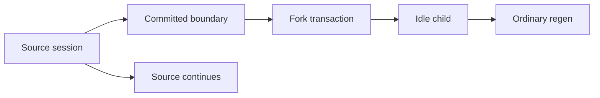

# Non-Destructive Session Branching and Regeneration

**Approved future design. Not implemented; activation requires an activating specification.**

Owner: architecture 23. Decisions: ADR 0015, ADR 0026, ADR 0033. Research: m4plus_concept.md.

This document owns future ordinary Session branching, conversation lineage, frozen fork context, regeneration, lineage
audit, and branch presentation. It applies to future ordinary Session branching only. M3/M4 Sessions, Runs, turns,
queues, provider selections, retries, event bytes/sequences, cursors, snapshots, replay, recovery, and M4
`ToolCallRecorded -> tool_execution_unavailable` retain their recorded meaning.

## Ownership and non-authorities

Architecture 04 owns current Session/Run persistence and recovery. Architecture 13 owns Mandate lifecycle, triggers,
fresh admission, uncertainty, and reconciliation. Architecture 14 owns run-execution meaning and historical
compatibility; its canonical framing was removed by [ADR 0046](../decisions/0046-typed-serde-json-contracts.md).
Architectures 15--20 own tool, scheduler, child/verifier, MCP, bridge, and kernel semantics. Architecture 21 owns
Goal/Skill/context source, audience, and disclosure semantics. Architecture 22 owns
provider/profile/capability/reasoning semantics.

This document owns only ordinary Session lineage and frozen fork transfer semantics. A conversation branch is not a
Mandate child edge, verifier target, RLM parent link, activity aggregate, provider continuation, tool permission,
scheduler reason, bridge grant, kernel epoch, MCP selection, or authority.

## Branch identity and user workflow

The Plan/Build workflow may optionally use ordinary Session lineage for an implementation handoff after plan approval;
the default path is same-Session continuation and is not a fork. An opted-in handoff creates an independent child
Session from the approved plan and full available safe conversational context, then may start a fresh Build Autopilot
run. It transfers no live runtime state, credentials, grants, queues, provider requests, or unfinished effects; the
source Session remains unchanged.

History is append-only. A user fork creates a new independent child `SessionId` and leaves the source unchanged.
“Rewind” is explanatory language only: it never truncates, replaces, deletes, rolls back, or switches the source history
or an external effect.

Every root and descendant share one `ConversationTreeId`. A child records its immediate `ParentSessionId`, caller-stable
`ForkOperationId`, and immutable `ForkBoundaryDto`. Roots use the selected UUIDv5 URL namespace and canonical name
`intention-relay/conversation-tree-v1/<canonical-session-uuid>`; children copy their persisted parent's tree ID. Forks
remain within one `ProjectId`, `WorkspaceId`, and immutable `WorkspaceRoot`.


```mermaid
flowchart LR
  S[Source session] --> B[Committed boundary]
  B --> F[Fork transaction]
  F --> C[Idle child]
  C --> R[Ordinary regen]
  S --> X[Source continues]
```

`Regenerate response` is a user-turn fork followed by a separate idempotent ordinary `StartForkRunCommandDto`. It is not
Mandate creation, trigger capture, or fresh admission. A failed start leaves the committed idle child visible.

## Closed boundaries and frozen context

`ForkBoundaryDto` has exactly these variants:

- `CommittedUserTurn`: a non-queued committed user turn with `RunStarted`. The child receives that validated user text
  once through a new child anchor and receives no response fact from that run.
- `CompletedAssistantTurn`: a genuinely completed run with one valid terminal `Finished` fact, no terminal failure,
  pending interaction, or unfinished external action. A valid empty response adds no synthetic assistant message.

Queued turns, arbitrary events/cursors, partial assistant batches, failed, cancelled, interrupted, incomplete, waiting,
or unfinished work are ineligible; source activity does not block an eligible fork, but source queues, active runs,
waiting interaction, admitted work, and external effects never cross it.

`fork-model-context-v1` is a closed ordered text-only causal projection from committed source facts at the selected
boundary. It includes validated user messages and only eligible final nonblank assistant messages. It excludes reasoning
text/summaries, attempts, usage, tool calls/results, questions, permissions, child results, raw provider data, and
opaque continuation state. Unsupported or oversized material rejects rather than truncates, omits, or uses current
state. A later implementation uses the stored compatible schema unchanged, defines a separately versioned compatible
projection, or blocks the dependent operation (ADR 0026).

## Base snapshot, reasoning references, and workspace state

Every child owns one flattened credential-free `ForkBaseSnapshotDto`; nested forks never require runtime traversal of
ancestor or sibling history. The child context starts from its own snapshot and adds only child-owned later history.
Missing, corrupt, unknown, or incompatible data blocks dependent work before an effect and never falls back to a live
source, current catalog, provider, file, index, memory, registry, bridge, kernel, MCP, or UI state.

Fork snapshot, preview, and command records are typed serde JSON shapes; the former `typed-tlv` framing,
canonicalization-version byte, and SHA-256 digest construction were removed by
[ADR 0046](../decisions/0046-typed-serde-json-contracts.md), and under the single-version policy
([ADR 0038](../decisions/0038-no-backward-compatibility-and-legacy-removal.md)) there is one live shape per record,
carrying the typed, ordered, compatibility-bound inherited reasoning references. References carry source identity,
cursor, category, and size and never reasoning text. Architecture 22 owns reasoning compatibility; this document owns
only the immutable fork-reference transfer.

`WorkspaceStateDto::Unverified` is the only initial workspace-state value. It makes no claim about files, processes,
repositories, remote systems, or effects. A fork never clones or rolls back machine state.

## Atomic lineage and idempotency

Future storage adds fork-owned records for conversation trees, child lineage, base snapshots, fork operations, and a
separately sequenced lineage journal. It does not alter source Session event sequences, run cursors, or ordinary replay.

One transaction validates the source head and the accepted preview binding, then atomically creates the child
projection/snapshots, lineage, base snapshot, optional anchor, child events, lineage event, and idempotency result. No
provider, scheduler, tool, process, network, kernel, MCP, bridge, or other external work occurs in that transaction.

Child events order as `SessionCreated`, `SessionForked`, then optional `ForkAnchorMaterialized`. The separate journal
records `ConversationTreeCreated` and `ConversationBranchLinked`. No synthetic source `SessionForked` event is allowed.

Equal operation identity and command semantics return the same child without new records. Changed reuse, stale source
state, preview mismatch, ineligible boundary, unavailable history, unsupported snapshot, or unavailable reference fails
closed before a side effect. A failed transaction leaves no partial child, lineage, event, snapshot, operation binding,
or rate consumption.

## Presentation, limits, and protocol

Titles and reversible archive state belong only to their ordinary Session. They never rewrite lineage or base snapshots.
Archive requires an idle session; archived sources remain readable and forkable.

Tree depth, descendant count, and source-boundary rate limits are ordinary-session fork policy only. They never
constrain Mandate admission, scheduler behavior, or Mandate-child creation. Snapshot, title, and page bounds remain
intrinsic representation/protocol constraints where their owning field table requires them.

The typed fork preview, fork, ordinary regeneration, tree page, rename, archive, and restore DTOs are exposed as
ordinary JSON-RPC methods over the single local connection; the former `session_fork_v1` negotiated family and its
capability gate were removed by [ADR 0045](../decisions/0045-local-json-rpc-2-0-transport.md). Tree reads are bounded
immediate-child projections with stable continuation order and their own lineage sequence. They are not tree-wide event
streams. Existing M3 session replay and M4 run streams remain unchanged; a peer that does not speak protocol 2.0
receives the typed version-mismatch error before any method is served.

## Detailed protocol DTOs, field tables, and limits

The fork public DTOs are:

```text
ForkSessionCommandDto
ForkSessionResultDto
GetForkPreviewQueryDto
ForkPreviewDto
StartForkRunCommandDto
GetConversationTreeQueryDto
ConversationTreePageDto
ConversationBranchSummaryDto
RenameSessionCommandDto
ArchiveSessionCommandDto
RestoreSessionCommandDto
```

`ForkSessionCommandDto` contains source session identity, the typed boundary, `ForkOperationId`, expected source
sequence, the expected preview binding, an optional validated title, and an optional safe future-profile override. It
never accepts a client-selected child ID, raw snapshot, raw event, configuration path, credential, workspace path, or
opaque implementation value. `ForkSessionResultDto` is bounded and returns child and tree identities, immediate parent,
accepted boundary, optional child-anchor `TurnId`, snapshot and context schema versions, inherited future defaults, and
the closed `unverified` workspace notice; it does not return the up-to-1-MiB base snapshot inside a transport response.

`GetForkPreviewQueryDto` takes only a source session and a candidate typed boundary. `ForkPreviewDto` returns a fresh
source sequence, accepted boundary data, safe inherited future defaults, the deterministic fallback title, counts and
safe types of retained terminal references, the count and aggregate size of inherited reasoning-history references, and
the closed `unverified` workspace state. The client must bind its command to the exact preview it accepted; it must not
manufacture a preview binding locally.

`StartForkRunCommandDto` names the child session, the immutable anchor turn, and a separate operation ID. It is valid
only for a non-archived child created from a user-turn boundary whose anchor has not already started a fork run. It uses
the anchor already included in the frozen context, resolves one immutable current run selection under the normal
admission rules, and starts no duplicate user message. Its failure leaves the idle child visible.

`RenameSessionCommandDto`, `ArchiveSessionCommandDto`, and `RestoreSessionCommandDto` each carry a session ID, expected
ordinary session sequence, and a globally stable `SessionPresentationOperationId`; rename also carries a
`SessionTitleDto`. Equal repeats return the original accepted result. A reused operation ID with different semantics
fails `session_presentation_operation_conflict`; a stale sequence fails `session_changed`. A command that already
observes its requested presentation state succeeds with `changed = false` and appends no event. Archive still performs
its mandatory idle check before either outcome.

`GetConversationTreeQueryDto` contains a `ConversationTreeId`, optional parent `SessionId`, optional opaque continuation
token, and a requested page size from 1 through 64. It returns the root summary, at most 64 immediate child summaries,
`has_more`, and an opaque continuation after the final `(created_at, child_session_id)` sort key. A tree is
intentionally live between pages: new, renamed, archived, restored, or otherwise changed branches may appear on later
pages, and a continuation never promises a revision-consistent tree snapshot. A token with another tree, another parent,
malformed contents, or an oversized page fails closed with `invalid_conversation_tree_page`.

`ConversationBranchSummaryDto` exposes only branch identity, immediate parent, creation ordering data, safe title or
stable fallback, archive state, mode, safe future-profile availability, fork point, and `unverified` workspace state.
The immutable base snapshot and its retained source content are not list data. Tree and lineage reads validate that
every named session belongs to the same tree, project, and workspace.

`SessionTitleDto` is bounded to 128 Unicode scalar values after trim and NFC normalization, and rejects blank, control,
and bidi-override characters. An adapter may request a title when it forks; otherwise the daemon stores a deterministic
safe title derived from the source title or its stable fallback and the fork point. A migrated root session has no
stored title and uses only the stable presentation fallback until renamed. Rename changes one session only, writes
`SessionRenamed`, and never changes lineage, a base snapshot, or a tree-wide title.

### Field tables

Fork snapshot, preview, and command records are typed serde JSON shapes; the former `typed-tlv` framing, type tags,
length encoding, canonicalization-version byte, and SHA-256 digest construction were removed by
[ADR 0046](../decisions/0046-typed-serde-json-contracts.md). Under the single-version policy
([ADR 0038](../decisions/0038-no-backward-compatibility-and-legacy-removal.md)) each record keeps exactly one live
shape, which carries the typed, ordered, compatibility-bound inherited reasoning references.

- `fork-base-snapshot`: `1 schema_version`, `2 context_schema_version`, `3 source_session_id`,
  `4 conversation_tree_id`, `5 boundary`, `6 source_boundary_sequence`, `7 source_run_cursors`,
  `8 effective_instruction_projection`, `9 materialized_model_messages`, `10 inherited_future_defaults`,
  `11 historical_config_policy_references`, `12 inherited_reasoning_history_references`, `13 safe_usage_provenance`,
  `14 terminal_tool_result_references`, `15 policy_decision_references`, `16 terminal_child_result_references`,
  `17 workspace_state`.
- `fork-preview`: `1 preview_schema_version`, `2 source_session_id`, `3 conversation_tree_id`, `4 boundary`,
  `5 source_head_sequence`, `6 materialized_effective_instruction_projection`, `7 materialized_model_messages`,
  `8 inherited_future_defaults`, `9 historical_config_policy_references`, `10 inherited_reasoning_history_references`,
  `11 safe_usage_provenance`, `12 terminal_tool_result_references`, `13 policy_decision_references`,
  `14 terminal_child_result_references`, `15 workspace_state`. Field 6 is the selected boundary sequence, not the
  current source head observed during the fork operation.
- `fork-command`: `1 source_session_id`, `2 boundary`, `3 expected_source_sequence`, `4 expected_preview_binding`,
  `5 title_present`, `6 requested_title`, `7 future_profile_override_present`, `8 future_profile_override`.

The former `canonical_snapshot_digest`, `model_context_digest`, and `fork-command` digest construction are removed with
the codec ([ADR 0046](../decisions/0046-typed-serde-json-contracts.md)). A command binds to the exact source state the
client accepted through `expected_source_sequence` and `expected_preview_binding`; a later activating specification may
define a canonical binding for the preview together with its first real consumer under the RFC 8785 policy (ADR 0046),
and no canonical digest is part of the current contract.

`effective_instruction_projection` and `materialized_effective_instruction_projection` carry the typed
`InstructionProjectionV1` of [architecture 30](30-instruction-sources-and-system-context.md)
([ADR 0043](../decisions/0043-instruction-sources-and-system-context.md)): the exact ordered contributions with their
source revisions, the declared audience, and the projection revision identity, materialized when the fork is created. A
child inherits the projection verbatim; no fork, regeneration, replay, or later run re-derives it from current
configuration, current project instructions, or current session state.

### Fixed limits and audit taxonomy

The first scope uses these fixed code-owned limits, enforced inside the fork transaction before any partial child record
exists; every limit failure is a typed policy result rather than an oversized transport frame, partial branch, or
unstructured storage error:

| Subject | Limit | Enforcement |
| --- | ---: | --- |
| Root-to-child depth | 4,096 | A root has depth 0; reject a child at depth 4,097 with `fork_tree_depth_limit`. |
| Descendants in one tree | 16,384 | Root is not counted; reject before a 16,385th child with `fork_tree_descendant_limit`. |
| Forks from one source boundary | 16 in a rolling hour | Count accepted operations by exact source and boundary; reject with `fork_boundary_rate_limit`. |
| Canonical `ForkBaseSnapshotDto` | 1 MiB | Reject before persistence with `fork_snapshot_too_large`; never truncate context or references. |
| Tree query page | 64 summaries | Reject page sizes outside 1..=64 with `invalid_conversation_tree_page`. |
| Session title | 128 NFC Unicode scalar values | Reject invalid title before the presentation event. |

The source boundary rate window uses durable accepted timestamps; a rejected, expired, or rolled-back attempt consumes
no quota. Boundaries, base snapshots, lineage, and idempotency records remain indefinitely readable under the initial
archive-only retention policy.

The ordinary-session taxonomy adds `SessionForked`, `ForkAnchorMaterialized`, `SessionRenamed`, `SessionArchived`, and
`SessionRestored` to the existing `SessionCreated` and run taxonomy. The separate closed lineage taxonomy is
`ConversationTreeCreated` and `ConversationBranchLinked`. Generic metadata events, raw snapshot blobs, and a synthetic
source-session fork event are not acceptable audit boundaries.

Inherited usage is source provenance and is never charged to the child a second time. Child totals count only
child-owned runs; tree aggregates deduplicate inherited usage by original `RunId`. Presentation must distinguish own and
inherited usage.

The closed fork safe failures through `ErrorDto` are:

```text
fork_context_schema_unsupported
fork_snapshot_too_large
reasoning_history_unavailable
fork_history_unavailable
fork_snapshot_unsupported
fork_reference_unavailable
fork_operation_conflict
fork_source_changed
fork_preview_mismatch
fork_boundary_ineligible
fork_tree_depth_limit
fork_tree_descendant_limit
fork_boundary_rate_limit
session_archive_not_idle
session_presentation_operation_conflict
session_changed
invalid_conversation_tree_page
```

They disclose no credential, path, source content, raw provider data, or implementation resource.

## Compatibility, dependencies, and non-goals

M3/M4 historical sessions remain linear ordinary records until an additive migration creates deterministic root lineage
records. Migration preserves IDs, turns, runs, queues, configuration revisions, event JSON, sequences, cursors, and
snapshots byte-for-byte. It creates no synthetic parent, anchor, run, assistant message, or source event.

A fork begins Mandate-free. It cannot create or transfer a Mandate reason/run, verifier authority, child edge, provider
request/client/credential, tool action, kernel task, MCP process, bridge grant, or unfinished effect. Later child runs
select their own immutable provider meaning. A profile override is allowed only for user-turn regeneration as a safe
future-default proposal, never as a current run selection or continuation.

This document depends on architectures 04 and 13--22 plus the DTO, transport, security, verification, and quality
policies. It does not define Mandate association, activity/UI implementation, workspace cloning/rebinding, autonomous
model/IPython forking, provider implementation, destructive deletion/GC/export, schema, migrations, crates, Cargo,
Makefile/CI, or production activation.

Tool-result execution, child-agent execution, export, and cross-workspace clone/rebind are accepted post-M5 future
directions under [ADR 0033](../decisions/0033-accepted-m5plus-execution-directions.md), to be executed in Milestone 5+:

- tool-result execution and child-agent execution are separately admitted ordinary fork actions from frozen references,
  never silent re-execution, never Mandate child edges, and never verifier authority;
- export is a bounded, credential-free surface for fork lineage and activity records, never a history rewrite and never
  destructive deletion;
- cross-workspace clone/rebind is explicit user-authorized only, never implicit, and never transfers live state or
  authority.

## Required evidence before implementation

Evidence: activating specification per [architecture 12](12-quality-gates-and-makefile.md).

Architecture 24 owns activity/UI projections. `AgentActivityTreeId` remains distinct from `ConversationTreeId`; neither
tree implies the other, authority, or rollback semantics.
