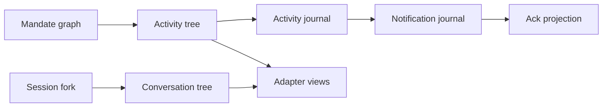

# Activity, UI, and Adapters

## Status and scope

**Approved future architecture, documentation-only.** This document is the sole
detailed owner for future activity trees, direct-pair communication, activity and
notification journals, acknowledgement projections, safe UI projections, and
adapter delivery. It extends ordinary Milestone 6 planning but activates no
crate, schema, migration, wire implementation, OS notification, or production
behavior.

It applies to future ordinary, Mandate, and VerifierMandate projections. M3/M4
records receive compatibility-only read projections where supported; they gain no
synthetic activity identity, journal, message, notification, acknowledgement, or
execution selection.

## Ownership and non-authorities

The daemon owns activity identity assignment, journal persistence, notification
and acknowledgement state, ordering, recovery, and publication. `intention-client`
remains the only adapter ingress. Tauri, TUI, and REPL own presentation, typed
user input, local display state, and reconnect UX only.

Architecture 13 owns lifecycle/admission/reconciliation; 14 owns canonical
meaning and decoding; 15 owns tool effects; 16 owns scheduling; 17 owns child
edges and verifier authority; 18--20 own MCP, bridge, and kernel; 21 owns
context; 22 owns provider/reasoning; and 23 owns Session fork lineage. Activity,
notifications, acknowledgements, adapters, and UI never grant or infer any of
those authorities.

## Activity identity and direct pairs

New work uses a daemon-assigned `AgentActivityTreeId`. New Mandate work retains
Mandate-scoped activity identity across fresh runs; a `RunId` is provenance, not
activity authority. `AgentActivityTreeId` is distinct from `ConversationTreeId`,
Mandate graph identity, Session sequence, Run cursor, lineage sequence, and
notification cursor.

Each admitted direct child has one immutable parent/child activity pair with a
daemon-assigned pair identity and one shared monotonic pair order. Only this
pair may exchange the closed message kinds:

| Direction | Kinds |
| --- | --- |
| Parent to child | `Instruction`, `ClarificationReply` |
| Child to parent | `Report`, `ClarificationRequest` |

A sibling, indirect relative, root, adapter, bridge, kernel, MCP service,
provider, or arbitrary caller cannot send a pair message. Invalid direction,
stale link, terminal endpoint, duplicate/skipped order, invalid reference, or
limit failure rejects before publication.

## Messages, safe projections, and journal

A message has typed identity, tree/pair/order/direction/kind, sender/recipient
provenance, bounded redacted safe text, closed typed references, delivery state,
and canonical digest. References carry identity, revision/cursor, visibility,
and provenance only. They never embed prompt, provider/reasoning, tool/MCP,
path, command, credential, grant, Python/Jupyter, raw result, or diagnostic
bodies. Retained content requires separately authorized retrieval.

Messages deliver only at the recipient's next fresh model request, in activity
journal order. They cannot alter a sent provider request, interrupt a step,
create a run, schedule work, or become a remote continuation. Clarification
waiting, timeout, cancellation, terminalization, and restart never resume work.

Each tree owns an append-only `AgentActivityJournalSequenceDto`, independent of
all Session, Run, lineage, provider, tool, and notification sequences. Journal
records safely describe root binding, child/message/clarification transitions,
terminal child state, policy observation, Goal/harness milestone, and unknown
effect observation. No global order across trees exists.

A semantic transition atomically commits its activity projections, journal/index/
snapshot state, required notification reference, acknowledgement consequences,
and related message/child state, or commits nothing. External work occurs outside
the transaction. Publication follows commit and exact scoped reread.

## Notifications and acknowledgement

One daemon-owned `AgentNotificationJournal` serves the local OS user. Its
independent `AgentNotificationCursorDto` is an observation position, never a
read, seen, dismissed, or accepted claim. Records contain only activity tree and
record references, closed `Urgent` or `Ordinary` level/reason, safe counts/states,
time, and digest. They exclude message text and all sensitive content/resources.

Urgent safety records take precedence over ordinary summaries. Ordinary
summaries may coalesce to current safe per-tree state. Reconnect returns current
redacted summaries for affected trees, not replayed alerts. Notification replay,
publication, archival reads, and slow-peer handling never start work.

Durable acknowledgement/read state is a separate presentation acknowledgement
aggregate with its own typed commands and projections. It never rewrites a
notification journal record, changes the notification cursor, creates authority,
or schedules/retries work. Native OS notifications, remote push, accounts, and
inbox semantics are excluded.

## Protocol, adapters, and recovery

`agent_activity_v1` and `user_notifications_v1` are additive negotiated families
over the existing local endpoint and daemon-frame transport. Activity replay
captures one upper journal sequence, sends a safe snapshot and bounded ascending
pages through that bound, sends completion, then emits only later live frames.
Notification reconnect accepts an observation cursor and returns bounded current
safe summaries. Unsupported, corrupt, unavailable, gapped, slow, or detached
peers fail closed or resynchronize without blocking durable work or healthy peers.

Adapters render daemon-owned typed projections and use `intention-client` for
all activity, notification, acknowledgement, Session, Run, and fork commands or
queries. They cannot own a journal, cursor authority, lifecycle inference, or
parallel protocol. Closing an adapter does not cancel work. Tauri may provide
in-app rendering only; TUI/REPL consume equivalent DTOs and outcomes.

Recovery preserves supported durable activity, notification, and acknowledgement
facts but never resumes messages, clarifications, model steps, notifications, or
external work. Detached clients reconstruct only from durable safe projections.
Historical M3/M4 compatibility projections never reconstruct missing state from
current configuration, providers, registry, ancestry, context, kernel, bridge,
MCP, UI, or adapter state.

## Compatibility, dependencies, and non-goals

Existing M3 session replay, M4 run streaming, cursors, facts, retries, provider
behavior, recovery, and `tool_execution_unavailable` remain unchanged. Activity
is not a filtered Session/Run stream and conversation lineage does not imply
activity authority.

This document depends on architectures 03, 10, 12, and 13--23 plus decisions
0001--0015. It does not define production storage/wire tags, crate activation,
OS notifications, remote transport, accounts, physical deletion, export,
compaction, retention clocks, provider UI/control planes, or final visual design.

## Required evidence before implementation

A later M6 activating specification must declare exact crate owners, test
targets, coverage tiers, feature profiles, storage/wire versions, and expected-
failure architecture fixtures. It must cover canonical identity/message/journal/
notification/acknowledgement vectors; direct-pair/order/clarification failures;
atomic fault injection; separate sequence domains; historical compatibility
projections; negotiated snapshot/page/completion/live/resync; urgent priority and
acknowledgement independence; restart/no-resume; redaction; adapter parity; and
Linux/Windows socket/named-pipe outcome scenarios. It must run `make quick`,
`make docs-check`, `make architecture`, `make verify`, and required CI.
