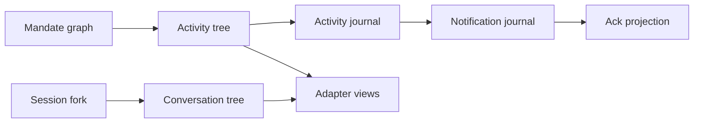

# Activity, UI, and Adapters

### Historical projections and limits

Compatibility-only M3/M4 activity projections, where supported, are read-only
views computed without synthetic activity identity, journal, message,
notification, or acknowledgement state. Numeric values retained in research are
not implementation limits for this package until an activating M6 specification
classifies them as intrinsic bounds, capacity availability, or ordinary policy.
Activity numeric limit classification is an accepted post-M5 future direction
under [ADR 0034](../decisions/0034-accepted-m5plus-retained-deferral-directions.md):
the numeric values require intrinsic/capacity/ordinary classification at M5+
activation, never Mandate quotas or child-graph limits; it is not activated
here.


## Status and scope

## Traceability

- Normative owner: architecture 24.
- Decision record: [`0016`](../decisions/0016-activity-ui-and-adapters.md).
- Detail decisions: [`0029`](../decisions/0029-activity-and-notification-detail-directions.md) (activity and notification detail), [`0032`](../decisions/0032-accepted-deferred-directions-activity-metadata-content-inspection-per-call-cancellation.md) (tree-level metadata direction), [`0033`](../decisions/0033-accepted-m5plus-execution-directions.md) (export), [`0034`](../decisions/0034-accepted-m5plus-retained-deferral-directions.md) (activity numeric limit classification).
- Reconciliation topics: `ACT-001..019`.
- Research provenance: [`m4plus_concept.md`](../m4plus_concept.md).
- Status: documentation-approved; implementation-authorized work requires a later activating specification.


**Approved future architecture, documentation-only.** This document is the sole
detailed owner for future activity trees, direct-pair communication, activity and
notification journals, acknowledgement projections, safe UI projections, and
adapter delivery. It extends ordinary Milestone 6 planning but activates no
crate, schema, migration, wire implementation, OS notification, or production
behavior.

It applies to future ordinary, Mandate, and VerifierMandate projections. M3/M4
records receive compatibility-only read projections where supported; they gain no
synthetic activity identity, journal, message, notification, acknowledgement, or
execution selection.

## Ownership and non-authorities

The daemon owns activity identity assignment, journal persistence, notification
and acknowledgement state, ordering, recovery, and publication. `intention-client`
remains the only adapter ingress. Tauri, TUI, and REPL own presentation, typed
user input, local display state, and reconnect UX only.

Architecture 13 owns lifecycle/admission/reconciliation; 14 owns canonical
meaning and decoding; 15 owns tool effects; 16 owns scheduling; 17 owns child
edges and verifier authority; 18--20 own MCP, bridge, and kernel; 21 owns
context; 22 owns provider/reasoning; and 23 owns Session fork lineage. Activity,
notifications, acknowledgements, adapters, and UI never grant or infer any of
those authorities.

## Activity identity and direct pairs

New work uses a daemon-assigned `AgentActivityTreeId`. New Mandate work retains
Mandate-scoped activity identity across fresh runs; a `RunId` is provenance, not
activity authority. `AgentActivityTreeId` is distinct from `ConversationTreeId`,
Mandate graph identity, Session sequence, Run cursor, lineage sequence, and
notification cursor.

Every new root run receives its `AgentActivityTreeId` in the same durable
admission transaction as its immutable run selection. Every root tree begins
with one durable `RootActivityTreeBound` journal record even when it has no
child or message. Historical M4 and post-M4 v1/v2/v3 selections stay
byte-for-byte readable with no synthetic identity.

`run-execution-meaning-v4` carries the credential-free `AgentActivitySelectionV1`:

```text
AgentActivitySelectionV1
  Root {
    activity_tree_id
    root_origin
    activity_exchange_revision
    activity_journal_revision
    user_projection_revision
    fixed_activity_limits
  }
  Descendant {
    activity_tree_id
    direct_parent_link_reference
    activity_exchange_revision
    activity_journal_revision
    user_projection_revision
    fixed_activity_limits
  }
```

Each admitted direct child has one immutable parent/child activity pair with a
daemon-assigned pair identity and one shared monotonic pair order. Only this
pair may exchange the closed message kinds:

| Direction | Kinds |
| --- | --- |
| Parent to child | `Instruction`, `ClarificationReply` |
| Child to parent | `Report`, `ClarificationRequest` |

A sibling, indirect relative, root, adapter, bridge, kernel, MCP service,
provider, or arbitrary caller cannot send a pair message. Invalid direction,
stale link, terminal endpoint, duplicate/skipped order, invalid reference, or
limit failure rejects before publication.



## Messages, safe projections, and journal

A message has typed identity, tree/pair/order/direction/kind, sender/recipient
provenance, bounded redacted safe text, closed typed references, delivery state,
and canonical digest. References carry identity, revision/cursor, visibility,
and provenance only. They never embed prompt, provider/reasoning, tool/MCP,
path, command, credential, grant, Python/Jupyter, raw result, or diagnostic
bodies. Retained content requires separately authorized retrieval.

The first-scope DTO shapes are:

```text
AgentActivityPairDto
  pair_id
  activity_tree_id
  direct_parent_link_reference
  pair_order
  parent_session_and_run_reference
  child_session_and_run_reference

AgentMessageDto
  message_id
  activity_tree_id
  pair_id
  pair_order
  direction
  kind
  sender_run_reference
  recipient_run_reference
  source_model_step_reference
  safe_text
  typed_references
  delivery_state
  canonical_message_digest

AgentMessageReferenceDto
  TerminalChildResult
  TerminalToolResult
  PolicyDecision
  VerificationEvidence
  GoalRevision
  RetainedContent
```

`safe_text` is bounded redacted presentation, never raw content; a message
carries at most 16 typed references; `RetainedContent` is disclosed only via the
separately admitted `retrieve` tool. Each direction holds at most 16 undelivered
messages and 512 KiB of canonical safe content, with one slot and 64 KiB in each
direction reserved for `ClarificationReply` and `ClarificationRequest`
respectively; ordinary `Instruction`/`Report` use at most 15 slots and 448 KiB.

Messages deliver only at the recipient's next fresh model request, in activity
journal order. They cannot alter a sent provider request, interrupt a step,
create a run, schedule work, or become a remote continuation. Clarification
waiting, timeout, cancellation, terminalization, and restart never resume work.

Each tree owns an append-only `AgentActivityJournalSequenceDto`, independent of
all Session, Run, lineage, provider, tool, and notification sequences. Journal
records safely describe root binding, child/message/clarification transitions,
terminal child state, policy observation, Goal/harness milestone, and unknown
effect observation. No global order across trees exists.

```text
AgentActivityJournalRecordDto
  activity_tree_id
  record_id
  sequence
  occurred_at
  root_run_reference
  direct_pair_reference_when_present
  record_kind
  safe_user_projection
  typed_references
  canonical_record_digest
```

The 17 closed record kinds are:

```text
RootActivityTreeBound
ChildCreated
DirectMessageAccepted
DirectMessageDelivered
DirectMessageUndeliverable
ChildAwaitingClarification
ChildClarificationResolved
ChildCompleted
ChildFailed
ChildCancelled
ChildInterrupted
PolicySuspensionObserved
PolicyRevocationCancellationStarted
PolicyRevocationCancellationCompleted
GoalActivityMilestone
HarnessActivityMilestone
ExternalEffectUnknownObserved
```

A semantic transition atomically commits its activity projections, journal/index/
snapshot state, required notification reference, acknowledgement consequences,
and related message/child state, or commits nothing. External work occurs outside
the transaction. Publication follows commit and exact scoped reread. A
`safe_user_projection` is limited to safe text, closed kind, safe status, bounded
counters, reason code, and allowed typed references; it never includes tool/MCP/
provider/reasoning data, prompts, paths, commands, grants, credentials, Python
values, transcripts, or diagnostics. `DirectChildStatusDto` reports one child;
`DescendantSummaryDto` reports a subtree with one journal sequence and bounded
counts, marked incomplete when a projection is unreadable, built from durable
safe projections only.

The first-scope fixed activity bounds are:

| Subject | Selected limit |
| --- | ---: |
| Inter-agent messages in one activity tree | 1,024 |
| Aggregate canonical message content | 4 MiB |
| Activity-journal records | 4,096 |
| One canonical message or activity record | 64 KiB |
| Activity-journal page | 256 records and 512 KiB |
| Typed references in one message | 16 |
| Clarification wait | 60 minutes |

A limit failure is checked before a partial durable record exists; it never
truncates, evicts, synthesizes, or starts external work. Archive is accepted only
after the root and every descendant are terminal; it is read-only, retains
everything, and physical deletion, compaction, export, and garbage collection
remain out of scope.

## Child operations, delivery, and model exchanges

The daemon-internal RLM child operation is closed and bound to the child's
immutable `RlmParentLinkDto`, current `ModelStepId`, daemon-assigned
`RlmMessageId`, message kind, pair order, and canonical payload digest:

```text
RlmChildMessageOperation
  Report
  ClarificationRequest
```

It is not a `ToolId`, `ToolCallId`, model-tool registry call, bridge operation,
or MCP command, and it cannot create, cancel, configure, or delegate to a child.
Equal replay returns the one accepted message; a changed operation identity
fails as a known pre-effect conflict. Messages reach a recipient only before
that recipient's next fresh model request. They never alter an already sent
provider request, interrupt a running model step, create a root run, or itself
schedule a parent step. The daemon records model delivery in the same
pre-provider durable boundary that records the recipient's next model step. A
terminal or cancelled recipient rejects an undelivered ordinary message with a
typed durable delivery outcome; the original message and its reason remain in
the activity journal.

The distinct typed model input is:

```text
RlmMessageExchangeDto
  activity_tree_id
  recipient_session_id
  recipient_run_id
  target_model_step_id
  captured_activity_journal_sequence
  ordered_messages
```

It remains distinct from text-only `ModelMessageDto` and from
`ModelToolExchangeDto`. A provider descriptor owns the private compatible
translation, but it cannot flatten an RLM message into an ordinary user or
assistant history item, infer a current message, reorder it, or introduce a
remote continuation. The daemon supplies all undelivered messages for the
recipient in increasing `AgentActivityJournalSequenceDto` order. That order is
the same durable order visible in the journal; an inner `AgentPairOrderDto`
proves the order of every individual pair. No alternative sorting by child,
class, task, timing estimate, or current projection is allowed.

A daemon-created agent status, child creation, admission, tool/MCP action,
output fragment, policy detail, or other service milestone never becomes a
parent model message merely because it is visible in the activity journal. A
terminal child conclusion is recorded as one mandatory direct-pair
terminal-result availability reference and is included once in the next eligible
parent exchange. It does not require `AwaitResult`, does not start a parent
step, and does not delay parent terminalization. If a parent is already
cancelling or terminal when no eligible step remains, the terminal reference
remains readable through the direct-child result/status evidence and activity
journal without inventing a model delivery.

Tree-level metadata is an accepted post-M5 future direction under
[ADR 0032](../decisions/0032-accepted-deferred-directions-activity-metadata-content-inspection-per-call-cancellation.md):
a future bounded, credential-free metadata surface on activity trees, distinct
from journal records and notification state, that never becomes activity,
authority, or a second sequence. It is not activated here.

Export of activity records is an accepted post-M5 future direction under
[ADR 0033](../decisions/0033-accepted-m5plus-execution-directions.md), to be
executed in Milestone 5+ as a bounded, credential-free surface that never
rewrites history and is never destructive; it is not activated here.

## Notifications and acknowledgement

One daemon-owned `AgentNotificationJournal` serves the local OS user. Its
independent `AgentNotificationCursorDto` is an observation position, never a
read, seen, dismissed, or accepted claim. Records contain only activity tree and
record references, closed `Urgent` or `Ordinary` level/reason, safe counts/states,
time, and digest. They exclude message text and all sensitive content/resources.

```text
AgentNotificationLevelDto
  Urgent
  Ordinary
```

`Urgent` is used for user-decision-needing-attention, policy-revocation or
cancellation safety, `ExternalEffectUnknown`, a terminal outcome leaving
obligatory work unfinished, and `sub_agent_clarification_timeout`. `Ordinary` is
used only for a stable awaiting state or terminal milestone; there are no
periodic or every-N summaries. Continual-harness `journal-only` presentation
suppresses ordinary linked-activity entries but never an `Urgent` safety record.
At most one `Urgent` record exists per `(AgentActivityTreeId, cancellation
reason)`, created atomically with the cascade-start projection carrying the
then-known safe counts; a later distinct `ExternalEffectUnknown` is its own
urgent reason.

Urgent safety records take precedence over ordinary summaries. Ordinary
summaries may coalesce to current safe per-tree state. Reconnect returns current
redacted summaries for affected trees, not replayed alerts. Notification replay,
publication, archival reads, and slow-peer handling never start work.

`user_notifications_v1` reuses the existing private local endpoint and transport;
a request carries only the last accepted cursor (no read, seen, dismissed, or
accepted claim) and returns one redacted `AgentNotificationSummaryDto` per
affected tree, ordered by first new cursor then `AgentActivityTreeId`, at most
32 trees and 64 KiB per page; missed notifications are never replayed as new
alerts. Delivery, summary, replay, reconnect, archival read, and resync are
read/presentation only and never start a model step, `ask_user`, confirmation,
tool, MCP, child, queue promotion, provider request, or external work. Urgent
frames are prioritized over pending ordinary summaries in one bounded subscriber
queue; an unaccepting peer receives a typed resync then detach and never blocks
execution, persistence, or healthy subscribers.

Durable acknowledgement/read state is a separate presentation acknowledgement
aggregate with its own typed commands and projections. It never rewrites a
notification journal record, changes the notification cursor, creates authority,
or schedules/retries work. Native OS notifications, remote push, accounts, and
inbox semantics are excluded.

## Protocol, adapters, and recovery

`agent_activity_v1` and `user_notifications_v1` are additive negotiated families
over the existing local endpoint and daemon-frame transport. Activity replay
captures one upper journal sequence, sends a safe snapshot and bounded ascending
pages through that bound, sends completion, then emits only later live frames.
Notification reconnect accepts an observation cursor and returns bounded current
safe summaries. Unsupported, corrupt, unavailable, gapped, slow, or detached
peers fail closed or resynchronize without blocking durable work or healthy
peers. A peer lacking the capability receives no partially understood frame and
the subscription fails with `agent_activity_capability_required` or
`user_notifications_capability_required` as applicable. There is no second
listener; the families reuse the existing private Unix-socket/Windows-named-pipe
endpoint and `ProtocolDaemonFrameDto` transport.

Adapters render daemon-owned typed projections and use `intention-client` for
all activity, notification, acknowledgement, Session, Run, and fork commands or
queries. They cannot own a journal, cursor authority, lifecycle inference, or
parallel protocol. Closing an adapter does not cancel work. Tauri may provide
in-app rendering only; TUI/REPL consume equivalent DTOs and outcomes.

Recovery preserves supported durable activity, notification, and acknowledgement
facts but never resumes messages, clarifications, model steps, notifications, or
external work. On daemon restart, unfinished roots and children retain the
no-resume outcome: journal records show only safe terminal or interrupted state,
nothing is retried or resumed, and a later explicit retry is a separately
admitted root or child with new identities. A detached client reconstructs only
from durable safe projections. Historical M3/M4 compatibility projections never
reconstruct missing state from current configuration, providers, registry,
ancestry, context, kernel, bridge, MCP, UI, or adapter state.

The closed activity/notification safe failures through `ErrorDto` are:

```text
agent_activity_tree_unavailable
agent_activity_tree_archived
agent_activity_pair_invalid
agent_message_direction_forbidden
agent_message_operation_conflict
agent_message_queue_full
agent_message_tree_limit_exceeded
agent_message_too_large
agent_message_reference_invalid
agent_message_reference_unavailable
agent_message_recipient_terminal
agent_message_order_invalid
agent_activity_history_unavailable
agent_activity_snapshot_too_large
agent_activity_capability_required
agent_notification_history_unavailable
agent_notification_summary_too_large
user_notifications_capability_required
```

They disclose no message or reference body, tool/MCP data, prompt, path,
credential, grant, Python value, provider resource, process topology, counter
history, or implementation detail. Every listed failure is known before an
external effect; unknown-effect evidence is retained for work that had already
started.

## Compatibility, dependencies, and non-goals

Existing M3 session replay, M4 run streaming, cursors, facts, retries, provider
behavior, recovery, and `tool_execution_unavailable` remain unchanged. Activity
is not a filtered Session/Run stream and conversation lineage does not imply
activity authority.

This document depends on architectures 03, 10, 12, and 13--23 plus decisions
0001--0015. It does not define production storage/wire tags, crate activation,
OS notifications, remote transport, accounts, physical deletion, export,
compaction, retention clocks, provider UI/control planes, or final visual design.

## Required evidence before implementation

A later M6 activating specification must declare exact crate owners, test
targets, coverage tiers, feature profiles, storage/wire versions, and expected-
failure architecture fixtures. It must cover canonical identity/message/journal/
notification/acknowledgement vectors; direct-pair/order/clarification failures;
atomic fault injection; separate sequence domains; historical compatibility
projections; negotiated snapshot/page/completion/live/resync; urgent priority and
acknowledgement independence; restart/no-resume; redaction; adapter parity; and
Linux/Windows socket/named-pipe outcome scenarios. It must run `make quick`,
`make docs-check`, `make architecture`, `make verify`, and required CI.
