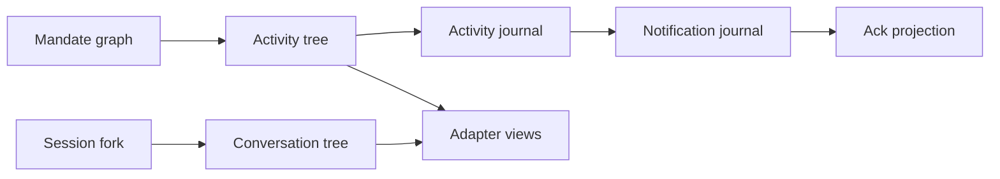

# Activity, UI, and Adapters

**Approved future design. Not implemented; activation requires an activating specification.**

Owner: architecture 24. Decisions: ADR 0016, ADR 0029, ADR 0032, ADR 0033, ADR 0034 (superseded by ADR 0048), ADR 0053.
Research: `m4plus_concept.md`.

This document owns future activity trees, direct-pair communication, activity and notification journals, acknowledgement
projections, safe UI projections, and adapter delivery. It applies to future ordinary, Mandate, and VerifierMandate
projections; compatibility-only M3/M4 activity projections, where supported, are read-only views computed without
synthetic activity identity, journal, message, notification, or acknowledgement state, and M3/M4 records gain no such
state. Numeric values retained in research are not implementation limits for this package: under [ADR
0048](../decisions/0048-limits-by-precedent-and-no-content-scanning.md) a numeric bound exists only with a recorded
precedent naming the failure mode it prevents, the former intrinsic/capacity/ordinary classification direction of [ADR
0034](../decisions/0034-accepted-m5plus-retained-deferral-directions.md) is superseded, and no numeric activity bound is
activated here.

## Ownership and non-authorities

The daemon owns activity identity assignment, journal persistence, notification and acknowledgement state, ordering,
recovery, and publication. `intention-client` remains the only adapter ingress. Tauri, TUI, and REPL own presentation,
typed user input, local display state, and reconnect UX only.

Architecture 13 owns lifecycle and admission; 14 owns run-execution meaning and historical compatibility (its canonical
codec was removed by [ADR 0046](../decisions/0046-typed-serde-json-contracts.md)); 15 owns tool effects; 16 owns
scheduling; 17 owns child edges and verifier authority; 18--20 own MCP, bridge, and kernel; 21 owns context; 22 owns
provider/reasoning; 23 owns Session fork lineage. Activity, notifications, acknowledgements, adapters, and UI never
grant or infer any of those authorities.

## Activity identity and direct pairs

New work uses a daemon-assigned `AgentActivityTreeId`. New Mandate work retains Mandate-scoped activity identity across
fresh runs; a `RunId` is provenance, not activity authority. `AgentActivityTreeId` is distinct from
`ConversationTreeId`, Mandate graph identity, the session event sequence, the run container journal
(`RunEventCursorDto`), the conversation-tree container journal, and the notification observation cursor.

Every new root run receives its `AgentActivityTreeId` in the same durable admission transaction as its immutable run
selection. Every root tree begins with one durable `RootActivityTreeBound` journal record even when it has no child or
message. Historical M4 records stay readable with no synthetic identity; the removed post-M4 selection versions gain no
replacement state.

The credential-free `AgentActivitySelectionV1` is a typed serde JSON selection record; the former
`run-execution-meaning-v4` carrier was removed with the canonical codec by [ADR
0046](../decisions/0046-typed-serde-json-contracts.md):

```text
AgentActivitySelectionV1
  Root {
    activity_tree_id
    root_origin
    activity_exchange_revision
    activity_journal_revision
    user_projection_revision
  }
  Descendant {
    activity_tree_id
    direct_parent_link_reference
    activity_exchange_revision
    activity_journal_revision
    user_projection_revision
  }
```

Each admitted direct child has one immutable parent/child activity pair, the container "delegation pair", with a
daemon-assigned pair identity and one delegation-edge container journal shared by both directions. Its dense
`pair_order` positions (`AgentPairOrderDto`) are the pair's only gap-detection token, and the journal is never reused
for global event order. Only this pair may exchange the closed message kinds:

| Direction | Kinds |
| --- | --- |
| Parent to child | `Instruction`, `ClarificationReply` |
| Child to parent | `Report`, `ClarificationRequest` |

A sibling, indirect relative, root, adapter, bridge, kernel, MCP service, provider, or arbitrary caller cannot send a
pair message. Invalid direction, stale link, terminal endpoint, duplicate or skipped `pair_order`, or invalid reference
rejects before publication.


```mermaid
flowchart LR
  M[Mandate graph] --> A[Activity tree]
  S[Session fork] --> C[Conversation tree]
  A --> J[Activity journal]
  J --> N[Notification journal]
  N --> K[Ack projection]
  A --> P[Adapter views]
  C --> P
```

## Messages, safe projections, and journal

A message has typed identity, tree/pair/order/direction/kind, sender/recipient provenance, bounded redacted safe text,
closed typed references, delivery state, and a typed record identity. References carry identity, revision/cursor,
visibility, and provenance only; they never embed prompt, provider/reasoning, tool/MCP, path, command, credential,
grant, Python/Jupyter, raw result, or diagnostic bodies. Retained content requires separately authorized retrieval.

The first-scope DTO shapes are:

```text
AgentActivityPairDto
  pair_id
  activity_tree_id
  direct_parent_link_reference
  pair_order
  parent_session_and_run_reference
  child_session_and_run_reference

AgentMessageDto
  message_id
  activity_tree_id
  pair_id
  pair_order
  direction
  kind
  sender_run_reference
  recipient_run_reference
  source_model_step_reference
  safe_text
  typed_references
  delivery_state
  message_record_identity

AgentMessageReferenceDto
  TerminalChildResult
  TerminalToolResult
  PolicyDecision
  VerificationEvidence
  GoalRevision
  RetainedContent
```

`safe_text` is bounded redacted presentation, never raw content; a message carries closed typed references, and
`RetainedContent` is disclosed only via the separately admitted `retrieve` tool. A message is never merged, overwritten,
or silently dropped, and no per-direction queue count, size cap, or clarification reservation exists
([ADR 0053](../decisions/0053-sub-agent-and-fork-limits-by-precedent.md)).

Messages deliver only at the recipient's next fresh model request, in activity-tree container journal order. They cannot
alter a sent provider request, interrupt a step, create a run, schedule work, or become a remote continuation.
Clarification waiting, timeout, cancellation, terminalization, and restart never resume work.

Each activity tree owns one append-only container journal, the activity-tree container journal, with
`AgentActivityJournalSequenceDto` as its position type; it is dense within its tree and is that tree's only
gap-detection token. It orders exactly the records that belong to that activity tree and are not records of one session;
it is never the session event sequence, the run container journal, the conversation-tree container journal, the
delegation-edge container journal, or a notification observation position. Journal records safely describe root binding,
child/message/clarification transitions, terminal child state, policy observation, Goal milestone, and partial effect
observation. No global order across trees exists.

```text
AgentActivityJournalRecordDto
  activity_tree_id
  record_id
  sequence
  occurred_at
  root_run_reference
  direct_pair_reference_when_present
  record_kind
  safe_user_projection
  typed_references
  record_identity
```

The 16 closed record kinds are:

```text
RootActivityTreeBound
ChildCreated
DirectMessageAccepted
DirectMessageDelivered
DirectMessageUndeliverable
ChildAwaitingClarification
ChildClarificationResolved
ChildCompleted
ChildFailed
ChildCancelled
ChildInterrupted
PolicySuspensionObserved
PolicyRevocationCancellationStarted
PolicyRevocationCancellationCompleted
GoalActivityMilestone
PartialEffectObserved
```

A semantic transition atomically commits its activity projections, journal/index/ snapshot state, required notification
reference, acknowledgement consequences, and related message/child state, or commits nothing. External work occurs
outside the transaction. Publication follows commit and exact scoped reread. A `safe_user_projection` is limited to safe
text, closed kind, safe status, bounded counters, reason code, and allowed typed references; it never includes tool/MCP/
provider/reasoning data, prompts, paths, commands, grants, credentials, Python values, transcripts, or diagnostics.
`DirectChildStatusDto` reports one child; `DescendantSummaryDto` reports a subtree with one activity-tree container
journal sequence and bounded counts, marked incomplete when a projection is unreadable, built from durable safe
projections only.

No numeric activity bound is activated here ([ADR
0048](../decisions/0048-limits-by-precedent-and-no-content-scanning.md)); the research values formerly listed in this
section are removed by [ADR 0053](../decisions/0053-sub-agent-and-fork-limits-by-precedent.md) because none had a
recorded precedent, and the child clarification deadline remains architecture 17's 60-minute sublimit of the 360-minute
child lifetime. A rejection is checked before a partial durable record exists; it never truncates, evicts, synthesizes,
or starts external work. Archive is accepted only after the root and every descendant are terminal; it is read-only,
retains everything, and physical deletion, compaction, export, and garbage collection remain out of scope.

## Child operations, delivery, and model exchanges

The daemon-internal RLM child operation is closed and bound to the child's immutable `RlmParentLinkDto`, current
`ModelStepId`, daemon-assigned `RlmMessageId`, message kind, `pair_order`, and the typed message payload reference:

```text
RlmChildMessageOperation
  Report
  ClarificationRequest
```

It is not a `ToolId`, `ToolCallId`, model-tool registry call, bridge operation, or MCP command, and it cannot create,
cancel, configure, or delegate to a child. Equal replay returns the one accepted message; a changed operation identity
fails as a known pre-effect conflict. Messages reach a recipient only before that recipient's next fresh model request;
they never alter an already sent provider request, interrupt a running model step, create a root run, or themselves
schedule a parent step. The daemon records model delivery in the same pre-provider durable boundary that records the
recipient's next model step. A terminal recipient rejects an undelivered ordinary message with a typed
durable delivery outcome; the original message and its reason remain in the activity journal.

The distinct typed model input is:

```text
RlmMessageExchangeDto
  activity_tree_id
  recipient_session_id
  recipient_run_id
  target_model_step_id
  captured_activity_journal_sequence
  ordered_messages
```

It remains distinct from text-only `ModelMessageDto` and from `ModelToolExchangeDto`. A provider descriptor owns the
private compatible translation, but it cannot flatten an RLM message into an ordinary user or assistant history item,
infer a current message, reorder it, or introduce a remote continuation. The daemon supplies all undelivered messages
for the recipient in increasing activity-tree container journal order; that order is the same durable order visible in
the journal, and each delegation pair's `pair_order` (`AgentPairOrderDto`) proves the order of every message within
that pair. No alternative sorting by child, class, task, timing estimate, or current projection is allowed.

A daemon-created agent status, child creation, admission, tool/MCP action, output fragment, policy detail, or other
service milestone never becomes a parent model message merely because it is visible in the activity journal. A terminal
child conclusion is recorded as one mandatory direct-pair terminal-result availability reference and is included once in
the next eligible parent exchange; it does not require `AwaitResult`, does not start a parent step, and does not delay
parent terminalization. If a parent is already terminal when no eligible step remains, the terminal
reference remains readable through the direct-child result/status evidence and activity journal without inventing a
model delivery.

Tree-level metadata is an accepted post-M5 future direction under [ADR
0032](../decisions/0032-accepted-deferred-directions-activity-metadata-content-inspection-per-call-cancellation.md): a
future bounded, credential-free metadata surface on activity trees, distinct from journal records and notification
state, that never becomes activity, authority, or a second sequence. It is not activated here. Export of activity
records is an accepted post-M5 future direction under [ADR
0033](../decisions/0033-accepted-m5plus-execution-directions.md), to be executed in Milestone 5+ as a bounded,
credential-free surface that never rewrites history and is never destructive; it is not activated here.

## Notifications and acknowledgement

One daemon-owned `AgentNotificationJournal` serves the local OS user. Its notification observation cursor — reserved
as `AgentNotificationCursorDto` and typed only when this surface is activated, because an observation position needs no
DTO before it has a producer — is the observation position for that one reader: a resume position only, never a read,
seen, dismissed, or accepted claim, never an ordering authority, never durable order, never a deduplication key, and
never a conflict token. Records contain only activity tree and record references, closed `Urgent` or `Ordinary`
level/reason, safe counts/states, time, and record identity. They exclude message text and all sensitive
content/resources.

```text
AgentNotificationLevelDto
  Urgent
  Ordinary
```

`Urgent` is used for user-decision-needing-attention, policy-revocation or cancellation safety, a partial effect,
a terminal outcome leaving obligatory work unfinished, and `sub_agent_clarification_timeout`. `Ordinary` is used only
for a stable awaiting state or terminal milestone; there are no periodic or every-N summaries. At most one `Urgent`
record exists per `(AgentActivityTreeId, cancellation reason)`, created atomically with the cascade-start
projection carrying the then-known safe counts; a later distinct partial effect is its own urgent reason.
Urgent safety records take precedence over ordinary summaries; ordinary summaries may coalesce to current safe per-tree
state. Reconnect returns current redacted summaries for affected trees, not replayed alerts. Notification replay,
publication, archival reads, and slow-peer handling never start work.

`user_notifications_v1` reuses the existing private local endpoint and transport; a request carries only the last
accepted cursor (no read, seen, dismissed, or accepted claim) and returns one redacted `AgentNotificationSummaryDto` per
affected tree, ordered by first new cursor then `AgentActivityTreeId`, at most 32 trees and 64 KiB per page; missed
notifications are never replayed as new alerts. Delivery, summary, replay, reconnect, archival read, and resync are
read/presentation only and never start a model step, `ask_user`, confirmation, tool, MCP, child,
provider request, or external work. Urgent frames are prioritized over pending ordinary summaries in one bounded
subscriber queue; an unaccepting peer receives a typed resync then detach and never blocks execution, persistence, or
healthy subscribers.

Durable acknowledgement/read state is a separate presentation acknowledgement aggregate with its own typed commands and
projections. It never rewrites a notification journal record, changes the notification observation cursor, creates
authority, or schedules/retries work. Native OS notifications, remote push, accounts, and inbox semantics are excluded.

## Protocol, adapters, and recovery

Activity and notification projections ride the single JSON-RPC 2.0 connection over the existing private
Unix-socket/Windows-named-pipe endpoint ([ADR 0045](../decisions/0045-local-json-rpc-2-0-transport.md)): typed
subscription methods and notification frames replace the former `agent_activity_v1` and `user_notifications_v1`
negotiated families and their capability gates. Activity replay captures one upper activity-tree container journal
sequence, sends a safe snapshot and bounded ascending pages through that bound, sends completion, then emits only later
live frames.
Notification reconnect accepts an observation cursor and returns bounded current safe summaries. Unsupported, corrupt,
unavailable, gapped, slow, or detached peers fail closed or resynchronize without blocking durable work or healthy
peers; a peer that cannot decode a typed frame receives no partially understood frame. There is no second listener.

Adapters render daemon-owned typed projections and use `intention-client` for all activity, notification,
acknowledgement, Session, Run, and fork commands or queries. They cannot own a journal, cursor authority, lifecycle
inference, or parallel protocol. Closing an adapter does not cancel work. Tauri may provide in-app rendering only;
TUI/REPL consume equivalent DTOs and outcomes.

Recovery preserves supported durable activity, notification, and acknowledgement facts but never resumes messages,
clarifications, model steps, notifications, or external work. On daemon restart, unfinished roots and children retain
the no-resume outcome: journal records show only safe terminal or interrupted state, nothing is retried or resumed, and
a later explicit retry is a separately admitted root or child with new identities. A detached client reconstructs only
from durable safe projections. Historical M3/M4 compatibility projections never reconstruct missing state from current
configuration, providers, registry, ancestry, context, kernel, bridge, MCP, UI, or adapter state.

The closed activity/notification safe failures through `ErrorDto` are:

```text
agent_activity_tree_unavailable
agent_activity_tree_archived
agent_activity_pair_invalid
agent_message_direction_forbidden
agent_message_operation_conflict
agent_message_reference_invalid
agent_message_reference_unavailable
agent_message_recipient_terminal
agent_message_order_invalid
agent_activity_history_unavailable
agent_notification_history_unavailable
agent_notification_summary_too_large
```

They disclose no message or reference body, tool/MCP data, prompt, path, credential, grant, Python value, provider
resource, process topology, counter history, or implementation detail. Every listed failure is known before an external
effect; a bounded partial result and its notice are retained for work that had already started.

## Compatibility, dependencies, and non-goals

Existing M3 session replay, M4 run streaming, cursors, facts, retries, provider behavior, recovery, and
`tool_execution_unavailable` remain unchanged. Activity is not a filtered Session/Run stream and conversation lineage
does not imply activity authority.

This document depends on architectures 03, 10, 12, and 13--23 plus decisions 0001--0015. It does not define production
storage/wire tags, crate activation, OS notifications, remote transport, accounts, physical deletion, export,
compaction, retention clocks, provider UI/control planes, or final visual design.

## Required evidence before implementation

Evidence: activating specification per [architecture 12](12-quality-gates-and-makefile.md).
