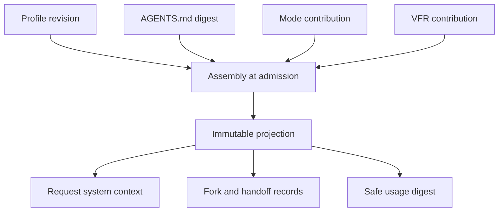

# Instruction Sources and System Context

## Status and scope

**Approved future architecture, documentation-only.** This document is the sole
detailed owner for the instruction channel of a model request: instruction
sources, profile revisions, canonical assembly, the effective instruction
projection, its bounds, failures, and observability. It is adopted by
[ADR 0043](../decisions/0043-instruction-sources-and-system-context.md) and
preserves M3/M4 bytes, meanings, and the current single-version model contract
([ADR 0038](../decisions/0038-no-backward-compatibility-and-legacy-removal.md)).

It authorizes no crate, DTO, tag, wire, storage schema, configuration field, UI
page, feature profile, quality-policy target, or production behavior. Delivery
belongs to the fifth activating slice of Milestone 5+; a later activating
specification must declare crates, contract versions, tests, coverage tiers,
and evidence before any of it is implemented.

The instruction channel applies to newly admitted runs only. Historical M3/M4
requests, runs, events, snapshots, replay, recovery, and retained records keep
their recorded meaning and gain no instruction state.

## Traceability

- Normative owner: architecture 30.
- Decision record: [`0043`](../decisions/0043-instruction-sources-and-system-context.md).
- Reconciliation topics: `INS-001..012`.
- Related owner documents: [architecture 21](21-goals-skills-context-memory-and-compaction.md)
  (Skill, context-manifest, memory, and compaction boundary),
  [architecture 23](23-non-destructive-session-branching-and-regeneration.md)
  (fork projection fields), [architecture 07](07-plan-and-build-modes.md)
  (`Mode` contribution), [architecture 06](06-vfr-and-headroom.md) (`Vfr`
  contribution), [architecture 08](08-model-protocol-and-providers.md) (request
  system-context semantics), [architecture 09](09-configuration-security-and-observability.md)
  (configuration, classification, observability), and
  [architecture 25](25-configuration-provider-control-plane.md) (editing and
  preview surface).
- Research provenance: [`legacy-antibusy-prompts/`](../legacy-antibusy-prompts/README.md),
  [`legacy-baseline/02-capability-catalog.md`](../legacy-baseline/02-capability-catalog.md),
  [`legacy-baseline/04-agent-behavior.md`](../legacy-baseline/04-agent-behavior.md),
  [ADR 0017](../decisions/0017-build-autopilot-and-plan-focus-continuity.md),
  and [ADR 0019](../decisions/0019-production-model-tool-loop.md).
- Status: documentation-approved; implementation-authorized work requires a
  later activating specification.

## Ownership and non-authorities

This document owns the source model, the profile revision identity, the
canonical assembly order and separators, the effective instruction projection,
its intrinsic bounds, its closed failures, and its observability rules.

Architecture 21 owns Goal, Skill, context-manifest, projection, memory, and
compaction semantics; instruction sources are not a context source and never
enter a context manifest, a Skill disclosure, or a model-step projection.
Architecture 23 owns fork lineage and the frozen records that carry the
materialized projection. Architecture 07 owns the `Mode` contribution text;
architecture 06 owns the `Vfr` contribution content and its configuration
dependency. Architecture 08 owns the request contract and driver translation.
Architecture 09 owns classification and redaction; architecture 25 owns the
control-plane commands that edit and preview instructions.

Nothing here is authority. Instruction text cannot create, widen, or remove a
tool permission, provider selection, admission decision, Mandate, child edge,
verifier target, MCP capability, bridge grant, kernel epoch, scheduler reason,
confirmation requirement, or reconciliation outcome, and it cannot prove that
an external effect did or did not happen.

## Instruction source model

An instruction source is one named, typed, ordered text contribution. Kinds and
scopes are closed sets; a new kind or scope requires a new decision.

| Kind | Source and owner | Persistence |
| --- | --- | --- |
| `Identity` | Adapted legacy identity source; daemon-owned default | Deployment configuration |
| `Guidelines` | Adapted legacy behavioral guidelines; daemon-owned default | Deployment configuration |
| `ToolUsage` | Adapted legacy tool-usage guidance; daemon-owned default | Deployment configuration |
| `CodingConventions` | Adapted legacy coding conventions; daemon-owned default | Deployment configuration |
| `Custom` | User-authored fragment | User, project, or session configuration |
| `ProjectInstructions` | Workspace `AGENTS.md` under the session `WorkspaceRoot` | Project file, addressed by digest |
| `Mode` | Plan/Build policy instruction, owned by architecture 07 | Reserved contribution |
| `Vfr` | VFR placeholder/expansion instructions, owned by architecture 06 | Reserved contribution, configuration-dependent |

| Scope | Meaning | Editing |
| --- | --- | --- |
| `Deployment` | Daemon-packaged defaults shipped with the build | Enable or disable only |
| `User` | The ordinary user's durable configuration | Full typed editing |
| `Project` | Configuration bound to one project | Full typed editing |
| `Session` | Configuration bound to one session | Full typed editing |

```text
InstructionSourceV1
  source_contract_revision
  source_kind
  source_scope
  source_identity
  declared_order
  enabled
  text_digest
  canonical_source_digest
```

A source carries no authority, no executable content, no credential, no
provider or tool payload, and no implementation resource. Instruction text is
UTF-8 configuration content; a source that is not representable as bounded text
fails closed.

## Profile revisions and immutable configuration

All configured fragments form exactly one live instruction profile. A change to
a fragment's text, order, enabled state, or scope produces a new immutable
revision identity; an existing revision is never mutated, and there is no
in-place edit of a recorded revision.

```text
InstructionProfileRevisionV1
  profile_contract_revision
  ordered_source_references
  profile_revision_identity
  canonical_profile_digest
```

The profile is durable configuration with exactly one live format version; no
migration, no second format, and no compatibility layer exists
([ADR 0038](../decisions/0038-no-backward-compatibility-and-legacy-removal.md)).
The revision identity and digest are the only profile data that may leave the
configuration surface; fragments themselves stay readable only where the user
edits them.

## Canonical assembly and the effective instruction projection

Assembly happens once per admitted run, before the first model step, from the
profile revision, the workspace instruction digest, the run's mode, and the
resolved VFR configuration:

1. `Deployment` fragments in declared order;
2. `User` fragments in declared order;
3. `Project` fragments in declared order;
4. `Session` fragments in declared order;
5. `ProjectInstructions`;
6. `Mode`;
7. `Vfr`.

Fragments of one scope are ordered by `declared_order` with `source_identity`
as the deterministic tie-break. Contributions are joined by a fixed canonical
separator whose bytes are part of the projection digest; the initial canonical
separator is the legacy `\n\n---\n\n` join. The order, the separators, and the
canonicalization are fixed by this document and can only change by a new
decision.

```text
InstructionProjectionV1
  projection_contract_revision
  ordered_contribution_references
  contribution_revision_and_digest
  declared_audience
  total_instruction_size
  canonical_projection_digest
```



The projection is frozen before the first model step of the run. Every later
model step of the same run reuses it; a fork inherits the materialized
projection verbatim; a plan handoff materializes it into its frozen snapshot;
replay, regeneration, reconnect, and audit never rebuild it. No path may
re-derive instructions from current configuration, current `AGENTS.md` content,
current session state, or a live ancestor. The projection is the contents of
the `effective_instruction_projection` and
`materialized_effective_instruction_projection` fields of the fork base and
preview records ([architecture 23](23-non-destructive-session-branching-and-regeneration.md)),
and its canonical digest is recorded as safe usage provenance. It adds no event
sequence, no lifecycle transition, and no authority.

## Workspace project instructions

`AGENTS.md` at the session's `WorkspaceRoot` is the only file-based instruction
source and the only part of the projection that comes from project material.

- The file is resolved inside the workspace boundary with the ordinary
  `WorkspaceRoot` rules; a path that escapes the boundary, resolves through an
  outward, unprovable, or dangling symbolic link, or is not a regular file fails
  closed.
- The file is read as bounded UTF-8 text and addressed by content digest. Its
  content is never executed, never parsed as configuration, and never treated
  as a hook, tool definition, or policy input.
- An absent file contributes nothing and is not a failure; a project without
  instructions behaves exactly as a project with an empty source.
- The file is project content, not authority: it cannot widen tool policy,
  provider selection, admission policy, or confirmation requirements, and its
  text is labeled as project material inside the projection.
- The digest, not the text, is durable outside the projection itself.

## Editing surface and preview

The control plane ([architecture 25](25-configuration-provider-control-plane.md))
exposes the instruction configuration surface:

- list, create, edit, duplicate, enable, disable, reorder, and re-scope
  fragments;
- validate an edit before it commits and reject it with a typed failure when it
  is invalid, inconsistent, or over bound;
- show the current profile revision identity and canonical digest;
- preview the effective instruction projection for a chosen session, policy,
  and mode without admitting a run, creating a reason or selection, or writing
  durable instruction state;
- keep the surface credential-free, and keep fragment text visible only where
  the user edits it.

Fragment editing is configuration, not admission: once a run is admitted, its
projection is immutable, and a later edit affects only future runs. The primary
UI exposes the surface; TUI/REPL remains contract-equivalent. Preview is
non-authorizing and non-admitting.

## Trust, authority, and the injection boundary

The instruction channel is the only trusted instruction surface of a request,
and it accepts content from declared sources only. Repository content, tool
output, fetched material, Skill bodies, memory records, provider output, and
model output remain untrusted or evidence-only material and can never be
promoted into it; they enter a request only through the context-manifest,
Skill-disclosure, and evidence rules of architecture 21.

Because the channel is the target of prompt injection rather than its source,
three rules are normative:

1. instruction text is advisory and creates no authority (ADR 0017);
2. a configured instruction source cannot widen policy or permissions, and the
   workspace source is labeled project material (ADR 0019 boundary);
3. a provider cannot scan, inject, rewrite, or reorder the projection, and no
   driver may add framing, caching, or templating of its own.

## Bounds, canonicalization, and digests

Intrinsic bounds are:

- total assembled projection at most 100,000 characters, aligned by the
  activating specification with the existing `system_context` validation;
- one fragment at most 16,384 characters;
- at most 64 enabled fragments;
- workspace project instructions at most 16,384 characters.

Canonical bytes reuse the `typed-tlv-v1` framing and SHA-256 digest policy of
the owning records ([architecture 14](14-run-execution-meaning-and-historical-compatibility.md)).
Digests cover content, kind, scope, order, enabled state, and audience, and
exclude credentials, absolute paths, current state, and display data. The same
profile revision, project instruction digest, mode, and configuration must
produce byte-identical projection bytes and the same digest, on every platform.

## Failure behavior

The closed instruction failure set is:

```text
instruction_profile_unavailable
instruction_projection_too_large
instruction_source_unavailable
```

- `instruction_profile_unavailable`: a configured profile revision is missing,
  corrupt, inconsistent, or no longer resolvable.
- `instruction_projection_too_large`: the projection exceeds an intrinsic
  bound.
- `instruction_source_unavailable`: a workspace instruction source is
  unreadable, escapes the workspace boundary, is not bounded text, or exceeds
  its own bound.

Each failure is a typed known pre-effect rejection at admission. It discloses no
credential, absolute path, file content, raw payload, or implementation detail.
No fallback revision, partial projection, silent omission, truncation,
sampling, or historical substitution is permitted, and none of these failures
may be repaired by current state.

## Observability and classification

Instruction text is durable configuration content, not a secret and not an
activity fact. Logs, activity records, notification projections, and audit
records carry the profile revision identity, the workspace instruction digest,
and the canonical projection digest only; they never carry fragment text,
`AGENTS.md` content, or the assembled projection. Fake-secret regression covers
every public, durable, log, and activity surface.

The control-plane configuration surface displays fragment text because the user
edits it there; that surface is not an activity, notification, audit, or
diagnostics channel, and it crosses no public or durable safe-projection
boundary. Classification and redaction rules of
[architecture 09](09-configuration-security-and-observability.md) apply
unchanged.

## Compatibility and historical preservation

M3/M4 requests keep the optional system context absent, and M3/M4 runs carry no
instruction state. Historical records never gain a reconstructed instruction
projection, and a missing or unreadable materialized projection leaves the
dependent fork or handoff blocked while unrelated history remains readable.
The mechanism adds no second model protocol, no second storage schema, no new
sequence, and no migration; it is part of the single live first-scope
instruction contract.

## Dependencies and non-goals

This document depends on architectures 04, 06, 07, 08, 09, 14, 21, 23, and 25
and on decision 0043. It does not define Goal, Skill, context-manifest, memory,
or compaction semantics; fork lineage or lineage projection rules; the model
request contract or driver translation; configuration storage, reload, or
credential handling; activity, notification, or adapter behavior; and it does
not activate any crate, schema, wire, UI, or production behavior.

Few-shot example selection, memory-derived prompt material, MCP-provided
prompts, date/time/Git/session-derived context injection, provider-native prompt
framing or caching directives, model-specific templates, prompt tuning,
telemetry, A/B evaluation, automatic instruction generation, cross-project
instruction sharing, executable or scripted instructions, and sandbox or
privilege claims are explicit non-goals; deferred items are recorded with
reconsideration owners in the deferred and excluded register.

## Required evidence before implementation

A later activating specification must declare exact crate owners, test targets,
coverage tiers, feature profiles, storage/wire versions, and fixtures, then pass
`make quick`, `make verify`, docs-check, and Linux/Windows CI. It must cover:

- deterministic canonical assembly, ordering, separators, and digest stability
  across repeated admissions and across platforms;
- profile revision immutability for every edit operation, with typed validation
  failures;
- intrinsic-bound rejection for the total projection, one fragment, the
  fragment count, and workspace instructions, without truncation or sampling;
- an absent `AGENTS.md` contributing nothing, and an unreadable,
  boundary-escaping, non-text, or oversized one failing closed with
  `instruction_source_unavailable`;
- `instruction_profile_unavailable` and `instruction_projection_too_large`
  failing closed with no fallback or partial projection;
- projection freeze at admission, reuse across later steps, verbatim fork and
  plan-handoff inheritance, and proof of no current-state re-derivation;
- channel closure: Skill bodies, memory records, tool output, repository
  content, and provider output never entering the instruction channel;
- credential-free, path-free, raw-payload-free, and activity-free public,
  durable, log, and audit surfaces, including fake-secret regression;
- preview non-authority and non-admission, with no durable instruction state
  created by a preview;
- the control-plane editing and preview contract and its TUI/REPL equivalence;
- M3/M4 and retained-history byte, meaning, replay, recovery, and tool-denial
  preservation.
