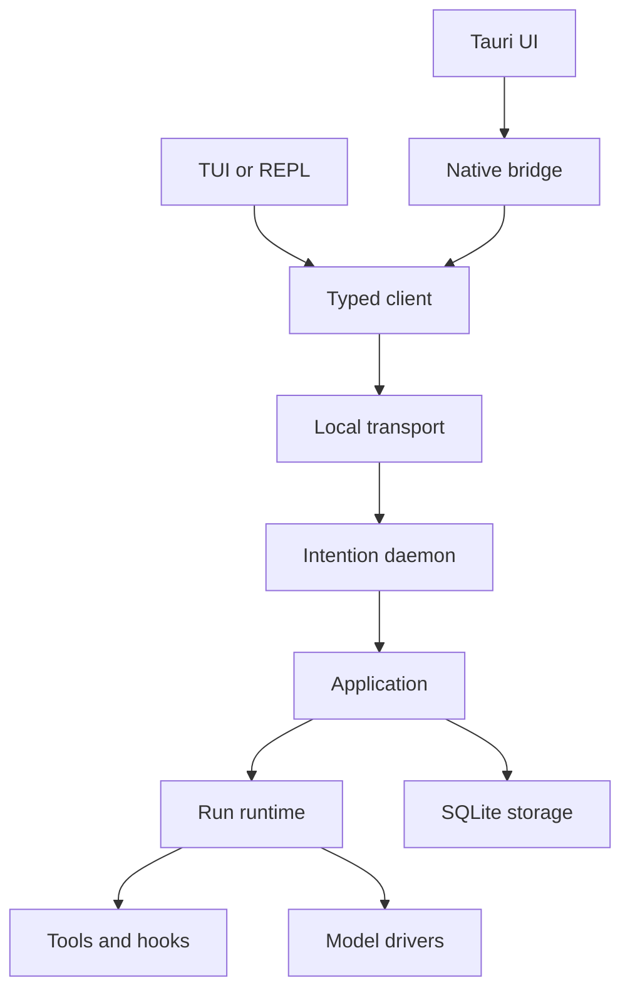
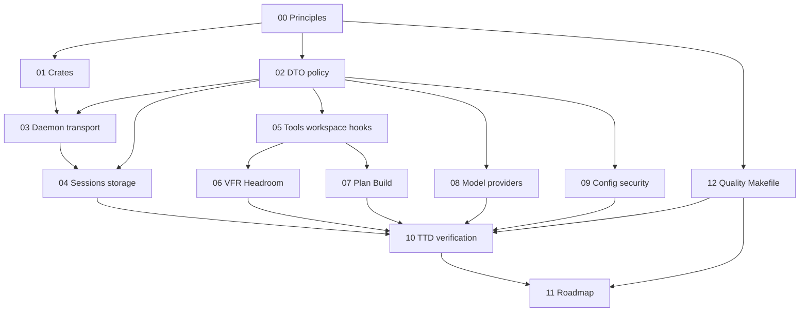

# Intention Relay Architecture Plan

## Status

**Planning reference, approved direction.** This directory defines the target architecture and delivery constraints for Intention Relay. It is an implementation plan, not application code and not a migration plan for Antibusy.

## Purpose and precedence

The active product baseline is the legacy-derived material in [`../legacy-baseline/`](../legacy-baseline/00-manifest.md). It describes proven user-facing behavior and known limitations. This directory defines the new implementation architecture that will realize selected product decisions.

When the documents differ:

1. explicit future product decisions override legacy implementation details;
2. the selected product baseline remains the source of user-facing capability evidence until a new product decision changes it;
3. the broader preserved audit under [`../../reference/`](../../reference/README.md) is research material only;
4. this architecture must not inherit a legacy design merely because it existed.

## Architectural summary

Intention Relay is a local-first, single-user system. A standalone daemon owns the application runtime and state. Desktop Tauri and TUI/REPL are presentation adapters over one typed local protocol and one shared Rust client.

<!-- UI: Svelte presentation; BR: Tauri Rust bridge; DM: single-user daemon. -->

## Core terms

| Term | Meaning |
| --- | --- |
| **DTO** | A strictly typed data-transfer object used at every crate and process boundary. It has an explicit schema and does not expose implementation resources. |
| **Daemon** | The single local process that owns runtime actors, persistence connections, active runs, providers, tools, hooks, and subscriptions. |
| **Project** | A logical user project associated with one or more sessions. |
| **Session** | A durable project-backed conversation and work record. It has one `WorkspaceRoot` and at most one active run. |
| **Turn** | A causally identified unit of conversation, such as a user request or assistant response. |
| **Run** | One agent execution lifecycle started from an accepted user turn. |
| **WorkspaceRoot** | The required directory boundary and process CWD for every session tool that touches the filesystem or launches a process. |
| **Artifact** | A durable work product associated with a session or run. Plans are artifacts. |
| **Hook** | A typed, ordered extension point around tool execution and result processing. |
| **Plan** | A physical, revisioned artifact produced by a planning-focused mode; ordinary project writes remain denied, while `execute` is available as trusted-local, advisory-guided execution. |
| **Build Autopilot** | The single user-authorized Build policy that executes the configured active tool surface without per-action confirmation. |
| **Projection** | A normalized current-state representation derived and stored for efficient queries. |
| **TTD** | Test-driven delivery. Each milestone starts from executable contracts and observable outcomes, not only structural design. |
| **Quality gate** | A reproducible, blocking Makefile pipeline that verifies formatting, linting, feature profiles, tests, documentation, architecture, coverage, and supply-chain policy. |

## Reading paths

### Start here

1. [Principles and scope](00-principles-and-scope.md)
2. [Workspace and crate map](01-workspace-and-crate-map.md)
3. [DTO and contract policy](02-dto-and-contract-policy.md)
4. [Quality gates and Makefile](12-quality-gates-and-makefile.md)
5. [Test-driven delivery and verification](10-test-driven-delivery-and-verification.md)

### Runtime and persistence

1. [Daemon, transport, and adapters](03-daemon-transport-and-adapters.md)
2. [Sessions, runs, events, and storage](04-sessions-runs-events-and-storage.md)
3. [Mandate domain and durable lifecycle](13-mandate-domain-and-durable-lifecycle.md)
4. [Run execution meaning and historical compatibility](14-run-execution-meaning-and-historical-compatibility.md)
5. [Tool registry and direct Mandate tool loop](15-tool-registry-and-mandate-tool-loop.md)
6. [Mandate scheduler and readiness-driven admission](16-mandate-scheduler-and-readiness-driven-admission.md)
7. [Mandate child graph and delegated verifier authority](17-mandate-child-graph-and-delegated-verifier-authority.md)
8. [Mandate MCP capability lifecycle](18-mandate-mcp-capability-lifecycle.md)
9. [Mandate Gateway/RLM bridge](19-mandate-gateway-rlm-bridge.md)
10. [Run-scoped IPython kernel lifecycle](20-ipython-kernel-lifecycle.md)
11. [Goals, Skills, context, memory, and compaction](21-goals-skills-context-memory-and-compaction.md)
12. [Provider evolution, profiles, and reasoning](22-provider-evolution-profiles-and-reasoning.md)
13. [Non-destructive session branching and regeneration](23-non-destructive-session-branching-and-regeneration.md)
14. [Activity, UI, and adapters](24-activity-ui-and-adapters.md)
15. [Tools, workspace, and hooks](05-tools-workspace-and-hooks.md)
16. [VFR and Headroom](06-vfr-and-headroom.md)
17. [Configuration and provider control plane](25-configuration-provider-control-plane.md)

### Agent operation

1. [Plan and Build modes](07-plan-and-build-modes.md)
2. [Model protocol and providers](08-model-protocol-and-providers.md)
3. [Configuration, security, and observability](09-configuration-security-and-observability.md)

### Delivery

1. [Quality gates and Makefile](12-quality-gates-and-makefile.md)
2. [Test-driven delivery and verification](10-test-driven-delivery-and-verification.md)
3. [Implementation roadmap](11-implementation-roadmap.md)
4. [Post-M4 authority reconciliation](../reconciliation/README.md)
5. [Architecture decision records](../decisions/README.md)
6. [M4 execution charter](../m4.md)
7. [M0/M1 closure evidence](../closeout/m0-m1-closure-evidence.md)
8. [M1+ quality hardening evidence](../closeout/m1-plus-quality-hardening-evidence.md)
9. [M2 closure evidence](../closeout/m2-closure-evidence.md)
10. [M3 closure evidence](../closeout/m3-closure-evidence.md)
11. [M4 closure evidence](../closeout/m4-closure-evidence.md)

## Document map

## Shared authoring rules

Every plan in this directory must:

- state its scope, ownership, invariants, dependencies, non-goals, failure behavior, and verification requirements;
- distinguish **decided**, **implementation-required**, and **deferred** items;
- use DTO terminology at every boundary;
- avoid Tauri, TUI, or REPL business logic;
- define observable outcomes in addition to architecture;
- identify required tests and their blocking quality gates before implementation work begins;
- link quality requirements to [Quality gates and Makefile](12-quality-gates-and-makefile.md);
- use Mermaid only for architecture, state, relationship, or lifecycle clarity;
- keep Mermaid labels short enough for terminal rendering.

## v1 boundary

v1 includes Tauri as the primary adapter, TUI/REPL as proof of adapter isolation, a local single-user daemon, SQLite-first persistence, OpenRouter and generic Chat Completion drivers, typed built-in tools, WorkspaceRoot enforcement, Plan/Build modes, Build Autopilot, VFR, and Headroom/CCR.

v1 excludes Web, Telegram, remote transport, multi-user access, parallel runs in one session, sandbox/container execution, automatic run resumption, and a direct MCP administration interface. Build Autopilot is trusted-local and does not claim shell isolation; Plan `execute` is advisory-guided rather than technically read-only.

## Post-M4 authority foundation

The closed M4 baseline remains authoritative for implemented behavior. The
post-M4 direction is coordinated by the
[authority reconciliation package](../reconciliation/README.md) and its
[accepted decision records](../decisions/README.md). Those artifacts do not
implement or silently supersede v1 behavior: they establish the authority,
compatibility, ownership, and dependency boundary that later authoritative
packages must satisfy.

### Foundation terms

| Term | Meaning |
| --- | --- |
| **Ordinary execution** | Existing run semantics, including historical M3/M4 behavior. |
| **Mandate** | Future durable user-issued work authority. It is distinct from a Goal, prompt, Skill, tool permission, provider continuation, or daemon. |
| **VerifierMandate execution** | Future Mandate execution with explicit, target-scoped delegated verifier authority. |
| **Mandate child graph** | Future immutable direct-child Mandate edges and delegation snapshots, distinct from session or conversation lineage. |
| **Fresh run** | A new `RunId` admitted from durable future work state. It is never resumption of prior external work. |
| **ExternalEffectUnknown** | A future started external attempt whose terminal effect cannot be durably proven. It is distinct from a known failure. |
| **Intrinsic bound** | A representation, correctness, or security constraint. |
| **Capacity availability** | Observable temporary resource availability, not a product quota. |
| **Product ceiling** | A policy quota. It cannot silently govern future Mandate admission. |

A state name is always qualified by its owner, for example Mandate `Active` or
Run `Running`. WorkspaceRoot, modes, hooks, gateways, and audit are logical
product controls in a trusted-local process, not OS sandbox or privilege
boundaries.

### Cross-domain identity and sequencing invariants

The following table is normative at the role level. Architecture 14 remains the
sole owner of byte-level canonical framing and digest encoding; owner documents
below define only their domain-specific semantic payloads.

| Value | Owner | Scope | Representation/ordering | Reconstruction rule |
| --- | --- | --- | --- | --- |
| `SessionId`, `WorkspaceId`, `RunId`, `TurnId` | architecture 04 and existing domain owners | ordinary M3/M4 | historical domain newtypes and recorded sequences | never reconstruct or replace historical identity |
| `MandateId`, revision, `ReasonId` | architecture 13 | Mandate aggregate | daemon/user-issued domain values with Mandate-local ordering | never derive from current mutable state |
| execution-meaning envelope and digest | architecture 14 | admitted run | versioned canonical bytes and tagged SHA-256 digest | no fallback after missing/corrupt/mismatched bytes |
| child edge, delegation, verifier authority/baseline | architecture 17 | Mandate graph and target mutation | domain newtypes plus owner-defined canonical references | stale or absent baselines fail before mutation |
| `ConversationTreeId`, `ForkOperationId` | architecture 23 | ordinary Session lineage | typed lineage values; tree root derivation is frozen by architecture 23 | never infer lineage from current ancestry |
| `AgentActivityTreeId` and activity records | architecture 24 | projections | daemon-assigned IDs and tree-local journal sequence | never convert from Session/Run/lineage identity |
| provider/tool/MCP/kernel selections | architectures 15, 18, 20, 22 | future admitted run | immutable credential-free semantic references | live registry/resources cannot repair selection |
| UUIDs, digests, operation IDs, correlation IDs | architecture 02 plus owning architecture | all | distinct domain newtypes; UUID equality is not cross-domain identity | no conversion or authority inference |

Sequences and cursors are independent authorities and are never interchangeable:

| Sequence/cursor | Owner | Orders | Must not be reused for |
| --- | --- | --- | --- |
| Session event sequence | architecture 04 | Session events | Run, Mandate, lineage, activity |
| Run event cursor | architecture 04 and future loop owners | Run/model/tool facts | Session or activity records |
| Mandate-local sequence | architecture 13 | Mandate lifecycle and reasons | queue tickets or Run cursors |
| graph/message sequence | architecture 17 | direct child/verifier messages | global event order |
| lineage sequence | architecture 23 | fork lineage facts | Session events or Run facts |
| activity journal sequence | architecture 24 | activity-tree records | notification cursor or domain events |
| notification cursor | architecture 24 | local-user observation | notification facts or acknowledgements |
| scheduler observation order | architecture 16 | live readiness evidence | semantic identity or admission order |

Semantic/frozen metadata includes identities, revisions, canonicalization,
selection references, digests, and baselines. Operational/live metadata includes
readiness, capacity, processes, handles, endpoints, current catalogs, wakeups,
grants, and publication state. Operational data may defer or reject fresh work,
but can never repair, reroute, reinterpret, or replace frozen semantic data.

### Mandate lifecycle owner

[Mandate domain and durable lifecycle](13-mandate-domain-and-durable-lifecycle.md)
is the sole detailed authority for future Mandate lifecycle and admission. The
[reconciliation package](../reconciliation/README.md) remains a traceability
index. Neither document amends M4 or current ordinary v1 behavior.

### Execution-meaning owner

[Run execution meaning and historical compatibility](14-run-execution-meaning-and-historical-compatibility.md)
is the sole detailed authority for future envelope, canonical identity and
compatibility semantics. It does not amend M3/M4 ordinary behavior or activate
a protocol/runtime implementation.

### Tool registry and loop owner

[Tool registry and direct Mandate tool loop](15-tool-registry-and-mandate-tool-loop.md)
is the sole detailed authority for future fixed registry identity, frozen tool
selection, Mandate direct admission, Mandate WorkspaceRoot semantics, tool-loop
facts, and tool-effect recovery. It preserves ordinary M3/M4 tool behavior and
does not activate a registry, protocol, schema, or runtime implementation.

### Scheduler owner

[Mandate scheduler and readiness-driven admission](16-mandate-scheduler-and-readiness-driven-admission.md)
is the sole detailed authority for future durable candidate reevaluation,
readiness/capacity evidence, scheduler handoff, and recovery admission gating.
Architecture 13 retains Mandate lifecycle, reason validity/order, and atomic
fresh admission. This does not activate timer topology, a scheduler crate, or a
protocol implementation.

### Child graph and verifier owner

[Mandate child graph and delegated verifier authority](17-mandate-child-graph-and-delegated-verifier-authority.md)
is the sole detailed authority for future immutable child edges, direct-parent
controls, graph terminalization, and separately issued target-scoped verifier
authority. It preserves M3/M4 and retained RLM history and does not activate an
executor, protocol, schema, or runtime implementation.

### Mandate MCP capability owner

[Mandate MCP capability lifecycle](18-mandate-mcp-capability-lifecycle.md) is
the sole detailed authority for future typed MCP source acquisition, discovery
normalization, immutable run-local capability selections, invocation, disposal,
and MCP recovery. It preserves the fixed `mcp` slot and M3/M4 behavior and does
not activate direct administration, protocol, schema, crate, or runtime work.

### Mandate Gateway/RLM bridge owner

[Mandate Gateway/RLM bridge](19-mandate-gateway-rlm-bridge.md) is the sole
detailed authority for future bridge attachment, ephemeral grants, operation
correlation, safe bridge-visible replay, cancellation propagation, and bridge
recovery. It is typed ingress to the one capability path, not a second registry,
lifecycle authority, persistence authority, sandbox, or privilege boundary.

### Run-scoped IPython kernel owner

[Run-scoped IPython kernel lifecycle](20-ipython-kernel-lifecycle.md) is the
sole detailed authority for future private kernel epochs, cells, namespace
checkpoints, safe projections, and kernel recovery. It consumes the Gateway/RLM
bridge and the one capability path; it is not a second runtime, registry,
lifecycle authority, sandbox, or privilege boundary.

### Goals, Skills, context, memory, and compaction owner

[Goals, Skills, context, memory, and compaction](21-goals-skills-context-memory-and-compaction.md)
is the sole detailed authority for future non-authorizing Goal scope/evidence,
Skill disclosure, context manifests/projections, typed memory, and immutable
compaction. It preserves M3/M4 history, binds project Goals to sessions only
through explicit applicability links, and cannot become lifecycle, scheduler,
tool, child, verifier, MCP, bridge, kernel, provider, or reconciliation
authority.

### Provider evolution owner

[Provider evolution, profiles, and reasoning](22-provider-evolution-profiles-and-reasoning.md)
is the sole detailed authority for future provider kinds, profiles/catalogs,
immutable provider and capability selections, driver compatibility, and normalized
reasoning. It preserves M4 provider kinds and behavior, is non-authorizing, and
cannot infer, reroute, or reconstruct a provider selection from mutable state.

### Session branching owner

[Non-destructive session branching and regeneration](23-non-destructive-session-branching-and-regeneration.md)
is the sole detailed authority for future ordinary Session lineage, frozen fork
context, regeneration, and bounded lineage projections. It preserves M3/M4
history and remains distinct from Mandate child graphs, lifecycle authority,
provider selections, and activity/UI implementation.

### Activity, UI, and adapters owner

[Activity, UI, and adapters](24-activity-ui-and-adapters.md) is the sole
detailed authority for future activity trees, safe projections, direct-pair
messages, notifications, acknowledgement projections, and shared-client adapter
behavior. It preserves historical Session/Run contracts and cannot become an
authority or a second transport path.

### Configuration and provider control-plane owner

[Configuration and provider control plane](25-configuration-provider-control-plane.md)
is the sole detailed authority for the accepted post-M5 configuration/provider
control-plane directions: controlled live reload, credential rotation, provider
health checks, discovery, pricing policy, and the profile UI/control plane,
adopted by [ADR 0020](../decisions/0020-configuration-provider-control-plane-directions.md)
and activated under [Milestone 5+](11-implementation-roadmap.md#milestone-5-post-m5-retrospective-alignment).
It preserves M3/M4 startup-only configuration and cannot become a second
authority, transport, registry, scheduler, or sandbox.
