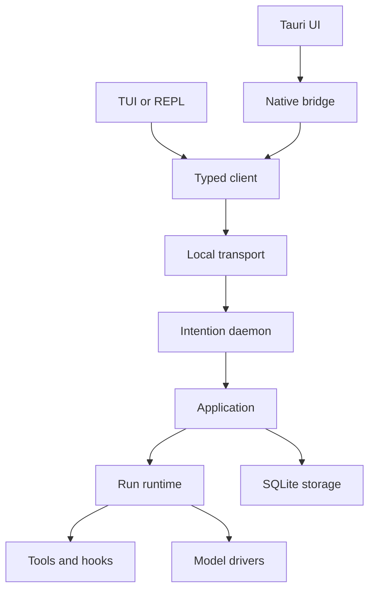
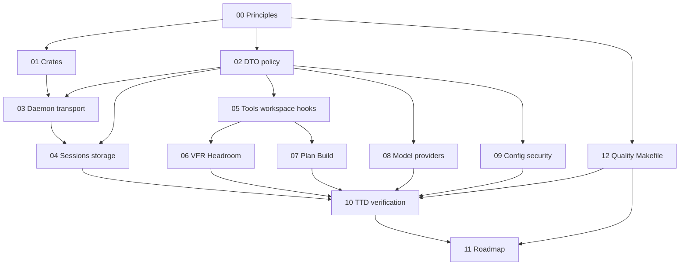

# Intention Relay Architecture Plan

## Status

**Planning reference, approved direction.** This directory defines the target architecture and delivery constraints for Intention Relay. It is an implementation plan, not application code and not a migration plan for Antibusy.

## Purpose and precedence

The active product baseline is the legacy-derived material in [`../legacy-baseline/`](../legacy-baseline/00-manifest.md). It describes proven user-facing behavior and known limitations. This directory defines the new implementation architecture that will realize selected product decisions.

When the documents differ:

1. explicit future product decisions override legacy implementation details;
2. the selected product baseline remains the source of user-facing capability evidence until a new product decision changes it;
3. the broader preserved audit under [`../../reference/`](../../reference/README.md) is research material only;
4. this architecture must not inherit a legacy design merely because it existed.

## Architectural summary

Intention Relay is a local-first, single-user system. A standalone daemon owns the application runtime and state. Desktop Tauri and TUI/REPL are presentation adapters over one typed local protocol and one shared Rust client.

<!-- UI: Svelte presentation; BR: Tauri Rust bridge; DM: single-user daemon. -->

## Core terms

| Term | Meaning |
| --- | --- |
| **DTO** | A strictly typed data-transfer object used at every crate and process boundary. It has an explicit schema and does not expose implementation resources. |
| **Daemon** | The single local process that owns runtime actors, persistence connections, active runs, providers, tools, hooks, and subscriptions. |
| **Project** | A logical user project associated with one or more sessions. |
| **Session** | A durable project-backed conversation and work record. It has one `WorkspaceRoot` and at most one active run. |
| **Turn** | A causally identified unit of conversation, such as a user request or assistant response. |
| **Run** | One agent execution lifecycle started from an accepted user turn. |
| **WorkspaceRoot** | The required directory boundary and process CWD for every session tool that touches the filesystem or launches a process. |
| **Artifact** | A durable work product associated with a session or run. Plans are artifacts. |
| **Hook** | A typed, ordered extension point around tool execution and result processing. |
| **Plan** | A physical, revisioned artifact written by the agent in Plan mode, with metadata hidden from the model. |
| **Projection** | A normalized current-state representation derived and stored for efficient queries. |
| **TTD** | Test-driven delivery. Each milestone starts from executable contracts and observable outcomes, not only structural design. |
| **Quality gate** | A reproducible, blocking Makefile pipeline that verifies formatting, linting, feature profiles, tests, documentation, architecture, coverage, and supply-chain policy. |

## Reading paths

### Start here

1. [Principles and scope](00-principles-and-scope.md)
2. [Workspace and crate map](01-workspace-and-crate-map.md)
3. [DTO and contract policy](02-dto-and-contract-policy.md)
4. [Quality gates and Makefile](12-quality-gates-and-makefile.md)
5. [Test-driven delivery and verification](10-test-driven-delivery-and-verification.md)

### Runtime and persistence

1. [Daemon, transport, and adapters](03-daemon-transport-and-adapters.md)
2. [Sessions, runs, events, and storage](04-sessions-runs-events-and-storage.md)
3. [Tools, workspace, and hooks](05-tools-workspace-and-hooks.md)
4. [VFR and Headroom](06-vfr-and-headroom.md)

### Agent operation

1. [Plan and Build modes](07-plan-and-build-modes.md)
2. [Model protocol and providers](08-model-protocol-and-providers.md)
3. [Configuration, security, and observability](09-configuration-security-and-observability.md)

### Delivery

1. [Quality gates and Makefile](12-quality-gates-and-makefile.md)
2. [Test-driven delivery and verification](10-test-driven-delivery-and-verification.md)
3. [Implementation roadmap](11-implementation-roadmap.md)
4. [M0/M1 closure evidence](../closeout/m0-m1-closure-evidence.md)

## Document map

## Shared authoring rules

Every plan in this directory must:

- state its scope, ownership, invariants, dependencies, non-goals, failure behavior, and verification requirements;
- distinguish **decided**, **implementation-required**, and **deferred** items;
- use DTO terminology at every boundary;
- avoid Tauri, TUI, or REPL business logic;
- define observable outcomes in addition to architecture;
- identify required tests and their blocking quality gates before implementation work begins;
- link quality requirements to [Quality gates and Makefile](12-quality-gates-and-makefile.md);
- use Mermaid only for architecture, state, relationship, or lifecycle clarity;
- keep Mermaid labels short enough for terminal rendering.

## v1 boundary

v1 includes Tauri as the primary adapter, TUI/REPL as proof of adapter isolation, a local single-user daemon, SQLite-first persistence, OpenRouter and generic Chat Completion drivers, typed built-in tools, WorkspaceRoot enforcement, Plan/Build modes, VFR, and Headroom/CCR.

v1 excludes Web, Telegram, remote transport, multi-user access, parallel runs in one session, sandbox/container execution, automatic run resumption, and a direct MCP administration interface.
