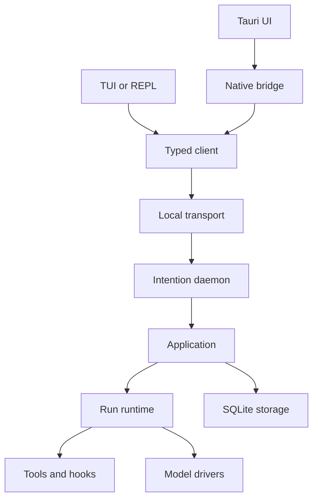
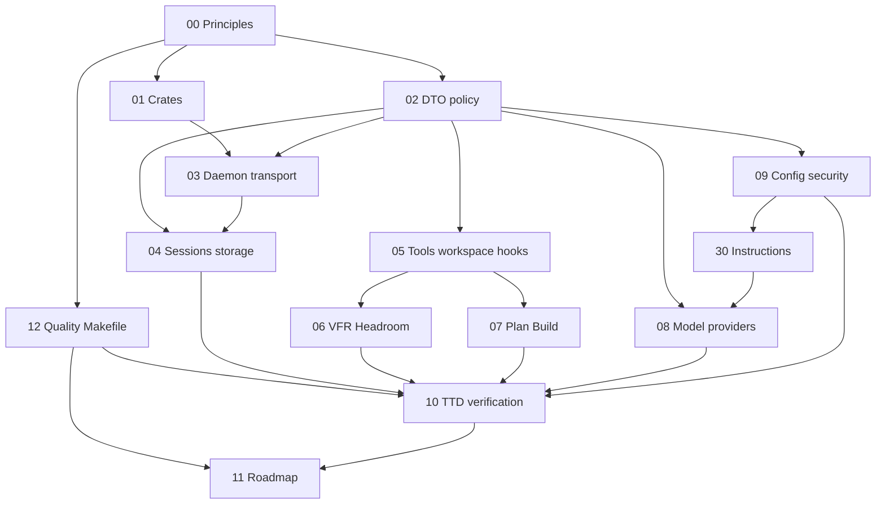

# Intention Relay Architecture Plan

**Planning reference, approved direction.** This directory defines the target architecture and delivery constraints for
Intention Relay. It is an implementation plan, not application code and not a migration plan for Antibusy.

## Purpose and precedence

This directory defines the implementation architecture for Intention Relay. The legacy-derived baseline the rewrite
started from is retired and remains in git history.

When the documents differ:

1. explicit future product decisions override legacy implementation details;
2. research material under [`../../reference/`](../../reference/README.md) is preserved reference only;
3. this architecture must not inherit a legacy design merely because it existed.

## Architectural summary

Intention Relay is a local-first, single-user system. A standalone daemon owns the application runtime and state.
Desktop Tauri and TUI/REPL are presentation adapters over one typed local protocol and one shared Rust client.

```mermaid
flowchart TD
  UI[Tauri UI] --> BR[Native bridge]
  TUI[TUI or REPL] --> CL[Typed client]
  BR --> CL
  CL --> TR[Local transport]
  TR --> DM[Intention daemon]
  DM --> AP[Application]
  AP --> RT[Run runtime]
  AP --> ST[SQLite storage]
  RT --> TL[Tools and hooks]
  RT --> MD[Model drivers]
```

<!-- UI: Svelte presentation; BR: Tauri Rust bridge; DM: single-user daemon. -->

## Core terms

| Term | Meaning |
| --- | --- |
| **DTO** | A strictly typed data-transfer object used at every crate and process boundary. It has an explicit schema and does not expose implementation resources. |
| **Daemon** | The single local process that owns runtime actors, persistence connections, active runs, providers, tools, hooks, and subscriptions. |
| **Project** | A logical user project associated with one or more sessions. |
| **Session** | A durable project-backed conversation and work record. It has one `WorkspaceRoot` and at most one active run. |
| **Turn** | A causally identified unit of conversation, such as a user request or assistant response. |
| **Pending turn** | A user turn accepted while a session run is active: durable input that joins that run's live context at the next model boundary and is removed only before it is seen. |
| **Run** | One agent execution lifecycle started from an accepted user turn. |
| **WorkspaceRoot** | The required addressing anchor and process CWD for every session tool: relative paths join the root, `execute` starts there, and pathless `glob`/`grep` search from there (ADR 0013). |
| **Artifact** | A durable work product associated with a session or run. Plans are artifacts. |
| **Hook** | A typed, ordered extension point around tool execution and result processing. |
| **Plan** | A physical, revisioned artifact produced by a planning-focused mode; ordinary project writes remain denied, while `execute` is available as trusted-local, advisory-guided execution. |
| **Build Autopilot** | The single user-authorized Build policy that executes the configured active tool surface without per-action confirmation. |
| **Projection** | A normalized current-state representation derived and stored for efficient queries. |
| **TTD** | Test-driven delivery. Each milestone starts from executable contracts and observable outcomes, not only structural design. |
| **Quality gate** | A reproducible, blocking Makefile pipeline that verifies formatting, linting, feature profiles, tests, documentation, architecture, coverage, and supply-chain policy. |

## Reading paths

### Start here

1. [Principles and scope](00-principles-and-scope.md)
2. [Workspace and crate map](01-workspace-and-crate-map.md)
3. [DTO and contract policy](02-dto-and-contract-policy.md)
4. [Quality gates and Makefile](12-quality-gates-and-makefile.md)
5. [Test-driven delivery and verification](10-test-driven-delivery-and-verification.md)

### Runtime and persistence

1. [Daemon, transport, and adapters](03-daemon-transport-and-adapters.md)
2. [Sessions, runs, events, and storage](04-sessions-runs-events-and-storage.md)
4. [Run execution meaning and historical compatibility](14-run-execution-meaning-and-historical-compatibility.md)
5. [Tool registry and model-tool loop](15-tool-registry-and-model-tool-loop.md)
8. [MCP capability lifecycle](18-mcp-capability-lifecycle.md)
9. [Gateway/RLM bridge](19-gateway-rlm-bridge.md)
10. [Run-scoped IPython kernel lifecycle](20-ipython-kernel-lifecycle.md)
11. [Goals, Skills, context, memory, and compaction](21-goals-skills-context-memory-and-compaction.md)
12. [Provider evolution, profiles, and reasoning](22-provider-evolution-profiles-and-reasoning.md)
13. [Non-destructive session branching and regeneration](23-non-destructive-session-branching-and-regeneration.md)
15. [Tools, workspace, and hooks](05-tools-workspace-and-hooks.md)
16. [VFR and Headroom](06-vfr-and-headroom.md)
17. [Configuration and provider control plane](25-configuration-provider-control-plane.md)
19. [Goal domain and verification](28-goal-domain-and-verification.md)
20. [Provider session selection and profiles protocol](29-provider-session-and-profiles-protocol.md)

### Agent operation

1. [Plan and Build modes](07-plan-and-build-modes.md)
2. [Model protocol and providers](08-model-protocol-and-providers.md)
3. [Configuration, security, and observability](09-configuration-security-and-observability.md)
4. [Instruction sources and system context](30-instruction-sources-and-system-context.md)

### Delivery

1. [Quality gates and Makefile](12-quality-gates-and-makefile.md)
2. [Test-driven delivery and verification](10-test-driven-delivery-and-verification.md)
3. [Implementation roadmap](11-implementation-roadmap.md)
5. [Architecture decision records](../decisions/README.md)
7. [M0/M1 closure evidence](../closeout/m0-m1-closure-evidence.md)
8. [M1+ quality hardening evidence](../closeout/m1-plus-quality-hardening-evidence.md)
9. [M2 closure evidence](../closeout/m2-closure-evidence.md)
10. [M3 closure evidence](../closeout/m3-closure-evidence.md)
11. [M4 closure evidence](../closeout/m4-closure-evidence.md)
12. [M5 closure evidence](../closeout/m5-closure-evidence.md)

## Document map

```mermaid
flowchart TD
  P[00 Principles] --> C[01 Crates]
  P --> D[02 DTO policy]
  C --> T[03 Daemon transport]
  D --> T
  D --> S[04 Sessions storage]
  T --> S
  D --> W[05 Tools workspace hooks]
  W --> V[06 VFR Headroom]
  W --> B[07 Plan Build]
  D --> M[08 Model providers]
  D --> G[09 Config security]
  P --> K[12 Quality Makefile]
  K --> Q[10 TTD verification]
  K --> R[11 Roadmap]
  S --> Q
  V --> Q
  B --> Q
  M --> Q
  G --> Q
  G --> I30[30 Instructions]
  I30 --> M
  Q --> R[11 Roadmap]
```

## Shared authoring rules

Every plan in this directory must:

- state its scope, ownership, invariants, dependencies, non-goals, failure behavior, and verification requirements;
- distinguish **decided**, **implementation-required**, and **deferred** items;
- use DTO terminology at every boundary;
- avoid Tauri, TUI, or REPL business logic;
- define observable outcomes in addition to architecture;
- identify required tests and their blocking quality gates before implementation work begins;
- link quality requirements to [Quality gates and Makefile](12-quality-gates-and-makefile.md);
- use Mermaid only for architecture, state, relationship, or lifecycle clarity;
- keep Mermaid labels short enough for terminal rendering;
- wrap prose at 120 columns; tables, code fences, and Mermaid blocks keep their own layout.

## v1 boundary

v1 includes Tauri as the primary adapter, TUI/REPL as proof of adapter isolation, a local single-user daemon,
SQLite-first persistence, OpenRouter and generic Chat Completion drivers, typed built-in tools, WorkspaceRoot
addressing, Plan/Build modes, Build Autopilot, VFR, and Headroom/CCR.

v1 excludes Web, Telegram, remote transport, multi-user access, parallel runs in one session, sandbox/container
execution, automatic run resumption, and a direct MCP administration interface. Build Autopilot is trusted-local and
does not claim shell isolation; Plan `execute` is advisory-guided rather than technically read-only.

## Post-M4 authority foundation

The closed M4 baseline remains authoritative for implemented behavior. The post-M4 direction is recorded in the
[accepted decision records](../decisions/README.md); those records establish the authority, compatibility, ownership,
and dependency boundary that later authoritative packages must satisfy, and the [implementation
roadmap](11-implementation-roadmap.md) owns activation order and status.

### Owner documents

-  [14 Run execution meaning and historical compatibility](14-run-execution-meaning-and-historical-compatibility.md):
  the historical compatibility semantics that remain after the binary canonical codec and digest layer were deleted by
  [ADR 0012](../decisions/0012-typed-serde-json-contracts.md).
-  [15 Tool registry and model-tool loop](15-tool-registry-and-model-tool-loop.md): future fixed registry identity,
  frozen tool selection, WorkspaceRoot semantics, tool-loop facts, and tool-effect recovery.
-  [18 MCP capability lifecycle](18-mcp-capability-lifecycle.md): future typed MCP source acquisition,
  discovery normalization, run-local capability selections, invocation, disposal, and MCP recovery.
-  [19 Gateway/RLM bridge](19-gateway-rlm-bridge.md): future bridge attachment, ephemeral grants,
  operation correlation, safe replay, cancellation propagation, and bridge recovery; typed ingress to the one capability
  path.
-  [20 Run-scoped IPython kernel lifecycle](20-ipython-kernel-lifecycle.md): future private kernel epochs, cells,
  namespace checkpoints, safe projections, and kernel recovery, plus the kernel-side import surface and script-import
  evidence of the project script library (`.ir/scripts`, [decision
  0009](../decisions/0009-project-script-library-for-kernel-cells.md)); the library's path convention and tools stay
  with architectures 05 and 15.
-  [21 Goals, Skills, context, memory, and compaction](21-goals-skills-context-memory-and-compaction.md): future
  non-authorizing Goal scope/evidence, Skill disclosure, context manifests/projections, typed memory, and immutable
  compaction; project Goals bind to sessions only through explicit applicability links.
-  [22 Provider evolution, profiles, and reasoning](22-provider-evolution-profiles-and-reasoning.md): future provider
  kinds, profiles/catalogs, immutable provider and capability selections, driver compatibility, and normalized
  reasoning.
-  [23 Non-destructive session branching and regeneration](23-non-destructive-session-branching-and-regeneration.md):
  future ordinary Session lineage, frozen fork context, regeneration, and bounded lineage projections.
-  [25 Configuration and provider control plane](25-configuration-provider-control-plane.md): accepted post-M5
  directions — controlled live reload, credential rotation, provider health checks, discovery, pricing policy, and the
  profile UI/control plane; not activated; activating slice 2 (ADR 0004).
-  [28 Goal domain and verification](28-goal-domain-and-verification.md): the accepted post-M5 Goal aggregate domain —
  Goal identity/scope/tree, lifecycle/readiness/user decision, leading-goal run selection, delegated Verification
  verification gates, working memory/roles/templates, model proposals, and the conversation-compaction working
  form; Goals remain acceptance/evidence
  records, not the work-authorization plane.
-  [29 Provider session selection and profiles protocol](29-provider-session-and-profiles-protocol.md): the accepted
  post-M5 provider session-selection layer — session defaults, per-turn/fork overrides, profile-keyed usage, the
  provider profiles protocol, and pending-removal/degraded recovery; not activated; activating slice 2.
-  [30 Instruction sources and system context](30-instruction-sources-and-system-context.md): the instruction channel of
  a model request — closed instruction source kinds and scopes, the deployment profile, workspace `AGENTS.md` project
  instructions read through the `WorkspaceRoot` anchor, the `Mode` and `Vfr` contributions of architectures 07 and 06,
  deterministic assembly, the immutable effective instruction projection with its typed identity, closed failures, and
  safe observability ([ADR 0010](../decisions/0010-instruction-sources-and-system-context.md)); activated under
  Milestone 5+ as the fifth slice.

### Foundation terms

| Term | Meaning |
| --- | --- |
| **Ordinary execution** | Existing run semantics, including historical M3/M4 behavior. |
| **Partial** | A tool call interrupted or lost before a final result whose bounded partial output is delivered to the model with a notice and whose next step proceeds; it is distinct from a known failure. |
| **Intrinsic bound** | A representation, correctness, or security constraint. |
| **Capacity availability** | Observable temporary resource availability, not a product quota. |
| **Product ceiling** | A policy quota that requires a recorded precedent; it cannot silently govern future admission. |

A state name is always qualified by its owner, for example Run `Running`. WorkspaceRoot, modes,
hooks, gateways, and audit are logical product controls in a trusted-local process, not OS sandbox or privilege
boundaries.

### Cross-domain identity and sequencing invariants

The following table is normative at the role level. [Architecture
14](14-run-execution-meaning-and-historical-compatibility.md) remains the owner of historical compatibility semantics;
owner documents define only their domain-specific semantic payloads, and every new family is typed serde JSON ([ADR
0012](../decisions/0012-typed-serde-json-contracts.md)).

| Value | Owner | Scope | Representation/ordering | Reconstruction rule |
| --- | --- | --- | --- | --- |
| `SessionId`, `WorkspaceId`, `RunId`, `TurnId` | architecture 04 and existing domain owners | ordinary M3/M4 | historical domain newtypes and recorded sequences | never reconstruct or replace historical identity |
| future execution-kind contract | architecture 14 | admitted run | typed serde JSON contract; no canonical bytes or digest layer (ADR 0012) | no fallback after missing or mismatched typed data |
| `ConversationTreeId`, `ForkOperationId` | architecture 23 | ordinary Session lineage | typed lineage values; tree root derivation is frozen by architecture 23 | never infer lineage from current ancestry |
| provider/tool/MCP/kernel selections | architectures 15, 18, 20, 22 | future admitted run | immutable credential-free semantic references | live registry/resources cannot repair selection |
| UUIDs, operation IDs, correlation IDs | architecture 02 plus owning architecture | all | distinct domain newtypes; UUID equality is not cross-domain identity | no conversion or authority inference |

Two durable ordering authorities exist, plus one observation position; together they are the closed set:

| Authority | Scope | Orders | Must not be reused for |
| --- | --- | --- | --- |
| Session event sequence (`SessionEventSequenceDto`) | one session | every record committed in the session: events, run lifecycle, tool lifecycle, model and tool facts | container records, observation positions |
| Container journal sequence (storage mechanism `container_journals`; the only kind today is `run`, whose position type is `RunEventCursorDto`) | one container: a run today; a conversation tree when activated | records that belong to the container and are not a record of one session | session records, observation positions, identity |
| Observation cursor (reserved name; no DTO until a producer exists) | one reader | nothing: it is a resume position | never an authority, never durable order, never a dedup key, never a conflict token |

1. No record family may introduce a further ordering sequence: a family orders by the session event sequence, or belongs
   to exactly one container and orders by that container's journal, or has no durable order; there is no fourth option.
2. A container journal is dense within its container and is its only gap-detection token; today's adjacency (`+1`)
   contracts stay in force.
3. The container-scoped optimistic append token stays container-local: a write to another container or to the session
   sequence must never invalidate it.
4. Cross-authority correlation uses typed identity only, with no arithmetic, offsets, or conversions.
5. No queue-ordering mechanism exists: pending turns are durable input joined to the live run context, and the M3
   queue, its tickets, and their promotion were removed by [ADR
   0019](../decisions/0019-pending-turns-and-cooperative-interruption.md).

Semantic/frozen metadata includes identities, revisions, selection references, and baselines. Operational/live metadata
includes readiness, capacity, processes, handles, endpoints, current catalogs, wakeups, grants, and publication state.
Operational data may defer or reject fresh work, but never repairs, reroutes, reinterprets, or replaces frozen semantic
data.
