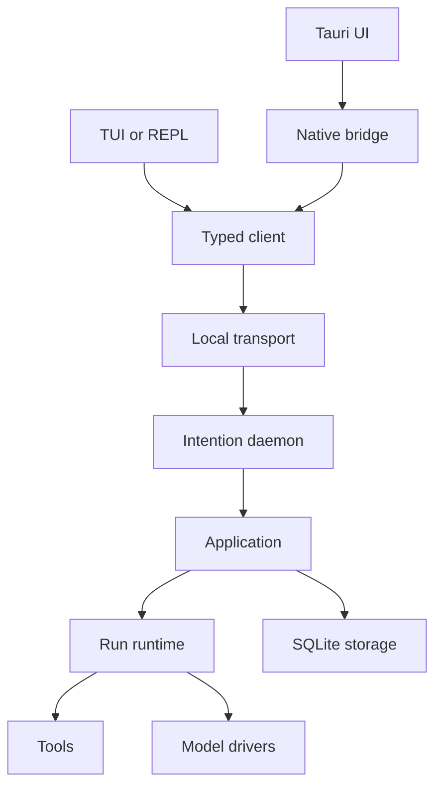
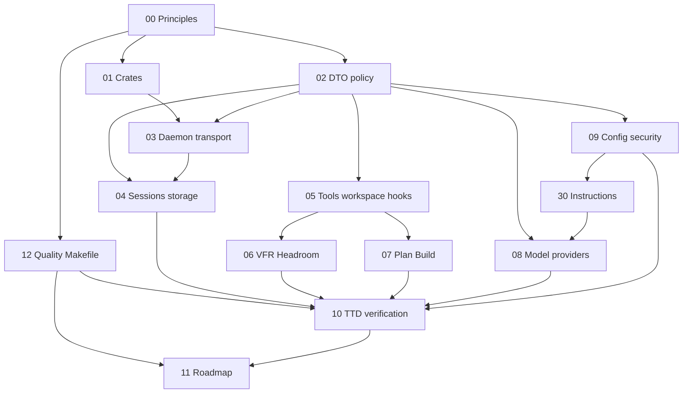

# Intention Relay Architecture Plan

**Planning reference, approved direction.** This directory defines the target architecture and delivery constraints for
Intention Relay. It is an implementation plan, not application code and not a migration plan for Antibusy.

## Purpose and precedence

This directory defines the implementation architecture for Intention Relay. The legacy-derived baseline the rewrite
started from is retired and remains in git history.

When the documents differ:

1. explicit future product decisions override legacy implementation details;
2. this architecture must not inherit a legacy design merely because it existed.

## Architectural summary

Intention Relay is a local-first, single-user system. A standalone daemon owns the application runtime and state.
Desktop Tauri and TUI/REPL are presentation adapters over one typed local protocol and one shared Rust client.

```mermaid
flowchart TD
  UI[Tauri UI] --> BR[Native bridge]
  TUI[TUI or REPL] --> CL[Typed client]
  BR --> CL
  CL --> TR[Local transport]
  TR --> DM[Intention daemon]
  DM --> AP[Application]
  AP --> RT[Run runtime]
  AP --> ST[SQLite storage]
  RT --> TL[Tools]
  RT --> MD[Model drivers]
```

<!-- UI: Svelte presentation; BR: Tauri Rust bridge; DM: single-user daemon. -->

## Core terms

| Term | Meaning |
| --- | --- |
| **DTO** | A strictly typed data-transfer object used at every crate and process boundary. It has an explicit schema and does not expose implementation resources. |
| **Daemon** | The single local process that owns runtime actors, persistence connections, active runs, providers, tools, and subscriptions. |
| **Project** | A logical user project associated with one or more sessions. |
| **Session** | A durable project-backed conversation and work record. It has one `WorkspaceRoot` and at most one active run. |
| **Turn** | A causally identified unit of conversation, such as a user request or assistant response. |
| **Pending turn** | A user turn accepted while a session run is active: durable input that joins that run's live context at the next model boundary and is removed only before it is seen. |
| **Run** | One agent execution lifecycle started from an accepted user turn. |
| **WorkspaceRoot** | The required addressing anchor and process CWD for every session tool: relative paths join the root, `execute` starts there, and pathless `glob`/`grep` search from there ([architecture 05](05-tools-workspace-and-hooks.md)). |
| **Artifact** | A durable work product associated with a session or run. Plans are artifacts. |
| **Plan** | A physical, revisioned artifact produced by a planning-focused mode; ordinary project writes remain denied, while `execute` is available as trusted-local, advisory-guided execution. |
| **Build Autopilot** | The single user-authorized Build policy that executes the configured active tool surface without per-action confirmation. |
| **Projection** | A normalized current-state representation derived and stored for efficient queries. |
| **TTD** | Test-driven delivery. Each milestone starts from executable contracts and observable outcomes, not only structural design. |
| **Quality gate** | A reproducible, blocking Makefile pipeline that verifies formatting, linting, tests, documentation, architecture, coverage, and supply-chain policy. |

## Reading paths

### Start here

1. [Principles and scope](00-principles-and-scope.md)
2. [Workspace and crate map](01-workspace-and-crate-map.md)
3. [DTO and contract policy](02-dto-and-contract-policy.md)
4. [Quality gates and Makefile](12-quality-gates-and-makefile.md)
5. [Test-driven delivery and verification](10-test-driven-delivery-and-verification.md)

### Runtime and persistence

1. [Daemon, transport, and adapters](03-daemon-transport-and-adapters.md)
2. [Sessions, runs, and storage](04-sessions-runs-events-and-storage.md)
3. [Tool registry and model-tool loop](15-tool-registry-and-model-tool-loop.md)
4. [Tools, workspace, and hooks](05-tools-workspace-and-hooks.md)
5. [VFR and Headroom](06-vfr-and-headroom.md)
6. [MCP capability lifecycle](18-mcp-capability-lifecycle.md)
7. [Gateway/RLM bridge](19-gateway-rlm-bridge.md)
8. [Run-scoped IPython kernel lifecycle](20-ipython-kernel-lifecycle.md)
9. [Goals, Skills, context, memory, and compaction](21-goals-skills-context-memory-and-compaction.md)
10. [Provider evolution, profiles, and reasoning](22-provider-evolution-profiles-and-reasoning.md)
11. [Non-destructive session branching and regeneration](23-non-destructive-session-branching-and-regeneration.md)
12. [Configuration and provider control plane](25-configuration-provider-control-plane.md)
13. [Goal domain and verification](28-goal-domain-and-verification.md)
14. [Provider session selection and profiles protocol](29-provider-session-and-profiles-protocol.md)

### Agent operation

1. [Plan and Build modes](07-plan-and-build-modes.md)
2. [Model protocol and providers](08-model-protocol-and-providers.md)
3. [Configuration, security, and observability](09-configuration-security-and-observability.md)
4. [Instruction sources and system context](30-instruction-sources-and-system-context.md)

### Delivery

1. [Quality gates and Makefile](12-quality-gates-and-makefile.md)
2. [Test-driven delivery and verification](10-test-driven-delivery-and-verification.md)
3. [Implementation roadmap](11-implementation-roadmap.md)

## Document map

```mermaid
flowchart TD
  P[00 Principles] --> C[01 Crates]
  P --> D[02 DTO policy]
  C --> T[03 Daemon transport]
  D --> T
  D --> S[04 Sessions storage]
  T --> S
  D --> W[05 Tools workspace hooks]
  W --> V[06 VFR Headroom]
  W --> B[07 Plan Build]
  D --> M[08 Model providers]
  D --> G[09 Config security]
  P --> K[12 Quality Makefile]
  K --> Q[10 TTD verification]
  K --> R[11 Roadmap]
  S --> Q
  V --> Q
  B --> Q
  M --> Q
  G --> Q
  G --> I30[30 Instructions]
  I30 --> M
  Q --> R[11 Roadmap]
```

## Shared authoring rules

Every plan in this directory must:

- state its scope, ownership, invariants, dependencies, non-goals, failure behavior, and verification requirements;
- distinguish **decided**, **implementation-required**, and **deferred** items;
- use DTO terminology at every boundary;
- avoid Tauri, TUI, or REPL business logic;
- define observable outcomes in addition to architecture;
- identify required tests and their blocking quality gates before implementation work begins;
- link quality requirements to [Quality gates and Makefile](12-quality-gates-and-makefile.md);
- use Mermaid only for architecture, state, relationship, or lifecycle clarity;
- keep Mermaid labels short enough for terminal rendering;
- wrap prose at 120 columns; tables, code fences, and Mermaid blocks keep their own layout.

## v1 boundary

v1 includes Tauri as the primary adapter, TUI/REPL as proof of adapter isolation, a local single-user daemon,
SQLite-first persistence, OpenRouter and generic Chat Completion drivers, typed built-in tools, WorkspaceRoot
addressing, Plan/Build modes, Build Autopilot, VFR, and Headroom/CCR.

v1 excludes Web, Telegram, remote transport, multi-user access, parallel runs in one session, sandbox/container
execution, automatic run resumption, and a direct MCP administration interface. Build Autopilot is trusted-local and
does not claim shell isolation; Plan `execute` is advisory-guided rather than technically read-only.
