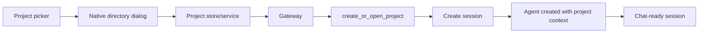
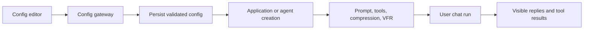

# User flows

These diagrams show static, active-looking routes from the frontend, not recorded runtime traces.

## Chat execution with streamed tool activity

```mermaid
sequenceDiagram
  participant UI as Chat UI
  participant Chat as ChatService
  participant Gate as Gateway
  participant IPC as Tauri IPC
  participant Loop as AgentLoop
  participant Tools as Tool runner

  UI->>Chat: Send message
  Chat->>Gate: sendMessage(session, channel)
  Gate->>IPC: send_message
  IPC->>Loop: run(content)
  Loop->>Tools: execute model tool calls
  Tools-->>IPC: text/tool chunks
  IPC-->>Chat: stream Channel chunks
  Chat-->>UI: update messages and todos
  Loop-->>IPC: final response
  IPC-->>Chat: completion
```

## Plan approval or rejection

```mermaid
sequenceDiagram
  participant Loop as AgentLoop
  participant Event as Tauri event
  participant App as App shell
  participant UI as Plan overlay
  participant Chat as ChatService
  participant IPC as Tauri IPC

  Loop-->>Event: PlanSubmitted
  Event-->>App: plan event
  App-->>UI: show plan
  UI->>Chat: confirm or reject
  Chat->>IPC: confirm_plan or reject_plan
  IPC-->>Chat: stream channel
  Chat-->>UI: render continuation
```

## Project-associated session lifecycle



## Configuration affecting a later agent



The final diagram intentionally includes the initialization step: current static evidence does not establish live replacement of all advanced behavior after clicking Save.
