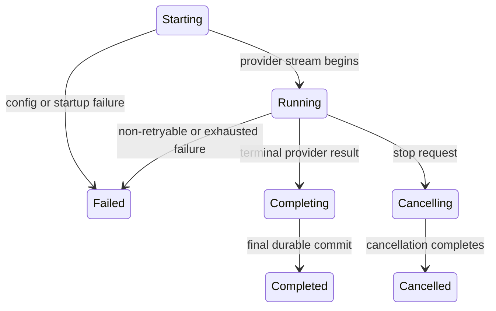
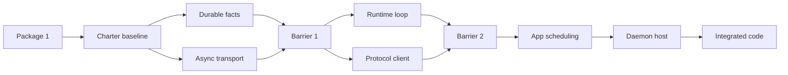

# M4 Execution Charter: Model Providers and One Persistent Streaming Run

## Status

**Controller-owned living M4 charter.** This document records the persistent
M4 implementation context, accepted decisions, Package 1 baseline, remaining
contracts, and the planned lane structure. It is not closeout evidence and it
does not claim that the remaining M4 behavior is delivered.

The current M4 integration branch is `feat/m4-model-streaming`. Its current
accepted Barrier 1 foundation is commit
`9231da93ff5e255d20e88a8e8ee1d797a51f4239`, after controller integration of
Lane A (`5deefd865dbfacec2fcb78dd6acc0b60a7559d16`) and Lane B. Barrier 1 passed
`make quick` and `make verify` after A integration and again after the combined
A+B integration. It delivers durable model facts/internal run replay and
additive async local transport primitives, but does not implement runtime
execution, wire streaming, persistent subscriber fan-out, or daemon hosting.

No remaining M4 lane, auxiliary worktree, or sub-agent is authorized by this
document alone. The user must explicitly authorize that execution after this
charter has been accepted. Package 6 closeout documentation likewise requires
separate user authorization.

## Authority and ownership

The following precedence applies:

1. [`AGENTS.md`](../../AGENTS.md) defines repository operating instructions.
2. [`architecture/`](architecture/README.md) defines approved product,
   architecture, test-driven delivery, and quality policy.
3. This charter records M4-specific execution decisions and Package 1 facts. It
   cannot override either higher source.
4. A lane-specific controller handoff may narrow work only when it agrees with
   all higher sources.

Every M4 sub-agent must read this document, `AGENTS.md`, and the architecture
sources named by its lane card before editing. A sub-agent must **not** edit,
stage, rename, move, delete, or amend this file. It reports required amendments
or conflicts to the controller instead.

Only the controller may update this charter, and only after a user-confirmed
decision or a successfully verified integration barrier. A controller charter
update is a separate documentation-only commit with documented validation.

## Baseline and retained M3 invariants

M3 closed at immutable implementation baseline
`e0ddc86c2df7f84394a9f15b5b7a331ad3e8b68b`. M4 preserves all of these
invariants:

- The system is local-first, single-user, and daemon-owned.
- Every cross-crate, process, persistence, provider, tool, hook, and adapter
  boundary uses explicit DTOs.
- A session has at most one active run. Additional accepted turns are durable,
  ordered queue entries.
- Every semantic state change atomically writes the projection, append-only
  event envelope(s), and affected session/run snapshot(s), or commits nothing.
- Publication occurs only after a durable commit.
- A started or promoted run retains its original `RunId`, credential-free
  `ConfigSnapshotDto`, and `ConfigRevisionId`.
- Cancellation is two-step: `Starting` or `Running` transitions to
  `Cancelling`, and only then may become `Cancelled`.
- Daemon startup interrupts unfinished runs before readiness. It never resumes
  or retries provider, tool, shell, or other external work automatically.
- M3 session subscriptions remain safe durable one-shot replay. M4 must never
  expose an unfiltered session snapshot to satisfy a run-scoped request.

## M4 scope

M4 delivers one daemon-owned streaming user turn from durable acceptance to an
ordered assistant result and durable terminal state. It includes:

- provider-neutral model contracts;
- OpenRouter and generic Chat Completions providers;
- safe provider/model capability validation;
- immutable timeout/retry selection, normalized usage and provider errors;
- durable assistant/model facts and run-scoped replay;
- one private daemon-owned Tokio runtime for model work and persistent local
  subscription delivery; and
- bounded post-commit live fan-out.

M4 excludes OpenAI Responses and `provider = "openai"`; Factory BYOK
configuration; M5 tools, WorkspaceRoot, hooks, and Plan/Build policy; M6 UI;
config live reload; credential persistence/rotation/keychain integration; remote
transport; multi-user access; idle shutdown; upgrades; and automatic external
work resumption.

## Accepted decision register

| Topic | Decision | Consequence |
| --- | --- | --- |
| Provider kinds | Only `openrouter` and `generic-chat-completion-api` remain valid M4 configuration kinds. | `openai` requires a later Responses driver, contract, and architecture decision. |
| OpenRouter adapter | `intention-provider-openrouter` uses `openrouter-rs` 0.14.0 privately. | OpenRouter SDK types never cross the provider public boundary. |
| Generic adapter | `intention-provider-generic-chat` uses `async-openai` 0.29.3 privately with configured-base-URL Chat Completions streaming. | No custom HTTP/SSE parser is introduced. |
| Generic capability subset | Text context/output, usage, finish reasons, and function-style tool calls are supported. | Reasoning, multimodal, and vendor extensions reject preflight before outbound preparation. |
| Model contract | Providers emit `Started`, zero or more text/reasoning/tool/usage facts, then one `Finished`. | A fact before start, after finish, duplicate usage, a second start, or a second finish fails lifecycle validation. |
| Credentials | Startup-only provider material is opaque, non-debug, non-display, and non-serializable. | Credentials never enter safe snapshots, storage, events, protocol DTOs, logs, diagnostics, or public APIs. |
| Execution policy | `ProviderExecutionPolicyDto` defaults to 30-second attempts and two attempts. TOML may set timeout `1..=60` and attempts `1..=3`. | The resolved safe policy belongs to each immutable run snapshot. |
| Retry delay | Runtime owns fixed 250 ms retry delay. | Backoff is not a TOML setting. |
| Retry eligibility | At most one retry for normalized retryable failure before the first committed assistant-content batch. | No retry after content, tool call, cancellation, terminal state, or restart. |
| Assistant content | Runtime coalesces content into durable batches no larger than 4 KiB under one `AssistantTurnId`. | Native provider chunking remains private; final remainder flushes before terminal success. |
| Tool calls before M5 | Runtime records typed tool-call evidence then fails `tool_execution_unavailable`. | Providers never invoke local tools and no registry/WorkspaceRoot/hook behavior is pulled into M4. |
| Runtime ownership | `intention-daemon` owns one private Tokio runtime. | Tokio tasks, channels, runtime handles, sockets, and SDK resources never cross public DTO boundaries. |
| Persistent subscribers | Each subscriber has capacity 64 event batches and a 10-second write deadline. | Overflow or timeout sends typed resync when possible, then closes only that peer. |
| Run scope | M4 uses dedicated run snapshot, cursor, tail, and live-batch DTOs. | A run request never filters or leaks the session snapshot/cursor. |
| Queued restart selection | A promoted run starts only when its persisted safe provider kind/model/endpoint/execution policy matches current startup selection. | A mismatch becomes durable `Starting -> Failed` with `provider_configuration_unavailable`, with no provider call. A matching safe selection may use the current in-memory credential. |

## Package 1 foundation

Package 1 activated the following Tier C production crates and their
machine-readable test targets:

| Crate | Responsibility | Integration target |
| --- | --- | --- |
| `intention-model` | Provider-neutral DTOs and model driver contract. | `model_contracts` |
| `intention-provider-openrouter` | Private OpenRouter SDK translation. | `openrouter_contracts` |
| `intention-provider-generic-chat` | Private generic Chat Completions SDK translation. | `generic_chat_contracts` |

The Package 1 public/safe contract includes:

- `ProviderExecutionPolicyDto` in resolved and snapshot configuration, with
  backward-compatible defaults for existing M3 snapshot fixtures;
- `StartupProviderMaterial`, consumable only by a selected provider constructor;
- `ModelMessageDto`, `ModelRequestDto`, requested/declared capability DTOs,
  `ModelEventDto`, `ModelStreamLifecycleDto`, `ToolCallDto`, `UsageDto`,
  `FinishReasonDto`, and `ProviderErrorDto`;
- private request translation and fixture normalization in both provider crates;
- compile/source/rustdoc architecture checks that restrict SDK namespaces to
  private source in their owner provider crate; and
- supply-chain exceptions recorded in the quality policy for selected SDK
  dependency paths. These exceptions and the `async-openai` outdated hold must
  be reassessed together when either SDK changes.

Package 1 validation recorded by its implementation handoff:

| Check | Result |
| --- | --- |
| `make quick` | Passed. |
| `make verify` | Passed. |
| `intention-model` coverage | 98.51%, Tier C threshold 85%. |
| `intention-provider-openrouter` coverage | 93.33%, Tier C threshold 85%. |
| `intention-provider-generic-chat` coverage | 90.65%, Tier C threshold 85%. |
| `intention-config` coverage | 95.03%, Tier A threshold 95%. |

## Barrier 1 foundation

Barrier 1 integrated and accepted the following controller-reviewed candidates:

| Lane | Integrated commit | Delivered boundary |
| --- | --- | --- |
| A | `5deefd865dbfacec2fcb78dd6acc0b60a7559d16` | Durable model facts, schema-v2 migration, model-run projection/snapshot, bounded internal run replay, and atomic fault evidence. |
| B | `9231da93ff5e255d20e88a8e8ee1d797a51f4239` | Additive Tokio local IPC primitives, bounded async framing, negotiated persistent split connections, and Unix/Windows transport fixtures. |

Lane A moves the normalized leaf values `UsageDto`, `FinishReasonDto`,
`ToolCallDto`, and `ProviderErrorDto` to `intention-types`; `intention-model`
re-exports them for Package 1 compatibility. It introduces a separate run
cursor and internal snapshot/tail read DTOs. Current M3 session protocol
behavior is intentionally unchanged: until Lane D supplies dedicated wire DTOs,
a `SubscribeSessionCommandDto` with `run_id` remains a safe
`HistoryUnavailable` resync and never returns a session snapshot.

Lane B preserves the existing synchronous M3 transport API. Its additive async
API retains the 500-millisecond connect bound, typed one-megabyte framing,
existing endpoint permissions, and opaque Tokio/IPC resources. It does not add
a Tokio runtime, daemon dispatch, a subscriber queue, write deadline, resync
policy, or fan-out.

Controller review found and corrected terminal-fact ordering, terminal queue
promotion, usage-overflow validation, and Windows async-connect timeout defects
before integration. No M4 charter change was made by either lane agent.

## Remaining implementation contract

### Durable facts and scoped replay

M4 must add typed, append-only facts for provider attempts/failures/retry,
assistant content, usage, tool calls, and safe provider failures. The public run
projection must safely represent assistant-turn identity, accumulated assistant
content, usage, finish reason, and safe failure state. SQLite work must use an
additive migration and the established projection/event/snapshot transaction
path. Fault injection must prove no partial content, usage, retry, or terminal
state persists.

A matching run-scoped read returns a dedicated run snapshot plus its own ordered
tail. Missing or cross-session `RunId` reads fail typed and never return
session-wide state.

### Runtime and application behavior

Runtime performs capability preflight and valid lifecycle transitions:

Runtime owns batching, timeout/retry eligibility, suppression of late provider
events after cancellation, tool-call denial, and safe configuration-match
failure. Application/composition schedules durable started runs; it must not
make a command handler synchronously own a provider execution.

### Persistent protocol, transport, and client behavior

M4 keeps one-shot commands/queries correlated and bounded. A subscription first
receives safe durable replay, then remains connected for committed live batches.
The protocol distinguishes session sequence from the dedicated run cursor.
Client reducers tolerate duplicate/stale facts, require typed resync after a
gap, and never invent daemon order.

Transport remains local Unix sockets / Windows named pipes with typed JSON and a
1 MiB payload limit. Async Tokio transport primitives, split I/O, persistent
connection lifecycle, and Windows fixtures remain M4 implementation work.

### Daemon outcome

The daemon registers a post-commit publisher only after durable composition and
recovery. It runs accepted model work asynchronously, preserves ready-after-
recovery behavior, and fan-outs only independently durable-read committed
changes. A fake provider outcome must prove ordered assistant events, durable
completion, live delivery, reconnect/replay, cancellation behavior, slow-peer
isolation, and no restart-resume.

## Read-only parallel execution plan

This section records the accepted future structure. It is **not authorization to
create worktrees, launch sub-agents, or modify M4 code**.

### Future lane topology

| Lane | Planned branch | Base | Bounded responsibility | Candidate commit |
| --- | --- | --- | --- | --- |
| A | `m4/durable-model-facts` | charter baseline | Domain/storage/SQLite facts, projections, migration, run replay. | `feat(m4): persist durable model facts` |
| B | `m4/async-transport-base` | charter baseline | Tokio local transport primitives and bounded async framing only. | `feat(m4): add async local transport foundation` |
| C | `m4/runtime-model-loop` | Barrier 1 | Runtime lifecycle, batching, retry, cancellation, tool denial. | `feat(m4): execute model run lifecycle` |
| D | `m4/run-stream-protocol-client` | Barrier 1 | Protocol stream DTOs and client reducer/reconnect semantics. | `feat(m4): add run stream protocol` |
| E | `m4/application-scheduling` | Barrier 2 | Application scheduling and selected-provider composition seam. | `feat(m4): schedule selected model runs` |
| F | `m4/daemon-streaming-host` | E integration | Tokio daemon host, publisher, fan-out, and end-to-end fixture outcome. | `feat(m4): host persistent streaming runs` |

Only two development lanes may run concurrently: A+B, then C+D. E and F are
serial integration work. The controller creates separate sibling worktrees from
an explicit integration SHA, reviews candidate commits, integrates them
serially, and updates this charter after successful barriers.

### Future package-level code-first cadence

When the user authorizes a lane, its agent must:

1. read this charter, `AGENTS.md`, the lane card, named architecture documents,
   affected code, and tests;
2. draft all relevant contract/domain/integration fixtures before production
   behavior;
3. implement the complete bounded package without compiling after each function
   or file;
4. run one batched validation phase, fix related failures in groups, and repeat
   the batch only as needed;
5. inspect the staged diff, make exactly one atomic Conventional Commit, and
   leave its worktree clean.

This remains test-first: tests precede production code. It merely avoids using
partial compilation as a per-function design loop.

### Planned candidate and integration validation

The active repository Makefile currently provides `make quick` and `make
verify`; both remain authoritative. The planned package-scoped `make focus
PACKAGES=...` target is **not implemented yet** and may only be added through a
separate user-authorized change.

Until that implementation exists, a future lane must follow the current
`AGENTS.md` requirement: run `make quick` while iterating and `make verify`
before handing off implementation work. Once a future documented lane-gate
change is implemented and accepted, a candidate lane may use the approved
focused Makefile target plus `make quick`, while the controller runs `make
verify` after each integration barrier. Candidate lanes are never accepted M4
behavior until the relevant barrier passes a full `make verify`.

No concurrent `make verify` jobs may run on the same host. The controller must
avoid running simultaneous heavy coverage/dependency gates that contend for
Cargo, CPU, disk, or network resources.

## Explicit deferrals

- Package 6 M4 closure documentation, immutable final baseline, and CI evidence
  remain deferred until explicit user authorization.
- No future lane may introduce an OpenAI Responses provider, `provider =
  "openai"`, direct tool execution, workspace policy, hooks, UI, config live
  reload, credential persistence, remote transport, multi-user behavior,
  automatic run resume, idle shutdown, or upgrade coordination.
- A requested change not represented in this charter is a decision request, not
  implied implementation work.

## Controller status log

| Date | Scope | Status | Evidence |
| --- | --- | --- | --- |
| 2026-08-03 | Package 1 foundation | Accepted implementation baseline. | `2889de9f151109934a61e61138d6db36724b0e36`; `make quick` and `make verify` passed. |
| 2026-08-04 | Charter and lane structure | Approved for documentation only; lane execution not yet authorized. | User-approved execution-charter specification. |
| 2026-08-04 | Barrier 1, Lane A + B | Accepted integrated foundation. | `5deefd865dbfacec2fcb78dd6acc0b60a7559d16` then `9231da93ff5e255d20e88a8e8ee1d797a51f4239`; controller review; `make quick` and `make verify` passed after A and after combined A+B. |

## Proposed, not approved

- The proposed `make focus PACKAGES=...` target and the candidate-lane versus
  integration-barrier validation model require a separate implementation change
  before they can alter the active Makefile/AGENTS quality workflow.
- Any amendment to provider API versions, event taxonomy, storage schema,
  protocol framing, retry values, or slow-peer policy requires a new recorded
  decision before implementation.
