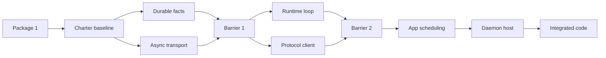

# M4 Execution Charter: Model Providers and One Persistent Streaming Run

## Status

**Controller-owned historical M4 charter.** This document records the M4
implementation context, accepted decisions, Package 1 baseline, completed lane
integrations, and retained contract history. The immutable M4 baseline and CI
closure evidence are recorded separately in [M4 Closure Evidence](closeout/m4-closure-evidence.md).

The M4 integration branch was `feat/m4-model-streaming`. Its accepted
Lane F integration baseline is commit
`18bb629635f6ae3149a6fde079b1415e7a483131`, after controller integration of
Lane C (`3fdc9f45929398fd0cf129b73d820389f71dd158`), Lane D
(`77e4ad5df4e3e598c5930a0ce03d2bbf624bcbda`), Lane E
(`24a9b78f0013c4e32fc906256fbbff732a8f488a`), and Lane F. Lane E adds durable
full-history context reconstruction, DTO-only post-commit scheduling, safe
scheduling/context terminal failures, and private selected-provider composition.
Lane F completes daemon-owned execution, commit observation and fan-out,
persistent run-scoped delivery, and task-owned cancellation lifecycle.

All planned M4 implementation lanes are integrated and M4 is closed. This
historical charter does not authorize new M4 work, an auxiliary worktree, or a
sub-agent. Changes to the closed M4 scope require a new decision and their own
baseline evidence.

## Authority and ownership

The following precedence applies:

1. [`AGENTS.md`](../../AGENTS.md) defines repository operating instructions.
2. [`architecture/`](architecture/README.md) defines approved product,
   architecture, test-driven delivery, and quality policy.
3. This charter records M4-specific execution decisions and Package 1 facts. It
   cannot override either higher source.
4. A lane-specific controller handoff may narrow work only when it agrees with
   all higher sources.

Every M4 sub-agent must read this document, `AGENTS.md`, and the architecture
sources named by its lane card before editing. A sub-agent must **not** edit,
stage, rename, move, delete, or amend this file. It reports required amendments
or conflicts to the controller instead.

Only the controller may update this charter, and only after a user-confirmed
decision or a successfully verified integration barrier. A controller charter
update is a separate documentation-only commit with documented validation.

## Baseline and retained M3 invariants

M3 closed at immutable implementation baseline
`e0ddc86c2df7f84394a9f15b5b7a331ad3e8b68b`. M4 preserves all of these
invariants:

- The system is local-first, single-user, and daemon-owned.
- Every cross-crate, process, persistence, provider, tool, hook, and adapter
  boundary uses explicit DTOs.
- A session has at most one active run. Additional accepted turns are durable,
  ordered queue entries.
- Every semantic state change atomically writes the projection, append-only
  event envelope(s), and affected session/run snapshot(s), or commits nothing.
- Publication occurs only after a durable commit.
- A started or promoted run retains its original `RunId`, credential-free
  `ConfigSnapshotDto`, and `ConfigRevisionId`.
- Cancellation is two-step: `Starting` or `Running` transitions to
  `Cancelling`, and only then may become `Cancelled`.
- Daemon startup interrupts unfinished runs before readiness. It never resumes
  or retries provider, tool, shell, or other external work automatically.
- M3 session subscriptions remain safe durable one-shot replay. M4 must never
  expose an unfiltered session snapshot to satisfy a run-scoped request.

## M4 scope

M4 delivers one daemon-owned streaming user turn from durable acceptance to an
ordered assistant result and durable terminal state. It includes:

- provider-neutral model contracts;
- OpenRouter and generic Chat Completions providers;
- safe provider/model capability validation;
- immutable timeout/retry selection, normalized usage and provider errors;
- durable assistant/model facts and run-scoped replay;
- one private daemon-owned Tokio runtime for model work and persistent local
  subscription delivery; and
- bounded post-commit live fan-out.

M4 excludes OpenAI Responses and `provider = "openai"`; Factory BYOK
configuration; M5 tools, WorkspaceRoot, hooks, and Plan/Build policy; M6 UI;
config live reload; credential persistence/rotation/keychain integration; remote
transport; multi-user access; idle shutdown; upgrades; and automatic external
work resumption.

## Accepted decision register

| Topic | Decision | Consequence |
| --- | --- | --- |
| Provider kinds | Only `openrouter` and `generic-chat-completion-api` remain valid M4 configuration kinds. | `openai` requires a later Responses driver, contract, and architecture decision. |
| OpenRouter adapter | `intention-provider-openrouter` uses `openrouter-rs` 0.14.0 privately. | OpenRouter SDK types never cross the provider public boundary. |
| Generic adapter | `intention-provider-generic-chat` uses `async-openai` 0.41.3 privately with configured-base-URL Chat Completions streaming (migrated from 0.29.3 post-M4). | No custom HTTP/SSE parser is introduced. |
| Generic capability subset | Text context/output, usage, finish reasons, and function-style tool calls are supported. | Reasoning, multimodal, and vendor extensions reject preflight before outbound preparation. |
| Model contract | Providers emit `Started`, zero or more text/reasoning/tool/usage facts, then one `Finished`. | A fact before start, after finish, duplicate usage, a second start, or a second finish fails lifecycle validation. |
| Credentials | Startup-only provider material is opaque, non-debug, non-display, and non-serializable. | Credentials never enter safe snapshots, storage, events, protocol DTOs, logs, diagnostics, or public APIs. |
| Execution policy | `ProviderExecutionPolicyDto` defaults to 30-second attempts and two attempts. TOML may set timeout `1..=60` and attempts `1..=2`. | The resolved safe policy belongs to each immutable run snapshot. |
| Retry delay | Runtime owns fixed 250 ms retry delay. | Backoff is not a TOML setting. |
| Retry eligibility | At most one retry for normalized retryable failure before the first committed assistant-content batch. | No retry after content, tool call, cancellation, terminal state, or restart. |
| Assistant content | Runtime coalesces content into durable batches no larger than 4 KiB under one `AssistantTurnId`. | Native provider chunking remains private; final remainder flushes before terminal success. |
| Tool calls before M5 | Runtime records typed tool-call evidence then fails `tool_execution_unavailable`. | Providers never invoke local tools and no registry/WorkspaceRoot/hook behavior is pulled into M4. |
| Runtime ownership | `intention-daemon` owns one private Tokio runtime. | Tokio tasks, channels, runtime handles, sockets, and SDK resources never cross public DTO boundaries. |
| Persistent subscribers | Each subscriber has capacity 64 event batches and a 10-second write deadline. | Overflow or timeout sends typed resync when possible, then closes only that peer. |
| Run scope | M4 uses dedicated run snapshot, cursor, tail, and live-batch DTOs. | A run request never filters or leaks the session snapshot/cursor. |
| Queued restart selection | A promoted run starts only when its persisted safe provider kind/model/endpoint/execution policy matches current startup selection. | A mismatch becomes durable `Starting -> Failed` with `provider_configuration_unavailable`, with no provider call. A matching safe selection may use the current in-memory credential. |

## Package 1 foundation

Package 1 activated the following Tier C production crates and their
machine-readable test targets:

| Crate | Responsibility | Integration target |
| --- | --- | --- |
| `intention-model` | Provider-neutral DTOs and model driver contract. | `model_contracts` |
| `intention-provider-openrouter` | Private OpenRouter SDK translation. | `openrouter_contracts` |
| `intention-provider-generic-chat` | Private generic Chat Completions SDK translation. | `generic_chat_contracts` |

The Package 1 public/safe contract includes:

- `ProviderExecutionPolicyDto` in resolved and snapshot configuration, with
  backward-compatible defaults for existing M3 snapshot fixtures;
- `StartupProviderMaterial`, consumable only by a selected provider constructor;
- `ModelMessageDto`, `ModelRequestDto`, requested/declared capability DTOs,
  `ModelEventDto`, `ModelStreamLifecycleDto`, `ToolCallDto`, `UsageDto`,
  `FinishReasonDto`, and `ProviderErrorDto`;
- private request translation and fixture normalization in both provider crates;
- compile/source/rustdoc architecture checks that restrict SDK namespaces to
  private source in their owner provider crate; and
- supply-chain exceptions recorded in the quality policy for selected SDK
  dependency paths. These exceptions and the `async-openai` outdated hold were
  reassessed together with the post-M4 `async-openai` 0.41.3 migration: the
  hold and the two transitive advisory acknowledgements were removed when the
  `backoff` chain dropped.

Package 1 validation recorded by its implementation handoff:

| Check | Result |
| --- | --- |
| `make quick` | Passed. |
| `make verify` | Passed. |
| `intention-model` coverage | 98.51%, Tier C threshold 85%. |
| `intention-provider-openrouter` coverage | 93.33%, Tier C threshold 85%. |
| `intention-provider-generic-chat` coverage | 90.65%, Tier C threshold 85%. |
| `intention-config` coverage | 95.03%, Tier A threshold 95%. |

## Barrier 1 foundation

Barrier 1 integrated and accepted the following controller-reviewed candidates:

| Lane | Integrated commit | Delivered boundary |
| --- | --- | --- |
| A | `5deefd865dbfacec2fcb78dd6acc0b60a7559d16` | Durable model facts, schema-v2 migration, model-run projection/snapshot, bounded internal run replay, and atomic fault evidence. |
| B | `9231da93ff5e255d20e88a8e8ee1d797a51f4239` | Additive Tokio local IPC primitives, bounded async framing, negotiated persistent split connections, and Unix/Windows transport fixtures. |

Lane A moves the normalized leaf values `UsageDto`, `FinishReasonDto`,
`ToolCallDto`, and `ProviderErrorDto` to `intention-types`; `intention-model`
re-exports them for Package 1 compatibility. It introduces a separate run
cursor and internal snapshot/tail read DTOs. Current M3 session protocol
behavior is intentionally unchanged: until Lane D supplies dedicated wire DTOs,
a `SubscribeSessionCommandDto` with `run_id` remains a safe
`HistoryUnavailable` resync and never returns a session snapshot.

Lane B preserves the existing synchronous M3 transport API. Its additive async
API retains the 500-millisecond connect bound, typed one-megabyte framing,
existing endpoint permissions, and opaque Tokio/IPC resources. It does not add
a Tokio runtime, daemon dispatch, a subscriber queue, write deadline, resync
policy, or fan-out.

Controller review found and corrected terminal-fact ordering, terminal queue
promotion, usage-overflow validation, and Windows async-connect timeout defects
before integration. No M4 charter change was made by either lane agent.

## Barrier 2 foundation

Barrier 2 integrated and accepted the following controller-reviewed candidates:

| Lane | Integrated commit | Delivered boundary |
| --- | --- | --- |
| C | `3fdc9f45929398fd0cf129b73d820389f71dd158` | Provider-neutral execution/cancellation contracts, private provider stream normalization, safe run-config lookup, runtime lifecycle, timeout/retry, batching, cancellation, and tool denial. |
| D | `77e4ad5df4e3e598c5930a0ce03d2bbf624bcbda` | Dedicated run-stream wire DTOs, daemon frame transport roles, opt-in stream client, replay/reducer/recovery, and status snapshot frames. |

Lane C resolves execution policy to one or two total attempts. Its runtime uses
exact safe selection equality for persisted/current kind, model, endpoint, and
execution policy; any mismatch fails `Starting -> Failed` without provider
work. It records output with UTF-8-safe 4 KiB capacity-or-terminal batches,
permits one retry only before any durable text, reasoning, usage, or tool fact,
and preserves the two-stage `Finished + Running -> Completing` then
`Completing -> Completed` commit sequence. A provider-neutral cancellation
signal and runtime-owned time port remain free of Tokio public types; the
private daemon adapter is deferred to F.

Lane D leaves M3 session subscription/client behavior intact. Its run stream is
an opt-in negotiated capability: a correlated initial replay/resync/error is
followed by uncorrelated run live batches or authoritative snapshot frames.
Clients retain the last valid run cursor on gaps, fail closed on unavailable
history, preserve tail-only reasoning during historical catch-up, and never
infer a terminal daemon status from a fact.

Controller review corrected provider retry classification, generic usage and
legacy function-call normalization, cancellation-waiter retention, repeated
`Running` transition on retry, replay-tail loss, and replay-response handling.
The first combined full gate reached a copied-fixture disk-quota failure in
`/tmp`; after removing only generated lane build artifacts and routing fixture
temporaries to `/home/data/.intention-relay-quality-tmp`, the same combined
source passed the complete gate.

## Lane E and F integration foundation

Lane E integrated and accepted the following controller-reviewed candidate:

| Lane | Integrated commit | Delivered boundary |
| --- | --- | --- |
| E | `24a9b78f0013c4e32fc906256fbbff732a8f488a` | Full durable starting-run context, DTO-only post-commit scheduling, safe scheduling/context failure terminalization, and private selected-provider composition. |
| F | `18bb629635f6ae3149a6fde079b1415e7a483131` | Private Tokio daemon host, task-owned execution/cancellation registry, post-commit durable-read fan-out, persistent run-stream delivery, and host outcome evidence. |

For a durably accepted `Starting` run, application reconstructs the complete
ordered durable model context: each started run contributes its user turn, and
only completed runs with non-blank final assistant content contribute an
assistant message; the current user turn is last. Queued turns are not
scheduled. Context reconstruction or scheduler admission failure records the
typed manual failure without rolling back the accepted turn or invoking a
provider. Idempotent acceptance does not create a duplicate scheduling request.

The composition root privately selects the configured OpenRouter or generic
Chat Completions driver from startup material while keeping credentials,
provider SDK types, and execution resources out of public APIs and scheduling
DTOs. The Lane E dispatch seam admits work only. Lane F supplies its private
Tokio host: exact `(SessionId, RunId)` task/cancellation registry, injected
provider-neutral execution, post-commit independently durable-read observation,
and run-scoped persistent fan-out. It deduplicates `RunStarted` evidence,
including atomically promoted successors, and never resumes provider work after
recovery.

The integrated M4 run contract uses typed append-only facts, dedicated
run snapshots/cursors/tails, and separate run-stream DTOs, never a filtered M3
session snapshot. The runtime owns capability preflight, batching, retry
eligibility, late-event suppression, tool-call denial, and the two-step
`Starting`/`Running -> Cancelling -> Cancelled` path. The host creates an
authoritative replay with an empty tail on subscribe or replay, then publishes
only committed live batches or status snapshots on the persistent connection.
Each peer has a bounded queue of 64 frames and a ten-second write deadline;
overflowing or timed-out peers receive best-effort `SubscriberTooSlow` resync
before peer-only closure. The complete evidence portfolio proves ordered
assistant events, durable completion, reconnect/replay, cancellation without
late facts, promotion deduplication, slow-peer isolation, credential redaction,
and restart without external-work resumption.

## Integrated lane topology

This historical topology records the accepted delivery structure. It did not
authorize worktrees, sub-agents, or scope changes while the lanes were being
integrated; closure evidence is now recorded separately.

| Lane | Integration base | Integrated commit | Delivered responsibility |
| --- | --- | --- | --- |
| A | Charter baseline | `5deefd865dbfacec2fcb78dd6acc0b60a7559d16` | Domain/storage/SQLite facts, projections, migration, and run replay. |
| B | Charter baseline | `9231da93ff5e255d20e88a8e8ee1d797a51f4239` | Tokio local transport primitives and bounded async framing. |
| C | Barrier 1 | `3fdc9f45929398fd0cf129b73d820389f71dd158` | Runtime lifecycle, batching, retry, cancellation, and tool denial. |
| D | Barrier 1 | `77e4ad5df4e3e598c5930a0ce03d2bbf624bcbda` | Protocol stream DTOs and client reducer/reconnect semantics. |
| E | Barrier 2 | `24a9b78f0013c4e32fc906256fbbff732a8f488a` | Application scheduling and selected-provider composition seam. |
| F | E integration | `18bb629635f6ae3149a6fde079b1415e7a483131` | Tokio daemon host, publisher, fan-out, and end-to-end fixture outcome. |

A+B and then C+D were integrated as paired barriers; E and F were serial
integration work. Every accepted lane followed the active `AGENTS.md`
requirement to run `make quick` while iterating and `make verify` before the
controller accepted the integration barrier. No package-scoped `make focus
PACKAGES=...` gate was introduced.

## Explicit deferrals

- No future lane may introduce an OpenAI Responses provider, `provider =
  "openai"`, direct tool execution, workspace policy, hooks, UI, config live
  reload, credential persistence, remote transport, multi-user behavior,
  automatic run resume, idle shutdown, or upgrade coordination.
- A requested change not represented in this charter is a decision request, not
  implied implementation work.

## Controller status log

| Date | Scope | Status | Evidence |
| --- | --- | --- | --- |
| 2026-08-03 | Package 1 foundation | Accepted implementation baseline. | `2889de9f151109934a61e61138d6db36724b0e36`; `make quick` and `make verify` passed. |
| 2026-08-04 | Charter and lane structure | Approved for documentation only; lane execution not yet authorized. | User-approved execution-charter specification. |
| 2026-08-04 | Barrier 1, Lane A + B | Accepted integrated foundation. | `5deefd865dbfacec2fcb78dd6acc0b60a7559d16` then `9231da93ff5e255d20e88a8e8ee1d797a51f4239`; controller review; `make quick` and `make verify` passed after A and after combined A+B. |
| 2026-08-05 | Barrier 2, Lane C + D | Accepted integrated foundation. | `3fdc9f45929398fd0cf129b73d820389f71dd158` then `77e4ad5df4e3e598c5930a0ce03d2bbf624bcbda`; controller review; C `make quick` and `make verify` passed; combined C+D `TMPDIR=/home/data/.intention-relay-quality-tmp make quick` and `make verify` passed. |
| 2026-08-05 | Lane E application scheduling | Accepted integrated foundation. | `24a9b78f0013c4e32fc906256fbbff732a8f488a`; controller review found no corrections; `TMPDIR=/home/data/.intention-relay-quality-tmp make quick` passed 237/237 tests and `TMPDIR=/home/data/.intention-relay-quality-tmp make verify` passed. |
| 2026-08-07 | Lane F daemon streaming host | Accepted integrated foundation. | `18bb629635f6ae3149a6fde079b1415e7a483131`; controller review found no confirmed findings; `TMPDIR=/home/data/.intention-relay-quality-tmp make quick` and `make verify` passed 259/259 tests. Outcome evidence covers one accepted execution, persistent replay/live/replay, cancellation without late facts, queued-promotion deduplication, slow-peer isolation, and restart/no-resume redaction. |
| 2026-08-08 | Package 6 M4 closeout | Closed at immutable implementation baseline. | `d2a85370a66d63fc759e4987a74d435ecd5d5115`; local `TMPDIR=/home/data/.intention-relay-quality-tmp make verify` passed; required Linux and Windows `make ci` matrix passed. See [M4 Closure Evidence](closeout/m4-closure-evidence.md). |

## Proposed, not approved

- The proposed `make focus PACKAGES=...` target and the candidate-lane versus
  integration-barrier validation model require a separate implementation change
  before they can alter the active Makefile/AGENTS quality workflow.
- Any amendment to provider API versions, event taxonomy, storage schema,
  protocol framing, retry values, or slow-peer policy requires a new recorded
  decision before implementation.
