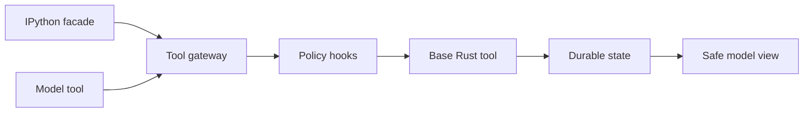
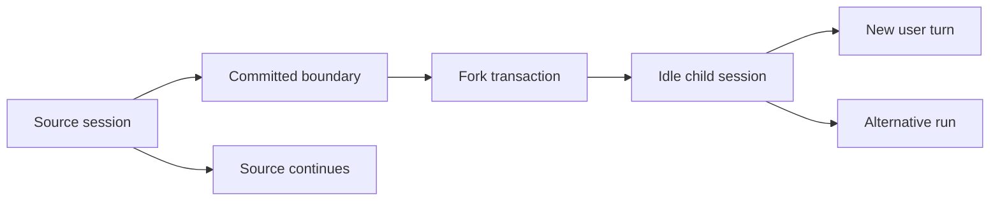
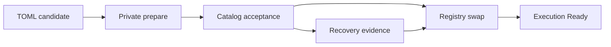

# M4+ Concept: Post-M4 Runtime and Session Evolution

## Status

**Research concept, not an approved implementation scope.** This document
preserves an investigation performed during M4 work and retained after M4
closure. It does not amend the closed M4 charter or implementation baseline,
authorize code changes, alter accepted M4 behavior, or claim that provider
profiles, configuration reload, credential rotation, or a provider-selection
user interface are delivered.

"M4+" is a shorthand for this unapproved research direction, not an approved
milestone or project phase. This document records possible future constraints;
it does not add a roadmap entry, crate, quality-policy target, or implementation
authorization.

Sections marked as selected concept constraints record the chosen target
semantics for a future replanning effort. They are more specific than open
research recommendations, but they are not approved architecture or delivery
scope. Before implementation, they must be reconciled into the authoritative
architecture, roadmap, crate map, quality policy, and decision records through
a separately approved change.

The closed M4 record remains [`m4.md`](m4.md), with its immutable
implementation baseline and acceptance evidence recorded in [M4 Closure
Evidence](closeout/m4-closure-evidence.md). The closed M4 baseline accepts only
`openrouter` and `generic-chat-completion-api`, applies TOML at daemon startup,
records one immutable credential-free selection per run, and explicitly
excludes configuration live reload, credential rotation, and M6 UI work.

## Prime Agent research and long-term direction

The following preserved research informs the wider M4+ direction:

- [Prime Agent runtime reference](../reference/prime-agent-research/prime-agent-runtime-reference.md);
- [RLM, IPython, and continual-harness integration analysis](../reference/prime-agent-research/rlm-ipython-harness-integration-analysis.md).

In the longer term, Intention Relay should implement the overall capability
described by that research: RLM-style recursive orchestration, persistent
IPython control-plane support, durable child-agent operation, and a continual
harness. Any future approved work in this direction must establish the
architectural and durable-runtime foundations first, rather than claim to
deliver the complete capability.

Before that scope is approved for implementation, the architecture
documentation, milestone roadmap, crate map, quality policy, and related
decision records require comprehensive replanning around the new direction.
This concept records only that intent; it does not amend M4 or authorize those
broader documentation or implementation changes.

## Conceptual execution direction: IPython and a unified Rust-owned capability plane

The long-term IPython direction is an optional programmable orchestration
control plane, not a second daemon, persistence system, or independent tool
implementation. The Rust daemon remains the sole authority for session and run
identity, provider selection, tool policy, child-agent admission, durable
state, event publication, and recovery. A persistent Python namespace may hold
variables, helper functions, skill wrappers, and child-agent handles, but it is
recoverable convenience state rather than authoritative application progress.

Future IPython code should call a thin Python facade over a typed daemon host
bridge. A later provider-native direct model tool may expose an equivalent
capability, but both paths must adapt to the same Rust-owned invocation service
and registered base tool. They must not independently perform equivalent file,
process, network, or other agent actions.



<!-- IPython and direct provider tool calls share one Rust-owned capability path. -->

The shared future invocation path must:

1. bind the request to daemon-held active session/run context rather than trust
   caller-supplied identity;
2. validate a typed tool request and apply WorkspaceRoot, mode, risk,
   confirmation, and hook policy;
3. execute the registered Rust base tool;
4. durably commit the tool outcome and policy evidence before publication; and
5. return a safe, size-bounded model-visible projection, preserving VFR,
   Headroom, retrieval, redaction, and observability policy.

A future direct-tool descriptor is a deliberate model-facing projection of a
Rust tool contract, not automatic exposure of every internal tool. Provider
function schemas, Python facade calls, daemon protocol commands, durable tool
events, and model-visible result projections must derive from compatible typed
Rust DTO contracts rather than manually maintained divergent schemas.

An unrestricted IPython kernel executes with its operating-system permissions.
It can bypass the facade through `pathlib`, `os`, or `subprocess`, so it is not
a technical enforcement boundary for WorkspaceRoot, Plan mode, hooks, or
audit. The facade is therefore the intended architecture and ergonomics path,
not a sandbox by itself. Enforcing those boundaries for Python requires a later
OS-level restricted sidecar or sandbox design where filesystem, process, and
network access are available only through the daemon bridge. Current trusted
local v1 assumptions neither provide nor claim such isolation, and this concept
does not decide its packaging, permission model, or delivery scope.

A full `model -> tool -> model` loop, including typed tool-result messages, is
a prerequisite for either IPython-driven or direct-tool agent execution. M4's
closed `tool_execution_unavailable` behavior remains unchanged. Cancellation,
kernel failure, and daemon restart must not silently resume external work;
existing no-resume recovery semantics continue to apply.

## Concept capability portfolio

This concept now preserves three related but independently deliverable
directions:

1. provider profiles, immutable per-run selection, configuration change
   awareness, controlled reload, and a safe adapter configuration control
   plane;
2. one Rust-owned capability plane shared by direct model tools and an optional
   IPython/RLM orchestration control plane, with later durable child-agent and
   continual-harness support; and
3. non-destructive session branching, regeneration, and a bounded conversation
   tree over independently durable sessions.

These directions have different prerequisites and do not have to become one
milestone or implementation package. Together they are technically feasible,
but they cross configuration, persistence, composition, runtime, tools,
protocol, client, security, and presentation boundaries. None is a small
adjustment to the closed M4 baseline.

## Closed M4 baseline

The closed M4 baseline has one daemon-startup provider selection:

```toml
[provider]
kind = "openrouter" # or "generic-chat-completion-api"
model = "..."
endpoint = "..." # required for generic Chat Completions
credential = "..."
```

`ConfigSnapshotDto` retains a credential-free representation of that one
selection. A started or queued turn retains its immutable snapshot and
`ConfigRevisionId`; queue promotion must keep the original selection. Runtime
compares the persisted and currently available safe selection before a provider
call. A mismatch fails safely with `provider_configuration_unavailable` and
makes no outbound request.

This is a useful foundation for profiles because immutable per-run selection,
queue promotion, recovery-before-ready, and provider-neutral runtime contracts
already exist. It is not sufficient for a catalog because a safe selection has
no logical profile identity. Two targets with otherwise equal kind, model,
endpoint, and execution policy may still represent different intended
credentials, accounts, or routing policy.

The closed baseline also provides durable linear sessions, queued turns,
session/run replay, reconnect/resync, cancellation, and bounded provider-attempt
retry. It does not provide rewind to an earlier turn, session fork or clone,
history branches, branch switching, destructive tail truncation, or regeneration
from an earlier user turn. Replay restores committed state; provider retry
repeats one eligible attempt inside the same run. Neither operation creates an
alternative history.

## Non-destructive session branching and regeneration

### Selected concept constraints

The constraints in this section are the selected target semantics for future
replanning. They do not approve a public contract, storage migration, UI, crate,
milestone, or implementation.

### Branch model and user semantics

History remains append-only. An action described informally as rewind must
never truncate, delete, replace, or rewrite the source session. It creates a new
durable child `SessionId` from one committed boundary and leaves the source
session unchanged. The domain therefore retains independent sessions with
lineage, while presentation groups them into one conversation tree.

The primary user action should be presented as **Fork from here**. **Regenerate
response** is a shortcut for a fork from a committed user turn followed by a
separate alternative run. Rewind is explanatory terminology only; it must not
be a command name or imply that files, processes, remote systems, or other
external effects are rolled back.



<!-- R starts only for a user-turn fork through a separate explicit command. -->

A root session and all of its fork descendants share a stable
`ConversationTreeId`. Every child additionally records its immediate
`ParentSessionId`, a globally stable `ForkOperationId`, and a typed immutable
`ForkBoundaryDto`. A nested fork points to its immediate source parent while
retaining the same tree ID. A schema migration should assign every pre-fork
session its own deterministic tree ID so storage and protocol never need a
permanent nullable or dual-mode lineage invariant.

Fork remains within one `ProjectId`, `WorkspaceId`, and immutable
`WorkspaceRoot`. A cross-project or cross-workspace copy is not a fork; it
requires a separate future clone/rebind workflow with its own filesystem,
artifact, provenance, and security decisions.

### Allowed boundaries and regeneration

A future fork contract may accept exactly two boundary forms:

1. A committed user turn. The child inherits the causal prefix through that
   user turn but none of the model, tool, usage, failure, or assistant facts
   produced in response to it. The fork transaction materializes one
   child-owned user-turn anchor with a new `TurnId`, the same content, and typed
   provenance to the source session/turn. Model-context projection replaces the
   source occurrence with this local anchor so the user content appears exactly
   once. A separate idempotent `StartForkRunCommandDto` may later start one
   alternative run from the idle anchor without creating another user turn.
2. The final committed assistant turn of a `Completed` run. The child inherits
   the complete causal prefix through that assistant turn, including safe
   terminal tool, artifact, child-result, policy, usage, and run references. It
   remains idle until a later ordinary user turn is accepted.

The first approved contract must reject a partial assistant batch, output from
a `Failed`, `Cancelled`, or `Interrupted` run, an unfinished tool call, a
pending permission/question or `WaitingInput` interaction, and an arbitrary
run cursor. Such states cannot be converted into a synthetic completed turn or
silently continued in the child.

Fork is independent of current source activity. An active source run may
continue, and a child may later run concurrently because the one-active-run
invariant remains per session. Source queued turns never cross the boundary;
the child starts with no queue. Existing archived descendants do not block a
new fork. An archived source may be forked when its boundary remains available
and passes integrity checks, without unarchiving the source.

### Frozen base snapshot and integrity

Every child owns a self-contained, credential-free, typed
`ForkBaseSnapshotDto`. Even a nested fork receives a flattened snapshot of its
entire selected causal prefix; runtime context construction must not walk a
chain of live ancestors.

The snapshot should contain the equivalent of:

```text
ForkBaseSnapshotDto
  schema_version
  projection_schema_version
  source_session_id
  boundary
  source_session_sequence
  source_run_cursors
  effective_prompt_projection
  terminal_user_assistant_context
  terminal_tool_result_references
  policy_decision_references
  artifact_revision_references
  terminal_child_result_references
  safe_usage_provenance
  historical_config_policy_references
  canonical_snapshot_digest
  model_context_digest
```

The effective prompt projection freezes the safe system, project, session, and
future harness-derived instructions visible at the boundary. Later child-owned
instructions are additive and separate; immutable hard policy continues to
take precedence. The snapshot must not contain credentials, provider SDK data,
raw Jupyter frames, arbitrary logs, pending external work, or an implementation
resource.

The canonical snapshot digest protects the full typed snapshot. A distinct
model-context digest protects the exact safe projection that the selected
historical projector produces for the model. The projection has its own schema
version. Later context-builder evolution must use a compatible historical
projector or an explicit migration that records separate migration evidence and
does not rewrite the original digest. Corruption or an unsupported snapshot or
projection schema leaves the child visible but blocks context-dependent work
with a typed `ForkHistoryUnavailable` or `UnsupportedSnapshot` result. Runtime
must never fall back to current source history and silently change fork meaning.

### Transaction, idempotency, and lifecycle

One SQLite transaction must create all of the following, or none of them:

- child session and projection;
- conversation lineage;
- frozen base snapshot;
- optional child-owned user anchor;
- closed typed fork events; and
- a canonical digest of the idempotent command.

Provider, scheduler, tool, shell, kernel, or other external work is forbidden
inside that transaction. The snapshot must therefore be bounded and derived
only from committed durable data.

`ForkOperationId` is a domain idempotency identity. Repeating an equal command
returns the same child; reusing the ID with a different source, boundary, title,
future profile override, or other semantic option fails with a typed conflict.
The command also carries the expected source projection revision/sequence used
for previewing inherited live defaults. A mismatch fails closed and requires a
fresh source read instead of accepting unseen defaults.

After commit, the child is an ordinary idle session with no queued, starting,
active, or waiting run. A later scheduling, configuration, or provider failure
does not compensate or roll back the fork. The idle child remains visible and
can be retried, continued, renamed, or archived.

### Inherited state and live defaults

Historical context retains every original per-run provider/configuration and
policy revision. Future child work inherits the effective source session
default provider profile and mode observed at fork commit. Each new child run
still resolves and persists its own immutable current profile and policy
snapshot; a user-turn regeneration may provide an explicit safe profile
override. Presentation must distinguish historical selection from the future
default when they differ.

The daemon supplies a deterministic safe default child title from source title
and fork point; an adapter may supply an optional validated title. Rename,
archive, future-profile default, and mode changes apply only to one session.
Tree-level title or metadata requires a separate explicit command and never
cascades implicitly to descendants.

An archived source remains available read-only to an ancestry inspector, but
child context building depends only on the child's frozen snapshot and lineage
metadata. Archival cannot free an ancestor that remains an audit dependency.

### Workspace state and concurrent branches

Fork branches durable intent and model context, not the machine. The child may
share a `WorkspaceRoot` whose current files include source-branch or external
changes made after the selected boundary. No fork workflow automatically
reverts files, commands, repositories, remote APIs, or other side effects.

A future `WorkspaceStateNoticeDto` in child snapshot/run preflight should carry
safe baseline tokens for referenced logical paths, a bounded mismatch summary,
and an explicit unknown/unverifiable state. The notice does not block read-only
work. Mutating built-in tools must use per-resource optimistic concurrency:

- read/search return a content hash and metadata token;
- write/edit require the expected token for every affected path;
- create requires expected absence;
- rename/delete require source and target tokens; and
- immediately before mutation, daemon-owned tools compare real filesystem
  state rather than trusting only prior daemon events.

A mismatch persists and publishes a typed `WorkspaceConflict` with safe logical
paths, does not execute the base tool, and never automatically rebases or
retries the user's intent. The model or user must reread and explicitly retry.

`execute` cannot provide the same guarantee. Its future contract must be
explicitly weak: validate declared observed state before launch, durably record
command intent, and collect best-effort changed-file evidence afterward. It
must not claim atomicity, complete side-effect discovery, or coordination with
external user processes.

### Artifacts, child agents, usage, and external effects

Artifacts visible before the boundary are inherited as read-only ancestry
references to exact revisions. A first child mutation creates a child-owned
copy/revision lineage and never changes the source artifact. This applies to
plans and other durable work products; it does not imply that referenced
physical workspace state was restored.

Terminal RLM child results before the boundary may be inherited as safe
read-only context/audit references. Running or queued children and messages
after the boundary are not copied, resumed, or re-admitted. Session-fork
lineage and future `RlmParentLink` are different typed relationships: a
delegated runtime child may own a session but does not become a user-visible
conversation branch without a separate explicit user fork.

Inherited usage remains source provenance and is not charged to the child a
second time. Child totals count only child-owned runs; tree aggregates
deduplicate inherited usage by original `RunId`. Presentation must distinguish
own and inherited usage.

### Public workflow, protocol, and presentation

The first public workflow should be user-initiated only. A model or IPython
program may recommend a fork but cannot create one until a later confirmation,
quota, and autonomous-branch policy is approved.

Likely public contract families include:

```text
ForkSessionCommandDto
ForkSessionResultDto
StartForkRunCommandDto
GetConversationTreeQueryDto
ConversationTreePageDto
ConversationBranchSummaryDto
```

`ForkSessionCommandDto` carries the source session, typed boundary,
`ForkOperationId`, expected source revision/sequence, optional validated title,
and optional safe future-profile override. `ForkSessionResultDto` is bounded and
returns the child `SessionId`, `ConversationTreeId`, immediate parent, accepted
boundary, optional child anchor `TurnId`, snapshot schema/digests, inherited
future defaults, and safe workspace-state notices. A separate ordinary query
loads the full child snapshot.

`GetConversationTreeQueryDto` should provide bounded adjacency pagination by
`ConversationTreeId`, optional parent `SessionId`, and page token. A page
contains a root summary, immediate child summaries, and `has_more`; clients
expand the tree lazily. Fork boundary and frozen snapshot data remain immutable,
while typed live summaries may show current title, status, archive state,
future-profile default, and mode.

Existing session and run subscriptions remain session-scoped. Fork commit may
write child-owned evidence, a separate lineage projection/event, and a bounded
source-side `SessionForked` reference, but it must not introduce an unbounded
tree-wide event stream. Ordinary session queries do not reveal ancestry; a tree
query is constrained to the same conversation tree, project, and workspace.

Protocol support is additive under a negotiated `session_fork_v1` capability.
Unsupported clients receive a typed unsupported result; existing session/run
contracts remain compatible rather than forcing a protocol-major change.

Presentation groups related sessions under one conversation root and lazily
shows branch title, status, profile, mode, fork point, archive state, workspace
drift, and ancestry breadcrumbs. Opening a branch remains opening an ordinary
session by `SessionId`. A regenerate shortcut performs a user-boundary fork and
then a separate `StartForkRunCommandDto`; failure of the second action leaves
the idle branch visible.

### Audit, retention, and bounded policy

The future closed event taxonomy should include the equivalent of
`ConversationTreeCreated`, `SessionForked`, `ForkAnchorMaterialized`, and
`SessionArchived`. `StartForkRunCommandDto` uses ordinary user/run events plus
typed fork provenance. Generic metadata events or raw snapshot blobs are not an
acceptable audit boundary.

Initial retention is archive/hide only. Physical deletion is forbidden while
descendants or audit dependencies exist. Reference-counted garbage collection,
cascade deletion, export, and destructive history cleanup require separate
later decisions.

Daemon policy must bound tree depth, descendants per tree, forks per source
boundary/time window, frozen snapshot size, and tree-query page size. Exact
defaults belong to a future approved specification. Every limit failure is a
typed policy result, not an oversized frame, partial branch, or unstructured
storage error.

## Selected concept constraints: provider profiles

The constraints in this section are selected target semantics for future
replanning. They do not approve a configuration migration, protocol, storage
schema, driver registry, UI, crate, milestone, or implementation.

### Profile identity, configuration shape, and credentials

A `ProviderProfileId` is immutable and is both the TOML key in
`[profiles.<id>]` and the durable logical profile identity. It must match
`[a-z0-9]+(?:-[a-z0-9]+)*`, remain within a future bounded length, reject
uppercase rather than silently normalizing it, and reject the reserved prefixes
`system` and `legacy`. It is never derived from a model, endpoint, or
credential, cannot be renamed, and is never reused after deletion. Renaming an
ID is an atomic removal of the old identity and creation of a new one, with no
heuristic based on equal safe selections.

`display_name` is optional presentation metadata. When present, it is trimmed,
non-blank bounded Unicode plain text that rejects control and bidi-override
characters. It is not unique, does not enter a profile revision, and is not
model-visible. Adapters must render it as escaped plain text, while the exact
`ProviderProfileId` is the deterministic display fallback and disambiguator.

The first catalog schema is version 2 and is conceptually shaped as follows:

```toml
schema_version = 2
allow_insecure_loopback_provider_http = false

[defaults]
profile = "openrouter-main"

[defaults.execution]
attempt_timeout_seconds = 30
max_attempts = 2

[profiles.openrouter-main]
kind = "openrouter"
model = "anthropic/claude-sonnet-4"
credential = "..."
display_name = "Primary"
enabled = true

[profiles.local-vllm]
kind = "generic-chat-completion-api"
endpoint = "http://127.0.0.1:8000/v1"
model = "llama-3.3-70b"
credential = "..."

[profiles.local-vllm.execution]
attempt_timeout_seconds = 60
```

All tables are typed and reject unknown fields. A profile contains only kind,
model, literal credential, enabled state, display name, endpoint, and an
optional execution-policy override. The global and per-profile execution tables
merge field by field, then validate and resolve to one immutable effective
policy. A missing `enabled` means `true`.

Only the closed M4 kinds `openrouter` and `generic-chat-completion-api` are
valid. Profiles do not introduce OpenAI Responses, `provider = "openai"`,
arbitrary provider strings, plug-ins, alternate credential fields, environment
references, keychain references, authorization-header maps, or provider-specific
query parameters.

Every profile, including a disabled one, requires a non-blank literal
`credential`. All credentials become private opaque non-`Debug`, non-serde
material during parsing. They never enter SQLite, DTOs, snapshots, events, logs,
diagnostics, display metadata, source digests, or public errors. Identical
literals may appear in multiple profiles, but the daemon neither compares nor
deduplicates them; every profile keeps independent private client/driver state.
`credential_configured` remains in safe catalog DTOs with value `true` for
accepted profiles. It is configuration presence, never credential health.

The existing v0 migration first normalizes to v1 and then materializes one
v2 profile named `default`; v1 migration does the same directly. The effective
global default becomes `default`. Migration is in memory only and must not
rewrite the physical TOML file. Once durable catalog history contains more than
that one exactly representable profile, a v0/v1 file fails closed with
`legacy_config_cannot_represent_active_catalog`. A tombstoned `default` similarly
makes legacy migration fail closed rather than weakening ID non-reuse.

### Safe selections, revisions, and endpoints

`ProviderProfileRevisionId` is a deterministic versioned digest of the
canonical credential-free execution selection:

```text
ProviderProfileRevisionDto
  profile_id
  profile_canonicalization_version
  revision_id
  kind
  model_id
  normalized_endpoint
  effective_execution_policy
  effective_insecure_loopback_policy
```

The profile revision changes when the profile ID, kind, exact trimmed model,
normalized endpoint, resolved execution policy, or resolved insecure-loopback
security policy changes. It does not change for TOML order or whitespace,
display name, enabled state, source path, or credential-only edits. A separate
typed canonicalization-version DTO accompanies digest IDs in catalog and run
snapshots; equality requires both version and digest. Future canonicalization
migration must be explicit and fixture-proved rather than inferred from binary
version.

`CatalogRevisionId` is a separate deterministic versioned digest of sorted
profile IDs, their safe profile revisions, enabled states, validated display
names, the global default, and effective global security policy. TOML order,
whitespace, credentials, and configuration path do not contribute. It captures
catalog/pagination/presentation semantics without making cosmetic metadata an
execution selection revision.

The existing `ConfigRevisionId` remains the run-wide identity of a canonical
full safe `ConfigSnapshotDto`. It is distinct from catalog and profile
revisions, includes the resolved provider selection plus other future run policy,
and is reusable when the complete safe run configuration is equal. A run
snapshot contains the resolved `ProviderProfileId`, profile revision,
driver-contract revision, and selection source, but neither display name nor a
whole catalog snapshot.

Generic Chat endpoint validation is protocol aware. OpenRouter has no endpoint
override. Generic Chat requires a strict absolute HTTPS URL with a non-root API
base path. Only the explicit global
`allow_insecure_loopback_provider_http = true` policy, false by default, permits
HTTP for exactly `localhost`, `127.0.0.1`, or `[::1]`; no DNS resolution,
custom aliases, private-LAN hosts, or broader network permission is implied.
That effective policy enters each affected profile revision.

Endpoints reject userinfo, query, fragment, malformed percent escapes, decoded
control bytes, and control characters. Canonicalization lowercases scheme and
ASCII host, uses bracketed IPv6, removes default ports, strips only final path
slashes, and preserves valid percent-encoded routing bytes and case without
dot-segment resolution. The path must remain non-root. Model identifiers are
trimmed and non-blank but otherwise byte-exact, with no model-name heuristics.
Endpoint is safe non-secret metadata for authorized local clients only; tests
must prove a fake secret cannot cross through URL syntax or projections.

### Catalog lifecycle, history, and activation

An accepted catalog has one enabled global default. A candidate that removes or
disables the default must name another enabled default in the same atomic
candidate. A profile's `enabled` state is catalog availability metadata, not
profile-revision input. Disabled profiles cannot be selected by a session,
turn, fork, start-fork-run, model, IPython, or administrative override.

Catalog validation is all-or-nothing: one invalid profile rejects the candidate
and produces a bounded `ProviderCatalogValidationDto` with a total issue count,
the first bounded set of closed safe issue variants keyed by profile ID and
field category, and truncation. It never contains raw TOML, credential text,
configuration path, parser snippet, or source-location content. Disabled
profiles undergo the same structural and deterministic local driver preflight as
enabled profiles, so accepted catalogs contain no latent constructability error.
Preflight may construct SDK clients, parse endpoints, place opaque auth material,
resolve policy, and declare code-owned capabilities. It must never perform DNS,
HTTP, model discovery, credential validation, telemetry, or an SDK background
request.

Credential-free catalog revisions and profile-revision rows are immutable,
append-only SQLite history. A current projection points to the active catalog.
Accepted profile removal writes a permanent `ProviderProfileTombstoneDto` with
only safe identity, removed catalog revision/time, and provenance. A candidate
cannot reintroduce a tombstoned ID. Historical revisions remain while referenced
by a run or audit record. Catalog acceptance belongs to a dedicated typed
configuration-audit envelope/sequence rather than a synthetic session; the
closed taxonomy includes at least `ProviderCatalogAccepted`.

Candidate, durable catalog acceptance, and private runtime activation are
different states:



<!-- Private preparation is local only. Publication follows the exact registry swap. -->

Preparation runs outside a short daemon-owned catalog command gate. The gate
serializes catalog acceptance, session default changes, turn/fork admission,
and registry lookups, but never blocks already active model tasks. Under the
gate, a prepared candidate rechecks its expected active catalog revision and a
private ephemeral source file identity/content digest. The daemon then commits
safe catalog history, tombstones, projection, and audit evidence, swaps the
exact registry, marks activation active, and only then publishes catalog
change/readiness evidence. Prepared opaque material is dropped and zeroized
where practically supported after conflict, failure, expiry, or rejection; no
absolute memory-erasure claim is made.

Private enabled entries are keyed by exact
`(ProviderProfileId, ProviderProfileRevisionId, ProviderDriverContractRevisionDto)`.
Metadata-only catalog changes reuse an enabled exact entry. Disabling removes it
from the active index after existing private `Arc` holders finish; enabling
constructs and validates it again before acceptance. Disabled profiles are
locally constructed for validation and then dropped. Each Generic Chat profile
uses its own client even when model, endpoint, or credential literal match a
different profile. Composition owns this registry; no SDK type, credential,
client, handle, or registry resource crosses a DTO, persistence, protocol,
runtime public API, or adapter boundary.

The driver contract revision is a code-owned typed provider kind plus monotonic
major/minor contract. A current driver declares the older revisions it can
execute compatibly. This revision is stored in each resolved run selection but
is not a profile-revision input. An incompatible binary update makes affected
queued work unavailable and fail closed; it does not prevent a valid current
catalog from activating or silently rewrite old execution semantics.

### Startup-only profile application and degraded recovery

Provider profiles v1 remain startup-only. The user manually edits TOML and explicitly
uses the existing external daemon lifecycle to restart. No watcher, polling,
automatic restart, raw-TOML adapter transport, or restart protocol command is
introduced. At startup, valid additions, execution edits, enable/disable, and
display changes auto-accept. A semantic-equal safe catalog writes no new catalog
revision/event but reconstructs the private registry from current opaque
credentials. Therefore credential-only changes are intentionally invisible
durable state: a queued run with exact safe selection can use the new credential
after restart. This is an explicit deferred credential-rotation limitation, not
account/key generation tracking.

Removal is the narrow exception. If a startup candidate omits a previously
active profile, it becomes one process-local pending-removal candidate rather
than auto-tombstoning IDs. The daemon exposes only degraded administrative/read
mode because changed TOML no longer contains the prior private credentials. A
random opaque expiring `ProviderCatalogCandidateId` keys the private candidate;
the public status separately exposes only its safe candidate revision and a
bounded impact preview. `AcceptProviderCatalogRemovalCommandDto` is idempotent
and contains the candidate handle, expected active/candidate revisions, operation
ID, and source recheck. It atomically accepts removals, creates tombstones, and
activates the prepared registry. `RejectProviderCatalogCandidateCommandDto`
drops the private candidate and pending status only; it cannot rewrite TOML or
restore old secrets/readiness. Pending candidates have a bounded configurable
TTL and at most one may exist.

The removal impact preview contains only removed IDs, global-default validity,
bounded affected session-default and queued-selection counts/examples,
tombstone consequences, and truncation. It never exposes prompts, paths, or
credentials. A removal candidate does not make an already absent tombstone a
new pending item; reintroduction of a tombstoned ID fails validation first.

Startup opens storage first and interrupts pre-existing unfinished runs before
any read response, using the existing provider-independent recovery rule and
its deterministic queue promotion without scheduling provider work. It then
prepares and activates the catalog to obtain execution readiness. A degraded
daemon still supports health, safe catalog status/validation diagnostics, and
existing session/run/tree reads, but rejects all provider-related state changes,
admission, promotion scheduling, and default selection changes with
`execution_not_ready`. The only degraded-mode exceptions are explicit
accept/reject commands for the one already prepared pending-removal candidate;
they do not admit model or tool work.

If a process crashes after durable catalog acceptance but before registry swap,
recovery evidence requires exact safe catalog reconstruction from TOML and a
new registry activation before any provider work can occur. Mismatch, invalid
configuration, or unavailable material leaves execution not ready with
`provider_catalog_activation_recovery_required`; it never silently adopts a
different current file. A recovery-promoted `Starting` run is never scheduled
automatically after restart, even once catalog recovery succeeds; its later
explicit disposition remains a separate recovery workflow.

### Session selection, runs, queues, and usage

Creating a session copies the current global `ProviderProfileId` as its durable
future default. Global catalog changes never cascade through sessions. Migration
assigns existing sessions the migrated `default` identity while leaving old
`RunId` and `ConfigSnapshotDto` data immutable; legacy stored selections are
additively materialized as the deterministic `default` profile revision and
current driver contract. They execute only through an exact enabled `default`
entry, otherwise failing closed.

`SetSessionProviderProfileCommandDto` is user/client initiated, idempotent, and
optimistic: it takes a session, enabled profile ID, expected session projection
revision, and operation ID. It changes only future intent, emits a closed
`SessionProviderProfileChanged` event and snapshot when changed, and cannot
alter active or queued work. A request for the existing profile is a successful
`changed = false` no-op with no new event. A session may retain an unavailable
profile ID only after later catalog disable/removal; an explicit command cannot
select a disabled or absent profile.

`GetSessionProviderProfileQueryDto` returns the durable intent, the current
safe resolved entry/revision when available or a closed unavailability reason,
the session projection revision, and the global default for reference. Current
availability is always a daemon-computed read projection over immutable intent
or selection plus active catalog/registry. It carries the evaluated catalog
revision and activation status, and never mass-rewrites session or queue
projections after a catalog change.

`SendUserTurn`, `ForkSession`, and `StartForkRun` accept an optional safe
profile ID and optional expected profile revision. A per-turn or fork override
changes only that accepted run; it does not mutate the durable session default.
When no override is supplied, the daemon resolves the session's durable profile
ID. If an expected revision is supplied for either source, a mismatch rejects
before a user turn, queue item, fork, or run is committed. The daemon checks
the exact enabled registry entry before durable admission; registry failure
returns `provider_profile_runtime_unavailable` and accepts no user intent.

Every accepted starting or queued turn persists and returns one
`ResolvedRunProviderSelectionDto`: profile ID, profile revision, kind, model,
normalized endpoint, effective policy, driver-contract revision, and source
(`session_default` or `turn_override`). The source is safe immutable provenance
but not profile-revision input. Each run selects exactly one profile, with no
fallback chain, model-based routing, ensemble, or retry on another profile.
The model receives only the concrete provider/model/capability context needed
to execute its run, not catalog/profile IDs, endpoint, display name, defaults,
or other profiles.

Fork history retains original resolved revisions. A child session copies the
source durable profile ID as its future default, including an unavailable intent
and safe warning when necessary; a valid explicit fork override can replace it.
`StartForkRun` follows the same one-profile resolution rules as `SendUserTurn`.

Active runs continue with their captured private handles across profile disable,
removal, catalog activation, and credential-only restart changes. Only explicit
run cancellation stops them. Queued selections never rewrite. At promotion, an
unavailable exact selection creates the original `RunId`, immediately records
`Starting -> Failed` with stable `provider_configuration_unavailable`, and
includes a closed detail such as absent, disabled, revision mismatch,
driver-contract mismatch, or registry unavailable, plus promotion provenance.
No provider call occurs.

Unavailable promotion may continue FIFO only up to configurable
`max_unavailable_promotions_per_transition`. Exhaustion writes a typed
queue-reconciliation-needed marker and starts no provider work. A user-only
idempotent `ReconcileUnavailableQueueCommandDto` handles the next bounded page:
it terminalizes only currently unavailable immutable selections, may promote the
first available item, and never reroutes a prompt to a current default or a new
profile revision.

Usage remains provider normalized and is keyed by exact profile identity and
revision. Safe queries may aggregate by profile and separately by revision/model
without inventing price, currency, or estimated cost. Different profiles may
share all safe execution fields, including model ID, but remain independent
clients, selection identities, and usage groups. Presentation must show display
name or profile ID alongside model rather than treating a model string as a
unique target.

### Public protocol and presentation

`provider_profiles_v1` is one additive negotiated capability for paginated
catalog reads, catalog status, session default query/command, safe per-turn and
fork overrides, and resolved-selection projections. It does not imply live
reload, configuration editing, profile testing, credential entry, or model
discovery. Older clients retain generic execution-not-ready health and existing
session/run history behavior, but do not receive profile-specific DTOs.

The catalog list is bounded and paginated by opaque token, stable `ProfileId`
sort order, active `CatalogRevisionId`, and `has_more`; catalog change
invalidates a token with a typed conflict/resync. A safe entry includes profile
and catalog revisions, display name, enabled state, kind, exact model,
normalized endpoint where applicable, effective policy,
`credential_configured`, deterministic driver-declared capabilities, and local
readiness. The closed readiness projection is `ready`, `disabled`, or
`unavailable`; it never claims network or credential health. A separate
`GetProviderCatalogStatusQueryDto` supplies compact activation/degraded/pending
state, active/candidate safe revisions, default, safe validation/removal impact,
and negotiated capability state without requiring a catalog page.

In profiles v1, adapters may only read this safe state, set session defaults,
supply user-originated selection overrides, and accept/reject a pending removal.
They never write raw TOML, create/edit/enable/disable profiles, enter
credentials, or receive config paths. Those operations, physical v1-to-v2 TOML
conversion, keychain/credential rotation, persistent secret restoration,
`TestProviderProfile`, pricing, network discovery, arbitrary auth headers, file
watching, true controlled live reload, and a full configuration control plane
remain separate future decisions.

## Required verification portfolio

Any approved implementation of this concept must add evidence for:

- v0/v1-to-v2 in-memory migration through the stable `default` profile,
  legacy-after-v2 rejection, and tombstoned-`default` migration conflict;
- strict catalog TOML validation: slug grammar/reserved prefixes, display text,
  all-or-nothing profile validation, field-wise policy merge, candidate-size
  limits, bounded validation diagnostics, and mandatory enabled global default;
- cross-platform versioned golden canonical digest fixtures proving that TOML
  order/whitespace, display-only edits, enabled state, and credential-only
  changes have their selected effects on profile/catalog/run revisions, while
  every model, endpoint, policy, ID, and security-policy change is exact;
- strict URL fixtures for normalized HTTPS and permitted literal loopback HTTP,
  non-root paths, IPv6/default ports, percent bytes, and rejection of URL
  userinfo/query/fragment or fake-secret injection before safe projection;
- redaction fixtures proving raw TOML, credentials, URL-carried fake secrets,
  SDK resources, source digests, and private candidate material never appear in
  catalog history, snapshots, events, errors, logs, diagnostics, or adapters;
- deterministic local-only driver construction for enabled and disabled
  profiles, proving no DNS, HTTP, credential test, telemetry, model discovery,
  or background provider request occurs during startup/activation;
- immutable credential-free catalog/profile history, permanent tombstones and
  ID non-reuse, configuration audit sequencing, global-default invariants, and
  valid duplicate safe selections with independent private clients;
- prepare/commit/swap fault injection after safe catalog write, tombstones,
  current projection, audit event, and registry swap; stale source/candidate
  conflict, candidate expiry/disposal, and crash recovery must never admit a
  provider call before exact registry reconstruction;
- startup auto-accept/no-op, pending removal, bounded removal-impact preview,
  explicit accept/reject, degraded read-only behavior, recovery interruption
  before read response, and no automatic execution of recovery-promoted runs;
- exact registry-key isolation, active-run survival across disable/removal,
  disabled/absent/revision/driver-contract mismatch with no provider call, and
  compatible versus incompatible driver-contract upgrade fixtures;
- session default creation/migration, idempotent optimistic default changes,
  current availability projections, turn/fork/start-fork override expected
  revision conflicts, accepted selection results, and source provenance;
- exact immutable selection persistence in queued turns, bounded unavailable
  promotion cascade, user-only queue reconciliation, no reroute, and safe
  profile availability details for queue/session reads;
- profile-keyed usage grouping without invented price/cost, multiple endpoints
  and equal-model profile isolation, and profile metadata omitted from model
  context/tool results;
- paginated catalog/status DTOs, stable token/revision behavior, local
  readiness/capability projection, `provider_profiles_v1` negotiation, and
  legacy-client generic degraded-health behavior;
- equivalent WorkspaceRoot, mode, confirmation, hook, audit, and durable
  publication outcomes when the same future capability is reached through a
  Python facade or a direct model tool;
- typed host-request validation, daemon-bound run identity, cancellation,
  bounded model-visible output, and safe error/redaction behavior for a future
  Python bridge;
- proof that an unrestricted kernel is not represented as an enforcement
  boundary, plus separate evidence for any future restricted-sidecar claim;
- compatible direct-tool schema/DTO contracts with no provider SDK, Python
  object, raw Jupyter frame, credential, or implementation resource escaping a
  public boundary;
- deterministic migration assigning every existing session one unique
  `ConversationTreeId`, with valid root projections and no history rewrite;
- atomic fork fault injection after child, lineage, snapshot, anchor, event,
  and idempotency writes, proving every failed stage leaves no partial branch;
- equal-command idempotency returning one child and changed-command reuse of a
  `ForkOperationId` failing with a typed conflict;
- strict user/final-assistant boundary validation, including rejection of
  partial facts, non-completed assistant responses, pending interactions,
  queued turns, and running child work;
- exact materialized user-anchor provenance and captured model context proving
  that the selected user content appears once and only once;
- deterministic flattened snapshot and model-context projections, both
  digests, compatible projection migration, and corruption or unsupported
  schema failing closed without a live-ancestor fallback;
- nested forks, archived-source forks, independent source/child active runs,
  no queued-turn inheritance, and no automatic external-work resumption;
- historical profile/mode/policy preservation together with explicitly visible
  current future defaults and safe regenerate overrides;
- read-only artifact and terminal child-result provenance, copy-on-first-child
  mutation, and usage aggregation without charging inherited `RunId` values
  twice;
- direct filesystem-token checks, typed per-resource conflicts without
  automatic rebase, external-edit detection, and explicit weak `execute`
  evidence without an atomicity claim;
- bounded adjacency tree pagination, additive `session_fork_v1` negotiation,
  authorization to the same tree/project/workspace, and existing subscriptions
  remaining session-scoped;
- archive/retention dependency enforcement plus typed failures for depth,
  descendant, fork-rate, snapshot-size, and page-size limits; and
- redaction and failure coverage proving that adapters, events, snapshots,
  logs, diagnostics, and previews do not disclose credential-bearing source
  material.

The root `make quick` and `make verify` contracts remain mandatory. Any new
production crate or integration target must be registered in the
machine-readable architecture and coverage policy before its production code
is accepted.

## Recommendation and sequencing

Do not reopen closed M4 or treat this concept as one implementation package.
The selected constraints must first move into the authoritative architecture,
roadmap, crate map, quality policy, and decision records through a separately
approved replanning change.

That replanning should preserve this dependency order without prematurely
assigning milestone numbers here:

1. Use the closed M4 baseline as the compatibility and safety foundation for
   provider profiles and immutable per-run selection. Controlled reload and
   its adapter UX remain distinct follow-on decisions.
2. Specify durable conversation-tree identity, fork boundaries, frozen context,
   storage migration, protocol, and client contracts before session-fork code
   or presentation work.
3. Reconcile parallel branch mutation with the typed M5 tool/WorkspaceRoot
   foundation before claiming safe concurrent writes or execution.
4. Establish the shared typed tool/policy and full agent-loop contracts before
   adding direct model tools or a Python sidecar/host bridge.
5. Add presentation only after each daemon/client contract exists. Persistent
   kernels, RLM delegation, session forks, continual harness, provider profiles,
   reload, and sandboxing must not be forced into one delivery package merely
   because this concept preserves all of them.

This sequencing preserves durable run and history immutability, queue
correctness, credential isolation, no-resume recovery, provider SDK boundaries,
and a bounded route from research constraints to an approved architecture.
