# M4+ Concept: Post-M4 Runtime and Session Evolution

## Status

**Research concept, not an approved implementation scope.** This document
preserves an investigation performed during M4 work and retained after M4
closure. It does not amend the closed M4 charter or implementation baseline,
authorize code changes, alter accepted M4 behavior, or claim that provider
profiles, configuration reload, credential rotation, or a provider-selection
user interface are delivered.

"M4+" is a shorthand for this unapproved research direction, not an approved
milestone or project phase. This document records possible future constraints;
it does not add a roadmap entry, crate, quality-policy target, or implementation
authorization.

Sections marked as selected concept constraints record the chosen target
semantics for a future replanning effort. They are more specific than open
research recommendations, but they are not approved architecture or delivery
scope. Before implementation, they must be reconciled into the authoritative
architecture, roadmap, crate map, quality policy, and decision records through
a separately approved change.

The closed M4 record remains [`m4.md`](m4.md), with its immutable
implementation baseline and acceptance evidence recorded in [M4 Closure
Evidence](closeout/m4-closure-evidence.md). The closed M4 baseline accepts only
`openrouter` and `generic-chat-completion-api`, applies TOML at daemon startup,
records one immutable credential-free selection per run, and explicitly
excludes configuration live reload, credential rotation, and M6 UI work.

> **Selected semi-autonomous overlay.** This copy preserves every detailed
> section of the original research concept in its original order. For new
> Mandate-owned work, the Mandate and Delegated Verification Mandate constraints
> inserted below are authoritative. A future statement retained from the original
> that conflicts with those constraints is historical-only: it remains readable
> for research traceability, decoder compatibility, audit, and migration analysis,
> but cannot authorize, narrow, deny, queue, resume, or quota a new Mandate run.
> This is still research concept material, not approved architecture, delivery
> scope, or implementation authorization.

## Prime Agent research and long-term direction

The following preserved research informs the wider M4+ direction:

- [Prime Agent runtime reference](../reference/prime-agent-research/prime-agent-runtime-reference.md);
- [RLM, IPython, and continual-harness integration analysis](../reference/prime-agent-research/rlm-ipython-harness-integration-analysis.md).

In the longer term, Intention Relay should implement the overall capability
described by that research: RLM-style recursive orchestration, persistent
IPython control-plane support, durable child-agent operation, and a continual
harness. Any future approved work in this direction must establish the
architectural and durable-runtime foundations first, rather than claim to
deliver the complete capability.

Before that scope is approved for implementation, the architecture
documentation, milestone roadmap, crate map, quality policy, and related
decision records require comprehensive replanning around the new direction.
This concept records only that intent; it does not amend M4 or authorize those
broader documentation or implementation changes.


## Selected semi-autonomous Mandate overlay

This selected overlay defines the future semi-autonomous execution direction
without deleting, relocating, or abbreviating the detailed first-scope material
that follows. It is authoritative only for **new Mandate-owned work**. The
retained sections remain the exact research, decoder, compatibility, and audit
record for their historical semantics. This overlay does not amend the closed M4
baseline, approve implementation, claim an OS security boundary, or permit old
external work to resume.

A Mandate is a durable user-issued work authority. It is neither a per-tool
permission, a prompt, a Goal, a provider continuation, a daemon process, nor a
second runtime. It gives a future daemon a stable unit that may capture triggers
and admit fresh runs while its user-selected lifecycle allows it. Goals remain
acceptance and evidence records; a Mandate may reference one or more frozen Goal
revisions but a Goal does not become an authorization or scheduler plane.

### Mandate identity, revisions, and lifecycle

The conceptual durable family is:

```text
MandateDto
  mandate_id
  active_revision
  lifecycle_state
  service_session_id
  work_state_references
  verified_checkpoint_references
  child_work_graph_reference
  activity_identity

MandateRevisionDto
  mandate_id
  revision
  objective
  scope
  mode
  trigger_configuration
  goal_context_references
  continuation_configuration
  stop_conditions
  canonical_revision_digest

MandateTriggerReasonDto
  reason_id
  source_kind
  first_observed_at
  last_observed_at
  coalesced_count
  typed_references
  triggering_revision

MandateRunDispositionDto
  run_id
  terminal_kind
  next_action = Continue | AwaitUserDecision | None
  checkpoint_reference_when_verified
  external_effect_reference_when_unknown

MandateSelectionV1
  mandate_id
  mandate_revision
  trigger_reason_reference
  service_session_id
  activity_identity
  frozen_goal_context_references
  continuation_configuration
```

All records are credential-free, typed, immutable at their selected revision,
and represented through the repository's later canonical record/version policy.
They contain no raw prompt transcript, provider resource, live kernel namespace,
process handle, MCP connection, bridge grant, credential, or unfinished external
operation. A new revision changes only future fresh-run admission. It does not
rewrite historical evidence, alter the meaning of an admitted run, attach a new
provider to it, or resume a prior execution.

```text
MandateLifecycleStateDto
  Draft
  Active
  Working
  Paused
  PausedAwaitingDecision
  NeedsRework
  Completed
  Stopped
  Archived
```

`Active` may admit a fresh run when a durable trigger is pending. `Working`
means exactly one non-terminal Mandate run exists. `Paused` prevents admission
but retains history and pending reasons. `PausedAwaitingDecision` is the
mandatory state after an `ExternalEffectUnknown`; it prevents automatic
continuation until a user, or an explicitly delegated verifier, resolves that
exact uncertainty with durable reconciliation evidence. `NeedsRework` records
user or delegated-verifier determination that more work is required.
`Completed` is a distinct terminal success decision: it says the Mandate's
objective is accepted as fully complete. `Stopped` is a distinct terminal user
decision to end work without that completion assertion. `Archived` is an idle
historical presentation state and starts no work when restored.

The user owns ordinary Mandate content and lifecycle changes: creating a new
revision, activation, pause, resume, completion, needs-rework, stop, archive,
and mode changes are user decisions. The daemon may record operational facts
only: trigger capture, `Active -> Working` admission, known terminal
`Working -> Active` disposition, and `Working -> PausedAwaitingDecision` after
an unresolved unknown effect. The only exception is a separately issued
Delegated Verification Mandate authority defined below. That authority is
explicit, revisioned, target-scoped, auditable, and never inferred from a
prompt, Goal, parent/child relation, activity tree, or tool call.

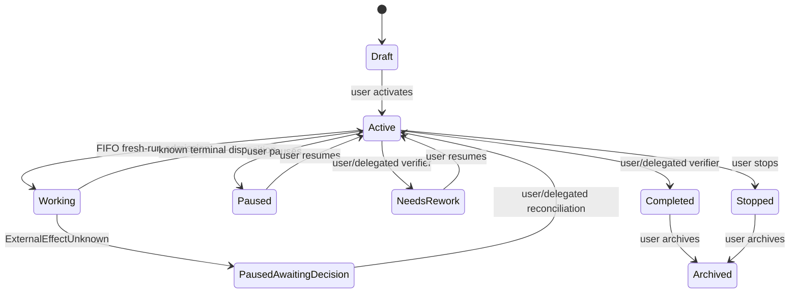

<!-- Delegated transitions require the explicit verifier authority and audit contract. -->

### Trigger capture, autonomous continuation, and recovery

A Mandate may receive durable reasons from explicit user activation or
continuation, the selected continuation disposition, interval/calendar schedule,
linked Goal or Mandate state, and restoration of provider, catalog, registry, or
daemon readiness. A reason is committed before it is considered for admission.
While a Mandate is `Working`, equal or additional reasons coalesce into one
pending reason with source/count/first/last/reference provenance. Downtime
produces at most one coalesced catch-up reason for the missed interval rather
than a burst of invented work.

Admission is deterministic FIFO by the durable first-observed trigger time,
then by stable Mandate identity where timestamps tie. FIFO orders eligible
pending reasons; it is not a promise that finite physical capacity is always
available. Registry, provider, storage, process, kernel, or scheduler capacity
may be unavailable and must produce a typed, observable, non-lossy unavailability
outcome. It is not a product-level action, calendar, concurrency, depth,
lifetime, output, page, or retry quota.

**Continue autonomously** creates or activates a Build-mode Mandate by default.
After a known terminal run disposition, the daemon records its terminal evidence
and, when continuation remains enabled, returns the Mandate to `Active`; a
pending coalesced continuation reason then admits a completely fresh run. There
is no hidden retry count, automatic escalation threshold, or conversion of a
known failure into an unknown effect. A known non-zero `execute` exit, typed
validation failure, provider failure with durable terminal evidence, or known
MCP result is a known outcome and may lead to the next fresh run. The user
decides when a known failure means pause, stop, completion, revision, or
needs-rework, except where an explicit delegated verifier has the corresponding
operation.

Recovery never resumes a run, provider request, tool invocation, bridge
operation, process, kernel cell, background task, child run, MCP process, or
external effect. A fresh run may use only durable verified checkpoints and
selected historical references. An admitted action known not to have started is
recorded as a known pre-effect terminal result. A started action whose terminal
effect cannot be durably proven records `ExternalEffectUnknown`; it is not made
unknown merely because a child program returned a non-zero exit status. Provider
or registry readiness after restoration may create a fresh eligible admission
from the held trigger, never an old-run continuation.

### Direct active-descriptor admission

For a new Mandate run, every active descriptor compatible with the immutable
selected model capability set and the selected mode is directly model-visible
and directly admissible through the one Rust-owned registry/gateway path. No
confirmation, policy selector, authorization corridor, action/calendar quota,
root-origin permission, parent permission, Goal permission, or Mandate
permission decides whether that descriptor starts. The Mandate is the durable
work authority, not a second per-tool approval layer.

A denial therefore means only a typed pre-effect incompatibility or unavailability:
invalid typed input, unavailable/inactive descriptor, missing model capability,
mode incompatibility (including ordinary project `write`/`edit` in Plan mode),
invalid descriptor implementation, unavailable registry/provider/runtime, or an
intrinsic representation/protocol failure. It never reports that a user or
policy declined a compatible active descriptor. Existing idempotency, hook
ordering, workspace default resolution, safe projection, observation, durable
commit, redaction, and no-resume rules remain required.

Plan mode remains meaningfully distinct: it denies ordinary project `write` and
`edit`; plan mutation remains its own typed plan operation. Build mode is the
default for **Continue autonomously**. Neither mode is a sandbox or a claim to
constrain programs running with the user's ordinary OS authority.

### No product-level ceilings for new Mandate work

The selected semi-autonomous model removes product-policy maxima from new
Mandate execution. A fixed number of calls, queued reasons, agents, child depth,
messages, lifetime, output bytes, page items, retries, catalog entries, or
calendar actions must not silently define what an otherwise valid Mandate may
accomplish. Detailed numeric constraints retained later in this document remain
historical first-scope semantics and compatibility data, not future Mandate
admission policy.

This does not remove intrinsic correctness requirements. Canonical encodings,
identifier width, ordering, idempotency, atomic durable commit, explicit
versioning, redaction, typed schema validation, and protocol framing remain
mandatory. If a real finite resource cannot accept work, the daemon emits a
typed observable capacity/unavailability result, preserves already committed
history, and never truncates, drops, or invents a successful result merely to
fit a product limit. The continuation scheduler keeps the durable reason for a
later fresh admission when that is applicable.

### Compatibility boundary for retained sections

The detailed sections below contain prior selected future-concept statements
about policy, confirmation, corridors, quotas, root origins, bounded RLM trees,
continual harness admission, activity trees, provider recovery, and fixed
limits. They remain in place uncompressed. For **new Mandate work**, any such
statement that conflicts with this overlay is historical-only and cannot
reintroduce a per-tool authorization path, a product ceiling, old-work resume,
or a restriction on compatible active direct descriptor invocation. Historical
M4 and v1--v4 records retain exactly their recorded meaning and never acquire a
synthetic Mandate selection, trigger, verifier authority, or mutation.

## Conceptual execution direction: IPython and a unified Rust-owned capability plane

The long-term IPython direction is an optional programmable orchestration
control plane, not a second daemon, persistence system, or independent tool
implementation. The Rust daemon remains the sole authority for session and run
identity, provider selection, tool policy, child-agent admission, durable
state, event publication, and recovery. A persistent Python namespace may hold
variables, helper functions, skill wrappers, and child-agent handles, but it is
recoverable convenience state rather than authoritative application progress.

Future IPython code should call a thin Python facade over a typed daemon host
bridge. A later provider-native direct model tool may expose an equivalent
capability, but both paths must adapt to the same Rust-owned invocation service
and registered base tool. They must not independently perform equivalent file,
process, network, or other agent actions.

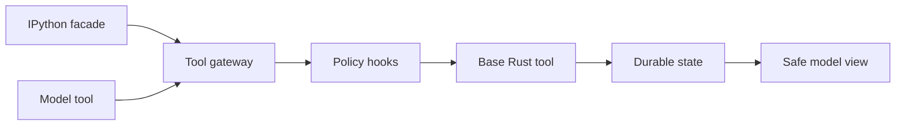

<!-- IPython and direct provider tool calls share one Rust-owned capability path. -->

The shared future invocation path must:

1. bind the request to daemon-held active session/run context rather than trust
   caller-supplied identity;
2. validate a typed tool request and apply WorkspaceRoot, mode, risk,
   confirmation, and hook policy;
3. execute the registered Rust base tool;
4. durably commit the tool outcome and policy evidence before publication; and
5. return a safe, size-bounded model-visible projection, preserving VFR,
   Headroom, retrieval, redaction, and observability policy.

A future direct-tool descriptor is a deliberate model-facing projection of a
Rust tool contract, not automatic exposure of every internal tool. Provider
function schemas, Python facade calls, daemon protocol commands, durable tool
events, and model-visible result projections must derive from compatible typed
Rust DTO contracts rather than manually maintained divergent schemas.

### Selected required Intention Relay tool core

This is a selected concept constraint for future replanning. It does not
authorize a crate, implementation, protocol, storage migration, or delivery
scope. The following canonical `ToolId` values are the required Intention Relay
tool core:

```text
read
write
edit
execute
glob
grep
fetch_url
ask_user
todo
retrieve
plan_submit
sub_agent
expand
mcp
```

Each identifier is a required member of the target Rust-owned registry. Future
replanning must retain all of them and must not replace one with an unregistered
equivalent capability. These are registry identifiers, not a promise of fixed
user-facing labels, one common implementation unit, or universal availability.

### Selected base-tool contracts and unified registry

> **Historical-only where conflicting for new Mandate work.** The detailed
> registry, descriptor, output, stream, transaction, and compatibility contract
> remains preserved below. Its policy, confirmation, corridor, root-origin, and
> fixed product-limit statements cannot authorize or restrict a compatible
> active descriptor in a new Mandate run; the Mandate overlay above controls
> that future behavior.


This is a selected concept constraint for future replanning. It fixes the
registry contract for the required core, but does not authorize a crate,
implementation, protocol, storage migration, or delivery scope. A future
authoritative crate map must reconcile these constraints with the existing
`intention-tools` registry ownership without introducing a dependency cycle.

`intention-tools` owns the registry form, common typed DTO boundary, canonical
slot list, revision validation, and duplicate-registration rejection. The
following owner boundaries own the primitive semantics and active descriptors:

| Owner boundary | Required `ToolId` values |
| --- | --- |
| `intention-tools` | `read`, `write`, `edit`, `execute`, `glob`, `grep`, `fetch_url`, `ask_user`, `todo` |
| `intention-headroom` | `retrieve` |
| `intention-plans` | `plan_submit` |
| `intention-vfr` | `expand` |
| future child-agent boundary | `sub_agent` |
| future MCP boundary | `mcp` |

The composition root alone combines the owner descriptors into the one
registry. An owner package never constructs a second registry, gives a model a
private function schema, or lets Python, a protocol client, a kernel, or a
child agent invoke the primitive implementation directly. A `ToolId` has one
immutable intended-owner slot and at most one active canonical registration.
Duplicate active registration, reassignment of an existing identifier, or a
call path that bypasses the registry fails before any external action.

Every first registry revision contains all fourteen slots, so delivery may be
split without omitting or substituting a core identity:

```text
ToolRegistryEntryDto
  Reserved { tool_id, intended_owner }
  Active { tool_id, intended_owner, descriptor_revision }
```

A `Reserved` slot has no input/result schema, model function schema, or
executor. It is absent from every model-visible function set and cannot become
`Admitted`. A stale, malformed, or otherwise direct request for such a slot
receives only the known pre-effect terminal `ExecutionUnavailable` result. An
owner activates its own slot only through the composition root by supplying a
compatible typed descriptor; that transition creates a new descriptor revision
and registry revision. Thus reservation neither invents DTOs for an undelivered
owner nor requires all core tools to ship in one package or vertical slice.

Every `Active` descriptor has this conceptual form:

```text
ToolDescriptorDto
  tool_id
  display_name
  intended_owner
  descriptor_revision
  input_schema_reference
  result_schema_reference
  required_model_capabilities
  tool_effect_profile
  workspace_binding
  mode_relation
  model_schema_availability
  model_function_schema_revision
  safe_result_projection_revision
  observation_contract_revision
  stream_shape
```

`ToolInvocationDto` and `ToolResultDto` carry only compatible typed values at
this boundary. An active descriptor cannot accept a raw JSON value, a loosely
typed map, an unvalidated `PathBuf`, a stringly typed identity, a provider SDK
object, a Python object, a file/process resource, or an implementation error.
Its schema references identify closed typed request/result DTO families rather
than serializable Rust implementation types. The primitive owner validates its
input, while the shared path applies the selected workspace-resolution,
observation, mode, policy, hook, persistence, publication, and safe-projection
rules.

`display_name` is safe presentation metadata. It is validated plain text for
adapters and diagnostics, but never changes descriptor or registry identity,
execution meaning, model function naming, or model-visible input. The closed
`required_model_capabilities` record states only which selected model-capability
values are necessary before an active descriptor may contribute a function
schema; it is distinct from the tool's direct-effect profile.

`ToolEffectProfileDto` is a closed record of independent direct effects. It is
descriptive, not a harmfulness classifier, sandbox, complete process-effects
inventory, or mandatory-confirmation rule:

```text
ToolEffectProfileDto
  workspace_read
  workspace_write
  process_start
  network_retrieval
  user_interaction
  session_state_mutation
  retained_content_read
  child_agent_start
  child_agent_control
```

Its initial required mapping is:

| `ToolId` | Direct effect flags |
| --- | --- |
| `read`, `glob`, `grep`, `expand` | `workspace_read` |
| `write` | `workspace_write` |
| `edit` | `workspace_read`, `workspace_write` |
| `execute` | `process_start` |
| `fetch_url` | `network_retrieval` |
| `ask_user` | `user_interaction` |
| `todo`, `plan_submit` | `session_state_mutation` |
| `retrieve` | `retained_content_read` |
| `sub_agent` | `child_agent_start`, `child_agent_control` |
| `mcp` | `process_start`, `network_retrieval` |

The profile states only the primitive's direct declared capability. In
particular, `process_start` does not claim that a shell program cannot read,
write, start descendants, or access a network; `network_retrieval` does not
claim that a remote endpoint treats a retrieval request as side-effect-free.
The selected programmatic-caller policy maps these flags to admission,
confirmation, quotas, audit, and presentation without changing an accepted
descriptor's meaning. No flag itself requires confirmation.

`WorkspaceRoot` is required for `read`, `write`, `edit`, `execute`, `glob`,
`grep`, and `expand`. For every descriptor whose typed input contains a local
path, it is the default base for relative-path resolution and the initial CWD
for `execute`, not an access boundary. Absolute paths and relative paths that
contain `..` are accepted; their location never creates a path-based denial.
`fetch_url`, `ask_user`,
`todo`, `retrieve`, `plan_submit`, `sub_agent`, and `mcp` do not receive a
fictional workspace path. Their owner may instead require a typed URL, question,
todo, retained-content, plan, child-agent, or MCP-method reference. A plan remains
outside the workspace until the plan policy authorizes it. Existing Plan/Build
rules remain unchanged: ordinary project `write`/`edit` is denied in Plan mode,
whereas plan mutation remains plan-policy work. The workspace contract observes
explicit path inputs for safe audit metadata but does not sanction a path that
resolves outside the default root.

An active descriptor declares only whether it can supply a code-owned function
schema to a compatible model subset. The exact model-visible function set for a
run is selected by the applicable root origin, model capability, mode, risk,
confirmation, hook, and admission policies. Registry membership and activation
never automatically expose a tool to every model, Python program, child agent,
protocol client, or mode. The selected programmatic-caller policy below owns
root origin, confirmation, quota, and inheritance; child-agent selection can
only further narrow it.

#### Descriptor and registry revisions

`ToolDescriptorRevisionId` and `ToolRegistryRevisionId` are credential-free
canonical semantic records in the selected `typed-tlv-v1`/SHA-256 family. They
have distinct record tags, fixed increasing field tables, lowercase tagged
digest identifiers, retained decoders, and golden fixtures for every claimed
executable revision. Display labels, implementation handles, live readiness,
and opaque owner resources are outside both revisions.

The descriptor record contains its `ToolId`, intended owner, typed input/result
schema references, required model capabilities, effect profile, workspace
binding for default resolution/CWD, mode relation, model-function schema
revision, safe-result-projection revision, observation contract revision, and
stream shape. The registry record is the fixed
`ToolId`-ordered list of all fourteen slots, each with its intended owner,
`Reserved`/`Active` state, and active descriptor revision when present. A
semantic change to either record requires a new canonical record version rather
than reinterpretation of stored bytes. Unknown, corrupt, or incompatible values
leave history readable wherever retained facts are readable, but block the
dependent call before provider, tool, process, network, kernel, or other
external work.

`ModelToolLoopV1` inside `RunExecutionMeaningDto.tool_execution_selection`
therefore stores the selected `ToolRegistryRevisionId`, code-owned
admission-engine revision, hook-pipeline revision, and an ordered frozen
model-tool selection. `admission-engine revision` identifies the implementation
of common typed admission flow only. It is distinct from, and must be used
together with, the separately selected
`ProgrammaticCallerPolicySelectionV1`; it cannot provide an independent risk,
confirmation, quota, or policy meaning.
Each selected entry carries its `ToolId`, descriptor revision, model-function
schema revision, and safe-result-projection revision. It contains only active
descriptors actually supplied to that model request, not every registry slot.
No replay, retry, fork, queued promotion, or historical execution reconstructs
that set from a current registry or current owner implementation.

#### Selected initial contracts

`execute` takes one `ShellCommandTextDto` value. A private, descriptor-selected
local shell adapter interprets that text; its executable path, platform resource,
and parser implementation never cross a public DTO boundary. Shell syntax,
including pipelines, redirects, and compound commands, is intentionally part of
the descriptor's versioned semantics. `stdout`, `stderr`, and exit status remain
separate typed result fields before the existing bounded durable stream and safe
projection, never values reconstructed from a formatted text footer. The command
runs with the user's ordinary OS authority and `WorkspaceRoot` CWD, without a
sandbox or a claim to enumerate all direct or indirect effects.

`fetch_url` is network retrieval only. Its closed first request form permits
only `GET` and `HEAD` over `HTTP` or `HTTPS`; it has no request body, request
header map, cookie jar, credential source, URL userinfo, or non-HTTP(S) scheme.
It permits every HTTP(S) address, including public, private, and literal
loopback addresses. This is deliberately not a local-network boundary and does
not relax the separate provider-endpoint policy. Redirects remain retrievals
under the same restrictions and have a descriptor-fixed bounded limit. The
typed result distinguishes final URL, status, safe content metadata, and bounded
body content; arbitrary response headers are not model-visible by default.

`ask_user` is a normal long-running tool with `user_interaction`, not an
`AwaitingConfirmation` policy outcome. Once it reaches `ToolCallStarted`, the
post-M4 model-tool-loop run stays `Running`; other independently admitted calls
may complete concurrently, while the next model step waits for this question's
terminal safe result with every other group result. It does not transition that
post-M4 run to `WaitingInput`. This selects only future model-tool-loop behavior
and does not rewrite M3/M4 `WaitingInput` snapshots, facts, or recovery.

The selected identifiers are a required core, not a final upper bound. A new
canonical `ToolId` requires a separately selected concept constraint and then
an approved architecture and replanning change.

The target execution model is trusted local execution under the user's ordinary
operating-system identity. The daemon, agent, IPython kernel, child agents, and
Rust tools run with the same OS permissions as the user who starts the daemon.
This concept does not plan an agent sandbox, container or VM isolation,
privilege separation, restricted Python sidecar, or other mechanism intended to
reduce the agent's operating-system authority. The daemon must not claim to
expand those permissions either; access to files, processes, networks, and
other resources is bounded by the user's existing OS permissions and by the
normal behavior of the selected tools and programs.

`WorkspaceRoot`, Plan/Build mode, confirmation, hooks, audit, redaction, and
the Rust-owned capability plane remain important logical product and safety
policies. They are not security boundaries against a malicious, compromised,
or unrestricted program running as the user. An IPython kernel can bypass the
facade through `pathlib`, `os`, or `subprocess`, and that is an accepted
property of this trusted local model rather than a gap to be closed by a later
sandbox design. Future work must not describe a facade, tool gateway, prompt
policy, or audit trail as OS-level isolation.

A full `model -> tool -> model` loop, including typed tool-result messages, is
a prerequisite for either IPython-driven or direct-tool agent execution. M4's
closed `tool_execution_unavailable` behavior remains unchanged. Cancellation,
kernel failure, and daemon restart must not silently resume external work;
existing no-resume recovery semantics continue to apply.

### Selected foundational model-tool loop

This section selects the first-scope future `model_tool_loop_v1` contract. It
does not amend the closed M4 executor, its one-stream terminal behavior, the
M4 storage schema, or M4 wire DTOs. In particular, an M4
`ModelEventDto::ToolCall` remains durable `ToolCallRecorded` evidence followed
by `tool_execution_unavailable`; it never starts a local action merely because
a later binary understands this concept.

The future loop belongs to one already active daemon-owned run. It does not
create a child run, a second session authority, or a provider-owned
continuation. `SessionId`, `RunId`, the originating user `TurnId`, and a new
daemon-assigned `ModelStepId` identify every model step. A caller, adapter,
Python facade, or provider cannot select those identities. One run may contain
any number of sequential model steps; this first scope adds no numeric step
limit. Existing attempt timeouts, per-fact bounds, group bounds, cancellation,
terminal states, and all other selected execution policies still apply.

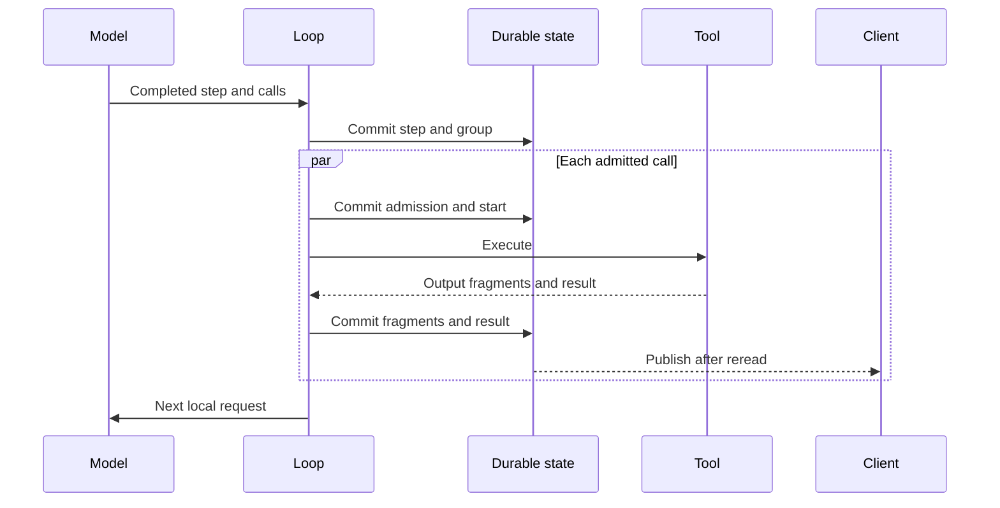

<!-- The next model request waits for every terminal result in the tool group. -->

#### Model-step boundary and local history

`ModelStepStarted` and `ModelStepCompleted` are future typed durable facts.
`ModelStepCompleted { finish_reason: ToolCalls }` closes a model **step**, not
the run: it is valid only after one non-empty, ordered group of normalized
`ToolCallDto` values and before any local action starts. A step that has calls
but lacks that closing reason, a `ToolCalls` reason without calls, a duplicate
or malformed group, more than 16 calls, or later provider facts for the closed
step fails closed as `provider_tool_group_invalid`. No local action starts in
any of those cases. A step with a non-tool terminal reason retains the ordinary
completed or failed run path.

`ToolCallId` is the canonical daemon-assigned identity of one requested local
action. It is unique within its group and never reused by a later step. A
provider-native call identifier remains private driver state. A descriptor may
declare a code-owned translation from the canonical `ToolCallId` into the
provider's required assistant-call/result correlation shape for the next
request, but no native identifier, raw response item, provider conversation,
or opaque continuation state persists, publishes, replays, or enters a public
DTO. A descriptor that cannot construct that representation from local typed
history cannot declare `model_tool_loop_v1`; preflight then fails before any
outbound provider work.

The future request boundary keeps `ModelMessageDto` text-only. It adds a
separate typed `ModelToolExchangeDto` associated with one completed
`ModelStepId`: the assistant's ordered calls, their canonical identities, the
completed result records, and only their safe model-visible projections.
`ModelRequestDto` therefore receives ordered text messages together with an
ordered typed tool-exchange history. A descriptor owns the private translation
to its provider's assistant-call and tool-result messages, preserving the
original call order even when local actions finished in another order. Tool
policy evidence, diagnostics, implementation resources, raw output, and
provider-native values are not model context.

Every continuation is a fresh provider request reconstructed from local durable
history. The loop does not use remote conversation state, `previous_response_id`,
provider `store` state, remote continuation controls, encrypted payloads, or a
provider response substituted for local replay. A provider retry remains
eligible only under its selected per-step policy before the first durable fact
of that step. It never repeats a tool action, and no provider retry is
eligible after a durable tool-group, admission, start, output, or result fact.

#### Tool groups and independent admission

`ToolGroupRecorded` binds the ordered calls of one `ModelStepId` before any
external work. Its maximum is 16 calls. The same durable transaction records
the completed model step, the group identity, every `ToolCallRecorded` fact,
their stable positions, the run cursor, projections, events, and snapshots, or
records none of them. The daemon performs no tool, process, filesystem, or
network action inside that transaction.

> **Mandate admission supersession.** For a new Mandate run, the retained
> admission DTO and policy-dependent prose below are historical-only. Every
> active descriptor compatible with the selected model capability and mode is
> directly admitted after typed input, descriptor, workspace-default-resolution,
> hook, idempotency, and actual runtime-availability validation.
> `AwaitingConfirmation`, per-tool risk/policy decisions, root origin,
> confirmation, corridor, quota, reservation, and inheritance do not occur.
> `Denied` means only typed incompatibility or actual unavailability. `ask_user`
> remains an ordinary registered tool, never a confirmation transport.

Every call in the recorded group has an independent typed admission outcome:

<!-- `AwaitingConfirmation` remains only for historical non-Mandate records. -->
```text
ToolCallAdmissionOutcomeDto
  Admitted
  AwaitingConfirmation
  Denied
```

Before `Admitted` can become `ToolCallStarted`, the daemon-held active-run
context validates the call identity, its typed decoded input, the selected
active descriptor/version, the WorkspaceRoot default-resolution and observation
contract, mode, risk, confirmation, and hook policy. A `Reserved` registry slot is always unavailable
before admission and starts no external action. The registry and descriptor
contracts above fix canonical ownership, typed shape, revision, and direct-effect
meaning; the selected programmatic-caller policy supplies the closed root,
confirmation, quota, inheritance, and policy-evidence rules. Each applicable
policy still decides independently for each call.
`Denied`, a known validation error, and a known failure before any external
effect become one terminal typed result and are included in the next model
step. They never invoke a base tool.

All admitted calls may start concurrently. A call awaiting user confirmation
does not delay other independently admitted calls. The run remains `Running`;
there is no `WaitingTool` run status. The durable call facts and compact run
The durable call facts and compact run
projection distinguish a current model step, an awaiting confirmation, an
admitted call, and an externally started call. A group is not a workspace
transaction and claims no serializability or merge of tool effects. A path
observation never changes admission or creates a path-based denial.
The loop begins the next model step only when every group call has one terminal
result. Its `ModelToolExchangeDto` preserves the model's original call order,
not the schedule-dependent order in which concurrent calls completed.

#### Result fragments, terminal outcomes, and bounds

Each call owns one ordered stream of `ToolOutputDeltaRecorded` facts followed
by exactly one `ToolCallResultRecorded` terminal fact. An output delta contains
the `ToolCallId`, a positive per-call fragment position, and normalized safe
content. Its position among all model, reasoning, usage, policy, and tool facts
is the shared `RunEventCursorDto`; each call's fragment position only orders
fragments within that one call. Duplicate, missing, non-contiguous,
post-terminal, wrong-group, or untyped fragments fail closed as
`tool_result_stream_invalid`.

Every accepted fragment is committed immediately as its own durable fact. The
daemon performs an independent durable reread and then publishes it to normal
run subscribers. A fragment is never inserted into the next model request by
itself: only the terminal safe result projection of every call becomes model
context after the whole group completes. Thus a client may observe ongoing
output without the model receiving a partial result.

The existing 512 KiB individual canonical-fact bound applies to every fragment.
All output fragments and successful result content in one group share a 4 MiB
combined canonical-content limit. The limit is consumed in actual durable
commit order, with no equal reservation by call and no dependence on later
scheduler reconstruction. Content is never truncated or partly committed. If a
next fragment cannot fit, that fragment is not written and only its call
receives terminal `tool_output_limit_exceeded`; the remaining calls continue.
A small closed terminal outcome remains representable after the content budget
is exhausted.

The closed initial terminal outcome taxonomy distinguishes at least
`Succeeded`, `DeniedBeforeExecution`, `FailedBeforeExternalEffect`,
`CancelledBeforeStart`, `InterruptedBeforeStart`, `OutputLimitExceeded`,
`ExecutionUnavailable`, and `ExternalEffectUnknown`. It carries only a safe
model-visible projection and approved typed metadata; no value silently changes
category during replay.
`Succeeded`, known denials, known pre-effect failures, and the output-limit
outcome may enter the next typed exchange. An `ExternalEffectUnknown` result
never permits another model step.

This package does not introduce semantic content inspection, secret
substitution, or a parallel redaction algorithm. The existing central safe
projection, credential, provider-payload, SDK-resource, and diagnostic
exclusion requirements apply before persistence, publication, or model-context
projection.

#### Cancellation, failure, and recovery

The daemon never automatically retries a tool action, including after a
temporary error before its first output fragment. A user or later model step may
choose a separately authorized new action after receiving a known terminal
result; durable replay itself never re-executes a call.

Cancellation before `ToolCallStarted` writes `CancelledBeforeStart` and
prevents the external action. Cancellation after an action has started follows
the existing `Running -> Cancelling -> Cancelled` run lifecycle immediately:
the daemon stops admitting remaining calls, cancels work where a tool supports
it, does not wait for that work, and accepts no late fragment or result. It
durably records `ExternalEffectUnknown` for every already-started action whose
final effect cannot be proven. Cancellation is never evidence that an external
effect was absent or rolled back, and it never starts a new model step.

An executor loss, an ambiguous completion, or a daemon restart after external
work started has the same no-resume rule. Recovery records the durable unknown
effect evidence that is available for every started action and records
`InterruptedBeforeStart` for every admitted action that has not reached
`ToolCallStarted`. It transitions the unfinished run to `Interrupted`; it never
reattaches, retries, resumes, or reruns the tool. A non-cancellation ambiguous
effect fails the run safely after preserving the same evidence and prevents a
continuation. Known errors before an effect remain ordinary terminal results
that the next model step can inspect.

#### Replay, initial history, and compatibility

Run snapshots contain only a compact safe summary of the active step/group/call
states. They do not accumulate tool-output text, full terminal content, raw
tool results, model-visible projection text, provider-native correlation data,
or implementation resources. Tool facts retain the shared run cursor and are
available for bounded tail replay.

`model_tool_loop_v1` is a separately negotiated protocol and descriptor/model
capability. After the correlated `RunReplayDto`, a subscribing negotiated
client receives uncorrelated `RunToolHistoryPageDto` frames containing one
fixed session/run identity, a captured upper cursor, and non-empty ascending
tool facts, bounded by the existing 256 facts and 512 KiB per page. A final
`RunToolHistoryCompletedDto` repeats the identity and upper cursor. The
publication gate serializes `RunReplayDto`, tool-history pages, completion, and
only then live frames. Sparse shared cursors are valid. Missing or incomplete
history requires typed resynchronization; it does not cause a live-tool retry.

An unnegotiated client subscribing to a run containing post-M4 model-tool-loop
facts fails closed with `model_tool_loop_required`, never a partially understood
snapshot or live stream. Historical M4 runs retain their old replay behavior
and `tool_execution_unavailable` semantics byte-for-byte. The new run-selection
provenance records the negotiated `model_tool_loop_v1` capability and the
descriptor/model support needed to reconstruct its local exchanges. Its
credential-free immutable run-execution meaning, capability set, selected
registry revision, and historical-version behavior follow the selected
cross-direction constraints above.

### Selected typed daemon host bridge and gateway protocol

This is a selected concept constraint for future replanning. It selects the
only first-scope host-bridge protocol through which a Python facade and a
future direct model-tool ingress reach the shared Rust-owned gateway. It does
not authorize a crate, implementation, storage migration, public protocol
change, Python dependency, kernel, or delivery scope.

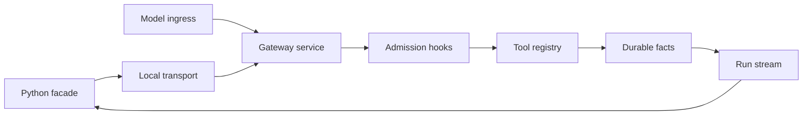

<!-- Python uses the existing local transport; the direct model ingress is an
in-daemon typed ingress to the same gateway service. -->

`intention-protocol` owns versioned public bridge DTO families and negotiated
capabilities. `intention-transport` retains the private local endpoint,
length-prefixed UTF-8 JSON framing, and connection roles. `intention-daemon`
owns attachment handling, operation correlation, durable reread publication,
and cancellation propagation. The composition root remains the sole assembler
of the active registry and concrete primitive implementations. A direct model
ingress is an in-daemon typed ingress to that same gateway service: it does not
open a local connection, create a private registry, or invoke a primitive
directly.

The bridge reuses the existing private per-user Unix-socket or Windows-named-
pipe endpoint, `ProtocolHelloDto` negotiation, 1 MiB frame bound, and operating-
system-user access boundary. It creates no second listener, TCP or HTTP
endpoint, remote attachment, credential, sandbox, or second daemon. A
capability-selected bridge peer is persistent only within one daemon-issued
authority context; it is a transport channel, not an authoritative runtime or
a replacement for durable storage.

#### Attachment and daemon-issued authority

The first bridge capability is `daemon_tool_gateway_v1`. It requires the
existing local hello/version negotiation and the negotiated
`model_tool_loop_v1` capability whenever the peer receives post-M4 tool-loop
facts. A peer that lacks either required capability fails closed before it can
receive a partially understood bridge result, tool-history page, or live tool
fragment.

The daemon alone issues an opaque `BridgeRunGrantDto` for one already-active
model-tool-loop authority context. The conceptual attachment response is:

```text
BridgeRunGrantDto
  opaque_grant_identity
  issued_protocol_revision

BridgeAttachmentResponseDto
  bridge_run_grant
  negotiated_capabilities
  initial_run_cursor
```

The grant binds its holder to one daemon-held `SessionId`, `RunId`, originating
`TurnId`, and `ModelStepId`; these identities remain daemon-assigned and do not
become caller-selected bridge input. It is non-secret capability state for one
live daemon process, not a credential, security boundary, revision identity,
or durable fact. It never enters `RunExecutionMeaningDto`, a snapshot, a
model message, a tool fact, a log, a diagnostic, or safe public history. It
expires when its run becomes terminal, the run is interrupted, its daemon
process exits, or its channel is detached. A persistent Python namespace may
outlive an expired grant, but it must obtain a newly issued grant before it can
invoke a tool for a later run. The grant therefore prevents a stale asynchronous
facade from acting in a later run without deciding kernel lifetime, namespace
scope, or which actors may attach.

#### Invocation identity and durable admission

`BridgeOperationId` is the stable typed idempotency identity of one ingress
request. It is distinct from the diagnostic `CorrelationIdDto` and from the
daemon-assigned `ToolCallId`:

```text
BridgeInvocationCommandDto
  bridge_run_grant
  bridge_operation_id
  typed_tool_invocation

BridgeInvocationAcceptedDto
  bridge_operation_id
  tool_call_id
  admission_state
```

The facade creates and retains `BridgeOperationId`; an in-daemon direct-model
ingress receives an equivalent stable ID from the gateway before admission.
The daemon validates the opaque grant, resolves the selected active descriptor,
and assigns the canonical `ToolCallId`. It durably binds the operation to its
authority context, `ToolId`, descriptor revision, and a non-public canonical
typed-input digest before any external action. The operation record contains no
grant value, credential, raw input, Python/Jupyter value, provider value,
workspace root, implementation handle, or source path.

Repeating an equal command with the same `BridgeOperationId` returns its saved
binding, current admission state, stream attachment, or terminal safe result.
It never admits, starts, or executes a second action. Reusing that ID with a
different authority context, `ToolId`, descriptor revision, or typed input
fails before an external action with the closed `bridge_operation_conflict`.
The operation record is durable idempotency evidence like other accepted
operation records; `ToolCallId` remains the one canonical identity for
`ToolCallRecorded`, `ToolCallStarted`, `ToolOutputDeltaRecorded`, and
`ToolCallResultRecorded` facts.

Before `ToolCallStarted`, a bound operation may report `Admitted` or
`AwaitingConfirmation`; the bridge does not decide the policy that produced
that state. On daemon recovery an admitted operation that never reached start
records `InterruptedBeforeStart`. Once a call has reached `ToolCallStarted`, a
repeat of its bridge operation is read-only: it returns only already durable
evidence and never re-executes the primitive.

> **Mandate bridge supersession.** For a new Mandate run, a bridge operation
> reports direct `Admitted` or a typed pre-effect incompatibility/unavailability.
> The retained `AwaitingConfirmation` state and its producing policy are
> historical-only. A bridge request cannot introduce confirmation, corridor,
> quota, reservation, root-origin, or other per-tool authorization gating.
> Grant binding, operation idempotency, durable replay, expiry, and no-resume
> behavior remain unchanged.

#### Persistent streaming, limits, and result delivery

> **Historical bounded-layout semantics.** The fixed operation, frame, output,
> and page values retained below do not constrain new Mandate work. Protocol
> framing and durable representation validity remain mandatory; actual finite
> capacity is reported as typed observable unavailability without silent loss.

One attached peer sends correlated attachment, invocation, operation-read, and
existing run-control commands, while the daemon sends correlated responses and
uncorrelated `RunStreamFrameDto` values over the same persistent local
connection. At most sixteen independently admitted bridge operations may be
unfinished on one attached peer. A seventeenth request receives the known
pre-effect `bridge_concurrency_limit_exceeded` result and starts no external
action. This is a transport limit only: it neither grants a caller permission
to invoke a tool nor changes the existing group limit, policy quotas, or lack
of tool-effect serialization.

The bridge creates no second stream sequence or result transport. Every safe
tool-output fragment remains one `ToolOutputDeltaRecorded` fact on the shared
`RunEventCursorDto`, with its positive per-call position and one terminal
`ToolCallResultRecorded` fact. The daemon publishes only after the fragment's
durable transaction and an independent reread. `ToolCallId` demultiplexes
simultaneous operation streams. A terminal result is delivered through the
same live batch and, when it changes run state, the existing authoritative run
snapshot; no separate terminal-result frame is introduced.

The bridge retains every selected bound: 1 MiB per local frame; a 64-frame,
10-second bounded slow-peer subscription path; 512 KiB per canonical fact; 4
MiB of commit-order tool output and successful result content in one group;
and 256 facts or 512 KiB per initial-history page. It adds no broader buffer,
alternate deadline, truncation rule, or unbounded queue. A slow or detached
peer receives the existing typed resynchronization behavior and does not delay
durable execution or healthy peers.

An attached peer recovers a detached stream only from durable history. It
reconnects through the same local endpoint, repeats negotiation, and requests
the run from its last accepted cursor. The publication gate supplies the
captured replay, applicable reasoning pages and completion, tool-history pages
and completion, then only later live frames in the selected order. The bridge
never treats channel state as authoritative, persists a last-published cursor,
or repeats external work to reconstruct a lost response.

#### Cancellation, restart, and safe failures

The bridge uses the existing `StopRunCommandDto` and
`Running -> Cancelling -> Cancelled` lifecycle. This first contract adds no
per-`ToolCallId` cancellation command. Closing a bridge channel, a slow-peer
resynchronization, or an expired grant does not itself cancel the run. After
run cancellation, the daemon stops admitting remaining calls, suppresses late
fragments and results for started calls, and records `ExternalEffectUnknown`
where the final effect cannot be proven.

After a daemon restart, no previous grant becomes valid and no bridge operation
is reissued, re-admitted, retried, resumed, or rerun. A read-only operation
lookup can return only durable safe evidence: an already-known terminal result,
`InterruptedBeforeStart`, or `ExternalEffectUnknown`. It cannot issue a new
grant, start an action, or substitute current registry, configuration, kernel,
or process state for stored history.

The bridge adds these closed safe failures through `ErrorDto`:

```text
daemon_tool_gateway_required
bridge_authority_unavailable
bridge_authority_expired
bridge_operation_conflict
bridge_operation_not_found
bridge_concurrency_limit_exceeded
```

They reveal no grant value, path, credential, raw typed input, Python or
Jupyter value, provider value, implementation resource, or operating-system
topology.

#### Boundaries retained for later packages

This bridge contract owns attachment, ingress correlation, persistent delivery,
and replay of durable bridge-visible facts. It deliberately does not own the
following semantics:

- **IPython kernel lifecycle** owns kernel process creation/disposal, scope,
  persistent namespace, resource limits, background work, and namespace
  recovery. The kernel-side host-request mechanism is a consumer of this
  daemon-owned bridge, not a second daemon bridge or an authoritative store.
- **RLM child-agent model** owns child identity, parent links, admission,
  quotas, recursion, context, result schema, provider selection, policy
  inheritance, and child recovery; the selected first-scope model is recorded
  below. The bridge may carry `sub_agent` only as its reserved or later
  owner-activated registry slot; it assigns no child semantics.
- **Continual harness** owns trigger, checkpoint, schedule, quota, retention,
  and harness-state recovery; its selected first-scope model is recorded
  below. Bridge replay restores no harness state.
- **Programmatic-caller policy** owns root origin, confirmation, policy and
  quota inheritance, typed policy evidence, and every authorization decision
  made inside one active daemon-held run. Its selected first scope is recorded
  below. The bridge defines only where that policy is enforced; it never creates
  a durable authority, second actor identity, or authority context outside an
  active run.
- Per-call cancellation and owner-specific tool semantics remain separate
  decisions. Explicit-path resolution and best-effort outside-root observation
  are selected here; OS-level tracing of shell, Python, or descendant-process
  filesystem activity is not part of this contract.

The trusted local model remains explicit: this bridge is not a sandbox,
privilege boundary, or protection against a compromised Python process running
as the user. It applies the selected logical tool policies whenever the caller
uses it, but it does not claim to prevent that process from using ordinary
operating-system APIs outside the facade.

### Selected IPython kernel lifecycle

> **Historical-only where conflicting for new Mandate work.** Preserve every
> kernel lifecycle, checkpoint, cancellation, and recovery detail below. New
> Mandate runs may create a replacement kernel from verified checkpoint state
> only; background work never owns Mandate triggers or authority, and no old
> cell, task, grant, or kernel is resumed. Retained fixed kernel limits are not
> product ceilings for new Mandate work.


This is a selected concept constraint for future replanning. It closes the
first-scope lifecycle of an optional IPython kernel without authorizing a
crate, implementation, Python dependency, storage migration, public protocol
change, or delivery scope. The kernel is a programmable session convenience;
the Rust daemon remains the only authority for application identity, runs,
tool admission, durable facts, publication, and recovery.

#### Ownership and scope

The kernel is **session-scoped**. One daemon-owned session actor owns at most
one IPython kernel at a time, and a kernel is never shared by two sessions,
projects, users, or daemon instances. The kernel inherits the session's
`WorkspaceRoot` as context metadata, but it does not own that root or choose a
different one. A child agent, future harness unit, or another programmatic
actor gets its own separately selected authority context; none may borrow a
session kernel by reusing its namespace.

The kernel is created lazily on the first admitted IPython execution for a
session. Creating a session, queueing a turn, attaching an ordinary client, or
starting the daemon does not create a Python process. The daemon disposes the
kernel when the session is archived, when its idle lifetime expires, when the
daemon shuts down, or when cancellation or failure requires a clean restart.
An idle kernel is retained for at most 60 minutes. The daemon retains at most
16 live session kernels; a request that would exceed this bound fails before
Python execution with `kernel_concurrency_limit_exceeded`.

The idle lifetime measures the absence of a foreground cell and of tracked
kernel-local background tasks. Reaching it terminates the kernel and discards
its in-memory namespace after recording only the safe checkpoint metadata that
already exists. It does not cancel or alter a durable run that is unrelated to
that kernel. A later explicit run may create a new kernel for the same session.

#### Process and boundary model

The kernel is a daemon-managed Python sidecar process, not an embedded Python
interpreter, a provider resource, a model driver, or a second daemon. Its
process, interpreter, Jupyter transport, task handles, and operating-system
resources remain private to the kernel owner. No raw Jupyter frame, ZeroMQ
socket, Python object, file handle, process handle, arbitrary path, provider
resource, or implementation error crosses a public crate or process boundary.

The kernel consumes the selected `daemon_tool_gateway_v1` bridge. It does not
add a listener, TCP/HTTP endpoint, private registry, second stream sequence,
or direct primitive call path. Kernel host requests use the same typed gateway,
registry, admission hooks, `WorkspaceRoot`, mode, confirmation, redaction,
durable commit, publication, and safe projection as a direct model ingress.
The first scope does not add an `ipython` `ToolId`: IPython is an orchestration
plane over registered tools, not a substitute for the fourteen required tool
slots. A new `ToolId` would require a separate concept and replanning change.

Every public kernel operation is represented by a versioned typed DTO family,
conceptually:

```text
KernelExecutionRequestDto
KernelExecutionResultDto
KernelOutputChunkDto
KernelStatusDto
KernelStateSnapshotDto
KernelHostRequestDto
KernelHostResponseDto
```

These DTOs carry safe typed values and daemon-assigned session/run context;
they never carry a Python object, raw Jupyter payload, implementation
resource, credential, or caller-selected application identity. The kernel
process may use ordinary user OS permissions, as required by the trusted
local execution model. The facade, bridge, and audit trail are not an OS-level
sandbox or privilege boundary, and direct `pathlib`, `os`, and `subprocess`
use remains an explicitly accepted bypass property.

#### Run attachment and namespace lifetime

The session kernel may remain alive between sequential runs, including while
the session has a queued turn or no active run. Its namespace is recoverable
convenience state only. It is not a session snapshot, run snapshot, model
message, durable model fact, tool result, event-log replacement, or proof that
an external effect occurred.

Each foreground execution attaches the kernel to exactly one daemon-held
active `SessionId`, `RunId`, `TurnId`, and `ModelStepId` through a newly issued
`BridgeRunGrantDto`. The kernel cannot select or manufacture those identities.
The grant expires at run termination, interruption, channel detachment, kernel
failure, or daemon exit. Between runs the namespace may remain in memory, but
it has no tool authority. A later run requires a newly issued grant and a new
`BridgeOperationId` for every host request. A stale function, task, or handle
receives `bridge_authority_expired` or `bridge_authority_unavailable`; it is
never silently queued for a later run.

The kernel never attaches to a queued turn before that turn is promoted to a
new run. It never attaches to a different session merely because the same
Python process still exists. Session forks, child agents, and future harness
units receive independent namespace and authority semantics from their own
packages; this section does not copy or inherit a live Python namespace across
those boundaries. The separately selected RLM child model may seed a child
kernel only with an independent full copy of the parent's latest verified
checkpoint; it never shares live memory, tasks, grants, or resources.

#### Foreground execution, output, and limits

One session kernel executes at most one foreground cell at a time. A cell has
a hard ten-minute execution bound. The daemon does not wait indefinitely for
the Python process, a Jupyter reply, or an output stream. The bound is a
kernel-execution policy limit, not a replacement for the existing 1-MiB frame,
512-KiB fact, 4-MiB group, 64-frame/10-second slow-peer, or 256-fact/512-KiB
history limits.

The first output contract is text-only and uses the existing run stream. The
private kernel owner normalizes Jupyter `stream`, `execute_result`,
`display_data`, and `error` messages into ordered typed
`KernelOutputChunkDto` values with a closed kind such as `Stdout`, `Stderr`,
`DisplayText`, or `Error`. The resulting safe text becomes the same
post-commit `ToolOutputDeltaRecorded` content stream and one terminal typed
result; it is never reconstructed from a formatted footer. Rich MIME values,
binary data, raw tracebacks, arbitrary display metadata, and raw Jupyter
frames are not first-scope model or public DTO values. They are either omitted
from the safe projection or produce the closed
`kernel_output_unrepresentable` failure before publication.

Every accepted output fragment obeys the existing individual fact and group
content bounds. Content is not truncated or partly committed. After a
successful cell, only its safe textual projection and terminal typed outcome
can enter the next model request; an intermediate display does not become
model context by itself. Publication remains a durable commit, independent
reread, and existing run-stream delivery. Kernel diagnostics contain only
safe status, bounded sizes, failure codes, and correlation references.

#### Checkpoint and recoverable state

After every successfully completed foreground cell, the kernel creates a
bounded, verifiable checkpoint of the session namespace. The checkpoint is
convenience state, not authoritative progress. Its first-scope canonical
representation is `kernel-state-snapshot-v1`: a typed, deterministic,
size-bounded collection of values accepted by the code-owned serializer. It
contains no open file or process handle, socket, task handle, provider SDK
object, raw Jupyter frame, executable code payload, grant, credential, or
implementation resource. Unsupported or non-serializable values are omitted
with typed metadata; they are never replaced by a guessed value.

The checkpoint payload remains private to the daemon-owned session kernel
service. Public snapshots, facts, events, logs, diagnostics, model messages,
bridge records, and adapter DTOs contain only its safe generation, schema,
digest, bounded size, and restoration status. The checkpoint is not a second
durable history and cannot replace a missing tool result or reconstruct an
external action. A checkpoint that cannot be created or verified after a
successful cell produces `kernel_checkpoint_unavailable`; the already-started
cell is not rerun, and the affected run cannot silently continue.

When a kernel is restarted because of cancellation, failure, idle disposal, or
daemon shutdown, no Python execution or external action is resumed. On the
next explicit IPython execution for the same session, the daemon may create a
new kernel and restore only the latest verified checkpoint. Restoration is
best-effort convenience state: a missing, corrupt, incompatible, or
over-limit checkpoint is reported as `kernel_state_restore_unavailable`, the
namespace starts empty, and durable run history remains readable. Restoring a
checkpoint never restores an active grant, bridge operation, task, process,
provider request, or unfinished run.

#### Cancellation, failure, and restart

`StopRunCommandDto` remains the only first-scope run cancellation command. The
daemon commits the existing `Running -> Cancelling -> Cancelled` lifecycle and
then terminates the attached kernel rather than merely leaving a potentially
modified namespace alive. It does not wait for the cell to acknowledge an
interrupt. Late output, late host responses, and late results from the
cancelled cell are rejected and never published. If an external action had
started before cancellation, its final effect remains `ExternalEffectUnknown`
when it cannot be proven; cancellation is never evidence of rollback.

A kernel process failure while the daemon remains alive fails the affected
foreground run with the safe `kernel_execution_unavailable` outcome. The
daemon records `ExternalEffectUnknown` for any started bridge operation whose
effect is not proven, `InterruptedBeforeStart` for admitted operations that
never started, and does not begin another model step. A failure does not
silently attach another kernel to the same unfinished run.

Daemon restart applies the existing recovery contract before readiness: every
unfinished run becomes `Interrupted`, every old grant expires, and no kernel,
cell, bridge operation, provider request, tool, process, or external action is
reattached, retried, resumed, or rerun. The old sidecar is not adopted by the
new daemon. A later explicit run may create a new session kernel and restore
the latest verified convenience checkpoint, but it receives a new grant and
new operation identities. Durable history is recovered only through the
existing cursor-based replay; kernel state is never reconstructed from live
history or a current registry.

#### Background work

Kernel-local background computation is allowed as recoverable convenience
work within one session. It may transform in-memory values, wait for local
computation, or prepare data for a later explicit cell. It is not a new run,
does not create a child agent, does not schedule a harness tick, and cannot
invoke a registered tool, obtain a grant, or start a new daemon authority.

Every bridge request made by background code must carry the grant of its
currently attached foreground execution. Once that grant expires, the request
fails immediately and is never queued. Background output after cell or run
termination is discarded. Background tasks are not included in checkpoints;
their in-memory results may be captured only by a later successful foreground
cell. Cancellation, kernel failure, idle disposal, daemon shutdown, and
checkpoint restoration terminate the kernel and therefore discard those tasks.
The trusted local model makes no claim that a Python program which bypasses
the facade through `subprocess` can be observed or forcibly stopped; such
effects remain outside the logical kernel contract and may be unknown.

The kernel does not provide a scheduler, autonomous continuation, or
cross-session background worker in this package. The separately selected
continual-harness model owns durable trigger and checkpoint rules, while the
selected programmatic-caller policy below constrains every gateway request to
the active run and its frozen policy selection. Per-call cancellation remains a
separate decision. Explicit path inputs use the selected default-resolution and
best-effort observation contract; direct Python and descendant-process
filesystem activity is not traced.

The kernel adds these closed safe failures through `ErrorDto`:

```text
kernel_concurrency_limit_exceeded
kernel_execution_unavailable
kernel_execution_timeout
kernel_output_unrepresentable
kernel_checkpoint_unavailable
kernel_state_restore_unavailable
```

They disclose no Python value, raw Jupyter frame, grant, credential, path,
provider resource, process topology, or implementation detail.

### Selected RLM child-agent model

> **Historical-only where conflicting for new Mandate work.** Preserve this
> detailed bounded RLM model for traceability and decoder compatibility. For new
> Mandate work, the Mandate child-work adaptation immediately below supersedes
> old policy/corridor authority and product tree, lifetime, class, message, and
> concurrency ceilings.

#### Mandate child-work adaptation

For new Mandate work, `sub_agent` creates a durable child Mandate rather than a
bounded RLM-only child authority. `MandateParentLinkDto` records immutable
parent Mandate/revision, parent run, creating `ToolCallId`, child
Mandate/revision, and typed delegation snapshot. The child has its own fresh
runs and selected provider/runtime meaning; it never inherits an old live
process, kernel, bridge grant, MCP connection, external action, or per-tool
permission. The parent owns a durable child-work graph and the Mandate-scoped
activity identity spans fresh continuation runs. A verifier child may gather
evidence but cannot inherit verification target-mutation authority.

This is a selected concept constraint for future replanning. It closes the
first-scope RLM child-agent model without authorizing a crate, implementation,
storage migration, public protocol change, configuration schema, or delivery
scope. It does not alter the closed M4 baseline.

#### Ownership, identity, and `sub_agent`

`sub_agent` is the canonical child-agent identifier in the required fourteen-slot
registry. It is the one child-agent boundary: no alias, second child-agent
`ToolId`, private Python function, or direct primitive path exists. Its direct
effect profile has the independent flags `child_agent_start` and
`child_agent_control`; the flags remain descriptive and do not themselves grant
admission or require confirmation.

Each admitted child is a daemon-owned independent `SessionId` with its own
`RunId`, queue, immutable run selection, model steps, bridge grants, durable
facts, and at-most-one active run. It is neither a parallel run in the parent
session nor an ephemeral task. The daemon assigns `SubAgentId`, the child
session identity, and child run identity only after successful admission.
`ToolCallId` remains the canonical identity of the parent `sub_agent` call;
the child never reuses the parent's `RunId`, `ModelStepId`, grant, or operation
identity. Every new root run also receives one daemon-assigned
`AgentActivityTreeId`; every admitted child retains that same activity-tree
identity together with its direct-parent link. This activity tree is distinct
from user-visible `ConversationTreeId` fork lineage and does not make an RLM
child a conversation branch.

`RlmParentLinkDto` is a durable immutable runtime relationship containing the
parent `SessionId`, `RunId`, `TurnId`, `ModelStepId`, and `ToolCallId`, plus the
child `SubAgentId`, `SessionId`, and initial `RunId`. It is distinct from
conversation-tree lineage: a delegated child may own a session, but it does
not become a user-visible conversation branch without an explicit user fork.
The RLM package owns this identity and audit relationship.

The child-agent owner activates `sub_agent` only through the composition root.
The direct parent alone has this closed command family:

```text
ParentSubAgentCommandDto
  Create
  GetStatus
  AwaitResult
  Cancel
  EnqueueFollowUp

SubAgentHandleDto
  sub_agent_id
  child_session_id
  child_run_id
  selected_class
  status
```

Every `ParentSubAgentCommandDto` command is a normal typed tool invocation with
its own `ToolCallId`, admission evidence, terminal result, durable commit, and
post-reread publication. `Create` returns `SubAgentHandleDto` immediately
after the atomic durable admission transaction; it never waits for child
completion. Repeating the equal ingress operation returns the same durable
binding and child handle. It never creates a second child. The handle contains
no credential, path, grant, kernel value, transcript, implementation resource,
or raw child result.

The child has one deliberately narrower daemon-internal RLM operation:

```text
RlmChildMessageOperation
  Report
  ClarificationRequest
```

It is bound to the child's immutable `RlmParentLinkDto`, current `ModelStepId`,
daemon-assigned `RlmMessageId`, and canonical payload digest. It is not a
`ToolId`, `ToolCallId`, registry invocation, bridge operation, MCP command, or
independent authority. It cannot create, cancel, configure, or otherwise
control a child. Equal operation replay returns its existing durable message;
changed reuse fails closed before publication.

Every RLM command or message validates the direct immutable parent link. A
parent may address only its direct child, and a child may report or request
clarification only from its direct parent. Siblings, indirect ancestors or
descendants, unrelated agents, adapters, protocol clients, Python code, MCP
services, and providers cannot read or send a message through this contract.

`GetStatus` returns only a bounded safe direct-child status and a bounded
summary of the child's descendants. It does not inject a child result or full
descendant activity into a parent model request. `AwaitResult` is the explicit
long-running operation that normally returns one child terminal outcome, safe
conclusion, and immutable provenance reference. A pending clarification instead
returns the distinct non-terminal observation outcome
`ClarificationPending { clarification_request_id, deadline }`; it ends only
that `AwaitResult` operation, not the child run. `Cancel` is available to the
direct parent for one active child and cascades only through that child's
descendant subtree. `EnqueueFollowUp` is available only to the direct parent of
an active child and creates either an `Instruction` or a
`ClarificationReply { clarification_request_id, content }`. It does not change
an already-sent model request or communicate with siblings or unrelated agents.

Each parent-to-child and child-to-parent direction has at most sixteen
undelivered messages and 512 KiB of canonical safe content. One slot and 64 KiB
inside each direction are reserved respectively for `ClarificationReply` and
`ClarificationRequest`; ordinary `Instruction` and `Report` messages therefore
use at most fifteen slots and 448 KiB. A message is never merged, overwritten,
or silently dropped. A message committed before a child's terminal decision is
included only in its next fresh model request; one to a terminal child is
rejected. The parent cannot use a stale handle to revive a terminal child, and
the child cannot autonomously request another parent authority context.

#### Admission, tree bounds, classes, and delegated input

The durable admission transaction validates the parent authority context,
applicable policy, selected descriptor, selected class, tree counters, and
delegation snapshot before it assigns child identities. It atomically records
the child session and run, `RlmParentLinkDto`, immutable delegation snapshot,
class resolution, idempotent operation binding, and audit evidence, or records
none of them. No provider, kernel, tool, process, network, or other external
work occurs in that transaction.

The following code-owned limits apply to one root user request. The root run is
at depth zero:

| Limit | Selected value |
| --- | --- |
| Direct children of the root run | 16 |
| Direct children of a depth-one child | 3 |
| Descendants of a depth-two child | 0 |
| Maximum child depth | 2 |
| Total descendants in one RLM tree | 64 |
| Concurrent non-terminal children in one RLM tree | 16 |
| Full lifetime of one child | 360 minutes from durable admission |

Thus the tree is bounded by `16 + (16 × 3) = 64` children. A request beyond a
depth, direct-child, total-descendant, or concurrent-child bound fails before
child creation. The seventeenth concurrent child is not queued: it receives a
known pre-effect terminal result. A child lifetime includes any delay before
work begins and never pauses for tools, confirmation, `ask_user`, kernel work,
or descendants.

`SubAgentClassDto` is closed as `Light`, `Medium`, or `Heavy`. Startup
configuration resolves each class to a complete typed profile: one permitted
provider profile, a lifetime no greater than 360 minutes, a permitted registered
tool subset, a maximum depth no greater than two, kernel rules, and context/result
limits. The classes have fixed maximum model-step counts of 64, 256, and 1,024
respectively. A parent may select any configured class only when its effective
programmatic-caller policy, inherited authorization corridor, and selected role
make the resulting child no broader than the parent. A stronger nominal class is
therefore valid only when every effective tool, input constraint, scope, class,
quota, concurrency, and lifetime limit remains narrowed. No class bypasses the
one-daemon authority, WorkspaceRoot, Plan/Build mode, hooks, confirmation,
redaction, or a stricter current admission decision. The daemon resolves and
persists one immutable child selection; it never accepts a raw model name,
endpoint, or credential, nor falls back to a current default when a class is
unavailable.

Usage remains safely recorded when reported by the provider and is aggregated
by original `RunId` without double counting. The first scope does not require a
token ceiling from providers that cannot report usage; the tree, lifetime,
model-step, context, result, and concurrency bounds remain mandatory.

digest. It excludes raw provider items, reasoning text, tool output, Python
Every child receives a required task and one immutable
`SubAgentDelegationSnapshotDto`, not a live parent context or full transcript.
The versioned, credential-free snapshot contains the task, bounded safe textual
projection, typed provenance references, parent provenance, the selected
effective programmatic-caller-policy snapshot reference, and the inherited
authorization-corridor reference when one exists, and the selected
`AgentActivitySelectionV1` reference. It excludes raw provider items,
reasoning text, tool output, Python objects, live state, grants, credentials,
paths, and implementation resources. One snapshot is at most 512 KiB and all
snapshots in one root RLM tree total at most 4 MiB. The daemon rejects rather
than truncates an oversized or unavailable required delegation.

#### Child kernel state

A child session may lazily create its own IPython kernel under the selected
session-kernel lifecycle and shared limit of sixteen live kernels. It never
shares a process or live namespace with its parent. At first child-kernel
creation, the daemon may form an independent full copy of the latest verified
parent `kernel-state-snapshot-v1`, containing only supported serializable
values. It excludes grants, tasks, file/process/socket handles, provider
resources, credentials, and every other unsupported value; it has no reverse
synchronization into the parent.

No parent checkpoint, failed checkpoint transfer, or unavailable restoration
blocks child admission. In each of those cases the child kernel starts with an
empty namespace and a safe transfer/restoration status. The daemon never reruns
a parent cell merely to produce a child copy.

#### Model progress, cancellation, failure, and recovery

`model_stream_progress_timeout_v1` is the selected future model-step policy for
all post-M4 model-tool-loop steps, including roots and children. It does not
reinterpret or alter M4's existing absolute provider-attempt deadline.

After a future request is sent to a provider, the first non-empty `TextDelta`
or `ReasoningDelta` must arrive within sixty seconds. The same sixty-second
deadline applies between later such deltas. Only non-empty text and reasoning
deltas reset the deadline; `Started`, usage, and other non-content facts do not.
An accepted `ToolCall` or `Finished` before the deadline ends the provider phase
normally. The progress deadline is active only while a provider stream for a
model step is open. It is paused while a tool or foreground kernel cell runs,
confirmation or `ask_user` awaits, `AwaitResult` waits for a child, a retry
delay runs, or the run is completing or cancelling.

For future post-M4 steps, this progress deadline replaces the absolute attempt
deadline: a continuously producing stream has no additional fixed step duration.
Before the first durable content or other irreversible fact, exactly one retry
is permitted after `model_stream_progress_timeout`. After such a fact, no retry
is permitted. A simultaneously committed user cancellation wins the race. A
timeout otherwise produces a safe failed outcome, suppresses late fragments,
and never claims success or resumes work after restart.

Every parent terminal outcome, including normal completion, failure,
cancellation, or interruption, cascades through every non-terminal child and
its descendants. Parent terminalization is not complete until the child subtree
has durable terminal outcomes. Each cancellation retains the existing required
two-step lifecycle. A started external action with an unproven final effect is
recorded as `ExternalEffectUnknown`; an admitted-but-never-started action gets
the applicable known pre-effect outcome. A child never outlives its parent.

A child may enter `AwaitingClarification` only after its durable
`ClarificationRequest` reaches the direct parent. The request has a fixed
60-minute deadline from durable acceptance, which is a sublimit of, and never
pauses or extends, the child's 360-minute full lifetime. The direct parent may
accept exactly one matching `ClarificationReply` before that deadline. The
daemon then records delivery and creates the next fresh model step of that same
active child run with the reply in the separate RLM message exchange. It does
not create a new child, a new `RunId`, a new authority, or a new external
action. A reply after the deadline, parent terminalization, cancellation,
policy-driven cascade, or another reply fails closed.

On child lifetime expiry, progress-timeout failure, child cancellation, kernel
failure, executor loss, or daemon restart, no provider request, tool, process,
kernel, bridge operation, or external action is resumed, reattached, retried,
or rerun. An unfinished child run becomes `Interrupted` on daemon recovery.
Its readable durable history, parent link, class resolution, and safe terminal
evidence remain available. A later retry creates a newly admitted child and
consumes new tree capacity; it never revives the old child.

When the clarification deadline expires, the child records the known terminal
`sub_agent_clarification_timeout` outcome and does not begin another model
step. Cancellation, parent terminalization, child lifetime expiry, policy
revocation, and daemon restart atomically invalidate every pending
clarification. A late reply is rejected; after restart neither a reply nor a
follow-up can resume the interrupted child. The selected automatic continuation
is permitted only while the same daemon process still owns the same active child
run and the matching reply arrives before its deadline.

`AwaitResult` returns a closed terminal state, a safe conclusion of at most
512 KiB, and an immutable typed terminal-child-result reference. It never
returns a full transcript, raw output, credential, grant, or
implementation resource. A conclusion above the bound is rejected rather than
truncated.

The RLM model adds these closed safe failures through `ErrorDto`:

```text
sub_agent_depth_limit_exceeded
sub_agent_direct_child_limit_exceeded
sub_agent_tree_descendant_limit_exceeded
sub_agent_concurrency_limit_exceeded
sub_agent_lifetime_exceeded
sub_agent_class_unavailable
sub_agent_delegation_too_large
sub_agent_delegation_unavailable
sub_agent_follow_up_queue_full
sub_agent_not_active
sub_agent_result_too_large
sub_agent_message_operation_conflict
sub_agent_message_direction_forbidden
sub_agent_clarification_not_pending
sub_agent_clarification_reply_conflict
sub_agent_clarification_timeout
model_stream_progress_timeout
```

They disclose no credential, path, delegation content, Python value, grant,
provider resource, process topology, or raw transcript.

### Selected continual-harness model

> **Historical-only where conflicting for new Mandate work.** This full
> continual-harness design remains readable in place. Its read-and-delegate,
> no-disconnect, policy/corridor, quota, bounded-rule, execution, admission,
> continuation, and recovery semantics do not govern a new Mandate. The
> conceptual mapping is rule -> Mandate, rule revision -> Mandate revision,
> harness trigger -> Mandate trigger, service session -> Mandate service session,
> and harness journal/checkpoint -> Mandate work state/verified checkpoint.


This is a selected concept constraint for future replanning. It closes the
first-scope continual-harness model without authorizing a crate,
implementation, storage migration, public protocol change, configuration
schema, or delivery scope. It does not alter the closed M4 baseline.

A continual harness is not a free-running autonomous agent, a persistent
process, or a second runtime authority. It is a user-managed set of durable
rules. Each accepted trigger may admit one new independent run in a separate
daemon-owned service session.

#### Ownership, scope, and lifecycle

A continual harness exists at exactly two scopes: a project and an ordinary
user session. Each rule owns a separate service session. That service session
does not share the user's queued turns and preserves at most one active run.

The daemon remains the sole owner of the rule definition, trigger capture,
admission, launch, durable memory, journal, publication, and recovery.
Conceptually the rule record family is:

```text
ContinualHarnessRuleDto
  harness_id
  scope
  active_revision
  lifecycle_state
  service_session_id

ContinualHarnessRevisionDto
  harness_id
  revision
  task
  class_reference
  source_references
  presentation_mode
  immutable_schedule_and_trigger_parts

HarnessTriggerReasonDto
  reason_id
  source_kind
  first_observed_at
  last_observed_at
  coalesced_count
  bounded_typed_references
  originating_rule_revision
  cause_chain_reference
```

A rule supports typed create, read, update-as-new-revision, pause, resume,
explicit launch, cancel-active-run, and archive operations. Updating a rule
creates a new immutable revision. A run already admitted under a revision
keeps that revision. A coalesced but not-yet-admitted reason uses the newest
active revision.

Archiving a session-linked harness is **pause with retention**: the rule,
journal, pending coalesced reason, and verified checkpoint remain durable;
no automatic launch occurs while archived, and restoring the linked session
never launches work by itself. Archiving is rejected while that harness has
an active run; cancellation follows the ordinary two-step path first.
Physical deletion, export, and garbage collection remain outside this
package.

#### Sources and trigger capture

One rule may contain up to sixteen explicitly named sources. The closed
source kinds are:

1. explicit user launch;
2. project-time-zone calendar time;
3. a fixed equal interval;
4. a selected known terminal outcome of another harness or a selected
   ordinary session.

A completion link chooses its allowed known terminal outcomes explicitly and
is rejected if adding it would create a cause cycle. The first scope permits
only the known closed run outcomes; it does not react to partial output,
provider fragments, process signals, or unverified external effects.

Every trigger is durably captured before admission and has a stable reason
identity. Redelivery never creates a second run. While one launch from the
same rule remains non-terminal or while daemon-wide concurrency is full,
later reasons coalesce into at most one pending reason for that rule. The
record keeps the source kind, first and last observation, a coalesced count,
bounded typed references, and the cause-chain reference.

After daemon downtime or paused automation, at most one coalesced catch-up
reason is admitted. A burst of every missed slot is forbidden. A pause is
**automation paused**: automatic sources are captured and coalesced but do
not launch; an explicit user launch remains allowed as a separate user-origin
operation.

#### Schedule and time rules

An equal-interval source uses a fixed cadence from a durable anchor; the
minimum interval is one minute. A long run does not shift the schedule grid:
missed slots coalesce into one pending or catch-up reason.

Calendar rules use the project time zone. A non-archived rule follows a
future project time-zone change, while each revision and admitted reason
records the applied zone. Both a closed typed calendar form and a standard
five-part calendar expression are accepted, but they canonicalize to one
record; contradictory equivalent inputs are rejected before admission.

For daylight-saving transitions the daemon selects the nearest valid local
time: a nonexistent local time moves forward to the first valid time, and a
repeated local time fires once. A system-clock change never repeats an
already captured durable trigger.

#### Delegated dossier, memory, and result

An admitted launch receives a two-layer dossier. The first layer is the
immutable task from the active rule revision. The second layer is a fresh
bounded safe summary built at admission from the rule's explicit durable
sources, the direct trigger reason, and the latest verified checkpoint when
present.

A dossier excludes live conversation context, a full transcript, live kernel
namespace, unfinished operations, raw provider items, reasoning text,
credentials, grants, paths, and implementation resources. It may contain up
to sixteen unique explicit sources and up to sixty-four typed references.
The complete dossier is at most 512 KiB and is rejected rather than
truncated.

A rule has a separate optional verified checkpoint, distinct from the
user-visible conclusion. It is typed, versioned, digest-protected, linked to
its producing run, and at most 512 KiB. A successful run may replace it
only after complete validation. Failure, cancellation, interruption,
`ExternalEffectUnknown`, an oversized or invalid checkpoint retains the
previous verified checkpoint; an older checkpoint is never presented as the
state of the current run.

The user-visible safe conclusion is also at most 512 KiB and is rejected
rather than truncated. Rule presentation selects either journal-only output
or also a compact safe entry in the linked activity. That entry is not a
user message and does not enter a later model request by itself.

#### Execution boundary and classes

Every harness launch resolves a configured harness class that references one
of the selected `Light`, `Medium`, or `Heavy` classes by inherited narrowing.
The inherited base supplies the provider profile and existing step/model
limits; the harness class may only narrow tools, context/result limits,
checkpoint rules, and timing. It never weakens WorkspaceRoot, Plan/Build,
hooks, confirmation, redaction, admission, or `model_stream_progress_timeout_v1`.

The direct run and its whole descendant subtree are read-and-delegate only.
When the selected class permits them, the allowed registered tools are
`read`, `glob`, `grep`, `expand`, `retrieve`, and `sub_agent`. Direct write,
edit, process start, network retrieval, user interaction, and model-created
rule changes are outside this first scope. `sub_agent` is admitted only through
the user-confirmed typed corridor selected by that harness rule. The corridor
fixes the permitted class, tool subset, depth, child count, input constraints,
and all applicable limits; a launch creates a fresh run-bound use of that
selection and cannot widen it. A harness never calls `ask_user`, prepares a
new corridor, or receives a fallback authorization when the corridor is absent,
expired, suspended, revoked, exhausted, or incompatible.

#### Bounds

The first scope uses these code-owned limits:

| Subject | Selected limit |
| --- | ---: |
| Harness rules in one daemon | 64 |
| Concurrent non-terminal work in one harness subtree | 16, including its sub-agents |
| Sources in one rule | 16 |
| Minimum equal interval | 1 minute |
| Dossier | 512 KiB |
| Verified checkpoint | 512 KiB |
| Safe conclusion | 512 KiB |
| Explicit sources in one dossier | 16 |
| Typed references in one dossier | 64 |
| Completion-cause chain depth | 8 |
| Direct successors of one terminal outcome | 16 |
| Total launches from one original cause | 256 |

A limit failure produces a known typed pre-effect rejection. Waiting for a
free concurrency slot retains the coalesced reason rather than dropping it.
No external provider, tool, kernel, process, network, or scheduler action
occurs inside a durable transition transaction.

#### Cancellation, recovery, and publication

Run cancellation uses the existing two-step lifecycle and cascades through
the descendant subtree. Daemon restart marks an unfinished harness run
`Interrupted`; no provider request, tool, process, kernel, child agent,
bridge operation, or external action resumes, retries, or reruns. A later
attempt is a separately admitted launch with new identities and consumes new
capacity.

The harness journal is durable, versioned, and readable after recovery.
Linked-activity output is published only after durable commit and an
independent reread. Historical M4 data remains byte-for-byte unchanged and
acquires no synthetic harness facts.

#### Explicit exclusions from this package

This continual-harness package does not include bounded autonomous
continuation or an autonomous harness goal mode; work, continuation, or requeue
after client disconnection; attachments, images, binary, rich-MIME, or multimodal
payloads; a plug-in, extension, skill/MCP installation, or dynamic tool
registration system; administration of long-lived processes, workers,
leases, attach/detach, force-kill, or supervisor recovery; physical deletion,
export, garbage collection, or destructive history
cleanup. Each requires a separate future decision; none is a prerequisite
for this package.

The harness adds these closed safe failures through `ErrorDto`:

```text
harness_rule_limit_exceeded
harness_source_limit_exceeded
harness_concurrency_limit_exceeded
harness_interval_too_short
harness_schedule_invalid
harness_trigger_cycle
harness_dossier_too_large
harness_source_unavailable
harness_checkpoint_too_large
harness_checkpoint_unavailable
harness_result_too_large
harness_not_active
harness_archived
harness_revision_conflict
harness_cause_chain_limit_exceeded
```

They disclose no credential, path, dossier content, Python value, grant,
provider resource, process topology, or raw transcript.

### Selected goals, working memory, verification, compaction, skills, and MCP model

> **Historical-only where conflicting for new Mandate work.** Preserve all Goal,
> evidence, memory, role, compaction, MCP, error, and recovery detail below.
> For new Mandate work, Goals are acceptance/evidence rather than the
> work-authorization plane; a Mandate may reference frozen Goal revisions, and
> Goal pause/evidence does not implicitly cancel, complete, or authorize it.
> The retained leading-goal, policy, confirmation, and bound semantics are
> historical-only where they conflict. MCP descriptors persist logically across
> fresh runs, but a per-run process never reattaches; `fetch_url` remains narrow
> public retrieval while authenticated or transactional capability uses active
> typed MCP or later registered descriptors.


This is a selected concept constraint for future replanning. It closes the
first-scope user-goal, working-memory, verification, conversation-compaction,
skill, reusable-delegation-role, and bounded MCP-adapter model. It does not
authorize a crate, implementation, storage migration, public protocol change,
configuration schema, network connection, local process, or delivery scope.
It does not alter the closed M4 baseline.

This section selects durable user-managed goals. It does **not** add a
free-running goal mode, autonomous continuation, a hidden model turn between
user-admitted runs, work after client disconnection, or a replacement for the
selected continual-harness model. A goal is durable intent and evidence, not a
worker, scheduler, process, provider continuation, or second runtime authority.

#### Goal identity, scope, and tree

The daemon assigns `GoalId`, `GoalRevisionId`, and `GoalLinkId`. A goal has
exactly one immutable scope:

```text
GoalScopeDto
  Project { project_id }
  Session { project_id, session_id }
```

A project goal is visible in the project summary but becomes applicable to
work only after an explicit durable project-goal-to-session link. It never
enters every session of that project by implication. A session goal belongs
only to its one ordinary session. A project goal may own a project child or a
session child. A session child is allowed only when its owner session already
has the explicit link to the project goal; creating that child atomically
records the required link if it is absent. A session goal cannot own a project
child, and neither a goal nor a link crosses a project or `WorkspaceId`.

A goal tree is directed and acyclic. Every child is an **obligatory component**
of its direct parent. A parent cannot become technically ready until every
obligatory child has reached a terminal user-decision state. A self-link,
cycle, duplicate direct child, cross-project link, or a session child outside
its linked session fails before a partial record exists.

The conceptual durable family is:

```text
GoalDto
  goal_id
  scope
  active_revision
  lifecycle_state
  readiness_state
  user_decision_state

GoalRevisionDto
  goal_id
  revision
  title
  objective
  inherited_rule_references
  local_rule_references
  required_gate_references
  canonical_revision_digest

GoalParentLinkDto
  parent_goal_id
  child_goal_id
  child_revision_at_link
  required = true
  canonical_link_digest

GoalSessionLinkDto
  project_goal_id
  session_id
  effective_from_revision
  canonical_link_digest
```

`GoalRevisionDto` is credential-free, typed, bounded, immutable, and
canonicalized in the selected revision family. A later edit creates a new
revision; it does not rewrite the objective, rules, evidence, decision, or
meaning of an already admitted run. A child receives the effective inherited
rules of the exact parent revision selected when it was created. It may add a
stricter rule, remove a parent-declared optional presentation item, or narrow
a limit, but it cannot widen a tool subset, class, quota, scope, required gate,
or hard policy. The effective result is recorded in the child revision rather
than re-derived from the current tree.

#### Goal lifecycle, readiness, and user decision

Goal work state, technical readiness, and user decision are separate facts:

```text
GoalLifecycleStateDto
  Active
  NeedsRework
  Paused
  Stopped
  Archived

GoalReadinessStateDto
  NotReady
  Ready { verified_evidence_set }

GoalUserDecisionStateDto
  Unaccepted
  Accepted
  AcceptedWithException { exception_evidence_set }
```

`Ready` means that the exact effective goal revision, every obligatory child,
and every required gate have the selected successful evidence. It is not a
model statement and is not synonymous with a user accepting the result. A
user may accept a ready goal, or explicitly accept it with exception. An
exception names only a known failed, unavailable, expired, or externally
ambiguous **gate** and its safe evidence. It never changes a gate into success
or creates `Ready`.

An obligatory child that is `AcceptedWithException` is terminal for the
parent's component calculation, but carries its complete exception evidence
upward. It cannot make the parent ready. The user may accept that parent only
with an exception set that explicitly includes each inherited child exception;
the parent presentation shows both the originating child and its gate evidence.
An exception cannot omit, cancel, or bypass an active obligatory child.

A required-gate failure moves the affected goal to `NeedsRework`, retaining
the gate result and all prior evidence. A later explicit ordinary or
verification run may establish a new affected evidence set. A successful gate
remains valid only until a new revision of the goal, that gate, its template,
or an obligatory child invalidates it. It proves the selected historical
contract, not an unverified present filesystem, process, or remote state.

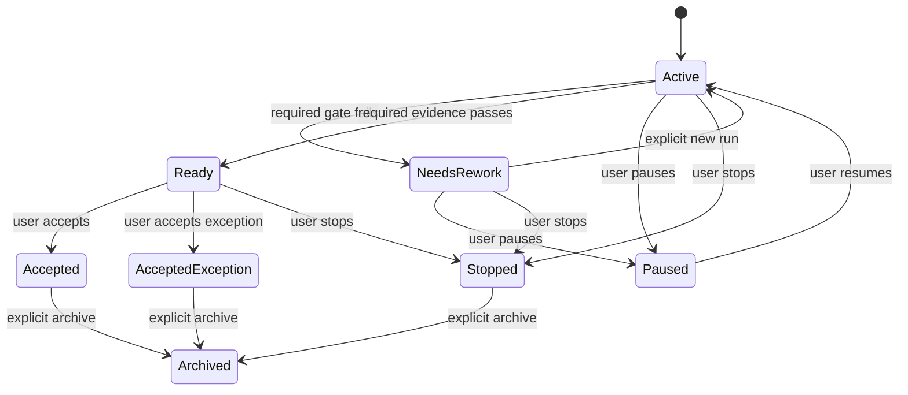

<!-- Readiness is technical evidence; acceptance is a distinct user decision. -->

`PauseGoal` and `StopGoal` both prevent new ordinary and verification runs.
They cascade through the non-terminal goal subtree and cancel every active run
whose leading goal is in that subtree, including its gate work and child-agent
subtree. They use the existing `Running -> Cancelling -> Cancelled` lifecycle.
A started external effect remains `ExternalEffectUnknown` whenever its final
effect cannot be proven. Pause is reversible through an explicit resume;
stop is a terminal work decision. Neither command archives evidence, starts a
new run, requeues work, or resumes it after restart.

Archiving is explicit and reversible only for a terminal, idle goal. It retains
all revisions, links, evidence, summaries, memory, skills, roles, templates,
and proposals as readable durable history. Restore changes presentation state
only and never launches a run. Physical deletion, export, cascade cleanup, and
garbage collection are outside this package.

#### Leading-goal run selection and durable transactions

A run is either an ordinary run with no leading goal, or a goal-directed run
with exactly one leading goal. It never acquires multiple coequal goals after
admission. A separate verification run also has that one goal, but its selected
kind is `VerificationOnly`; it may collect gate evidence and cannot alter the
goal, memory, skill, role, template, or connection state.

The selected immutable execution meaning becomes:

```text
RunExecutionMeaningDto
  schema_version = run-execution-meaning-v4
  resolved_provider_selection
  model_capability_set
  context_projection_selection
  tool_execution_selection
  reasoning_history_manifest_reference
  terminal_provenance_references
  harness_selection = Disabled | ContinualHarnessSelectionV1 { ... }
  goal_selection = Disabled | GoalRunSelectionV1 { ... }
  mcp_selection = Disabled | McpMethodCatalogSelectionV1 { ... }
  programmatic_caller_policy_selection =
    Disabled | ProgrammaticCallerPolicySelectionV1 { ... }
  agent_activity_selection = AgentActivitySelectionV1 { ... }
```

`GoalRunSelectionV1` contains the leading `GoalId`, exact goal revision,
scope/session-link provenance, ordered parent revision chain, effective
obligatory-component references, selected gate/template revisions and valid
evidence references, selected memory/skill/role cards and revisions, already
revealed full-record references, the selected effective programmatic-caller
policy snapshot reference, `AgentActivitySelectionV1` reference, run kind,
canonical target-snapshot digest, and immutable bounds. It contains no full
memory, skill, role, summary, credential, provider value, current machine
state, raw transcript, grant, process resource, or implementation handle.

The admission transaction validates the selected goal and session link, the
complete target snapshot, all required references and bounds, exact provider
selection, registry revision, and applicable programmatic-caller policy. It
then atomically writes the run, `GoalRunSelectionV1`, required goal and policy
audit evidence, projections, and snapshots, or writes none of them. No
provider, tool, MCP connection, local process, kernel, scheduler, or other
external action occurs in that transaction. A goal edit or policy edit accepted
while a run is active creates a newer revision for future admission only; the
active run retains its frozen selection.

An unknown, corrupt, unavailable, incompatible, or over-limit selected record
keeps unrelated history readable but blocks the dependent operation before
provider, tool, process, network, kernel, or external work. Queue promotion,
replay, retry, child admission, fork, and recovery never substitute current
goal state for the selected snapshot.

`McpMethodCatalogSelectionV1` is `Disabled` when `mcp` is absent from the
frozen model-tool selection. Otherwise it contains the selected connection,
method-catalog, schema, gateway, and safe-result-projection revisions of every
method eligible for that run. An individual `mcp` call records its exact one
method reference and typed input digest before an external action. No later
model step discovers, substitutes, or reinterprets a current connection or
method catalog.


#### Delegated Verification Mandates

This additive section defines the only selected path by which a user may ask an
independent verification agent to determine whether an explicit target Mandate
has fully and unconditionally achieved its objective and, when explicitly
delegated, mutate that target's future lifecycle or revision. It is neither a
normal verification gate nor a per-tool confirmation mechanism. Existing
verification gates below remain durable evidence only unless this separate
authority is present.

A Verification Mandate is an ordinary Mandate whose purpose is audit, with its
own revisioned prompt/objective, selected tools, provider selection, fresh runs,
activity identity, checkpoints, child work, evidence, and recovery. Its prompt
is independent from the target objective and is never a security boundary. It
does not inherit authority from a parent, a Goal, a branch, an activity tree, a
child relation, an MCP connection, or an audit result.

```text
VerificationMandateAuthorityDto
  authority_id
  verifier_mandate_id
  authority_revision
  target_set_reference
  allowed_operations
  audit_contract_reference
  canonical_authority_digest

VerificationTargetSetDto
  target_set_id
  immutable_targets
  canonical_target_set_digest

VerificationTargetDto
  target_mandate_id
  frozen_target_revision
  baseline_lifecycle_state
  frozen_goal_references
  frozen_gate_and_evidence_contract_references
  baseline_unknown_effect_reference_when_present

VerificationAuditContractDto
  contract_id
  revision
  required_evidence_kinds
  completion_standard
  reconciliation_standard_when_allowed
  canonical_contract_digest

VerificationAuditEvidenceDto
  evidence_id
  authority_reference
  target_reference
  frozen_target_revision
  frozen_goal_references
  frozen_gate_and_evidence_contract_references
  evidence_kind
  retained_content_reference
  canonical_evidence_digest

VerificationTargetOperationDto
  MarkCompleted
  MarkNeedsRework
  Pause
  Resume
  Stop
  ReviseFull
  ResolveUnknownEffect

VerificationTargetMutationDto
  mutation_id
  authority_reference
  audit_contract_reference
  target_reference
  operation
  audit_evidence_references
  expected_target_revision
  idempotency_key
  canonical_mutation_digest

VerificationAuditVerdictDto
  Pass
  Fail
  Inconclusive
  TargetRevisionStale
  TargetUnavailable
  VerifierUnavailable
  VerifierExternalEffectUnknown
```

The target set is immutable and explicitly enumerated at authority issuance. It
never expands to related parents, children, siblings, Goals, branches, sessions,
or activity-tree members. A verifier cannot target itself. Its child work may
collect evidence but cannot inherit, relay, or amplify target-mutation authority.
The user issues an authority revision with the target set, exact operations, and
audit contract; full delegated revision means `ReviseFull` may create a complete
new target Mandate revision for an included target, including objective, scope,
mode, triggers, Goal/context references, continuation, stop conditions, and
ordinary future-work references. It still cannot rewrite history or alter a live
old run; a resulting revision affects fresh admission only.

Each audit binds the explicit target's frozen Mandate revision and baseline
state, required Goal revisions, gate/evidence-contract references, and audit
contract before evidence gathering. If any selected baseline reference changes,
becomes missing, incompatible, or otherwise invalid before verdict or mutation,
the audit becomes `TargetRevisionStale`, fails closed, and cannot be used for a
mutation. User mutations win through ordinary optimistic concurrency. An audit
verdict is durable evidence, never an implicit trigger, hidden retry, or
self-executing mutation.

The daemon applies a requested target mutation atomically only after validating
the authority owner/revision, immutable target membership, allowed operation,
every frozen Mandate/Goal/gate/evidence-contract baseline reference, audit
contract/evidence, operation-specific lifecycle preconditions, no-resume rule,

record, target projection, and rejection or applied result together, or commits
none. A duplicate equal mutation returns the saved result; changed key reuse
fails before any mutation.

| Target state | `MarkCompleted` | `MarkNeedsRework` | `Pause` | `Resume` | `Stop` | `ReviseFull` | `ResolveUnknownEffect` |
| --- | --- | --- | --- | --- | --- | --- | --- |
| `Draft` | Reject | Reject | Reject | Reject | Explicitly granted | Future revision only | Reject |
| `Active` | Allowed with `Pass` | Allowed with `Fail`/evidence | Allowed | Reject | Explicitly granted | Future revision only | Reject |
| `Working` | Reject live-run completion | Reject live-run mutation | Reject live-run mutation | Reject | Reject | Future revision only, no live rewrite | Reject |
| `Paused` | Allowed with evidence | Allowed with evidence | Idempotent | Explicitly granted | Explicitly granted | Future revision only | Reject |
| `PausedAwaitingDecision` | Reject | Reject | Reject | Reject | Reject | Future revision only | Allowed only with delegated reconciliation evidence |
| `NeedsRework` | Allowed with new `Pass` evidence | Idempotent | Explicitly granted | Explicitly granted | Explicitly granted | Future revision only | Reject |
| `Completed` / `Stopped` | Idempotent only | Reject | Reject | Reject | Idempotent only | Explicitly granted reopening revision only | Reject |
| `Archived` | Reject | Reject | Reject | Reject | Reject | Reject | Reject |
`ResolveUnknownEffect` is available only when the authority explicitly includes
it, the target is in `PausedAwaitingDecision`, the mutation names the original
unknown-effect reference, and the audit contract/evidence proves the selected
reconciliation standard on the unchanged target baseline. Its sole outcomes are
`Resume` (to `Active`, for a later fresh run) or `Stop`. It makes no rollback,
absence, idempotence, or repeatability claim about the original external effect.
A verifier's own `ExternalEffectUnknown` pauses only the verifier at
`PausedAwaitingDecision`; it never mutates a target.

Verification activity is added through typed Mandate-scoped records such as
`VerificationAuthorityIssued`, `VerificationAuditStarted`,
`VerificationAuditVerdictRecorded`, `VerificationTargetMutationApplied`,
`VerificationTargetMutationRejected`, and
`VerificationUnknownEffectReconciled`. They contain typed identity, revision,
digest, visibility, and provenance references rather than raw evidence content.
Pass, fail, inconclusive, target-unavailable, and stale-audit outcomes are
ordinary target-visible summaries. Delegated unknown-effect reconciliation and
inability to reconcile an unknown effect are urgent. A verifier's own unknown
effect is a verifier safety event and never mutates a target. Notification,
replay, and recovery publish only after durable commit and reread.

Recovery retains authority, target-set, audit, evidence, verdict, and mutation
history but never resumes verifier or target work, repeats verification tools,
or reapplies a mutation. Unknown or incompatible authority/audit/target records
leave unrelated history readable and block only the dependent audit/mutation
before external work. Historical M4 and v1--v4 execution records never acquire
a synthetic verifier authority, target set, audit, verdict, or target mutation.

#### Verification gates and evidence

`VerificationGateDto` is closed as:

```text
VerificationGateDto
  ReferenceGate { evidence_contract_revision, accepted_reference_kinds }
  ExecutableGate { template_id, template_revision }
```

A `ReferenceGate` validates an exact durable reference such as a terminal
child result, accepted user declaration, or terminal registered-tool result.
An `ExecutableGate` names a user-created typed
template at one exact revision. It does not contain raw shell text, arbitrary
path, URL, header map, executable code, opaque JSON, or a model-supplied
provider resource. A template uses a registered capability and one of its
closed typed input families; its owner validates that its effect profile,
mode, required confirmation, and selected class are allowed before execution.

Gate templates have `Project`, `Goal`, or `Session` scope, immutable revisions,
safe cards, explicit user create/edit/archive/restore operations, and typed
provenance. A model may prepare a template proposal only under the proposal
rules below. It cannot create a template, invoke a template, or turn a raw
command into a gate without explicit user confirmation and ordinary admission.

An executable gate may run either in the terminal verification phase of an
ordinary leading-goal run or in a separately user-admitted `VerificationOnly`
run. Both produce the same typed evidence family while retaining their distinct
run provenance. A gate failure, timeout, cancellation, output bound, unknown
effect, missing reference, stale revision, or unavailable template is a known
typed outcome. It neither triggers a hidden retry nor allows a next model phase
to claim readiness. Existing retry rules remain available only before their
first irreversible durable fact and never repeat a started external action.

#### Working memory, skill, role, and template records

Working memory, textual skills, reusable delegation roles, and gate templates
are first-class typed durable records, not free-text side instructions or
dynamic extensions. Their scopes are `Project`, `Goal`, and `Session`.
Session scope stays in its own session; a project or goal record reaches a
session only through the selected goal/session link and frozen target snapshot.

Every record has daemon-assigned identity, owner scope, immutable revisions,
canonical digest, safe card, lifecycle state, source/provenance, bounded typed
references, explicit archive/restore, and a replacement/rollback relation.
The first memory vocabulary is:

```text
MemoryKindDto
  Fact
  Decision
  Preference
  PastFailure
```

The daemon never decides that two arbitrary texts conflict. A newer record can
replace an older applicable record only through an explicit typed replacement
link naming its identity and revision. Without that link both cards remain
visible. Rollback creates a new immutable revision linked to the earlier
revision; it never rewrites a historical selection.

Every applicable active card from the project, selected goal chain, and current
session enters the target snapshot. A card includes only kind, title, scope,
bounded safe purpose, exact revision, digest, and a typed retained-content
reference. Full content is revealed only by explicit use of the existing
`retrieve` tool against that reference under its selected descriptor, policy,
safe projection, and bounds. This creates no new `ToolId`, does not insert a
content body into a run snapshot, and does not cause a current record to
replace the historical reference. An unavailable or incompatible full record
blocks only the dependent disclosure or model step.

A skill is a bounded textual procedure with typed references to existing
memory, roles, gate templates, or registered capabilities. It contains no
binary material, executable code, installation instruction, plug-in, dynamic
registration, arbitrary MCP schema, or hidden external action. A role is a
named reusable `sub_agent` template containing a task, permitted class, tool
subset, contextual limits, and typed references. A concrete role use may only
narrow its task, class, context/result limits, or permitted tool subset. It
cannot add a tool, increase a class, widen a scope, bypass a gate, change a
provider, or weaken policy. Skill and role cards are discovered first; their
full bounded records require explicit disclosure in the active run.

#### Model proposals and user confirmation

After one of the following durable goal milestones, the model may prepare at
most one coalesced proposal of a particular owner scope and record kind:

- technical readiness;
- user acceptance, acceptance with exception, or stop;
- required-gate failure; or
- a terminal outcome of an obligatory child.

`RefinementDraftDto` contains its daemon-assigned identity, selected source
run/goal and milestone, exact base revisions, bounded typed edit set, evidence
references, safe rationale, and canonical digest. It is not a current record,
does not appear in cards or model context, cannot be used by a child, skill,
role, gate, harness, or MCP method, and grants no execution authority. A later
equal proposal adds evidence to the one pending draft rather than producing an
unbounded queue.

The daemon records a proposal durably before it asks the user. Through the
normal `ask_user` path, the user may accept, edit and accept, or reject it.
The draft remains pending until that explicit decision. Acceptance validates
the exact base revision and creates a new immutable record revision; stale
base state produces a typed conflict. Rejection changes no active record. The
selected programmatic-caller policy below uses the same user-confirmed flow for
its separate inactive policy drafts, while retaining its own evidence, scope,
and quota rules.

#### Conversation compaction and progressive context disclosure

Conversation compaction is a versioned model-context projection, not a
replacement for the source transcript, model facts, tool facts, reasoning,
kernel checkpoint, harness checkpoint, child dossier, or goal evidence.
`ConversationSummaryDto` covers one continuous completed durable-history range
and contains its schema/canonicalization version, start/end references,
previous-summary reference when present, bounded safe content, digest, and
provenance. The original facts remain readable.

The selected working form is one cumulative current summary plus the later
uncompacted suffix. A new revision is made inside the already active run: it
uses the previous selected summary and the next bounded completed source range,
then becomes part of the next model step in that same run. It executes no
registered tool, creates no service run, and cannot run before a user-admitted
run, after terminalization, or after restart. A user or model may request that
operation in an active run; if the selected model-context bound would otherwise
be exceeded, the daemon requires it in that same run rather than silently
creating another one.

Correcting a summary creates a separately immutable later revision with exact
source and predecessor references. The earlier summary remains historical
evidence. Fork creation stores only the exact compatible selected summary
references within its frozen projection; it never reads a current ancestor or
imports a future summary. Headroom, VFR, and `retrieve` retain their own
semantics and do not turn source content into summary text implicitly.

#### Branches, children, cancellation, and recovery

A new session fork receives a frozen copy of applicable project-goal links,
session memory/skill/role/template cards, their exact revisions, and the
selected current summary reference in its independent fork snapshot. It does
not receive a new session goal, active goal run, grant, kernel namespace,
current ancestor record, local MCP process, external connection resource, or
future source change. The user explicitly creates any new session goal in the
branch. Programmatic-caller policy uses a separate immutable session-policy
inheritance record: a fork refers to the same source-session policies and their
same durable counters rather than copying a fresh allowance. The branch may add
only a new policy that narrows the inherited effective policy; historical fork
context remains unchanged.

An admitted child agent receives `GoalDelegationSnapshotV1` inside its existing
bounded `SubAgentDelegationSnapshotDto`: the parent task, leading-goal identity
and revision, effective required constraints, applicable cards, selected role
when any, the selected effective programmatic-caller-policy snapshot reference,
the selected `AgentActivitySelectionV1` reference, and only required safe
references. It is not a full parent transcript or live target context. Later
parent/goal/memory/skill/role/policy/activity edits do not change the child
snapshot, although a live suspension or revocation can still impose a stricter
present-time denial. The child still uses its independently assigned session,
run, class, tool selection, provider selection, cancellation, and no-resume
rules.

On cancellation, failure, or daemon restart, no provider request, gate, tool,
MCP request/process, kernel action, child, or external effect is retried,
reattached, resumed, or rerun. Unfinished work becomes `Interrupted` with the
already selected known pre-effect or unknown-effect evidence. Goals, records,
summaries, proposals, and readable history survive recovery; a later user
attempt obtains a new run identity and target snapshot.

#### Bounded MCP gateway

`mcp` is the one canonical MCP gateway `ToolId`, owned by a future MCP boundary
and assembled only through the existing Rust-owned registry and gateway. It is
not a second registry. Its descriptor selects a bounded catalog of explicit
user-approved `McpMethodDto` records, each naming exactly one connection and
method, closed typed request/result families, canonical schema digest, effect
classification, safe result projection, and immutable revision. It is never a
generic string-method call, raw JSON transport, arbitrary header map, or
automatic exposure of a discovered remote method. A method whose schema does
not fit a supported closed family is unavailable.

An MCP connection has `Project` or `Session` scope. The user alone creates,
edits, archives, restores, or selects a connection and its methods; a model may
only prepare a draft under the selected proposal rules. Credentials, OAuth
material, SDK objects, sockets, child-process handles, and endpoint resources
remain private daemon material and never enter a DTO, snapshot, fact, log,
diagnostic, card, model context, or safe result.

The selected transports are user-created outgoing `HTTP`/`HTTPS` connections
and user-created local standard-input/output services. The daemon starts a
local service only upon the first selected MCP call in one run. That private
process serves only that run and is terminated when the run completes, cancels,
fails, or is interrupted. It is never attached by a later daemon, shared with
another run, treated as a durable worker, or managed as a long-lived process.

authority context.
Every MCP call passes the same registry selection, daemon-bound authority,
typed admission, confirmation, programmatic-caller-policy selection,
idempotency, durable outcome, cancellation, redaction, and post-reread
publication rules as another registered tool. Its selected
connection/method/schema/gateway revision is frozen in the call and run
selection. A remote schema mismatch fails closed before an external effect; an
already started ambiguous call is never repeated and records
`ExternalEffectUnknown` when appropriate. A service may emit bounded safe
progress through the ordinary durable output stream, but cannot invoke
`ask_user` or create a confirmation request. It cannot create a goal, proposal,
session, run, connection, tool registration, child agent, message, or another

This bounded adapter does not add an MCP listener, remote attachment to the
daemon bridge, plug-in system, skill/MCP installation, dynamic tool
registration, server-driven child control, autonomous continuation, or a
claim that a local service is isolated from the user's ordinary OS authority.

#### Bounds, safe failures, and retained exclusions

The first scope uses these code-owned limits:

| Subject | Selected limit |
| --- | ---: |
| Goals in one project | 256 |
| Goals in one session | 64 |
| Goal-tree depth | 16 |
| Direct children of one goal | 32 |
| Session links of one project goal | 64 |
| Gates of one goal | 32 |
| Active applicable memory cards in one run | 128 |
| Selected skills and roles in one run | 32 |
| Full memory, skill, role, template, summary, draft, or safe gate result | 512 KiB |
| Canonical goal target snapshot | 1 MiB |
| Goal context, revealed records, and summaries in one run | 4 MiB |
| Pending proposal per owner scope and record kind | 1, with evidence coalescing |

No content is truncated or partly committed to satisfy a bound. At a minimum,
the model adds these closed safe failures through `ErrorDto`:

```text
goal_limit_exceeded
goal_tree_depth_limit_exceeded
goal_child_limit_exceeded
goal_session_link_limit_exceeded
goal_cycle_detected
goal_not_active
goal_revision_conflict
goal_snapshot_too_large
goal_snapshot_unavailable
goal_gate_limit_exceeded
goal_gate_unavailable
goal_gate_failed
goal_not_ready
goal_acceptance_exception_invalid
goal_archive_not_terminal
memory_entry_limit_exceeded
memory_entry_too_large
memory_reference_unavailable
memory_replacement_conflict
skill_entry_too_large
skill_reference_unavailable
delegation_role_invalid
delegation_role_widening_forbidden
compaction_summary_too_large
compaction_summary_unavailable
compaction_history_unavailable
refinement_draft_conflict
refinement_draft_too_large
mcp_connection_unavailable
mcp_method_unavailable
mcp_schema_mismatch
mcp_local_process_unavailable
mcp_progress_limit_exceeded
mcp_user_interaction_unavailable
```

They disclose no credential, path, raw external response, private process
resource, grant, full memory/skill/role/template content, model proposal text,
provider resource, or implementation detail. This package continues to exclude
autonomous continuation, work after client disconnection, attachments/images/
binary/rich-MIME input, dynamic extensions and installation, dynamic tool
registration, physical deletion, and administration of
long-lived workers, leases, attach/detach, force-kill, or supervisor recovery.

### Selected programmatic-caller policy and admission

> **Historical-only for new Mandate work.** All policy DTOs, diagrams,
> counters, corridors, errors, lifecycle, and recovery detail below remain
> preserved for historical decoding, audit, and migration analysis. They cannot
> authorize, narrow, deny, reserve, quota, or gate a new Mandate tool call. No
> new policy decoder requirement is created beyond preserving historic bytes.


This is a selected concept constraint for future replanning. It closes the
first-scope policy that decides whether a programmatic path may invoke a
registered capability. It does not authorize a crate, implementation, protocol,
storage migration, configuration, network connection, local process, or
delivery scope. It preserves the closed M4 baseline and the trusted-local
execution model: this policy is logical product control and audit evidence, not
an operating-system security boundary against code running with the user's
ordinary OS authority.

The policy does not create a durable autonomous actor, a second daemon, a
second tool registry, a remote identity, or an authority that survives an
active daemon-held run. A local protocol peer remains an adapter under the
ordinary operating-system-user boundary, not an account or a caller-selected
principal. A Python facade, direct model ingress, child agent, and MCP service
cannot assert an identity, issue an authorization, or keep one after their
active run ends.

#### Root origin, calling path, and durable provenance

Every programmatic action has one daemon-assigned root origin:

```text
ProgrammaticCallerRootOriginDto
  InteractiveUser { originating_turn_id }
  ContinualHarness { harness_id, rule_revision, trigger_reason_id }
```

`InteractiveUser` is the root of an ordinary user-admitted run and all of its
descendants. `ContinualHarness` is the root of one separately admitted harness
launch and all of its descendants. These values are not account identities,
credentials, operating-system identities, or user-supplied input. No third
root exists in this first scope: a protocol peer, detached Python task, child
agent, MCP service, provider, bridge channel, queued item, replay, and daemon
recovery cannot become an independent root.

The policy distinguishes only the root origin. It does not give a model,
Python facade, direct in-daemon ingress, child agent, or a particular child
class an independently wider policy category. The daemon nevertheless retains
the exact internal calling path as immutable audit provenance:

```text
ProgrammaticCallerProvenanceDto
  root_origin
  root_session_id
  root_run_id
  current_session_id
  current_run_id
  parent_link_references
  bridge_operation_reference_when_present
  leading_goal_reference_when_present
  tool_call_id
  selected_tool_id
  selected_descriptor_revision
  selected_mcp_method_reference_when_present
  typed_input_digest
  effective_policy_snapshot_reference
  admission_basis_reference
  limit_reservation_references
  canonical_provenance_digest
```

The daemon creates this record before `ToolCallStarted`, together with the
admission outcome it explains. It records no raw input, workspace path, grant,
credential, provider value, Python value, socket, process handle, external
response, or implementation resource. A returned tool result may refer to the
safe provenance record but does not turn it into model context by itself.

For a tool whose typed input contains one or more local paths, the daemon may
also create a best-effort audit-only `WorkspacePathOutsideObserved` record. It
contains only the `ToolCallId`, `ToolId`, selected descriptor revision, a closed
observation kind, and the count of explicit path values observed outside the
session's default root. It contains no source, normalized, absolute, canonical,
or symlink-target path; no `WorkspaceRoot`; no CWD, command, content, path
digest, operating-system detail, or file error. The record is safe audit data,
never model context, a public tool-result field, a notification, a confirmation,
or a sanction. Failure to persist this optional record never blocks, changes,
retries, or rolls back the tool call.

```text
WorkspacePathObservationKindDto
  LexicallyOutsideRoot
  ResolvedLinkOutsideRoot
```

The workspace owner first resolves a relative path from `WorkspaceRoot` or
uses an absolute path as supplied. It records `LexicallyOutsideRoot` when the
lexically resolved path is outside the root. When a symlink or an existing
parent can be resolved, it additionally records `ResolvedLinkOutsideRoot` if
the resolved target is outside. Missing, inaccessible, changing, or
unresolvable links produce no guessed observation and never deny access. This
observation covers explicit path-bearing DTOs only; it makes no claim about
filesystem activity hidden inside `execute`, IPython, or child processes.

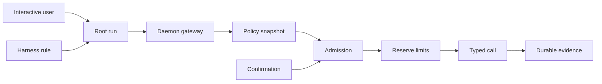

<!-- The daemon derives provenance and admits a typed call before any external
work. `CF` is either one exact confirmation or one bounded corridor. -->

Every gateway request remains bound to an active daemon-held run. A live
`BridgeRunGrantDto` is necessary transport evidence for a bridge request but is
not a policy selection, authorization, or durable fact. Its expiry, channel
detachment, or daemon exit cannot transfer a pending call into another run. A
future request without the active context fails before a primitive, provider,
kernel, process, network call, or child admission.

#### Durable policy identity, scope, and narrowing

Programmatic policy is a first-class durable record, separate from a goal,
memory card, skill, role, gate template, harness rule, or MCP connection. The
daemon assigns `ProgrammaticCallerPolicyId` and immutable revisions:

```text
ProgrammaticCallerPolicyDto
  policy_id
  scope
  calendar_period_kind
  lifecycle_state
  active_revision
  canonical_policy_digest

ProgrammaticCallerPolicyRevisionDto
  policy_id
  revision
  root_origin_rules
  admission_rules
  per_run_limits
  calendar_limit
  inherited_policy_references
  canonical_revision_digest

ProgrammaticCallerPolicyScopeDto
  Project { project_id }
  Goal { project_id, goal_id }
  Session { project_id, policy_owner_session_id }
```

A project policy applies to every current and future session in its project,
including ordinary, child, branch, and harness service sessions. This is
intentionally different from a project goal, which remains applicable only
through its selected explicit goal-to-session link. A goal
policy is applicable only when that goal is the leading goal or an ancestor in
its frozen effective goal chain. A session policy applies to its owner session
and to a fork only through the explicit immutable inherited-policy reference
recorded by that fork. It never crosses a project or `WorkspaceId`.

At run admission the daemon resolves applicable project, selected-goal-chain,
and session policies into one immutable
`EffectiveProgrammaticCallerPolicySnapshotDto`. It records each policy ID and
revision, scope provenance, root-origin constraint, ordered narrowing result,
per-run limits, calendar-counter identities, and a canonical digest. It holds
no full rule text, raw input, credential, process resource, current counter
value, live policy state, or confirmation. The snapshot is immutable historical
execution meaning; it is not reconstructed from a current policy projection.

Every applicable rule constrains a call by the intersection of both of these
independent selectors:

1. the selected tool's declared `ToolEffectProfileDto` flags; and
2. the exact `ToolId`, plus an exact selected MCP connection/method revision
   where the tool is `mcp`.

An effect selector alone cannot admit a different tool, and an exact tool or
MCP method selector cannot escape a stricter applicable effect selector. The
most restrictive decision, smallest bound, and narrowest input constraint win.
A child goal, session policy, role, child-agent selection, or harness class may
only add a restriction. It cannot add a tool, remove an effect condition,
broaden a method, increase a class, extend a scope, enlarge a limit, or weaken
a confirmation requirement. A nominally stronger child class is valid only if
the resulting effective policy still narrows the parent selection.

A session fork stores immutable references to the source session policies and
their `ProgrammaticCallerPolicyId` values rather than copies. The source and
all such forks consume the same calendar counters. A branch can add only a new
policy that narrows the inherited intersection. Thus a fork cannot obtain a
fresh calendar allowance by copying, changing a title, or creating a new
session. Its materialized historical context remains immutable even if a later
live policy makes a future action unavailable.

#### Decisions, typed input constraints, and confirmation

The closed first policy decision is:

```text
ProgrammaticAdmissionRuleDto
  Prohibited
  DirectLocalRead
  ExactConfirmationRequired
  BoundedConfirmationRequired
```

`DirectLocalRead` is valid only for `InteractiveUser` and only for `read`,
`glob`, `grep`, `expand`, or `retrieve`. It permits local reading or disclosure
of already retained content, subject to the frozen registry, descriptor,
WorkspaceRoot default resolution and observation where applicable, mode, hooks,
per-run limit, and
every stricter policy. It does not state that a file is safe, current, or free
of sensitive content. A direct policy never admits `fetch_url`, `write`,
`edit`, `execute`, `plan_submit`, `sub_agent`, `mcp`, user interaction, a
network call, a process, or a state mutation.

When no durable policy is applicable, an `InteractiveUser` root receives the
same narrow direct-local-read baseline. It applies only to the root run itself,
not automatically to a Python facade, child agent, or any descendant. A
`ContinualHarness` root has no such baseline: its selected read-and-delegate
tool subset and separately selected policy must admit each action. All other
calls require an exact confirmation or a bounded confirmation corridor.

The baseline itself is a code-owned `InteractiveLocalReadBaselineV1` selection
with a maximum of 256 root-run actions and 16 concurrent actions. It has no
calendar counter, cannot create a corridor, and is frozen into the v3 policy
selection like every other selected rule. A durable policy may only narrow this
baseline. Thus the absence of a stored policy does not produce an unbounded or
unaccounted admission path.

An admission rule may select only descriptor-declared closed typed input
constraint families. A `DescriptorInputConstraintSelectionDto` names its
family, revision, and typed values; the descriptor is solely responsible for
validation. It cannot contain a raw command, code fragment, unvalidated path,
free-form URL, raw JSON, map, provider object, arbitrary header, dynamic MCP
method name, pattern language, or newly discovered schema. A descriptor that
cannot express the needed constraint cannot participate in a bounded corridor
for that call.

`execute` therefore never receives `DirectLocalRead` or a bounded-corridor
admission in this first scope. `ShellCommandTextDto` deliberately permits
pipelines, redirects, and compound commands, so WorkspaceRoot CWD does not make
its input a closed corridor constraint. It remains available only through an
exact user confirmation that displays the exact typed command and still applies
WorkspaceRoot CWD, explicit-path observation where applicable, mode, hook,
output, cancellation, and no-resume rules. A future
typed command-template direction would require a separately selected contract.

`fetch_url` never receives direct admission. It may use a bounded corridor only
when its descriptor declares a compatible typed constraint family and each
redirect remains within the selected descriptor-fixed restrictions. `mcp` never
receives direct admission: its corridor must name one selected connection,
method, schema, gateway revision, and supported typed input constraint family.
An MCP service cannot ask the user, create a confirmation, create a goal,
connection, run, child, message, or authority context.

An exact confirmation is one durable user decision bound to exactly one
`ToolCallId`, root tree, `ToolId`, descriptor revision, MCP-method reference
when present, typed input digest, applicable policy-snapshot digest, and all
selected limits. It cannot be replayed for another call, input, descendant
tree, revision, or later run.

A bounded confirmation is a user-approved
`ProgrammaticAuthorizationCorridorDto`:

```text
ProgrammaticAuthorizationCorridorDto
  root_session_id
  root_run_id
  root_origin
  effective_policy_snapshot_reference
  required_effect_selectors
  exact_tool_or_mcp_method_selectors
  descriptor_input_constraint_selections
  maximum_action_count
  maximum_concurrent_actions
  expires_at_run_terminal
  confirmation_reference
  canonical_corridor_digest
```

The corridor belongs to one active root tree and reaches every descendant in
that tree. A child may use only the same or a narrower exact selector and typed
constraint, and every action consumes the one shared remaining count and
concurrency allocation. No child can copy, widen, detach, retain, or apply a
corridor to a sibling root, a fork-created future root, another harness launch,
or a later run. A corridor expires on root terminalization, cancellation,
interruption, policy suspension or revocation, daemon restart, or its own
bounded terminal evidence. It is not a lasting policy revision.

`ask_user` remains a normal long-running registered tool rather than a policy
outcome. Only an `InteractiveUser` root may start it. When a descendant needs
an exact or bounded confirmation, the daemon records the descendant's safe
provenance but creates the typed question only for the root run. The child,
Python facade, role, harness, and MCP service never directly start `ask_user`.
A harness cannot await user interaction: its `sub_agent` use must fit the
user-approved corridor already selected by the harness rule, or it fails before
child admission.

#### Policy lifecycle, live tightening, and drafts

The durable policy lifecycle is closed:

```text
ProgrammaticCallerPolicyLifecycleStateDto
  Active
  Suspended
  Revoked
  Archived
```

An ordinary user edit creates a new immutable active revision only for future
admission. It does not reinterpret an admitted run's frozen effective-policy
snapshot, corridor, confirmation, or audit evidence. A current live state may
nevertheless impose a stricter decision:

- `SuspendPolicy` blocks every not-yet-started matching call, cancels pending
  confirmations, releases their reservations, and permits no new reservation.
  It does not claim to roll back or silently stop an action that already reached
  `ToolCallStarted`.
- `ResumePolicy` may make a suspended policy active again only through an
  explicit user operation on its then-current active revision. It does not
  revive a cancelled run, expired confirmation, released reservation, or old
  corridor.
- `RevokePolicy` atomically creates a later immutable revision whose admission
  is disabled, enters `Revoked`, marks every active root tree that selected the
  policy for cancellation, and denies new reservations. Each affected tree
  follows the existing `Running -> Cancelling -> Cancelled` path. A started
  effect whose final result is not provable remains `ExternalEffectUnknown`.
- A later user decision may create a **new** active revision of the same policy
  identity, retaining its counter history. Revocation is never undone by
  reactivating an old revision, by restoring an archive, or by replay.
- Only a revoked policy with no active dependent tree may be archived. Archive
  is reversible presentation retention only; it never grants authority or
  removes readable revisions, counters, confirmations, provenance, or audit.
  Physical deletion and counter erasure are excluded.

`AutomationPaused` for a continual harness remains distinct from a suspended
policy. The former coalesces automatic triggers while retaining explicit user
launch as defined by the harness model. The latter is a stricter live denial:
it blocks both automatic and explicit admissions that depend on that policy.

The model may prepare one inactive `ProgrammaticCallerPolicyDraftDto` for any
applicable project, goal, or session scope. The draft always displays its
proposed scope, root-origin applicability, selected rules, evidence references,
base revisions, safe rationale, and canonical digest. It may arise after the
selected goal milestones, a policy denial, or exhaustion of a policy limit.
An equal later proposal coalesces evidence into that one pending draft. The
draft is not a policy, card, target-snapshot input, corridor, confirmation,
tool selection, or authority. The daemon records it before the root-only user
question; the user may accept, edit and accept, or reject it. Acceptance checks
the exact base state and creates an immutable policy or policy revision.
Rejection changes no policy. No harness rule, policy, or policy revision exists
because a model merely proposed it.

#### Run and calendar limits, reservations, and recovery

Every selected policy supplies both a per-run action limit and a per-run
concurrency limit. A user may select values no greater than 256 actions and 16
concurrent actions for one run; an effective intersection takes the smallest
non-zero bound. A policy also owns one calendar action limit from 1 through
4,096. The counter belongs to `ProgrammaticCallerPolicyId`, never to one
revision, scope projection, session, branch, child, root run, or corridor.

At initial policy creation, the user selects exactly one immutable calendar
period kind:

```text
ProgrammaticCalendarPeriodKindDto
  Day
  Week
  Month
```

A revision may narrow the numeric calendar limit but cannot change the period
kind. A different period requires a different policy identity. The current
calendar window retains the project time zone with which that window was first
opened. The next window reads the then-current project time zone. This does not
recalculate a current window after a project time-zone edit, while preserving
the project-calendar rule that nonexistent local times move forward to the
nearest valid local time and repeated local times occur once.

Before `ToolCallStarted`, the daemon atomically verifies every applicable
effective policy, all exact selectors and input constraints, run counters,
calendar counters, confirmation or corridor, and live policy state. It then
creates all required policy-counter reservations, the policy admission evidence,
and the tool admission outcome in one transaction, or writes none of them. No
provider, tool, shell, process, filesystem action with an external effect,
network call, kernel operation, MCP process, or child admission occurs in that
transaction.

An equal repeated operation reads the accepted idempotent binding and does not
reserve a second unit. A denial, invalid input, expiration, cancellation, or
known failure before `ToolCallStarted` releases each reservation atomically
with the terminal known pre-effect outcome. On `ToolCallStarted`, reservations
become permanent calendar and run consumption, even when later cancellation,
loss, or ambiguity yields `ExternalEffectUnknown`. Recovery records
`InterruptedBeforeStart` and releases the unstarted reservation atomically, or
records `ExternalEffectUnknown` for a started ambiguous action and never
retries it. It never recreates a reservation by running the action again.

The first policy scope uses these additional code-owned limits:

| Subject | Selected limit |
| --- | ---: |
| Policies in one project | 64 |
| Policies attached to one goal | 32 |
| Own or inherited policy references in one session | 32 |
| Rules in one policy revision | 32 |
| Typed input constraints in one rule or corridor selector | 16 |
| Unfinished corridors in one root tree | 16 |
| Awaiting policy confirmations in one root tree | 16 |
| Policy, revision, corridor, draft, or safe admission evidence | 512 KiB |
| Effective policy snapshot | 1 MiB |
| Pending draft per owner scope and record kind | 1, with evidence coalescing |

No reservation, counter, draft, provenance chain, or content is truncated or
partly committed to fit a bound. An unavailable or incompatible counter,
policy, snapshot, confirmation, or corridor blocks only the dependent action
before an external effect. It never falls back to the current policy, a current
default, a different counter, a live ancestor, or a fresh authorization.

#### Run-selection compatibility and closed safe failures

The selected immutable execution meaning is first selected in
`run-execution-meaning-v3` for programmatic-caller policy and then extended by
the separately versioned `run-execution-meaning-v4` activity selection below:

```text
ProgrammaticCallerPolicySelectionV1
  root_origin
  effective_policy_snapshot_reference
  policy_selection_digest
  inherited_scope_provenance
  fixed_run_limits
```

`RunExecutionMeaningDto.programmatic_caller_policy_selection` is `Disabled`
only for historical M4 and earlier post-M4 selection versions. Every new v3 or
v4 ordinary, goal-directed, verification, child, and harness run carries this
selection, including a selection that contains only the narrow interactive
direct-local-read baseline. `GoalRunSelectionV1`,
`SubAgentDelegationSnapshotDto`, `GoalDelegationSnapshotV1`,
`ContinualHarnessSelectionV1`, and `McpMethodCatalogSelectionV1` retain only
safe typed references to it and to any later admission evidence. No historical
v1 or v2 selection, M4 snapshot, event, `RunId`, replay, or
`tool_execution_unavailable` result is rewritten or given a synthetic policy
record.

Live suspension, revocation, registry availability, counter state, and daemon
readiness remain outside immutable execution meaning. They may impose a
stricter present-time denial, but never rewrite historical semantics, reroute a
call, substitute a current policy snapshot, restore a corridor, or resume
external work.

At a minimum, the policy adds these closed safe failures through `ErrorDto`:

```text
programmatic_policy_limit_exceeded
programmatic_policy_snapshot_too_large
programmatic_policy_snapshot_unavailable
programmatic_policy_revision_conflict
programmatic_policy_inheritance_widening_forbidden
programmatic_policy_origin_invalid
programmatic_policy_not_applicable
programmatic_policy_suspended
programmatic_policy_revoked
programmatic_policy_confirmation_required
programmatic_policy_confirmation_expired
programmatic_policy_root_only_interaction
programmatic_policy_corridor_unavailable
programmatic_policy_corridor_exhausted
programmatic_policy_input_constraint_mismatch
programmatic_policy_run_limit_exceeded
programmatic_policy_calendar_limit_exceeded
programmatic_policy_counter_unavailable
programmatic_policy_reservation_conflict
programmatic_policy_harness_delegation_forbidden
programmatic_policy_draft_conflict
programmatic_policy_draft_too_large
```

They disclose no policy body, raw input, path, grant, credential, Python value,
provider resource, process topology, external response, counter history, or
implementation detail. Every listed failure is known before an external effect,
except that a later cancellation or recovery preserves the independently
selected `ExternalEffectUnknown` evidence for work that had already started.

### Selected agent communication, observation, and notifications

> **Historical-only where conflicting for new Mandate work.** Preserve the full
> communication, journal, notification, replay, ordering, and safe-projection
> detail below. New Mandate work uses a Mandate-scoped activity identity across
> fresh runs; retained root-origin and fixed-limit semantics are historical-only
> where they conflict. Verification authority, audit verdicts, target mutations,
> and unknown-effect reconciliation add typed activity records as specified
> below.


This is a selected concept constraint for future replanning. It closes the
first-scope communication, observation, and user-notification model for the
selected RLM tree. It does not authorize a crate, implementation, storage
migration, public protocol change, listener, user-account model, operating
system notification, or delivery scope. It preserves the closed M4 baseline,
the one-daemon authority, typed DTO-first boundaries, central redaction, and
no-resume recovery.

Communication is not an authority channel. It cannot grant a tool, policy,
corridor, confirmation, bridge grant, provider selection, MCP method, child
creation right, `ask_user` right, workspace access, or a right to survive a
terminal run. It also is not a hidden direct model message, raw transcript,
tool-result stream, MCP channel, kernel channel, provider continuation, or
second daemon. The selected programmatic-caller policy continues to decide a
parent `sub_agent` tool command as already specified, but it does not create a
separate configurable admission rule that can widen or narrow the closed RLM
communication graph, message kinds, ordering, or bounds below.

#### Activity-tree identity and immutable selection

Every new root run receives a daemon-assigned `AgentActivityTreeId` in the same
durable admission transaction that creates its immutable run selection. A root
is a run with one of the two selected `ProgrammaticCallerRootOriginDto` values
that is not itself admitted as an RLM child. Each direct or indirect child
retains exactly that root's activity-tree identity through its immutable
`RlmParentLinkDto`; a child cannot create, substitute, merge, fork, detach, or
reuse an activity tree.

`AgentActivityTreeId` is distinct from `ConversationTreeId`. The former owns
one bounded runtime-work tree rooted at one `RunId`; the latter owns durable
user-visible session-fork lineage. Neither identity can be derived from the
other, and an RLM child remains separate from a conversation branch unless the
user later creates an explicit session fork under the separately selected fork
contract.

Every root tree begins with one durable `RootActivityTreeBound` journal record,
even when that root never creates a child or sends a message. This gives every
new run one fixed activity identity, one audit anchor, and one subscription
target without a late first-activity race. It does not create a child, a model
step, a model-visible context item, a user notification, or another runtime
authority.

The new immutable execution meaning is `run-execution-meaning-v4`:

```text
AgentActivitySelectionV1
  Root {
    activity_tree_id
    root_origin
    activity_exchange_revision
    activity_journal_revision
    user_projection_revision
    fixed_activity_limits
  }
  Descendant {
    activity_tree_id
    direct_parent_link_reference
    activity_exchange_revision
    activity_journal_revision
    user_projection_revision
    fixed_activity_limits
  }
```

Its references and limits are credential-free, canonical, and immutable. Live
queue occupancy, delivery state, subscribers, daemon readiness, policy state,
and current activity or notification projections are not execution meaning.
They may deny a later operation or show a stricter current state, but never
replace an activity-tree identity, re-order a historical message, reconstruct a
message from current state, or resume work.

Historical M4 and post-M4 v1/v2/v3 run selections remain byte-for-byte
readable. They receive no synthetic activity identity, journal, message,
notification, or v4 execution selection. An unknown, corrupt, unavailable, or
incompatible v4 activity selection leaves unrelated retained history readable
but blocks only the dependent post-M4 activity or execution operation before a
provider, tool, process, kernel, or other external effect.

#### Direct-pair messaging and safe content

One `AgentActivityPairDto` is created atomically with every admitted child and
is bound forever to its exact direct `RlmParentLinkDto`. It has one
daemon-assigned `AgentActivityPairId`, two fixed directions, and one shared
monotonic `AgentPairOrderDto`. The daemon allocates that order in durable
acceptance order across both directions; each direction retains its own
delivery queue. A pair never connects siblings, unrelated agents, a direct
ancestor beyond the parent, a direct descendant beyond the child, another root,
an adapter, a bridge peer, a kernel, an MCP service, or a provider.

The complete first vocabulary is closed:

```text
AgentMessageKindDto
  Instruction
  Report
  ClarificationRequest
  ClarificationReply

AgentMessageDirectionDto
  ParentToChild
  ChildToParent
```

`Instruction` and `ClarificationReply` are valid only from the direct parent to
the direct child. `Report` and `ClarificationRequest` are valid only from the
direct child to the direct parent. An unknown kind, wrong direction, stale
parent link, terminal sender or recipient, duplicate order, skipped order, or
message outside the selected activity tree fails before publication and never
becomes a model-context item.

The conceptual durable message is:

```text
AgentMessageDto
  message_id
  activity_tree_id
  pair_id
  pair_order
  direction
  kind
  sender_run_reference
  recipient_run_reference
  source_model_step_reference
  safe_text
  typed_references
  delivery_state
  canonical_message_digest
```

`safe_text` is a bounded redacted presentation value, not a raw prompt,
provider item, tool output, MCP input/result, path, command, Python value,
credential, grant, socket, process resource, or diagnostic. A message may have
at most sixteen closed typed references. The only reference variants are:

```text
AgentMessageReferenceDto
  TerminalChildResult
  TerminalToolResult
  PolicyDecision
  VerificationEvidence
  GoalRevision
  RetainedContent
```

Each reference carries its exact stable identity, revision or cursor where
applicable, canonical digest, safe visibility class, and immutable provenance.
It never carries a referenced body. `RetainedContent` carries only the existing
retained-content reference, size, safe purpose, and provenance; it can be
disclosed only through the separately admitted `retrieve` tool and its
descriptor, policy, redaction, and bounds. An unavailable, expired,
incompatible, unauthorized, or over-limit reference blocks only its dependent
disclosure. It never substitutes a current record, copies its content into a
message, or grants the recipient a new capability.

Each direction permits at most sixteen undelivered messages and 512 KiB of
canonical safe content. Within that same bound, one slot and 64 KiB are
reserved for `ClarificationRequest` in the child-to-parent direction and one
slot and 64 KiB are reserved for `ClarificationReply` in the parent-to-child
direction. Thus `Instruction` and `Report` use at most fifteen slots and
448 KiB in their direction. A normal message cannot consume the reserve, a
control message cannot displace a durable normal message, and no message is
merged, overwritten, silently dropped, or truncated.

The complete activity tree has these fixed code-owned bounds:

| Subject | Selected limit |
| --- | ---: |
| Inter-agent messages in one activity tree | 1,024 |
| Aggregate canonical message content | 4 MiB |
| Activity-journal records | 4,096 |
| One canonical message or activity record | 64 KiB |
| Activity-journal page | 256 records and 512 KiB |
| Typed references in one message | 16 |
| Clarification wait | 60 minutes |

Each bound is checked before a partial durable record is created. A limit
failure does not truncate content, evict another message, synthesize an
aggregate message, start external work, or consume a tool/policy reservation.

#### Child operations, delivery, and model exchanges

The parent creates `Instruction` and `ClarificationReply` through the existing
typed `ParentSubAgentCommandDto::EnqueueFollowUp` command. The child creates
`Report` and `ClarificationRequest` only through the narrow
`RlmChildMessageOperation` selected in the RLM model. That internal operation
is bound to the direct parent link, child `ModelStepId`, daemon-assigned
`RlmMessageId`, message kind, pair order, and canonical payload digest. It is
not a `ToolId`, `ToolCallId`, model-tool registry call, bridge operation, or
MCP command, and it cannot create, cancel, configure, or delegate to a child.
Equal replay returns the one accepted message; a changed operation identity
fails as a known pre-effect conflict.

Messages reach a recipient only before that recipient's next fresh model
request. They never alter an already sent provider request, interrupt a running
model step, create a root run, or itself schedule a parent step. The daemon
records model delivery in the same pre-provider durable boundary that records
the recipient's next model step. A terminal or cancelled recipient rejects an
undelivered ordinary message with a typed durable delivery outcome; the original
message and its reason remain in the activity journal.

The distinct typed model input is:

```text
RlmMessageExchangeDto
  activity_tree_id
  recipient_session_id
  recipient_run_id
  target_model_step_id
  captured_activity_journal_sequence
  ordered_messages
```

It remains distinct from text-only `ModelMessageDto` and from
`ModelToolExchangeDto`. A provider descriptor owns the private compatible
translation, but it cannot flatten an RLM message into an ordinary user or
assistant history item, infer a current message, reorder it, or introduce a
remote continuation. The daemon supplies all undelivered messages for the
recipient in increasing `AgentActivityJournalSequenceDto` order. That order is
the same durable order visible in the journal; an inner `AgentPairOrderDto`
proves the order of every individual pair. No alternative sorting by child,
class, task, timing estimate, or current projection is allowed.

An explicit `Report` becomes an item in the direct parent's next eligible
`RlmMessageExchangeDto`. A daemon-created agent status, child creation,
admission, tool/MCP action, output fragment, policy detail, or other service
milestone never becomes a parent model message merely because it is visible in
the activity journal. A terminal child conclusion is recorded as one mandatory
direct-pair terminal-result availability reference and is included once in the
next eligible parent exchange. It does not require `AwaitResult`, does not
start a parent step, and does not delay parent terminalization. If a parent is
already cancelling or terminal when no eligible step remains, the terminal
reference remains readable through the direct-child result/status evidence and
activity journal without inventing a model delivery.

`ClarificationRequest` creates the selected `AwaitingClarification` child
state. When a direct parent has an active `AwaitResult`, the operation returns
the distinct `ClarificationPending { clarification_request_id, deadline }`
observation rather than a child terminal result. It carries only a safe request
reference; the request text is delivered only through the RLM message exchange.
The request waits at most sixty minutes from durable acceptance inside, and
without pausing, the existing 360-minute child lifetime. Exactly one matching
direct-parent `ClarificationReply` may be accepted before that deadline. Its
delivery atomically permits the daemon to create the next fresh model step of
that same active child run. This continuation is neither a new child nor a new
root authority, and it is never allowed after cancellation, parent
terminalization, deadline/lifetime expiry, live policy cancellation, or daemon
restart. Expiry terminalizes the child safely as
`sub_agent_clarification_timeout`; a late reply is rejected and never retries
or resumes work.

#### Activity journal and bounded observation

Every `AgentActivityTreeId` owns an append-only, independently ordered
`AgentActivityJournalSequenceDto`. Its conceptual record is:

```text
AgentActivityJournalRecordDto
  activity_tree_id
  record_id
  sequence
  occurred_at
  root_run_reference
  direct_pair_reference_when_present
  record_kind
  safe_user_projection
  typed_references
  canonical_record_digest
```

The journal is an independent aggregate with dedicated bounded reads; it does
not advance `RunEventCursorDto`, replace a session event, filter a run stream,
or claim a total order across independent activity trees. A semantic transition
that creates a message, changes its delivery state, creates or terminalizes a
child, starts/ends a clarification wait, changes a visible policy/cancellation
condition, or changes a selected goal/harness activity projection commits its
affected projections, journal record, indexes, snapshots, and any required
notification reference in one durable transaction, or commits none of them.
No provider, tool, process, network call, kernel action, MCP action, or other
external effect occurs in that transaction. Publication rereads the exact
committed journal scope after commit; publication failure never rolls back it.

The closed first user-visible record kinds are:

```text
RootActivityTreeBound
ChildCreated
DirectMessageAccepted
DirectMessageDelivered
DirectMessageUndeliverable
ChildAwaitingClarification
ChildClarificationResolved
ChildCompleted
ChildFailed
ChildCancelled
ChildInterrupted
PolicySuspensionObserved
PolicyRevocationCancellationStarted
PolicyRevocationCancellationCompleted
GoalActivityMilestone
HarnessActivityMilestone
ExternalEffectUnknownObserved
```

`safe_user_projection` may contain the safe text of an accepted direct message,
its closed kind, safe status, bounded counters, reason code, and allowed typed
references. It must not contain tool or MCP calls, methods, inputs, outputs,
progress, or result bodies; provider items; reasoning; raw prompts; paths;
commands; grants; credentials; Python/Jupyter values; full child transcripts;
or arbitrary diagnostic data. A terminal child result remains separately
available through its selected safe conclusion/reference contract rather than
being copied into activity text.

The direct parent may obtain `DirectChildStatusDto` for one child and a
`DescendantSummaryDto` for that child's subtree. The status identifies only the
direct child, its safe lifecycle state, current closed milestone, and safe
terminal-reference availability. The descendant summary captures one activity
journal sequence, has bounded terminal/active/failure/cancellation counts and
a bounded safe state summary, and is marked incomplete when a required durable
projection cannot be read. It is computed only from durable safe projections,
never from a live kernel, current provider/registry state, raw message content,
or a full descendant transcript. It does not make descendants direct
communication peers.

The user may inspect every record in a tree through the dedicated bounded
activity projection. A negotiated `agent_activity_v1` capability uses the
existing private Unix socket or Windows named pipe and daemon-owned transport;
it opens no second listener. It has its own activity snapshot, pages,
completion, live frames, and typed resynchronization rather than adding an
ununderstood variant to the historical M4 `RunStreamFrameDto`. The initial
publication gate captures one activity-journal upper sequence, sends the
current safe snapshot, ascending pages through that sequence, one completion,
and only then later live frames. A slow, detached, malformed, unavailable, or
unnegotiated peer cannot block a durable transition or a healthy peer and must
recover through the selected resynchronization path.

An activity tree can be explicitly archived only after its root and every
descendant are terminal. Archive makes the tree read-only for presentation and
subscription, retains its journal, messages, summaries, references, and safe
notification history, and starts no run. It neither deletes history, erases a
counter, modifies a session's archive state, restores authority, nor makes a
child executable. Physical deletion, compaction, export, and garbage collection
remain outside this first scope.

#### User notifications and reconnect summaries

The daemon owns one separate append-only `AgentNotificationJournal` for its
one local operating-system user. It is not an account, remote identity,
inbox, acknowledgement store, or read-state projection. Its immutable records
have their own monotonic `AgentNotificationCursorDto` and contain only a
reference to the activity tree and record, closed level/reason, safe counts and
states, occurrence time, and canonical digest. They never contain a direct
message's text, prompt, tool/MCP data, output, path, credential, reasoning,
grant, raw result, or arbitrary diagnostic.

```text
AgentNotificationLevelDto
  Urgent
  Ordinary
```

`Urgent` records are created for a user decision that needs attention,
policy-revocation/cancellation safety, `ExternalEffectUnknown`, a terminal
outcome that unexpectedly leaves obligatory selected work unfinished, and
`sub_agent_clarification_timeout`. `Ordinary` records are created only for a
stable awaiting state or terminal activity milestone; no periodic time-based
summary and no every-N-events summary exists. The common notification stream
contains both levels. For a continual-harness launch, its selected
`journal-only` presentation still suppresses ordinary linked-activity
presentation, but never suppresses an `Urgent` safety record. This is the
selected rule that safety takes precedence over the harness presentation mode.

One cascading cancellation produces at most one `Urgent` notification for the
same `(AgentActivityTreeId, cancellation reason)`. That one immutable record
is created atomically with the durable cascade-start projection and carries the
then-known safe counts. Later child outcomes update only the current derived
activity-tree summary; they do not rewrite the notification record or create a
burst of duplicate urgent notifications. A later distinct
`ExternalEffectUnknown` remains its own urgent reason and is not hidden by the
cancellation aggregate.

The negotiated `user_notifications_v1` capability reuses the same private
local endpoint and daemon-frame transport. It creates neither another listener
nor a remote push channel. Its initial and reconnect request carries only the
last accepted `AgentNotificationCursorDto`, not a claim that the user read,
saw, dismissed, or accepted anything. The daemon finds the activity trees with
new notification entries after that cursor and returns exactly one current
redacted `AgentNotificationSummaryDto` for each affected tree, ordered by first
new notification cursor and then `AgentActivityTreeId`, with at most 32 trees
and 64 KiB per page. It does not replay individual missed notifications as new
alerts. Full historical detail remains available only through the corresponding
activity journal.

Notification delivery, summary construction, replay, reconnection, archival
read, and a slow-peer resynchronization are read/presentation actions. They do
not start a model step, `ask_user`, confirmation, tool, MCP call, child, queue
promotion, provider request, or any external work. A client decision remains a
separate typed idempotent command that rereads the active durable state before
it can take effect.

Urgent notification frames have delivery priority over pending ordinary
summaries for one bounded subscriber queue. Ordinary summaries may coalesce to
the newest safe per-tree state. If a peer cannot accept an urgent frame within
the selected bounded path, the daemon sends typed resynchronization where
possible and detaches it; reconnect returns current durable tree summaries.
This never blocks execution, persistence, or healthy subscribers. Notification
history is retained with its originating archived activity tree; physical
deletion, compaction, and a separate notification-retention clock remain
excluded.

#### Compatibility, recovery, and safe failures

`agent_activity_v1` and `user_notifications_v1` are additive negotiated
capabilities. A peer that lacks one receives no partially understood frame;
the matching activity/notification subscription fails with respectively
`agent_activity_capability_required` or `user_notifications_capability_required`.
Existing M3/M4 session and run subscriptions, M4 `RunStreamFrameDto`, replay,
tool facts, and `tool_execution_unavailable` behavior remain unchanged.

On daemon restart, every unfinished root and child retains the selected
no-resume outcome. The activity journal records only the resulting safe
terminal/interrupted state; no message delivery, clarification reply, model
step, provider request, tool, process, kernel, MCP action, notification, or
external effect is retried or resumed. A later explicit retry is a separately
admitted root or child with new identities and capacity. A detached client
reconstructs observations only from durable activity/notification history and
current summaries, never by repeating work.

At a minimum, this direction adds these closed safe failures through `ErrorDto`:

```text
agent_activity_tree_unavailable
agent_activity_tree_archived
agent_activity_pair_invalid
agent_message_direction_forbidden
agent_message_operation_conflict
agent_message_queue_full
agent_message_tree_limit_exceeded
agent_message_too_large
agent_message_reference_invalid
agent_message_reference_unavailable
agent_message_recipient_terminal
agent_message_order_invalid
agent_activity_history_unavailable
agent_activity_snapshot_too_large
agent_activity_capability_required
agent_notification_history_unavailable
agent_notification_summary_too_large
user_notifications_capability_required
```

They disclose no message body not otherwise selected as safe user-visible text,
no reference body, no tool or MCP data, no prompt, path, credential, grant,
Python value, provider resource, process topology, counter history, or
implementation detail. Every listed failure is known before an external effect;
later cancellation and recovery retain the separately selected unknown-effect
evidence for work that had already started.

## Reasoning support in generic Chat Completions

### Current gap

The closed M4 baseline accepts only OpenRouter as a reasoning-capable provider.
The generic Chat Completions adapter in `intention-provider-generic-chat`
deliberately declares `supports_reasoning() == false`. A model request that
requests reasoning fails preflight with `unsupported_model_capability` before
any outbound provider call. The request translator does not send `thinking`,
`enable_thinking`, or `reasoning_effort` parameters. The stream normalizer does
not parse `reasoning_content` or `reasoning` fields from Chat Completions
response deltas.

Despite this adapter gap, the provider-neutral runtime foundation already
supports reasoning end to end. `ModelEventDto::ReasoningDelta` exists,
`ModelStreamLifecycleDto` accepts it, `ModelRunExecutionService` persists
`ReasoningDeltaRecorded` facts as tail-only durable evidence, and the client
reducer reconstructs reasoning content from replay and live fact batches.
OpenRouter reasoning flows through this path today. The gap is therefore
localized to the generic adapter translation layer, not to the runtime,
storage, or protocol design.

### Industry landscape (June–August 2026)

An industry survey of cloud providers and local inference runtimes shows that
reasoning output has become a mainstream capability rather than a niche
feature. The table below summarizes current formats:

| Provider / runtime | Model | Thinking enable parameter | Response field | reasoning_effort support |
| --- | --- | --- | --- | --- |
| DeepSeek | V4-Pro, V4-Flash | `thinking: {type: "enabled"}` | `reasoning_content` | `low` / `high` / `xhigh` / `max` |
| Qwen / Alibaba | Qwen3.8-Max | `enable_thinking: true` | `reasoning_content` | `low` / `medium` / `xhigh` |
| GLM / ZhipuAI / Z.AI | GLM-5.2 | `thinking: {type: "enabled"}` | `reasoning_content` | `none` / `minimal` / `low` / `medium` / `high` / `xhigh` / `max` |
| Kimi / Moonshot | K3 | Always on; no toggle | `reasoning_content` | `low` / `high` / `max` |
| MiniMax | M3 | `thinking: {type: "adaptive"}` + `reasoning_split: true` | `reasoning_details[].text` | Not supported |
| Baidu ERNIE | ERNIE-5.1 | `thinking: {type: "enabled"}` | `reasoning_content` | Not supported |
| Volcengine Doubao | Seed 2.0 | Model-default / `encrypted_content` | `reasoning_content` | Not supported |
| Tencent | Hy3 | Model-default (three modes) | `reasoning_content` | Not supported |
| StepFun | Step-3.7-Flash | Always on; no toggle | `reasoning` | `low` / `medium` / `high` |
| vLLM | DeepSeek, Qwen, GLM, etc. | `--reasoning-parser` + `chat_template_kwargs` | `reasoning` (renamed from `reasoning_content`, RFC #27755) | `none` / `low` / `medium` / `high` (auto-injects `enable_thinking`) |
| SGLang | DeepSeek, Qwen, Kimi, GPT-OSS | `--reasoning-parser` + `enable_thinking` / `thinking` | `reasoning_content` | Not directly; parser-dependent |
| Ollama | Qwen3, DeepSeek-R1, GPT-OSS | `think: true` / `think: "low"` / `think: "high"` | `message.thinking` (native) | `low` / `medium` / `high` / `max` |
| OpenRouter | Many models | Model-dependent | `reasoning` (OpenRouter convention) | `low` / `medium` / `high` (model-dependent) |

The key patterns observed across these providers are:

- **Response field**: `reasoning_content` dominates among cloud providers
  (8 of 10 surveyed). vLLM renamed to `reasoning` in October 2025 (RFC #27755)
  following OpenAI guidance for GPT-OSS; `reasoning_content` remains as a
  backwards-compatible alias. StepFun already uses `reasoning`. MiniMax returns
  thinking through a `reasoning_details[].text` array when `reasoning_split` is
  enabled. No provider returns both fields simultaneously except OpenRouter,
  which populates `reasoning` and a separate `reasoning_details` array for
  models with encrypted or summary reasoning.
- **Thinking enable**: two incompatible request-parameter families.
  `thinking: {type: "enabled"}` is used by DeepSeek, GLM, Baidu ERNIE, MiniMax,
  and Volcengine Doubao. `enable_thinking: true` is used by Qwen, vLLM chat
  templates, and Baidu Qianfan for Qwen models. Always-on models (Kimi K3,
  StepFun Step-3.7) accept no toggle and expose only `reasoning_effort`.
- **`reasoning_effort`**: the closest approximation to a cross-provider
  parameter, adopted by OpenAI, DeepSeek, GLM, Kimi K3, Qwen3.8, StepFun, and
  Baidu Qianfan. However, no two providers support the same set of values.
  Common values include `none`, `minimal`, `low`, `medium`, `high`, `xhigh`,
  and `max`, but each provider implements a different subset and maps
  unsupported values differently.
- **Preserved / cross-turn reasoning**: the most fragmented area. Four
  incompatible mechanisms exist: Kimi's `thinking.keep: "all"`, Qwen's
  `preserve_thinking: true`, Volcengine Doubao's `encrypted_content` blob, and
  OpenAI's `reasoning.context: "all_turns"` with `encrypted_content` in the
  Responses API. DeepSeek and Kimi K3 require passing `reasoning_content` back
  in assistant messages during multi-turn tool-call flows; other providers
  optionally ignore it. No unified convention exists.
- **Thinking budget**: also fragmented. Qwen and Alibaba use `thinking_budget`,
  Baidu uses `thinking_budget`, vLLM uses `thinking_token_budget` as a sampling
  parameter. DeepSeek, GLM, Kimi, and StepFun do not support an explicit budget
  parameter.
- **Local runtimes** (vLLM, SGLang, Ollama) provide parser-based reasoning
  extraction for dozens of models, but naming conventions and parameter formats
  differ across runtimes. vLLM supports 14 reasoning parsers, SGLang supports
  7, and Ollama uses a native `think` field that is incompatible with the
  OpenAI-compatible `reasoning_content` convention.

### Direction and context

Reasoning support across Chat Completions-compatible endpoints is a necessary
future direction, not an optional enhancement. The provider-neutral runtime
foundation is already prepared. The selected direction does not broaden the
core `generic-chat-completion-api` adapter through model-name heuristics or
untyped vendor flags. Instead, an endpoint whose reasoning protocol differs
from the core adapter must select a separate first-party or declarative typed
provider kind described below.

No industry standard exists for thinking parameters or reasoning response
fields as of August 2026. The trend is converging toward a `reasoning` response
field name and `reasoning_effort` as a cross-provider parameter, but
`reasoning_content` remains dominant among cloud providers and will not be
deprecated in the near term. Cross-turn reasoning preservation is the least
standardized area.

The selected stateless wire-format, capability, Responses API, canonical
selection identity, historical-compatibility, catalog-lifecycle, fork-history,
and normalized-reasoning constraints below resolve their respective initial
directions. The normalized-reasoning contract is still a future target: it does
not amend the closed M4 adapter, storage schema, or protocol.

## Selected concept constraints: provider contracts, typed kinds, and reasoning

The constraints in this section select the initial provider-contract direction
for future replanning. They do not amend closed M4 configuration, authorize a
new driver crate, alter an accepted M4 adapter, define a final TOML schema, or
approve code. They supersede only conflicting **future concept** statements in
this document.

### Provider kind model

The first-party kind for the OpenAI Responses API contract is named
`responses`, not `openai`. The name identifies the wire and semantic contract,
not ownership of an endpoint: a compatible non-OpenAI endpoint may implement
the same contract. `responses` must therefore never be represented as
`generic-chat-completion-api`.

`responses` has the effective default API base `https://api.openai.com/v1`
when no endpoint is configured. A profile may explicitly override that base
only for a compatible Responses endpoint. `openrouter` remains a first-party
kind without an endpoint override. The closed M4 baseline still accepted only
`openrouter` and `generic-chat-completion-api`; the additional kind is a target
constraint for a future catalog/configuration migration, not a retrospective
claim about M4.

The existing `generic-chat-completion-api` kind remains a deliberately narrow
core Chat Completions contract. It does not acquire vendor-specific request
parameters, response fields, custom headers, or model-name classification. A
new incompatible protocol is represented either by a distinct first-party kind
with code-owned fixtures or by a validated user-declared typed kind. No kind
may select a provider implementation by an arbitrary string, plug-in, raw
HTTP/JSON template, or executable configuration.

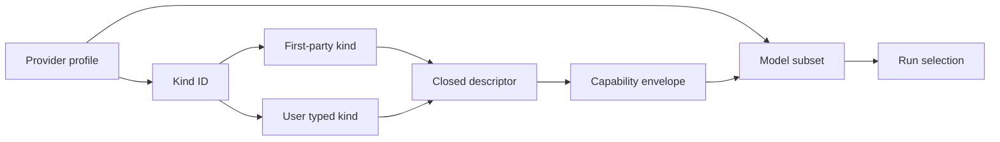

<!-- A profile selects one registered kind. Its model subset cannot exceed that
kind descriptor's code-owned capability envelope. -->

### Declarative typed kinds and credential transport

A future catalog has one global registry of user-declared
`ProviderKindId` definitions. A profile references one registered ID and owns
its model, endpoint, literal opaque credential, enablement, display name, and
execution policy. A kind definition is immutable by ID, may not replace a
reserved first-party ID (`openrouter`, `generic-chat-completion-api`, or
`responses`), and has a separate credential-free descriptor revision. Multiple
profiles may reference the same kind definition without sharing credential or
private client state.

A user-declared kind is a declarative composition of versioned, binary-owned,
closed protocol parts. The accepted combination must occur in a code-owned
compatibility matrix; composability does not permit an unbounded Cartesian
product. A kind definition cannot execute code, introduce an unknown wire
field, select an arbitrary parser, interpolate a secret, or modify a request
through raw JSON. The implementation may construct a private driver only for a
validated descriptor revision, and each descriptor/driver pair requires its
own fixture portfolio.

Every profile supplies exactly one opaque literal credential. A selected kind
descriptor chooses one closed credential transport: either
`Authorization: Bearer <credential>` or exactly one validated secret header
name whose value is exactly that credential, for example `x-api-key`. Header
names are code-validated safe metadata, not credential data. Arbitrary header
maps, multiple credentials, query credentials, header-value interpolation,
environment references, keychains, and raw-TOML adapter transport remain
excluded.

### Typed stateless reasoning dialect catalog

The initial user-kind catalog is deliberately broad in **typed stateless
textual** coverage, while remaining closed. Subject to the compatibility matrix
and a profile's declared model subset, it may express:

- Chat Completions SSE and an explicitly supported native streaming framing,
  including an Ollama-native framing where a dedicated descriptor owns it;
- textual reasoning fields `reasoning_content`, `reasoning`,
  `reasoning_details[].text`, and `message.thinking`;
- thinking activation as `thinking` with closed `enabled` or `adaptive` values,
  `enable_thinking`, `think` with a closed boolean or supported closed effort
  string, or no activation field;
- closed `reasoning_effort`, `thinking_budget`, and
  `thinking_token_budget` request fields only where a descriptor declares each
  field and its allowed values.

Each accepted textual reasoning fragment from these descriptors maps to the
future normalized reasoning path described below. The catalog does not support
encrypted or opaque provider reasoning payloads, server-side vLLM/SGLang parser
configuration, raw provider JSON, or generic request templates. The selected
cross-turn policy is limited to an explicit typed textual history contract;
provider-native `preserve_thinking`, `thinking.keep`, remote continuation
identifiers, and assistant-history requirements that do not fit that contract
remain excluded.

The current `async-openai` core Chat Completions adapter is not assumed to be
sufficient for every selected descriptor. A future implementation must choose
a pinned private SDK or an explicitly specified private typed decoder for each
closed descriptor. A descriptor registry never authorizes arbitrary network
protocol handling, unbounded parsing, or provider SDK data outside its owner
adapter.

### Normalized reasoning stream

The future normalized stream has one shared `RunEventCursorDto` for all
provider facts. Text, reasoning, summaries, tool calls, usage, and the terminal
fact retain the order in which the owning descriptor accepts them. Reasoning
does not receive a second sequence and does not become a separate event stream.

The closed reasoning categories are:

```text
ReasoningFragmentCategoryDto
  Primary
  Detail

ReasoningDeltaDto
  category
  content

ReasoningSummaryDeltaDto
  content
```

The future provider/model, domain, and durable representations are closed and
corresponding: `ModelEventDto::ReasoningDelta { category, content }` and
`ModelEventDto::ReasoningSummaryDelta { content }` normalize provider input;
`ModelRunFactInputDto::ReasoningDeltaRecorded { category, content }` and
`ModelRunFactInputDto::ReasoningSummaryDeltaRecorded { content }` persist it;
and the domain taxonomy has matching `ReasoningDeltaRecorded` and
`ReasoningSummaryDeltaRecorded` event variants. `ReasoningHistoryBound` is a
separate closed durable fact, never a provider stream event. A supported legacy
M4 `ReasoningDeltaRecorded { content }` decodes as historical `Primary`
reasoning evidence without rewriting its stored bytes; it has no synthetic
summary, category field, or history manifest.

`Primary` is the main textual reasoning representation and `Detail` is a
separate detailed representation. When one native response contains both
allowed representations, the descriptor emits both as separate ordered facts.
Equal text is not deduplicated. The descriptor owns the fixed field-path and
array-index order for values originating in one native response.

Every accepted fragment is durably appended immediately as its own typed fact;
adjacent fragments are never merged. A summary is a separate
`ReasoningSummaryDelta` fact and never replaces, hides, or merges a textual
`ReasoningDelta`. The run snapshot does not accumulate either form; replay and
live delivery reconstruct them from the durable tail.

An unknown, malformed, duplicate-where-the-descriptor-declares-single,
out-of-order, or post-terminal reasoning value fails closed with a safe typed
`provider_reasoning_stream_invalid` failure. The private native envelope,
field representation, and any unaccepted value are never persisted or
published; the accepted validated textual content is the normalized fact
content without semantic rewriting. The existing lifecycle, transaction,
cursor, publication, cancellation, and no-resume rules remain authoritative.
In particular, the first durable text, reasoning, summary, usage, or tool fact
makes provider retry ineligible.

The existing 512 KiB canonical individual-fact bound remains in force. The
combined canonical reasoning fragments and summaries of one run have a fixed
4 MiB bound. A fragment that would exceed the individual bound fails with the
existing fact-size failure; a fragment that would exceed the combined bound
fails with `reasoning_output_limit_exceeded`. Neither case truncates or
partially writes the fragment.

This contract does not add content inspection, secret substitution, or a new
reasoning redaction algorithm. Existing central redaction and credential,
provider-payload, SDK-resource, and diagnostic exclusion rules remain in force.

### Typed cross-turn reasoning history

The future provider descriptor may declare one of these closed policies:

```text
ReasoningHistoryTransferDto
  Disabled
  TextualHistoryV1 { compatibility_id }
```

`compatibility_id` is code-owned descriptor and compatibility-matrix metadata;
it is never inferred from a model name, endpoint, or equal text. Under
`TextualHistoryV1`, a run receives all causally preceding completed compatible
assistant responses in causal `RunStarted` order, then each response's facts in
their original run-cursor order. It receives both `Primary` and `Detail`
fragments and all reasoning summaries. The material is placed in a separate
typed reasoning history associated with the assistant response; it is not
converted into ordinary `ModelMessageDto` text.

Profiles and models may share historical reasoning only when their descriptors
explicitly declare the same `compatibility_id` and the same transfer semantics.
Encrypted, opaque, remote-provider, and otherwise unrepresentable material is
never transferred. A missing, corrupt, incompatible, or over-limit required
reference blocks only the dependent run before any provider call. The closed
results are `reasoning_history_unavailable` for missing or corrupt durable
material, `reasoning_history_incompatible` for a transfer-policy or
compatibility mismatch, and `reasoning_history_too_large` for the aggregate
bound. The run is never silently sent without required history.

Every dependent run receives an immutable
`ReasoningHistoryManifestDto` in the same durable transaction that creates its
`RunStarted` fact, including repository-owned queued-turn promotion. The
manifest contains the schema and transfer policy, compatibility identity,
ordered source-response references, per-entry digests and sizes, and one
canonical manifest digest. It contains no duplicate reasoning text. One source
response reference contains the source session/run, completed sequence, final
assistant-turn identity when present, and its ordered reasoning fact cursor,
category, digest, and size references. A compatible completed response with no
reasoning remains a typed empty reference, never an invented fragment.

The same transaction appends the closed `ReasoningHistoryBound` audit fact with
only the manifest digest, transfer policy, compatibility identity, source-entry
count, and aggregate canonical size. It records no reasoning text. Execution
verifies the manifest and its referenced durable facts, then constructs the
separate typed history without rescanning a live session, ancestor, or sibling.
The transfer policy and compatibility identity are immutable safe reasoning
provenance for that run.

`ReasoningHistoryBound` is an ordinary run-scoped domain audit event in the
same session transaction as `RunStarted`; it is not a `ModelRunFactDto`, is not
a provider-stream event, is not delivered in a run live batch, and leaves the
new run's model-fact cursor at zero. This preserves the M4 rule that only
accepted model facts advance `RunEventCursorDto`.

The complete required history has a 4 MiB canonical-data bound. It must be
transferred as a whole or the dependent run is rejected before provider work.
Historical M4 runs remain readable and do not acquire synthetic manifests.

### Reasoning usage and initial delivery

Future `UsageDto::Reported` includes an optional typed
`ReasoningUsageDto` with optional input and output token counts. Missing values
mean that the provider did not report that component, never zero. Reported
reasoning values are components of the corresponding total input/output
counts, not additional usage. Reconnect, replay, inheritance, and tree
aggregation must not charge or count the same source `RunId` twice. This
direction introduces no price, currency, or inferred cost.

The negotiated `normalized_reasoning_stream_v1` capability provides automatic
initial reasoning delivery through uncorrelated
`RunReasoningHistoryPageDto` and `RunReasoningHistoryCompletedDto` frames after
the existing correlated authoritative `RunReplayDto` snapshot response. A page
contains fixed session/run identity, the captured upper run cursor, and a
non-empty ascending list of only reasoning fragment or summary facts. Fact
cursors may be sparse but must be strictly increasing across all initial pages.
The completion frame repeats the fixed identities and captured upper cursor.

Under the serialized publication gate, the daemon captures that upper cursor,
registers the subscriber, and enqueues the correlated snapshot response, every
history page through the cursor, and the completion frame before it can enqueue
any later live fact. Live frames begin strictly after the captured cursor. The
client does not receive live reasoning before the initial history completes.

Pages expose both fragment categories and summaries in the same ordinary
run-subscription visibility class as live facts. They use the existing tail
bounds of at most 256 facts and 512 KiB of canonical fact data; they may
contain only reasoning and summary facts and therefore may be sparse relative
to the shared run cursor. An unavailable or incomplete initial history produces
typed resynchronization without client guessing. A client that did not
negotiate the capability does not receive a partially understood new history
form: a subscription to a run using a post-M4 reasoning fact fails closed with
`normalized_reasoning_stream_required`. Legacy M4 runs retain their existing
subscription behavior.

### Reasoning in branches

`ForkBaseSnapshotDto` stores only immutable typed references to the required
completed source response facts, under a field named
`inherited_reasoning_history_references`; it never copies reasoning text into
the snapshot. Each `InheritedReasoningHistoryReferenceDto` contains source
session/run and completed-sequence identity, final assistant-turn identity when
present, ordered reasoning fact cursor/category/digest/size references, and
the source descriptor's `compatibility_id`. `fork-model-context-v1` remains a
text-only projection and does not add reasoning or summaries to ordinary model
messages. A child run combines these frozen references with its own completed
compatible responses to construct its own `ReasoningHistoryManifestDto`. It
never rescans the source or a sibling. An unavailable required reference blocks
only the dependent action.

### Initial capability slice and immutable selection

This concept selects an initial, versioned provider/model capability slice:
text streaming, textual reasoning output, the closed supported sets of
`reasoning_effort` and `reasoning.mode`, reasoning-summary support, and custom
function-call admission. It is intentionally not the final cross-direction
capability taxonomy.

A kind descriptor declares the maximum protocol capability envelope. Each
profile explicitly declares a safe subset for its exact configured model,
including reasoning availability, supported effort and mode values,
summary availability, and custom-function-call availability. Model identifiers
remain byte-exact and are never used to infer capabilities. Preflight rejects a
requested capability or value that is absent from either level before any
outbound work occurs.

A future safe profile/run revision must include the kind ID, descriptor
revision, normalized effective endpoint (including the `responses` default
when it is used), selected credential-transport mode and safe header name when
applicable, declared model-capability subset, and resolved reasoning policy.
These are execution semantics, unlike a credential literal, display name, or
enabled state. They cannot silently change an accepted or queued run.

The resolved reasoning policy includes the closed fragment-category and summary
support, the `ReasoningHistoryTransferDto` mode, and `compatibility_id` when
transfer is enabled. It also records the fixed 4 MiB output/history limits and
the optional reasoning-usage interpretation. A selection that cannot represent
the descriptor's declared history transfer fails preflight before provider
work; it never falls back to a different transfer policy.

The same immutable selection records whether its descriptor/model subset
supports `model_tool_loop_v1` and the compatible local assistant-call/result
translation revision. The capability is absent unless the descriptor explicitly
declares that it can reconstruct each next request from local typed text,
`ModelToolExchangeDto`, and the selected reasoning history. It never licenses
remote conversation continuation, opaque provider items, provider-native state,
or an untyped call/result representation.

### Bounded `responses` v1

`responses` v1 is local-history-first. Every Responses request sets
`store: false`; the daemon continues to construct model context from Intention
Relay durable history and does not use OpenAI Conversations or
`previous_response_id`. It must neither request nor persist, publish, replay,
or depend on encrypted reasoning, opaque response output items, remote
conversation identifiers, or provider-managed history state.

The future provider-neutral contract adds closed `ReasoningEffortDto` values
(`none`, `minimal`, `low`, `medium`, `high`, `xhigh`, and `max`) and a
Responses-specific closed reasoning-mode projection (`standard` or `pro`). A
profile may select only values declared in its model subset; an unsupported
effort or mode fails preflight. The future resolved execution policy records
those values as immutable safe provenance.

For a `responses` profile whose model subset declares summary support, the
default request asks for an automatic provider reasoning summary. A returned
summary becomes a distinct tail-only `ReasoningSummaryDelta` and corresponding
durable fact. It is not a `ReasoningDelta`, is never raw chain-of-thought, and
does not enter model context or a run snapshot. It follows the normalized
reasoning cursor order, the 4 MiB per-run reasoning bound, the existing tail
replay and publication rules, and the selected initial-delivery contract. It
enters a typed `TextualHistoryV1` transfer together with the selected response's
textual reasoning fragments.

`responses` remains function-call-free unless its exact future descriptor/model
subset explicitly declares `model_tool_loop_v1`. Such a subset may send only
the code-owned schema derived from the registered Rust base-tool contract and
must use the selected local typed call/result exchange, never provider-built-in
tools, multimodal inputs, remote-continuation controls, or direct local tool
execution. An unexpected provider function-call item from a subset without
that capability fails normalization safely rather than becoming a `ToolCallDto`.
The closed M4 tool-denial boundary remains unchanged for every historical M4
run.

### Endpoint policy

All effective endpoint overrides are protocol-aware safe metadata. They must
be strict absolute HTTPS URLs with a non-root API base path. HTTP is permitted
only when the global explicit loopback policy is enabled and the host is exactly
`localhost`, `127.0.0.1`, or `[::1]`; no DNS resolution, aliases,
private-LAN expansion, or broader network permission is implied. User-defined
kinds require an explicit endpoint. `responses` alone may use its fixed OpenAI
default in place of an override. Endpoints reject userinfo, query, fragment,
malformed percent escapes, decoded control bytes, and control characters; their
canonical effective form enters immutable safe selection identity.

## Selected cross-direction closure

The constraints in this section close the common conceptual foundations shared
by provider profiles, reasoning, the Rust-owned capability plane, and session
branching. They do not approve code, a crate, a storage migration, a protocol
change, or a milestone. They preserve the closed M4 baseline and supersede only
conflicting future-concept statements in this document.

### Unified model-capability taxonomy

`ModelCapabilitySetDto` is the sole typed declaration of a provider/model
capability set. Its first closed form is conceptually:

```text
ModelCapabilitySetDto
  taxonomy_version = model-capability-taxonomy-v1
  input = TextOnly
  text_streaming = Enabled | Disabled
  structured_output = Unsupported
  reasoning = Disabled | TextualReasoningV1 { ... }
  tool_exchange = Disabled | ModelToolLoopV1 { translation_revision }
  context_preservation = LocalDurableHistoryV1 { reasoning_history_transfer }
```

The `taxonomy_version` is a closed typed value inside the existing canonical
`capability_subset` record. It is not inferred from a binary version, a model
identifier, a provider SDK, or a `supports_*()` convention. Unknown versions,
unknown values, and invalid combinations fail closed before outbound provider
work.

A kind descriptor declares the maximum capability envelope and a profile
declares the safe subset for its exact configured model. The immutable resolved
run selection stores their validated intersection. A driver verifies that it
implements the descriptor contract, but it does not introduce a second
capability source. Model identifiers remain byte-exact identifiers rather than
capability classifiers.

The first taxonomy deliberately represents structured output and non-text input
as explicitly unsupported rather than absent, inferred, or silently accepted.
Future structured-output modes or input modalities require a new closed typed
taxonomy version, a descriptor-owned wire contract, a profile-declared subset,
preflight rules, immutable selection persistence, and compatibility fixtures.
They cannot arrive through an optional boolean, raw provider JSON, a vendor
flag, or a new independently maintained `supports_*()` method.

The selected driver-contract compatibility policy also owns capability
semantics. A change to a request, normalization, stream ordering, credential
transport, or capability meaning that an older selection cannot safely assume
requires a new driver-contract major revision. A compatible extension requires
an explicitly supported minor revision and fixtures proving preserved
preflight, request, normalization, ordering, and redaction behavior.

### Immutable run-execution meaning

> **Historical-only where conflicting for new Mandate work.** Keep v1--v4
> schemas and selections below exactly readable. New Mandate work introduces a
> later, separate execution-meaning version; no old record acquires synthetic
> Mandate or verifier state.


`RunExecutionMeaningDto` is the credential-free immutable semantic portion of
a future post-M4 run snapshot. Its first form is conceptually:

```text
RunExecutionMeaningDto
  schema_version = run-execution-meaning-v4
  resolved_provider_selection
  model_capability_set
  context_projection_selection
  tool_execution_selection
  reasoning_history_manifest_reference
  terminal_provenance_references
  harness_selection = Disabled | ContinualHarnessSelectionV1 { ... }
  goal_selection = Disabled | GoalRunSelectionV1 { ... }
  mcp_selection = Disabled | McpMethodCatalogSelectionV1 { ... }
  programmatic_caller_policy_selection =
    Disabled | ProgrammaticCallerPolicySelectionV1 { ... }
  agent_activity_selection = AgentActivitySelectionV1 { ... }
```

It supplements rather than rewrites M4 run snapshots. Historical M4 snapshots
remain byte-for-byte readable under their existing schema and do not acquire a
synthetic `RunExecutionMeaningDto`.

The immutable meaning persists the resolved provider selection, the validated
capability set, every revisioned context-projection policy that affects model
input, and the compact active model-step/group/call summary already selected
for `model_tool_loop_v1`. A tool-execution selection is either `Disabled` or a
versioned `ModelToolLoopV1` selection carrying `ToolRegistryRevisionId`, the
code-owned admission-engine revision, the hook-pipeline revision, and the
ordered frozen set of active descriptors actually supplied to model requests:
the admission-engine revision identifies only the common typed admission
implementation and is distinct from the selected
`ProgrammaticCallerPolicySelectionV1`; each entry has
its `ToolId`, descriptor revision, function-schema revision, and safe-result-
projection revision. It also carries a `ReasoningHistoryManifestDto` reference
when reasoning transfer is required, and typed terminal references to tool
results, policy decisions, and child results.

These references preserve identity, revision or cursor, safe visibility class,
and provenance. They are never a substitute for raw content. Full tool output,
raw tool results, model-visible tool projections, reasoning text, reasoning
summaries, provider-native correlation values, and implementation resources
remain in bounded durable facts or owner records outside the compact snapshot.

The immutable meaning never contains credentials, opaque private clients,
provider SDK data, display names, enabled state, a whole catalog snapshot, raw
TOML, arbitrary logs, current machine state, current filesystem state, current
network state, or process state. Context and historical content reconstruct
only from the selected bounded durable facts and typed frozen references, never
from current configuration, a current registry, or a live ancestor session.

Profile availability, registry-entry availability, catalog activation,
daemon readiness, credential health, network health, and workspace state are
live daemon-computed projections. They may impose a stricter present-time
denial, but they never alter a stored execution meaning, reroute a run, replace
historical context, permit a fallback to a current default, or reconstruct a
model-tool selection from a current registry.

Historical M4 and v1/v2 post-M4 selections remain readable under their
recorded schema and do not acquire a synthetic v3 policy selection. Historical
v3 selections remain readable and acquire no synthetic v4 activity selection.
Every new v4 run records both `ProgrammaticCallerPolicySelectionV1` and
`AgentActivitySelectionV1` as selected above. Ordinary v4 runs set
`harness_selection = Disabled` and `goal_selection = Disabled`, but still
retain their programmatic-caller selection, including the narrow interactive
direct-local-read baseline when that is the only applicable rule. A launch
admitted by the
selected continual-harness model carries a separately versioned
`ContinualHarnessSelectionV1` nested record containing the harness identity,
active rule revision, durable trigger reason, class resolution, dossier digest,
checkpoint reference, time-zone application, and immutable bounds. Historical
M4 and other non-harness runs do not acquire a synthetic harness record. A
goal-directed run carries the selected `GoalRunSelectionV1` described above;
historical M4 and ordinary non-goal runs do not acquire a synthetic goal
record. A run whose selected frozen model-tool set omits `mcp` sets
`mcp_selection = Disabled`; otherwise it stores the selected
`McpMethodCatalogSelectionV1`. Historical M4 runs do not acquire a synthetic
MCP record. A future persistent kernel, child-agent model, or later selection
may add only another separately versioned typed nested record. It cannot


#### Mandate run execution meaning

New Mandate-owned work uses `MandateRunExecutionMeaningV1`, a later additive
execution-meaning version. It carries the immutable `MandateSelectionV1`,
Mandate-scoped activity selection, frozen Goal/MCP context when used, selected
provider/capability/descriptor set, and, when applicable, verifier authority,
immutable target-set, audit-contract, allowed-operation, reconciliation, and
complete Mandate/Goal/gate/evidence-contract baseline selections. Direct
invocation selection records active descriptors supplied to the selected
compatible model; it records no policy, confirmation, corridor, quota, or
root-origin authorization state.

```text
MandateRunExecutionMeaningV1
  resolved_provider_selection
  model_capability_set
  mandate_selection
  mandate_activity_selection
  context_projection_selection
  direct_tool_selection
  goal_context_selection
  mcp_selection
  verifier_selection_when_applicable
  terminal_provenance_references
```

`MandateRunExecutionMeaningV1` is credential-free and excludes raw objectives,
evidence bodies, prompts, tool output, provider resources, process state, live
configuration, and implementation handles. v1--v4 remain readable exactly as
recorded; no decoder infers a Mandate, verifier authority, or direct-admission
selection from their policy/activity fields. Canonical conceptual records for
verification authority, target set, audit contract/evidence, verdict, and target
mutation use new tags rather than modifying retained tags.

### Common durable facts, transactions, publication, and recovery

Every durable fact belongs to exactly one owning sequence:

| Fact kind | Owning sequence and effect |
| --- | --- |
| Session or run state transition | Ordinary session event sequence and affected projections/snapshots |
| Model, reasoning, or tool stream fact | Shared `RunEventCursorDto` for one run |
| Run audit without a model-fact cursor advance | Ordinary session transaction, not `ModelRunFactDto` |
| Explicit workspace-path observation | Ordinary session audit transaction associated with the `ToolCallId`; no `RunEventCursorDto` advance |
| Conversation-tree provenance | Separate monotonic lineage journal |
| Provider-catalog lifecycle | Separate typed configuration-audit sequence |
| Agent activity | Separate monotonic `AgentActivityJournalSequenceDto` for one `AgentActivityTreeId` |
| Local-user agent notification | Separate monotonic `AgentNotificationCursorDto` referring to one activity record |

A new fact type does not create a new sequence merely for convenience. A
separate sequence is permitted only for an independent aggregate with dedicated
bounded queries and without replacing or filtering the ordinary session event
sequence. A fact either changes a session/run projection or is audit-only. An
audit-only fact never advances `RunEventCursorDto`, never becomes an implicit
state transition, and is not automatically delivered in a run live batch.

Every semantic state transition commits its affected projection, typed event
envelope or envelopes, indexes, cursors, and required session/run snapshots in
one durable transaction, or commits none of them. A `ToolGroupRecorded` group,
`RunStarted` plus `ReasoningHistoryBound`, catalog acceptance, and fork creation
are examples of indivisible multi-fact transitions. A policy decision that
admits, waits, denies, or otherwise determines such a transition commits in the
same transaction as the outcome it governs.

An explicit local-path observation may be computed before `ToolCallStarted` and
written as the audit-only `WorkspacePathOutsideObserved` record. Its durable
write is best-effort: a storage failure does not deny, delay, retry, roll back,
or otherwise change the associated tool call. When the record is committed, it
is independently reread for audit availability, but it is never added to the
model-tool exchange, a run stream, or a user notification. No observation is
created for an unavailable or unresolvable link merely to fill an audit gap.

Each accepted `ToolOutputDeltaRecorded`, `ReasoningDeltaRecorded`, or
`ReasoningSummaryDeltaRecorded` fragment commits as one durable fact in its own
transaction. A repository batch cannot merge independently accepted fragments
into one transaction. The selected per-group tool-output budget is consumed in
that actual durable commit order.

No provider, scheduler, tool, shell, process, network action, kernel action,
filesystem action with an external effect, or hook with an observable external
effect occurs inside a durable state-transition transaction. Such work happens
before or after the transaction. A filesystem-dependent validation or hook must
finish before the transition transaction, and any stale result becomes a typed
known pre-effect outcome rather than an unrecorded second external check inside
the transaction.

Publication occurs only after a successful durable commit and an independent
reread of the exact committed scope. A publication failure never rolls back the
commit; a client recovers through durable replay or typed resynchronization,
not a persisted last-published cursor. Ordering is defined by
`RunEventCursorDto` within one run, `AgentActivityJournalSequenceDto` within
one activity tree, and `AgentNotificationCursorDto` within the local-user
notification journal. No artificial total order exists across independent
sessions, activity trees, lineage journals, or configuration-audit sequences.

When one subscription negotiates both normalized reasoning and the model-tool
loop, the publication gate captures one upper run cursor and emits this exact
initial order before any live frame:

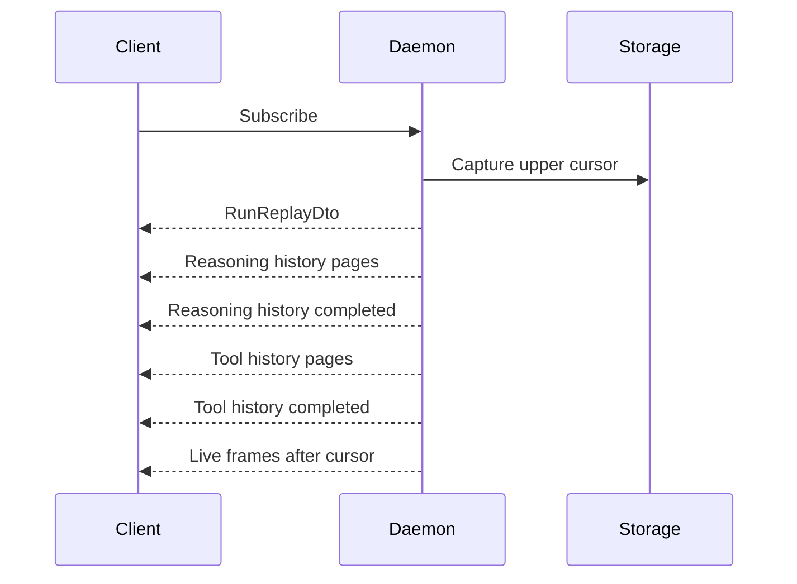

<!-- Every initial page uses the same captured upper cursor. -->

If either history class is absent, its pages and completion frame are omitted;
the remaining frames retain this order. Catalog and lineage audit records are
read through their own bounded queries and do not enter this run publication
gate merely because they are related to the same user operation.

Recovery never resumes a run, provider request, tool, process, kernel, or
external action. An already started action whose terminal effect is not proven
records `ExternalEffectUnknown`. An admitted action that has not reached
`ToolCallStarted` records the new terminal outcome `InterruptedBeforeStart`:
it is known not to have started, but it is never transferred to a later daemon
process. Recovery writes those missing terminal outcomes and the run transition
to `Interrupted` atomically. It never opens another model step, repeats a tool,
or reconstructs a remote continuation.

### Common historical-version policy

`intention-domain` owns versions for domain facts, semantic snapshots, and
canonical record tags. `intention-storage` owns storage migrations and their
ordering. `intention-protocol` owns public command, query, and frame schemas.
An owning provider driver owns its driver-contract compatibility. A future
direction owns the values of its own records, but cannot change a
cross-direction semantic record without an explicit new version.

Historical data falls into three classes:

| Class | Examples | Unknown or incompatible version |
| --- | --- | --- |
| Execution meaning | Provider selection, capability set, context selection, reasoning manifest, tool/policy selection | Keep history readable where possible; block dependent execution before external work |
| Replay data | Snapshots, model facts, reasoning facts, tool facts, projections | Require typed resynchronization or history unavailability; never guess or partly apply it |
| Audit data | Catalog lifecycle, lineage journal, policy audit | Keep unrelated projections valid; report the affected record as unavailable without exposing raw data |

Public DTO families use explicit schema versions and the established additive
compatibility policy. Canonical semantic records use fixed tags, exact field
tables, and explicit canonicalization versions in the existing `typed-tlv`
family. A migration may add an explicit bridge record, but it never rewrites a
stored event, snapshot, identifier, digest, or historical behavior.

A binary retains decoders and golden fixtures for every historical version it
claims is executable. An unknown, corrupt, or incompatible value is never
rebuilt from current TOML, a current registry, a live ancestor, or a repeated
external request. It leaves readable history available wherever the stored
replay data remains readable, but blocks the dependent action before provider,
tool, process, kernel, or other external work.

Materialized context projections follow the selected `fork-model-context-v1`
rule: a later implementation uses the stored compatible schema unchanged,
defines a separately versioned compatible projection, or blocks the dependent
operation. M3/M4 snapshots, events, identifiers, and replay behavior, including
`tool_execution_unavailable`, remain byte-for-byte preserved and acquire no
synthetic future facts.

## Concept capability portfolio

This concept now preserves five related but independently deliverable
directions:

1. provider profiles, immutable per-run selection, configuration change
   awareness, controlled reload, and a safe adapter configuration control
   plane;
2. reasoning support in the generic Chat Completions adapter, whose
   industry landscape, typed stateless dialect catalog, normalized stream,
   typed cross-turn history, accounting, and bounded Responses v1 constraints
   are recorded above; implementation still requires separate approval;
3. one Rust-owned capability plane shared by direct model tools and an optional
   IPython/RLM orchestration control plane, including the selected initial
   local `model_tool_loop_v1`, durable child-agent and continual-harness
   support, selected programmatic-caller policy, direct-pair agent
   communication, durable activity observation, and two-level local-user
   notifications under the same trusted user-privilege execution model;
4. non-destructive session branching, regeneration, and a bounded conversation
   tree over independently durable sessions; and
5. durable user goals, verification evidence, working memory, textual skills,
   reusable delegation roles, conversation compaction, and the bounded typed
   MCP gateway selected above.

These directions have different prerequisites and do not have to become one
milestone or implementation package. Together they are technically feasible,
but they cross configuration, persistence, composition, runtime, tools,
protocol, client, security, and presentation boundaries. None is a small
adjustment to the closed M4 baseline.

## Closed M4 baseline

The closed M4 baseline has one daemon-startup provider selection:

```toml
[provider]
kind = "openrouter" # or "generic-chat-completion-api"
model = "..."
endpoint = "..." # required for generic Chat Completions
credential = "..."
```

`ConfigSnapshotDto` retains a credential-free representation of that one
selection. A started or queued turn retains its immutable snapshot and
`ConfigRevisionId`; queue promotion must keep the original selection. Runtime
compares the persisted and currently available safe selection before a provider
call. A mismatch fails safely with `provider_configuration_unavailable` and
makes no outbound request.

This is a useful foundation for profiles because immutable per-run selection,
queue promotion, recovery-before-ready, and provider-neutral runtime contracts
already exist. It is not sufficient for a catalog because a safe selection has
no logical profile identity. Two targets with otherwise equal kind, model,
endpoint, and execution policy may still represent different intended
credentials, accounts, or routing policy.

The closed baseline also provides durable linear sessions, queued turns,
session/run replay, reconnect/resync, cancellation, and bounded provider-attempt
retry. It does not provide rewind to an earlier turn, session fork or clone,
history branches, branch switching, destructive tail truncation, or regeneration
from an earlier user turn. Replay restores committed state; provider retry
repeats one eligible attempt inside the same run. Neither operation creates an
alternative history.

## Non-destructive session branching and regeneration

### Selected concept constraints

The constraints in this section are the selected target semantics for future
replanning. They do not approve a public contract, storage migration, UI, crate,
milestone, or implementation.

### Branch model and user semantics

> **Historical-only where conflicting for new Mandate work.** Preserve the complete branching model below. A branch never copies active Mandate work, verifier authority, live grant, provider request, tool action, kernel task, MCP process, or unfinished external effect. It may obtain a new user-issued Mandate or verifier authority only through explicit new records. Retained policy inheritance and product ceilings are historical-only for new Mandate execution.


History remains append-only. An action described informally as rewind must
never truncate, delete, replace, or rewrite the source session. It creates a new
durable child `SessionId` from one committed boundary and leaves the source
session unchanged. The domain therefore retains independent sessions with
lineage, while presentation groups them into one conversation tree.

The primary user action is **Fork from here**. **Regenerate response** is a
shortcut for a fork from an eligible committed user turn followed by a separate
alternative run. Rewind is explanatory terminology only; it is not a command
name and must not imply that files, processes, remote systems, or other
external effects are rolled back.

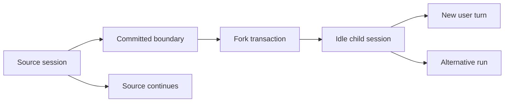

<!-- R starts only for a user-turn fork through a separate explicit command. -->

A root session and every descendant share a stable `ConversationTreeId`. A
child additionally records its immediate `ParentSessionId`, the
caller-provided globally stable `ForkOperationId`, and an immutable typed
`ForkBoundaryDto`. A nested fork points to its immediate source parent while
retaining the tree ID. The daemon, not a client, assigns a fresh random child
`SessionId` only after source validation succeeds. It stores that result against
the accepted fork operation, so a repeat of the same operation returns the same
child.

Every root tree ID is deterministic. The migration and every future root-session
creation calculate it as UUID version 5 with the code-owned RFC 4122 URL
namespace `6ba7b811-9dad-11d1-80b4-00c04fd430c8` and the ASCII name
`intention-relay/conversation-tree-v1/<canonical-session-uuid>`. The resulting
`ConversationTreeId` is persisted as an opaque UUID. This gives every existing
linear session one reproducible root tree without a nullable lineage mode,
without a history rewrite, and without depending on migration order. A child
always copies its parent's stored tree ID; it never calculates a tree ID from a
child identity.

Fork remains within one `ProjectId`, `WorkspaceId`, and immutable
`WorkspaceRoot`. A cross-project or cross-workspace copy is not a fork; it
requires a separate future clone/rebind workflow with its own filesystem,
provenance, and security decisions.

### Allowed boundaries and regeneration

The first public contract accepts exactly two closed `ForkBoundaryDto` variants:

1. `CommittedUserTurn { source_turn_id, accepted_sequence }` selects a
   non-queued source user turn that has a committed `RunStarted` fact. The child
   inherits the causal context through that user message but none of the model,
   tool, usage, failure, or assistant facts produced in response to it. The
   source run may still be `Starting`, `Running`, `WaitingInput`, `Cancelling`,
   or terminal, because none of its response facts enter this boundary. The
   fork transaction creates a child-owned user anchor with a new `TurnId`, equal
   validated user text, and typed provenance to the source session and turn.
   The materialized base context includes that user message exactly once. A
   separate idempotent `StartForkRunCommandDto` may start one alternative run
   from the anchor without appending the anchor a second time.
2. `CompletedAssistantTurn { source_run_id, final_assistant_turn_id:
   Option<AssistantTurnId>, completed_sequence, final_run_cursor }` selects the
   terminal response of a `Completed` run. `completed_sequence` is the source
   `Completing -> Completed` event sequence and `final_run_cursor` is the cursor
   containing that run's terminal `Finished` fact. The run must have one valid
   terminal `Finished` fact, no terminal failure, no pending
   permission/question, and no unfinished tool or child action. When final
   assistant text exists, `final_assistant_turn_id` is required and identifies
   its final contiguous assistant-content facts. When no assistant text exists,
   it is `None`. The child inherits the complete committed causal prefix through
   that terminal point, including eligible safe provenance. A completed run
   with no assistant text is valid: no synthetic empty assistant message is
   created, and the materialized context ends with the preceding real message.
   The child remains idle until a later ordinary user turn is accepted.

The contract rejects a queued source turn, an arbitrary session event or run
cursor, an incomplete assistant batch, an output from a `Failed`, `Cancelled`,
or `Interrupted` run, an incomplete `Completing` state, and any pending
interaction or non-terminal external action. Such state cannot be converted
into a synthetic completed turn or silently continued in the child.

Fork is independent of current source activity. An active source run may
continue, and a child may later run concurrently because the one-active-run
invariant remains per session. Source queued turns never cross the boundary;
the child starts with no queue, active run, waiting interaction, or admitted
external work. Existing archived descendants do not block a new fork. An
archived source remains readable and may be forked when its boundary remains
available and passes integrity checks, without restoring the source.

### Exact historical context projection

`fork-model-context-v1` materializes a closed text-only causal projection. It
does not replay a session projection, inspect a live ancestor, or infer history
from a current profile, tool registry, or provider implementation. Its ordered
messages are derived from the committed source facts at the selected boundary:

1. Traverse source `RunStarted` facts in source session-sequence order through
   the selected boundary. For each eligible started run, append its validated
   source user message once.
2. Immediately after that user message, append its final non-blank assistant
   message only when the run completed before the boundary with exactly one
   valid `Finished` terminal fact and no terminal failure. The final assistant
   text is the concatenation of its ordered durable assistant-content facts for
   its final assistant-turn identity.
3. For a `CommittedUserTurn` boundary, include the selected user message but
   never include any response fact from that selected run, even if the source
   later completed before the fork transaction. For a
   `CompletedAssistantTurn` boundary, include that run's selected final
   assistant message when it is non-blank; a valid empty response contributes
   no synthetic message.

The projection contains no reasoning delta, reasoning summary, or cross-turn
reasoning-history text, provider
attempt/failure detail, usage value, tool call, tool result, permission,
question, child result, VFR representation, Headroom-compressed
text, retrieval payload, raw provider item, or opaque provider-preserved
context. Usage and eligible terminal references are captured only in their
dedicated snapshot fields. Every message and instruction must already be a
safe model-visible typed value. The fork transaction rejects instead of
truncating a context or silently omitting any future model-visible value that
`fork-model-context-v1` cannot represent, with
`fork_context_schema_unsupported` or `fork_snapshot_too_large` as applicable.

The materialized instruction and message projection is the exact v1 inherited
context. A later context-builder, VFR, Headroom, tool-loop, reasoning, or child
agent evolution cannot reproject it. It must either use the stored compatible
context schema unchanged, define a separately versioned compatible stored
projection, or block a context-dependent operation. A newly mandatory hard
policy may enforce a stricter present-time denial, but it cannot replace,
remove, reinterpret, or fabricate a materialized historical message.

### Frozen base snapshot and integrity

Every child owns a self-contained, credential-free, typed
`ForkBaseSnapshotDto`. Even a nested fork receives a flattened snapshot of its
entire selected causal prefix; runtime context construction must not walk a
chain of live ancestors.

The historical `fork-base-snapshot-v1` schema remains one immutable canonical
record, not a collection of mutable or independently substituted records. It is
conceptually:

```text
ForkBaseSnapshotDto
  schema_version = fork-base-snapshot-v1
  canonicalization_version = typed-tlv-v1
  materialized_context_schema_version = fork-model-context-v1
  source_session_id
  conversation_tree_id
  boundary
  source_boundary_sequence
  source_run_cursors
  materialized_effective_instruction_projection
  materialized_model_messages
  inherited_future_defaults
  historical_config_policy_references
  safe_usage_provenance
  terminal_tool_result_references
  policy_decision_references
  terminal_child_result_references
  workspace_state = unverified
  canonical_snapshot_digest
  model_context_digest
```

The selected reasoning contract adds `fork-base-snapshot-v2`, whose canonical
form is `typed-tlv-v2`, not an additive reinterpretation of v1. It has every
v1 field unchanged plus typed `InheritedReasoningHistoryReferenceDto` values in
`inherited_reasoning_history_references`. New forks use v2. A v1 child remains
readable and may run when its selected history-transfer policy is `Disabled`; a
run that requires inherited textual history from a v1 snapshot fails before
provider work with `reasoning_history_unavailable`. No snapshot, digest, or
event stored under v1 is rewritten.

`materialized_effective_instruction_projection` freezes the safe system,
project, session, mode, policy, and future harness-derived instructions visible
at the boundary. `materialized_model_messages` is the complete ordered list of
non-empty user and assistant messages that the model would receive at that
boundary, including the selected user message for a user-turn boundary. It is
the authoritative inherited model context, rather than a request to rebuild
context from current source events. Later child-owned instructions and messages
are additive and separate; immutable hard policy continues to take precedence.

`inherited_reasoning_history_references` is a separately typed ordered list of
completed source response references required by compatible causally preceding
responses at the fork boundary. Each reference contains the transfer
`compatibility_id`, source run/completion/cursor range, per-fact category,
digest, and canonical size, but never referenced reasoning text. It is not part
of `fork-model-context-v1`; it is the sole source of inherited separate typed
reasoning history used to materialize a child run's manifest.

Every reference collection uses a closed tagged reference DTO with stable source
identity, source revision or cursor where applicable, safe visibility class,
and immutable provenance. The first vocabulary reserves only
`terminal_tool_result`, `policy_decision`, and `terminal_child_result`. A
category not yet produced by a delivered subsystem
is an empty typed collection, never an opaque placeholder, raw JSON, or an
untyped map. These references are audit and future-policy inputs, not implied
model-context content. Their producing directions must explicitly decide when
and how they become model-visible.

`workspace_state` has exactly one first-scope value, `unverified`. A fork makes
no statement about files, directories, repositories, processes, remote systems,
or other machine state at the boundary. It is not file-state evidence and does
not alter the selected tool or WorkspaceRoot semantics.

`fork-base-snapshot-v1`, `fork-preview-v1`, and `fork-command-v1` retain their
existing `typed-tlv-v1` framing and SHA-256 inputs exactly. Their v1 field
tables remain, respectively: `fork-base-snapshot`: `1 schema_version`,
`2 context_schema_version`, `3 source_session_id`, `4 conversation_tree_id`,
`5 boundary`, `6 source_boundary_sequence`, `7 source_run_cursors`,
`8 effective_instruction_projection`, `9 materialized_model_messages`,
`10 inherited_future_defaults`, `11 historical_config_policy_references`,
`12 safe_usage_provenance`, `13 terminal_tool_result_references`,
`14 policy_decision_references`, `15 terminal_child_result_references`, and
`16 workspace_state`; and
`fork-preview`: `1 preview_schema_version`, `2 source_session_id`,
`3 conversation_tree_id`, `4 boundary`, `5 source_head_sequence`,
`6 materialized_effective_instruction_projection`,
`7 materialized_model_messages`, `8 inherited_future_defaults`,
`9 historical_config_policy_references`, `10 safe_usage_provenance`,
`11 terminal_tool_result_references`, `12 policy_decision_references`,
`13 terminal_child_result_references`, and `14 workspace_state`. Field 6 is the
selected boundary sequence, not the
current source head observed during the fork operation.

`typed-tlv-v2` preserves the v1 framing, type tags, length encoding,
collection ordering, SHA-256 construction, and rejection behavior, changing
only the canonicalization-version byte and the fixed field tables below. New
forks use `fork-base-snapshot-v2` and `fork-preview-v2`: the base table is
`1 schema_version`, `2 context_schema_version`, `3 source_session_id`,
`4 conversation_tree_id`, `5 boundary`, `6 source_boundary_sequence`,
`7 source_run_cursors`, `8 effective_instruction_projection`,
`9 materialized_model_messages`, `10 inherited_future_defaults`,
`11 historical_config_policy_references`,
`12 inherited_reasoning_history_references`, `13 safe_usage_provenance`,
`14 terminal_tool_result_references`, `15 policy_decision_references`,
`16 terminal_child_result_references`, and `17 workspace_state`; the preview
table is `1 preview_schema_version`,
`2 source_session_id`, `3 conversation_tree_id`, `4 boundary`,
`5 source_head_sequence`, `6 materialized_effective_instruction_projection`,
`7 materialized_model_messages`, `8 inherited_future_defaults`,
`9 historical_config_policy_references`,
`10 inherited_reasoning_history_references`, `11 safe_usage_provenance`,
`12 terminal_tool_result_references`, `13 policy_decision_references`,
`14 terminal_child_result_references`, and `15 workspace_state`. The fixed
`fork-command` table is unchanged and uses
`typed-tlv-v1`:
`1 source_session_id`, `2 boundary`, `3 expected_source_sequence`,
`4 expected_preview_digest`, `5 title_present`, `6 requested_title`,
`7 future_profile_override_present`, and `8 future_profile_override`.
`canonical_snapshot_digest` is SHA-256 over that record excluding the resulting
digest field. `model_context_digest` is SHA-256 over the complete versioned
materialized instruction projection and ordered materialized model-message
projection, not over a later reconstructed request.

The command's `expected_preview_digest` is a distinct version-matched
`fork-preview-v1` or `fork-preview-v2` digest of the source/tree identities,
selected boundary, source head sequence, inherited future defaults,
materialized context, retained safe references, and `unverified` workspace
state shown to the caller. A `fork-command` digest
protects the complete semantic idempotency input, including source, boundary,
expected source sequence, expected preview digest, requested title, and safe
future-profile override, but excludes the daemon-assigned child ID and time.

The snapshot never contains credentials, provider SDK data, raw Jupyter frames,
arbitrary logs, pending external work, an implementation resource, raw provider
payloads, or a current source projection substituted after the fork. Snapshot
corruption, an unknown canonicalization/context schema, a digest mismatch, or
unreadable required durable history leaves the child and its lineage visible but
blocks context-dependent work with a closed `fork_history_unavailable` or
`fork_snapshot_unsupported` result. Runtime must never fall back to current
source history and silently change fork meaning. A later unavailable referenced
tool result, policy decision, or child result blocks only the action that
requires that reference with `fork_reference_unavailable`; it does not
invalidate already materialized messages or permit fabrication, omission, or a
live-ancestor substitution.


For every child run, context construction first validates and loads the child's
own `ForkBaseSnapshotDto`. It starts with that snapshot's materialized
instruction projection and model-message sequence, then appends only ordered
child-owned user messages and final completed child-assistant messages created
after the fork. It never scans the source session or a sibling. A user-boundary
anchor is already represented once in the base sequence, so a
`StartForkRunCommandDto` must not append the same local anchor a second time.
The existing linear projection rule remains applicable only to the child-owned
suffix. A missing, corrupt, or unsupported base snapshot blocks admission
before provider, tool, or other external work.
### Durable lineage layout and migration

The first storage model retains every branch as an independent ordinary session
and adds only typed fork-owned records. `conversation_trees` maps every stable
tree identity to exactly one root `SessionId`; roots are represented there and
never need a nullable parent field. `session_fork_lineage` contains one row only
for each child, with child ID, tree ID, immediate parent, operation ID,
boundary, creation ordering data, and immutable snapshot identity. A separate
`fork_base_snapshots` record is keyed by child session ID, while
`fork_operations` keys the canonical command digest and accepted result by
globally unique `ForkOperationId`. `conversation_lineage_events` is a separate,
monotonic per-tree audit sequence; it is not `domain_events` and cannot be read
as a session event tail. A fork-operation record retains the observed source
head sequence and preview digest separately from the base snapshot's selected
boundary sequence, so audit never conflates a source change check with the
causal history captured by the child.

Session title and archive state belong to the ordinary session projection and
its snapshots. The lineage projection carries only immutable parent/tree/fork
data plus creation ordering. Therefore a rename, archive, or restore updates
one session without rewriting a base snapshot, a parent, a tree record, or a
lineage event. A child snapshot has one immutable owner and cannot be shared,
replaced, or recomputed for a nested fork.

The SQLite migration from the current linear-session schema is additive. For
every pre-fork session, it inserts exactly one root tree row using the fixed
UUID-version-5 rule, no child-lineage row, no fork snapshot, and one
`ConversationTreeCreated` lineage-audit record. It preserves session IDs,
turns, runs, queues, configuration revisions, session event sequences, run
cursors, snapshots, and historical event JSON byte-for-byte. A later child
insertion atomically creates its own ordinary session records and a
`ConversationBranchLinked` lineage event. Migration never creates a synthetic
parent, user anchor, run, assistant message, or source-session event.

### Transaction, idempotency, and lifecycle

One SQLite transaction must create all of the following, or none of them:

- source-head and preview-digest checks;
- child session, presentation projection, and initial snapshots;
- conversation lineage and separate lineage-journal evidence;
- frozen base snapshot;
- required child-owned user anchor;
- closed child-session fork events; and
- the `ForkOperationId` plus its canonical command digest and accepted result.

Provider, scheduler, tool, shell, kernel, or other external work is forbidden
inside that transaction. The snapshot must therefore be bounded and derived
only from committed durable data.

The command must name the source session, typed boundary, `ForkOperationId`,
expected current source `SessionEventSequenceDto`, and the preview digest. The
source's ordinary event sequence must equal the expected value and the daemon's
fresh preview must equal the expected digest in the transaction that creates the
child. A source event committed after preview, including an archive, rename, or
source run state event, therefore requires a fresh source read. A separate
lineage-journal insertion never changes that ordinary source sequence and does
not make an already reviewed source stale.

`ForkOperationId` is a domain idempotency identity. Repeating an equal command
digest returns the same child result without a new event, snapshot, or lineage
record. Reusing the ID with a different source, boundary, expected values,
title, future-profile override, or other semantic option fails with
`fork_operation_conflict`. A source/head mismatch is `fork_source_changed`; a
preview mismatch is `fork_preview_mismatch`; an ineligible or unavailable
boundary is respectively `fork_boundary_ineligible` or
`fork_history_unavailable`.

Child-session events are ordered `SessionCreated`, `SessionForked`, then
`ForkAnchorMaterialized` when the selected boundary is a user turn. The child
owns those ordinary session events and snapshots. The separate per-tree
lineage journal orders `ConversationTreeCreated` for a root and
`ConversationBranchLinked` for every child with both source and child
identities, boundary, operation, and safe digests. It is the required short
source-side reference: ancestry queries can find a source's descendants without
altering the source session's event tail, projection, snapshot, or event
sequence. No synthetic source `SessionForked` domain event is appended.

After commit, the child is an ordinary idle session with no queued, starting,
active, or waiting run. A later scheduling, configuration, or provider failure
does not compensate or roll back the fork. The idle child remains visible and
can be retried, continued, renamed, or archived.

### Inherited state and live defaults

Historical context retains original per-run configuration, policy, and usage
provenance. Future child work inherits the source's effective session mode and
future provider-profile default at fork commit. Each new child run still
resolves and persists its own immutable current selection and policy snapshot;
a user-turn regeneration may provide an explicit safe profile override.
Presentation distinguishes historical selections in the base snapshot from the
child's future default when they differ.

`SessionTitleDto` is bounded to 128 Unicode scalar values after trim and NFC
normalization, and rejects blank, control, and bidi-override characters. An
adapter may request a title when it forks; otherwise the daemon stores a
deterministic safe title derived from the source title or its stable fallback
and the fork point. A migrated root session has no stored title and uses only
the stable presentation fallback until renamed. Rename changes one session
only, writes `SessionRenamed`, and never changes lineage, a base snapshot, or a
tree-wide title.

`ArchiveSessionCommandDto` and `RestoreSessionCommandDto` provide reversible,
per-session presentation state. Archive is accepted only when the session has
no queued turn, active run, waiting interaction, or other non-terminal work;
otherwise it fails `session_archive_not_idle`. It writes `SessionArchived`,
makes ordinary continuation and regeneration unavailable until restored, and
does not cancel, mutate, or delete history. `SessionRestored` reverses that
presentation state without altering lineage or the frozen snapshot. An archived
source remains read-only to an ancestry inspector and may be forked. Archival
cannot free an ancestor that remains an audit dependency.

### Workspace state and concurrent branches

Fork branches durable intent and model context, not the machine. The child may
share a `WorkspaceRoot` whose current files include source-branch or external
changes made after the selected boundary. No fork workflow automatically
reverts files, commands, repositories, remote APIs, or other side effects.

The first fork scope records only `WorkspaceStateDto::Unverified` in the base
snapshot and an equivalent safe notice in child summaries. It permits no claim
that a write in either branch is coordinated with a historical source read. The
fork contract does not otherwise describe current files.

### Child agents, usage, and external effects

The first snapshot schema retains typed read-only provenance references to
eligible terminal tool results, policy decisions, and terminal child results
before the selected boundary. These references do not copy, resume, re-admit,
or otherwise act on their sources. Running or queued children, unfinished tools,
and messages after the boundary are never copied, resumed, or re-admitted. The
selected RLM package defines the durable `RlmParentLinkDto` identity separately
from session-fork lineage: a delegated runtime child may own a session but does
not become a user-visible conversation branch without a separate explicit user
fork.

Inherited usage remains source provenance and is not charged to the child a
second time. Child totals count only child-owned runs; tree aggregates
deduplicate inherited usage by original `RunId`. Presentation must distinguish
own and inherited usage.

### Public workflow, protocol, and presentation

The first public workflow is user-initiated only. A model or IPython program
may recommend a fork but cannot create one until a later confirmation, quota,
and autonomous-branch policy is approved. The additive `session_fork_v1`
negotiated capability owns these public contract families:

```text
ForkSessionCommandDto
ForkSessionResultDto
GetForkPreviewQueryDto
ForkPreviewDto
StartForkRunCommandDto
GetConversationTreeQueryDto
ConversationTreePageDto
ConversationBranchSummaryDto
RenameSessionCommandDto
ArchiveSessionCommandDto
RestoreSessionCommandDto
```

`ForkSessionCommandDto` contains source session identity, typed boundary,
`ForkOperationId`, expected source sequence, expected preview digest, optional
validated title, and optional safe future-profile override. It never accepts a
client-selected child ID, raw snapshot, raw event, configuration path,
credential, workspace path, or opaque implementation value.
`ForkSessionResultDto` is bounded and returns child and tree identities,
immediate parent, accepted boundary, optional child-anchor `TurnId`, snapshot
and context schema versions/digests, inherited future defaults, and the closed
`unverified` workspace notice. It does not return the up-to-1-MiB base snapshot
inside a transport response.

`GetForkPreviewQueryDto` takes only source session and a candidate typed
boundary. `ForkPreviewDto` returns a fresh source sequence, the
`fork-preview` digest, accepted boundary data, safe inherited future defaults,
the deterministic fallback title, counts and safe types of retained terminal
references, count and aggregate canonical size of inherited reasoning-history
references, and the closed `unverified` workspace state. The existing source
session/run history remains the presentation source for inherited message text;
the preview never turns a base snapshot, full prompt projection, reasoning
text, credential, or tool result into a broad tree-query
payload. The client must send the exact preview digest it accepted in
`ForkSessionCommandDto`; it must not manufacture a preview digest locally.

`StartForkRunCommandDto` names the child session, the immutable anchor turn,
and a separate operation ID. It is valid only for a non-archived child created
from a user-turn boundary whose anchor has not already started a fork run. It
uses the anchor already included in the frozen context, resolves one immutable
current run selection under the normal admission rules, and starts no duplicate
user message. The operation ID has the same equal-command/idempotent-result and
changed-command conflict behavior as `ForkOperationId`. Its failure leaves the
idle child visible.

`RenameSessionCommandDto`, `ArchiveSessionCommandDto`, and
`RestoreSessionCommandDto` each carry a session ID, expected ordinary session
sequence, and a globally stable `SessionPresentationOperationId`; rename also
carries a `SessionTitleDto`. Equal repeats return the original accepted result.
A reused operation ID with different semantics fails
`session_presentation_operation_conflict`; a stale sequence fails
`session_changed`. A command that already observes its requested presentation
state succeeds with `changed = false` and appends no event. Archive still
performs its mandatory idle check before either outcome.

`GetConversationTreeQueryDto` contains a `ConversationTreeId`, optional parent
`SessionId`, optional opaque continuation token, and requested page size from 1
through 64. It returns the root summary, at most 64 immediate child summaries,
`has_more`, and an opaque continuation after the final `(created_at,
child_session_id)` sort key. A tree is intentionally live between pages: new,
renamed, archived, restored, or otherwise changed branches may appear on later
pages, and a continuation never promises a revision-consistent tree snapshot.
It remains safe because ordering is stable, records before the continuation are
not repeated, and the response reports the observed lineage sequence. A token
with another tree, another parent, malformed contents, or an oversized page
fails closed with `invalid_conversation_tree_page`.

`ConversationBranchSummaryDto` exposes only branch identity, immediate parent,
creation ordering data, safe title or stable fallback, archive state, mode,
safe future-profile availability, fork point, and `unverified` workspace state.
The immutable base snapshot and its retained source content are not list data.
Tree and lineage reads validate that every named session belongs to the same
tree, project, and workspace. The local single-user daemon remains the
authorization boundary; this does not introduce an account or cross-user access
model.

Existing session and run subscriptions remain session-scoped. Ordinary session
queries do not acquire an unbounded ancestry payload, and this package creates
no tree-wide event stream. A tree query reads the bounded lineage projection;
older clients that have not negotiated `session_fork_v1` receive the typed
unsupported result and retain existing session/run behavior without a protocol
major change.

Presentation groups related sessions below one conversation root and lazily
shows branch title, status, profile, mode, fork point, archive state, the
unverified-workspace warning, and ancestry breadcrumbs. Opening a branch opens
an ordinary session by `SessionId`. A regenerate shortcut performs a user-boundary
fork and then a separate `StartForkRunCommandDto`; failure of the second action
leaves the idle branch visible.

### Audit, retention, and bounded policy

The closed first-scope ordinary-session taxonomy adds `SessionForked`,
`ForkAnchorMaterialized`, `SessionRenamed`, `SessionArchived`, and
`SessionRestored` to the existing `SessionCreated` and run taxonomy. The
separate closed lineage taxonomy is `ConversationTreeCreated` and
`ConversationBranchLinked`. The fork events identify immutable provenance; the
last three ordinary events identify presentation-state changes.
`StartForkRunCommandDto` uses ordinary user/run events plus stored fork
provenance. Generic metadata events, raw snapshot blobs, and a synthetic
source-session fork event are not acceptable audit boundaries.

Initial retention is reversible archive/hide only. Physical deletion is
forbidden while descendants or audit dependencies exist, and this package
introduces no physical deletion command at all. Reference-counted garbage
collection, cascade deletion, export, and destructive history cleanup remain
separate future decisions.

The first scope uses fixed code-owned limits. They are enforced inside the fork
transaction before any partial child record exists, and every limit failure is a
typed policy result rather than an oversized transport frame, partial branch,
or unstructured storage error.

| Subject | Limit | Enforcement |
| --- | ---: | --- |
| Root-to-child depth | 4,096 | A root has depth 0; reject a child at depth 4,097 with `fork_tree_depth_limit`. |
| Descendants in one tree | 16,384 | Root is not counted; reject before a 16,385th child with `fork_tree_descendant_limit`. |
| Forks from one source boundary | 16 in a rolling hour | Count accepted operations by exact source and boundary; reject with `fork_boundary_rate_limit`. |
| Canonical `ForkBaseSnapshotDto` | 1 MiB | Reject before persistence with `fork_snapshot_too_large`; never truncate context or references. |
| Tree query page | 64 summaries | Reject page sizes outside 1..=64 with `invalid_conversation_tree_page`. |
| Session title | 128 NFC Unicode scalar values | Reject invalid title before the command digest or presentation event. |

The source boundary rate window uses durable accepted timestamps. A rejected,
expired, or rolled-back attempt consumes no quota. Boundaries, base snapshots,
lineage, and idempotency records remain indefinitely readable under the initial
archive-only retention policy.

## Selected concept constraints: provider profiles

The constraints in this section are selected target semantics for future
replanning. They do not approve a configuration migration, protocol, storage
schema, driver registry, UI, crate, milestone, or implementation.

### Profile identity, configuration shape, and credentials

A `ProviderProfileId` is immutable and is both the TOML key in
`[profiles.<id>]` and the durable logical profile identity. It must match
`[a-z0-9]+(?:-[a-z0-9]+)*`, remain within a future bounded length, reject
uppercase rather than silently normalizing it, and reject the reserved prefixes
`system` and `legacy`. It is never derived from a model, endpoint, or
credential, cannot be renamed, and is never reused after deletion. Renaming an
ID is an atomic removal of the old identity and creation of a new one, with no
heuristic based on equal safe selections.

`display_name` is optional presentation metadata. When present, it is trimmed,
non-blank bounded Unicode plain text that rejects control and bidi-override
characters. It is not unique, does not enter a profile revision, and is not
model-visible. Adapters must render it as escaped plain text, while the exact
`ProviderProfileId` is the deterministic display fallback and disambiguator.

The first catalog schema is version 2 and is conceptually shaped as follows:

```toml
schema_version = 2
allow_insecure_loopback_provider_http = false

[defaults]
profile = "gpt-5-6"

[defaults.execution]
attempt_timeout_seconds = 30
max_attempts = 2

[profiles.gpt-5-6]
kind = "responses" # fixed default endpoint: https://api.openai.com/v1
model = "gpt-5.6-terra"
credential = "..."

[profiles.gpt-5-6.capabilities]
text_streaming = true
textual_reasoning = true
reasoning_efforts = ["none", "low", "medium", "high", "xhigh"]
reasoning_modes = ["standard", "pro"]
reasoning_summary = true
custom_function_calls = false

[profiles.gpt-5-6.reasoning]
effort = "medium"
mode = "standard"

[kinds.local-deepseek]
stream = "chat-completions-sse-v1"
reasoning_output = "reasoning-content-v1"
thinking_activation = "thinking-enabled-v1"
reasoning_effort = "reasoning-effort-v1"
credential_transport = "bearer-authorization-v1"

[profiles.local-deepseek]
kind = "local-deepseek"
endpoint = "http://127.0.0.1:8000/v1"
model = "deepseek-v4"
credential = "..."

[profiles.local-deepseek.capabilities]
text_streaming = true
textual_reasoning = true
reasoning_efforts = ["low", "high"]
reasoning_modes = []
reasoning_summary = false
custom_function_calls = false

[profiles.local-deepseek.execution]
attempt_timeout_seconds = 60
```

All tables are typed and reject unknown fields. `kinds` contains only
user-declared compositions of closed versioned parts, while a profile contains
one registered kind reference, model, literal credential, enabled state,
display name, endpoint, declared model-capability subset, an optional reasoning
policy, and an optional execution-policy override. The global and per-profile
execution tables merge field by field, then validate and resolve to one
immutable effective policy. A missing `enabled` means `true`.

The closed M4 kinds `openrouter` and `generic-chat-completion-api` remain valid
for historical M4 data. A future catalog additionally reserves the first-party
`responses` kind and may contain user-declared `ProviderKindId` definitions from
the global typed kind registry. A user-defined ID is not an executable provider
string: it references a validated composition of binary-owned, versioned,
closed protocol parts. Profiles do not introduce plug-ins, raw HTTP/JSON
templates, arbitrary header maps, multiple credentials, environment
references, keychain references, query credentials, or untyped provider-
specific parameters.

A profile may select a safe model-capability subset and a kind-declared
credential transport. The subset and transport metadata are execution
semantics and participate in future profile/run selection identity; display
name and enablement remain catalog metadata. `responses` uses the fixed OpenAI
base URL when its endpoint is absent, while user-defined kinds require an
explicit endpoint.

Every profile, including a disabled one, requires a non-blank literal
`credential`. All credentials become private opaque non-`Debug`, non-serde
material during parsing. They never enter SQLite, DTOs, snapshots, events, logs,
diagnostics, display metadata, source digests, or public errors. Identical
literals may appear in multiple profiles, but the daemon neither compares nor
deduplicates them; every profile keeps independent private client/driver state.
`credential_configured` remains in safe catalog DTOs with value `true` for
accepted profiles. It is configuration presence, never credential health.

The existing v0 migration first normalizes to v1 and then materializes one v2
profile named `default`; v1 migration does the same directly. It also
materializes the deterministic first-party kind and descriptor revision for the
original M4 selection, with the original M4 capability subset and execution
policy. The effective global default becomes `default`. Migration is in memory
only and must not rewrite the physical TOML file. Once durable catalog history
contains more than that one exactly representable profile, a user-defined kind,
or an incompatible first-party descriptor revision, a v0/v1 file fails closed
with `legacy_config_cannot_represent_active_catalog`. A tombstoned `default`
similarly makes legacy migration fail closed rather than weakening ID non-reuse.

### Safe selections, revisions, and endpoints

`ProviderProfileRevisionId` is a deterministic versioned digest of the
canonical credential-free execution selection. Its digest input is the
following DTO, not a serialization that contains its resulting ID:

```text
ProviderProfileRevisionDto
  profile_id
  canonicalization_version
  kind_id
  kind_descriptor_revision
  model_id
  normalized_endpoint
  credential_transport
  declared_model_capability_subset
  resolved_reasoning_policy
  effective_execution_policy
  effective_loopback_policy_or_not_applicable
```

The profile revision changes when the profile ID, kind ID, descriptor revision,
exact trimmed model, normalized effective endpoint, credential transport,
declared model-capability subset, resolved reasoning policy, resolved execution
policy, or resolved insecure-loopback security policy changes. It does not
change for TOML order or whitespace, display name, enabled state, source path,
or credential-only edits. The loopback-policy field is `not_applicable` for an
HTTPS effective endpoint or a kind with no endpoint override. It records the
effective allow-insecure-loopback policy only for a permitted HTTP literal
loopback endpoint, where changing that policy changes whether the selection can
execute.

`CatalogRevisionId` is a separate deterministic versioned digest of sorted
profile IDs and their safe profile revisions, accepted typed kind descriptors
and their safe revisions, enabled states, validated display names, the global
default, and effective global security policy. TOML order, whitespace,
credentials, and configuration path do not contribute. It captures
catalog/pagination/presentation semantics without making cosmetic metadata an
execution selection revision. `display_name` is trimmed, rejects controls and
bidi overrides, is normalized to Unicode NFC during catalog validation, and is
then encoded as NFC UTF-8 in the catalog digest. Model IDs and normalized
endpoint routing bytes retain their separately selected byte-exact semantics;
they are not Unicode-normalized by this display-only rule.

For catalog/profile-era snapshots, `ConfigRevisionId` is the run-wide identity
of a canonical full safe `ConfigSnapshotDto`. It is distinct from catalog and
profile revisions and is reusable when the complete selected safe run
configuration is equal. The closed M4 UUID `ConfigRevisionId` remains legacy
persisted data and is not retroactively reinterpreted as a SHA-derived ID. A
run snapshot contains the resolved `ProviderProfileId`, kind ID, descriptor
revision, profile revision, model, normalized effective endpoint,
credential-transport metadata, declared model-capability subset, resolved
reasoning policy, effective execution policy, applicable loopback policy,
driver-contract revision, and selection source. It contains neither a
credential literal, display name, enabled state, nor a whole catalog snapshot.
`CatalogRevisionId` is safe catalog provenance for queries and audit, but is not
an execution input and must not make a queued run unavailable merely because a
display, pagination, or other catalog-only value changed.

### Canonical revision encoding and immutable selection identity

All future safe revision digests in this direction use one closed
canonicalization family, `typed-tlv-v1`, and SHA-256. This explicitly excludes
JSON object ordering, Rust struct layout, serde behavior, and a third-party
CBOR implementation from revision identity. The full preimage is a typed record
with the following byte layout:

```text
"IRCD"                         # four ASCII magic bytes
u8(1)                           # canonicalization version
u8(record_tag_length)
ASCII(record_tag)               # e.g. provider-profile-revision
field*                          # strictly increasing numeric field tags

field := u16(field_tag) | u8(value_type) | u32(value_length) | value_bytes
```

All unsigned integers use their fixed-width big-endian representation. A
The `value_type` byte is fixed as follows: `0x01` Boolean, `0x02` unsigned
integer, `0x03` closed ASCII identifier or enum, `0x04` UTF-8 text,
`0x05` tagged revision/identity reference, `0x06` nested record, `0x07`
ordered list, and `0x08` canonical set. A Boolean is exactly one byte, `0` or
`1`; an unsigned integer is exactly eight big-endian bytes; closed identifiers
are validated ASCII; UTF-8 text has the field-specific normalization rule; and
a nested DTO is its own complete typed record. A list or set value starts with
a big-endian `u32` count and then contains `u8(element_type) |
u32(element_length) | element_bytes` for every item. List order is declared
order; set items sort lexicographically by that complete canonical element
encoding and reject duplicates. An optional value has a distinct Boolean
presence field, followed by its value field exactly when present. Unknown tags,
repeated tags, a non-increasing tag order, a wrong type, an inconsistent length,
invalid UTF-8, or an inconsistent optional/list/set shape invalidates the
record. Every record tag owns a fixed field-tag table; adding or reinterpreting
a field requires a new canonicalization version rather than an inferred
binary-version change.

The initial record-tag table is closed for this package:

| Record tag | Canonical fields in increasing tag order |
| --- | --- |
| `provider-profile-revision` | `1 profile_id`, `2 kind_id`, `3 kind_descriptor_revision_id`, `4 model_id`, `5 endpoint_present`, `6 normalized_endpoint`, `7 credential_transport`, `8 capability_subset`, `9 reasoning_policy`, `10 execution_policy`, `11 loopback_policy_or_not_applicable` |
| `provider-kind-descriptor-revision` | `1 kind_id`, `2 descriptor_family`, `3 descriptor_parts`, `4 credential_transport`, `5 capability_envelope` |
| `catalog-revision` | `1 profile_entries` sorted by `profile_id`, `2 kind_descriptor_entries` sorted by `kind_id`, `3 default_profile_id`, `4 global_security_policy` |
| `execution-provider-selection` | `1 profile_id`, `2 profile_revision_id`, `3 kind_id`, `4 kind_descriptor_revision_id`, `5 model_id`, `6 endpoint_present`, `7 normalized_endpoint`, `8 credential_transport`, `9 capability_subset`, `10 reasoning_policy`, `11 execution_policy`, `12 loopback_policy_or_not_applicable`, `13 driver_contract_revision` |
| `resolved-run-provider-selection` | `1 execution_provider_selection`, `2 selection_source` |
| `config-revision` | `1 execution_provider_selection` |
| `legacy-m4-selection-binding` | `1 legacy_config_revision_id`, `2 legacy_snapshot_schema`, `3 legacy_safe_selection`, `4 default_profile_id`, `5 default_profile_revision_id`, `6 kind_descriptor_revision_id`, `7 capability_subset`, `8 execution_policy`, `9 driver_contract_revision` |
| `tool-descriptor-revision` | `1 tool_id`, `2 intended_owner`, `3 input_schema_reference`, `4 result_schema_reference`, `5 required_model_capabilities`, `6 tool_effect_profile`, `7 workspace_binding`, `8 mode_relation`, `9 model_schema_availability`, `10 model_function_schema_revision`, `11 safe_result_projection_revision`, `12 observation_contract_revision`, `13 stream_shape` |
| `tool-registry-revision` | `1 fixed_tool_slots` in canonical `ToolId` order, each with intended owner, `Reserved`/`Active` state, and active descriptor revision when present |
| `bridge-invocation-v1` | `1 authority_context_identity`, `2 bridge_operation_id`, `3 tool_id`, `4 tool_descriptor_revision`, `5 typed_input_digest` |
| `workspace-path-observation-v1` | `1 tool_call_id`, `2 tool_id`, `3 descriptor_revision`, `4 observation_kind`, `5 observed_path_count` |
| `programmatic-caller-policy-revision` | `1 policy_id`, `2 policy_scope`, `3 calendar_period_kind`, `4 root_origin_rules`, `5 admission_rules`, `6 per_run_limits`, `7 calendar_limit`, `8 inherited_policy_references` in declared narrowing order |
| `effective-programmatic-caller-policy-snapshot` | `1 root_origin`, `2 selected_policy_revisions` in declared scope/narrowing order, `3 inherited_scope_provenance`, `4 effective_rule_projection`, `5 fixed_run_limits`, `6 calendar_counter_references`, `7 interactive_local_read_baseline_present` |
| `programmatic-caller-policy-selection-v1` | `1 root_origin`, `2 effective_policy_snapshot_reference`, `3 policy_selection_digest`, `4 inherited_scope_provenance`, `5 fixed_run_limits` |
| `run-execution-meaning-v3` | `1 resolved_provider_selection`, `2 model_capability_set`, `3 context_projection_selection`, `4 tool_execution_selection`, `5 reasoning_history_manifest_reference`, `6 terminal_provenance_references`, `7 harness_selection`, `8 goal_selection`, `9 mcp_selection`, `10 programmatic_caller_policy_selection` |
| `agent-activity-tree-v1` | `1 activity_tree_id`, `2 root_session_id`, `3 root_run_id`, `4 root_origin`, `5 activity_exchange_revision`, `6 activity_journal_revision`, `7 user_projection_revision`, `8 fixed_activity_limits` |
| `agent-activity-pair-v1` | `1 pair_id`, `2 activity_tree_id`, `3 direct_parent_link_reference`, `4 parent_session_run`, `5 child_session_run`, `6 pair_ordering_revision`, `7 directional_queue_limits`, `8 control_reserves` |
| `agent-message-v1` | `1 message_id`, `2 activity_tree_id`, `3 pair_id`, `4 pair_order`, `5 direction`, `6 kind`, `7 sender_run_reference`, `8 recipient_run_reference`, `9 source_model_step_reference`, `10 safe_text`, `11 typed_references`, `12 delivery_state` |
| `agent-activity-journal-record-v1` | `1 activity_tree_id`, `2 record_id`, `3 sequence`, `4 occurred_at`, `5 root_run_reference`, `6 direct_pair_reference_present`, `7 direct_pair_reference`, `8 record_kind`, `9 safe_user_projection`, `10 typed_references` |
| `agent-activity-selection-v1` | `1 selection_kind`, `2 activity_tree_id`, `3 root_origin_or_parent_link`, `4 activity_exchange_revision`, `5 activity_journal_revision`, `6 user_projection_revision`, `7 fixed_activity_limits` |
| `agent-notification-record-v1` | `1 notification_cursor`, `2 activity_tree_id`, `3 activity_record_reference`, `4 level`, `5 reason`, `6 safe_counts_and_states`, `7 occurred_at` |
| `run-execution-meaning-v4` | `1 resolved_provider_selection`, `2 model_capability_set`, `3 context_projection_selection`, `4 tool_execution_selection`, `5 reasoning_history_manifest_reference`, `6 terminal_provenance_references`, `7 harness_selection`, `8 goal_selection`, `9 mcp_selection`, `10 programmatic_caller_policy_selection`, `11 agent_activity_selection` |

Fields named `credential_transport`, `capability_subset`, `reasoning_policy`,
`execution_policy`, `loopback_policy_or_not_applicable`, `driver_contract_revision`,
policy scope/rules/limits/selections, and descriptor/catalog entries are nested
closed typed records. Their owning DTO defines its own fixed record tag and
field table under the same version; they cannot be maps, raw JSON, or opaque
vendor blobs. `endpoint_present` is the required optional-presence Boolean for
`normalized_endpoint`. A `Disabled` policy selection is one closed enum value;
it has no omitted mutable fields. Ordered policy revisions retain the declared
scope/narrowing order and reject a duplicate, reordered, missing, unknown,
corrupt, or incompatible reference.

The digest is SHA-256 over those complete bytes. New IDs serialize as ASCII
`sha256-v1:<64 lowercase hexadecimal characters>`. The future typed revision-ID
decoder also recognizes a legacy UUID form for existing M4
`ConfigRevisionId` values. New bridge metadata refers to that legacy value as
`legacy-uuid:<canonical UUID>`; it does not rewrite the UUID embedded in an old
snapshot or manufacture a second identity for it. Equality of a SHA-derived
revision requires its tag, canonicalization version, and full digest. It never
means only that two strings happen to display alike.

`ProviderKindDescriptorRevisionId`, `ProviderProfileRevisionId`,
`CatalogRevisionId`, new `ConfigRevisionId` values, the policy records above,
and the activity records above use distinct record tags within this family. In
this package, the `config-revision` record contains the complete credential-free
provider selection. A later cross-direction run policy or activity selection
cannot be silently added under this tag or inferred from a binary version;
`run-execution-meaning-v3` owns the separate policy selection and
`run-execution-meaning-v4` owns its separate activity selection. Existing
`run-execution-meaning-v1`, `run-execution-meaning-v2`, and
`run-execution-meaning-v3` field tables remain unchanged. `ConfigRevisionId`
does not include `CatalogRevisionId` or
`selection_source`. The latter is immutable audit provenance, not wire
semantics. The digest deliberately excludes credential literals, opaque client
state, display data, enabled state, raw TOML, source path, and capture time.
Thus a credential-only restart may construct a new private client for the same
safe selection without rewriting queued historical provenance.

```text
ResolvedRunProviderSelectionDto
  selection_canonicalization_version
  profile_id
  provider_profile_revision_id
  kind_id
  kind_descriptor_revision_id
  model_id
  normalized_effective_endpoint
  credential_transport_mode
  credential_transport_safe_header_name
  declared_model_capability_subset
  resolved_reasoning_policy
  effective_execution_policy
  effective_loopback_policy_or_not_applicable
  provider_driver_contract_revision
  selection_source                 # immutable provenance, outside execution digest
```

The selection record is immutable at admission for both a starting run and a
queued turn. The runtime must verify its typed canonical form and digest before
using it, then use the complete execution fields, rather than a model-name
heuristic, current default profile, or subset of accidental current fields.
The model receives only the concrete model/capability context required to make
the request, never profile/catalog identifiers or endpoint metadata.

Canonicalization migration is additive and evidence-driven. A supported binary
retains the decoder and golden fixtures for every executable historical version
it claims to support. It may create an explicit bridge record to a newer
selection representation, but it never rewrites an existing digest or silently
substitutes current configuration. An unknown version, malformed TLV record, or
digest mismatch leaves readable run/session history available wherever the
stored replay data itself is readable, but blocks execution.

### Historical selection verification and driver compatibility

`ProviderDriverContractRevisionDto` is code-owned and contains a descriptor
family plus monotonic `major.minor` values. A major increment is required for a
request, response-normalization, stream-ordering, capability, or credential
transport semantic change that an old selection cannot safely assume. A minor
increment represents an explicitly versioned compatible extension. Matching the
same family and major does **not** automatically make every old minor revision
executable: a current driver must explicitly declare each older
`family/major/minor` revision it supports, with compatibility fixtures proving
the preserved request, normalization, preflight, and redaction semantics. A
major mismatch is always incompatible.

Before any outbound provider work, the runtime verifies the persisted selection
digest, resolves the exact active private registry entry by profile ID, profile
revision, descriptor revision, and driver-contract compatibility, and checks
that the profile remains executable. It must not reroute to a current default,
fall back to a same-model profile, or rebuild historical selection semantics
from current TOML. A credential literal is intentionally not compared; a
credential-only restart may supply fresh private material only after all safe
execution fields match.

The compatible top-level failure remains
`provider_configuration_unavailable`. Its future closed safe detail states one
of: `historical_selection_corrupt`,
`historical_selection_version_unsupported`, `profile_absent`,
`profile_tombstoned`, `profile_disabled`, `profile_revision_mismatch`,
`kind_descriptor_revision_mismatch`, `driver_contract_incompatible`, or
`registry_entry_unavailable`. The detail contains no raw TOML, endpoint,
credential, SDK object, source path, or provider response. Every such result
is terminal for that immutable queued selection and occurs without an outbound
provider call.

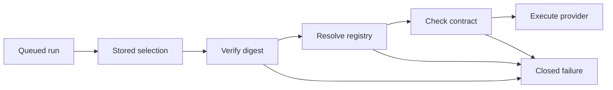

<!-- The failure branch does not call a provider or reroute to the current default. -->

### Historical M4 selection bridge

A future storage migration eagerly maps every persisted legacy M4
`ConfigRevisionId` to one immutable `LegacyM4SelectionBindingDto` for its
supported safe snapshot. Equal supported M4 safe snapshots may share one
equivalent binding. The binding references the original legacy ID and snapshot
bytes without changing either, records validation of that supported M4 snapshot
schema, and materializes its deterministic first-party `default` profile ID,
profile revision, kind descriptor revision, capability subset, execution policy,
and M4 driver-contract revision. A canonical binding digest protects the bridge
fields. No binding is recomputed from future TOML at execution time.

An old queued run can execute only when the active `default` entry exactly
matches its binding and its current driver explicitly supports the materialized
M4 contract. Otherwise it receives the same closed unavailable outcome as any
other historical selection. The migration preserves the original `RunId`,
legacy `ConfigSnapshotDto`, event history, and replay data. It is additive:
neither old snapshot JSON nor an old UUID is replaced with a SHA ID. A missing,
malformed, or digest-inconsistent binding is
`historical_selection_corrupt`; it permits readable replay where possible but
never a reconstruction from current TOML.

Generic Chat endpoint validation is protocol aware. OpenRouter has no endpoint
override. Generic Chat requires a strict absolute HTTPS URL with a non-root API
base path. `responses` defaults to `https://api.openai.com/v1` but may use an
explicit compatible Responses endpoint. User-defined kinds require an explicit
endpoint. Only the explicit global
`allow_insecure_loopback_provider_http = true` policy, false by default, permits
HTTP for exactly `localhost`, `127.0.0.1`, or `[::1]`; no DNS resolution,
custom aliases, private-LAN hosts, or broader network permission is implied.
That effective policy enters each affected profile revision.

Endpoints reject userinfo, query, fragment, malformed percent escapes, decoded
control bytes, and control characters. Canonicalization lowercases scheme and
ASCII host, uses bracketed IPv6, removes default ports, strips only final path
slashes, and preserves valid percent-encoded routing bytes and case without
dot-segment resolution. The path must remain non-root. Model identifiers are
trimmed and non-blank but otherwise byte-exact, with no model-name heuristics.
Endpoint is safe non-secret metadata for authorized local clients only; tests
must prove a fake secret cannot cross through URL syntax or projections.

### Catalog lifecycle, history, and activation

An accepted catalog has one enabled global default. A candidate that removes or
disables the default must name another enabled default in the same atomic
candidate. A profile's `enabled` state is catalog availability metadata, not
profile-revision input. Disabled profiles cannot be selected by a session,
turn, fork, start-fork-run, model, IPython, or administrative override.

Catalog validation is all-or-nothing: one invalid profile rejects the candidate
and produces a bounded `ProviderCatalogValidationDto` with a total issue count,
the first bounded set of closed safe issue variants keyed by profile ID and
field category, and truncation. It never contains raw TOML, credential text,
configuration path, parser snippet, or source-location content. Disabled
profiles undergo the same structural and deterministic local driver preflight as
enabled profiles, so accepted catalogs contain no latent constructability error.
Preflight may construct SDK clients, parse endpoints, place opaque auth material,
resolve policy, and declare code-owned capabilities. It must never perform DNS,
HTTP, model discovery, credential validation, telemetry, or an SDK background
request.

The first catalog scope has the following fixed code-owned limits. They are not
TOML settings and cannot be raised by a client, profile, or candidate. Exceeding
one rejects the candidate before catalog acceptance with a closed typed
validation or policy result; it never truncates accepted execution semantics.

| Subject | Limit | Enforcement |
| --- | ---: | --- |
| `ProviderProfileId` and user `ProviderKindId` length | 63 ASCII characters | Reject the field before canonical revision construction. |
| Validated `display_name` length | 128 Unicode scalar values after trim and NFC normalization | Reject the field before catalog-digest construction. |
| Profiles in one catalog | 128 | Reject the candidate as oversized. |
| User-declared kinds in one catalog | 32 | Reject the candidate as oversized. |
| Raw candidate input | 512 KiB | Reject before unbounded parsing or private driver construction. |
| Safe validation issues returned | 32 | Return the first 32 deterministic issues, total count, and `truncated`. |
| Active private registry entries | 128 | One entry per enabled profile; reject an impossible over-capacity candidate. |
| Catalog page and removal-preview examples | 32 entries | Reject an oversized requested page; truncate examples with total count. |
| Pending-removal lifetime | 30 minutes | Expire the candidate as specified below. |
| Unavailable queue promotions per terminal transition | 8 | Stop the cascade and persist reconciliation-needed evidence. |
| Queue-reconciliation page | 32 selections | Process at most that many currently unavailable selections. |

`ProviderKindId` is immutable after its first accepted declaration. A candidate
cannot change the closed stream, reasoning, activation, budget/effort, or
credential-transport parts of an existing user-declared kind, including by
claiming a compatible descriptor revision; such a candidate fails with the
closed safe validation detail `provider_kind_immutable_mismatch`. The valid
path is to declare a new kind ID and explicitly reassign affected profiles.
First-party descriptor revisions remain code-owned compatibility data rather
than mutable user-kind definitions.

Credential-free catalog revisions and profile-revision rows are immutable,
append-only SQLite history. A current projection points to the active catalog.
Accepted profile removal writes a permanent `ProviderProfileTombstoneDto` with
only safe identity, removed catalog revision/time, and provenance. A candidate
cannot reintroduce a tombstoned ID. A candidate cannot remove a user-declared
kind while any resulting profile still references it; it fails with
`provider_kind_has_dependents`. It may instead remove or reassign every
dependent profile in the same atomic candidate, after which accepted kind
removal writes a permanent safe `ProviderKindTombstoneDto`. Existing historical
descriptor revisions remain readable for audit and historical verification; a
removed kind never receives a new live registration or a reused identity.

Catalog lifecycle evidence belongs to a dedicated typed configuration-audit
envelope/sequence rather than a synthetic session. It retains the complete
ordered lifecycle of every valid prepared candidate, not only accepted catalog
revisions. The closed taxonomy is:

```text
ProviderCatalogCandidatePrepared
ProviderCatalogRemovalPending
ProviderCatalogRemovalAccepted
ProviderCatalogCandidateRejected
ProviderCatalogCandidateExpired
ProviderCatalogAccepted
ProviderCatalogActivated
ProviderCatalogActivationRecoveryRequired
ProviderCatalogRecoveryCompleted
```

These facts contain only safe candidate/catalog revisions, opaque candidate or
operation identity where needed, bounded removal-impact summaries, timestamps,
and closed reason/detail values. They never contain raw TOML, credential data,
configuration paths, source file identity/content digests, private driver
material, or parser diagnostics. A parse or validation failure that never
produces a valid prepared candidate returns its existing bounded safe diagnostic
only; it cannot create a pseudo-candidate audit record.

Every successful local preparation appends
`ProviderCatalogCandidatePrepared` before any later lifecycle action. A
candidate with removals then appends `ProviderCatalogRemovalPending`. Its
successful acceptance orders `ProviderCatalogRemovalAccepted`,
`ProviderCatalogAccepted`, and `ProviderCatalogActivated`; a no-removal
candidate orders `ProviderCatalogAccepted` then `ProviderCatalogActivated`.
User rejection or expiry terminates the prepared/removal-pending attempt with
its corresponding closed event and never emits acceptance or activation. A
crash after acceptance orders
`ProviderCatalogActivationRecoveryRequired`, then a replacement
`ProviderCatalogActivated`, then `ProviderCatalogRecoveryCompleted` only when
the exact accepted registry is active again.

Candidate, durable catalog acceptance, and private runtime activation are
different states:

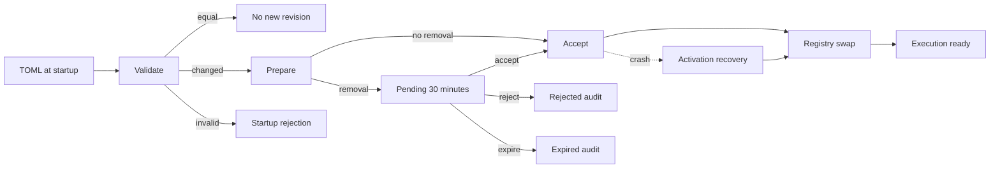

<!-- Preparation is local only. Publication follows the exact registry swap. -->

Preparation runs outside a short daemon-owned catalog command gate. The gate
serializes catalog acceptance, session default changes, turn/fork admission,
and registry lookups, but never blocks already active model tasks. Under the
gate, a prepared candidate rechecks its expected active catalog revision and a
private ephemeral source file identity/content digest. The daemon then commits
safe catalog history, tombstones, current projection, and
`ProviderCatalogAccepted` evidence as one transaction. That durable state is
explicitly accepted-but-not-activated until the exact private registry swap
succeeds; a successful swap records `ProviderCatalogActivated` before catalog
change/readiness publication. A removal additionally records
`ProviderCatalogRemovalAccepted` in the same ordered audit sequence.

Prepared opaque material is dropped and zeroized where practically supported
after conflict, failure, expiry, or rejection; no absolute memory-erasure claim
is made. Candidate rejection writes `ProviderCatalogCandidateRejected`; expiry
writes `ProviderCatalogCandidateExpired`. Neither event changes the active
catalog, restores omitted private credentials, or rewrites the source file.

Private enabled entries are keyed by exact
`(ProviderProfileId, ProviderProfileRevisionId, ProviderKindDescriptorRevisionId,
ProviderDriverContractRevisionDto)`. The descriptor revision captures the
validated typed protocol composition. Metadata-only catalog changes reuse an
enabled exact entry. Disabling removes it
from the active index after existing private `Arc` holders finish; enabling
constructs and validates it again before acceptance. Disabled profiles are
locally constructed for validation and then dropped. Each profile, including a
Responses profile or two profiles using the same user-defined kind, owns an
independent private client/driver entry even when model, endpoint, or credential
literal match a different profile. Composition owns this registry; no SDK type,
credential, client, handle, or registry resource crosses a DTO, persistence,
protocol, runtime public API, or adapter boundary.

The driver contract revision is a code-owned typed first-party kind or
descriptor-family plus monotonic major/minor contract. Its exact compatibility
rules are defined in [Historical selection verification and driver
compatibility](#historical-selection-verification-and-driver-compatibility):
same-family minor support is explicit and fixture-proved, while a major mismatch
fails closed. The separately persisted kind descriptor revision identifies the
selected declarative composition. Both are stored in each resolved run
selection, while only the descriptor revision is a profile-revision input. An
incompatible binary update makes affected queued work unavailable and fail
closed; it does not prevent a valid current catalog from activating or silently
rewrite old execution semantics.

### Startup-only profile application and degraded recovery

Provider profiles v1 remain startup-only. The user manually edits TOML and explicitly
uses the existing external daemon lifecycle to restart. No watcher, polling,
automatic restart, raw-TOML adapter transport, or restart protocol command is
introduced. At startup, valid profile additions, new user-kind additions,
profile execution edits, enable/disable, and display changes auto-accept. An
existing user kind never accepts an edited composition under its old ID; it
requires the new-ID migration rule above. A semantic-equal safe catalog writes
no new catalog revision/event but reconstructs the private registry from current
opaque credentials.
Therefore credential-only changes are intentionally invisible durable state: a
queued run with exact safe selection can use the new credential after restart.
This is an explicit deferred credential-rotation limitation, not account/key
generation tracking. Removal is the narrow exception. If a startup candidate
omits a previously active profile or an unreferenced user kind, it becomes one
process-local pending-removal candidate rather than auto-tombstoning identities.
A candidate that leaves a profile pointing to an omitted kind remains invalid
rather than becoming pending removal. The daemon exposes only degraded
administrative/read mode because changed TOML no longer contains the prior
private credentials. A random opaque expiring `ProviderCatalogCandidateId` keys
the private candidate; the public status separately exposes only its safe
candidate revision and a bounded impact preview.

`AcceptProviderCatalogRemovalCommandDto` is idempotent and contains the
candidate handle, expected active/candidate revisions, operation ID, and source
recheck. It atomically accepts removals, creates profile and kind tombstones as
applicable, records the ordered removal/acceptance audit evidence, and activates
the prepared registry. `RejectProviderCatalogCandidateCommandDto` drops the
private candidate and pending status only, then records
`ProviderCatalogCandidateRejected`; it cannot rewrite TOML or restore old
secrets/readiness, and leaves the daemon in degraded read-only mode with
`removal_candidate_rejected`. At most one candidate may exist. Its fixed
30-minute lifetime begins at `ProviderCatalogRemovalPending`; expiry drops its
private material, records `ProviderCatalogCandidateExpired`, and leaves the
daemon in degraded read-only mode with `removal_candidate_expired`. The only
way to prepare another candidate is a new external daemon start with a complete
candidate file.

The removal impact preview contains only removed IDs, global-default validity,
bounded affected session-default and queued-selection counts/examples,
tombstone consequences, and truncation. It never exposes prompts, paths, or
credentials. A removal candidate does not make an already absent tombstone a
new pending item; reintroduction of a tombstoned ID fails validation first.

Startup opens storage first and interrupts pre-existing unfinished runs before
any read response, using the existing provider-independent recovery rule and
its deterministic queue promotion without scheduling provider work. It then
prepares and activates the catalog to obtain execution readiness. A degraded
daemon still supports health, safe catalog status/validation diagnostics, and
existing session/run/tree reads, but rejects all provider-related state changes,
admission, promotion scheduling, and default selection changes with
`execution_not_ready`. The only degraded-mode exceptions are explicit
accept/reject commands for the one already prepared pending-removal candidate;
they do not admit model or tool work.

If a process crashes after durable catalog acceptance but before registry swap,
recovery evidence requires exact safe catalog reconstruction from TOML and a
new registry activation before any provider work can occur. Recovery records
`ProviderCatalogActivationRecoveryRequired` before that reconstruction and
`ProviderCatalogRecoveryCompleted` only after the exact accepted catalog is
active again. Mismatch, invalid configuration, or unavailable material leaves
execution not ready with `activation_recovery_required`; it never silently
adopts a different current file. The closed degraded reasons are
`removal_candidate_pending`, `removal_candidate_rejected`,
`removal_candidate_expired`, and `activation_recovery_required`.

A recovery-promoted `Starting` run is never scheduled automatically after
restart, even once catalog recovery succeeds. It remains a held durable active
run, does not prevent reads, and causes later user turns to queue behind it.
The user may issue idempotent `AdmitRecoveredRunCommandDto` with the exact
session/run identities and operation ID. It verifies the complete immutable
selection, enabled exact registry entry, driver compatibility, and active
catalog readiness before scheduling the existing run. Repeating an accepted
command cannot schedule a second task. A failed verification returns a closed
safe error and leaves the run held, so the user may retry after catalog repair.
The user may instead use the ordinary stop path; it terminalizes the held run
through `Starting -> Cancelling -> Cancelled` without provider, tool, or other
external work. This held-state disposition is the complete first-scope recovery
workflow, not a future automatic resume mechanism.

### Session selection, runs, queues, and usage

Creating a session copies the current global `ProviderProfileId` as its durable
future default. Global catalog changes never cascade through sessions. Migration
assigns existing sessions the migrated `default` identity while leaving old
`RunId` and `ConfigSnapshotDto` data immutable; legacy stored selections are
additively materialized through their eager M4 binding as the deterministic
`default` profile revision and M4 driver contract. They execute only through an
exact enabled compatible `default` entry, otherwise failing closed.

`SetSessionProviderProfileCommandDto` is user/client initiated, idempotent, and
optimistic: it takes a session, enabled profile ID, expected session projection
revision, and operation ID. It changes only future intent, emits a closed
`SessionProviderProfileChanged` event and snapshot when changed, and cannot
alter active or queued work. A request for the existing profile is a successful
`changed = false` no-op with no new event. A session may retain an unavailable
profile ID only after later catalog disable/removal; an explicit command cannot
select a disabled or absent profile.

`GetSessionProviderProfileQueryDto` returns the durable intent, the current
safe resolved entry/revision when available or a closed unavailability reason,
the session projection revision, and the global default for reference. Current
availability is always a daemon-computed read projection over immutable intent
or selection plus active catalog/registry. It carries the evaluated catalog
revision and activation status, and never mass-rewrites session or queue
projections after a catalog change.

`SendUserTurn`, `ForkSession`, and `StartForkRun` accept an optional safe
profile ID and optional expected profile revision. A per-turn or fork override
changes only that accepted run; it does not mutate the durable session default.
When no override is supplied, the daemon resolves the session's durable profile
ID. If an expected revision is supplied for either source, a mismatch rejects
before a user turn, queue item, fork, or run is committed. The daemon checks
the exact enabled registry entry before durable admission; registry failure
returns `provider_profile_runtime_unavailable` and accepts no user intent.

Every accepted starting or queued turn persists and returns one
`ResolvedRunProviderSelectionDto`: profile ID, profile revision, kind ID, kind
descriptor revision, model, normalized effective endpoint, credential transport
metadata, declared model-capability subset, resolved reasoning policy, effective
execution policy, applicable loopback policy, driver-contract revision, and
source (`session_default` or `turn_override`). The source is safe immutable
provenance but not an execution-digest or profile-revision input. Each run
selects exactly one profile, with no fallback chain, model-based routing,
ensemble, or retry on another profile.
The model receives only the concrete provider/model/capability context needed
to execute its run, not catalog/profile IDs, endpoint, display name, defaults,
or other profiles.

Fork history retains original resolved revisions. A child session copies the
source durable profile ID as its future default, including an unavailable intent
and safe warning when necessary; a valid explicit fork override can replace it.
`StartForkRun` follows the same one-profile resolution rules as `SendUserTurn`.

Within one daemon process, active runs continue with their captured private
handles across profile disable, removal, and catalog activation. Only explicit
run cancellation stops them. Every external daemon restart, including a
credential-only restart, interrupts every unfinished run before readiness;
neither a private handle nor external work survives that process boundary.
Queued selections never rewrite, and an exact queued selection may use fresh
private credentials after restart only after all safe execution fields verify.
At promotion, an unavailable exact selection creates the original `RunId`,
immediately records `Starting -> Failed` with stable
`provider_configuration_unavailable`, and includes the closed safe
unavailability detail selected in [Historical selection verification and driver
compatibility](#historical-selection-verification-and-driver-compatibility),
plus promotion provenance. No provider call occurs.

Unavailable promotion may continue FIFO only through eight unavailable
selections per terminal transition. Exhaustion writes a typed
queue-reconciliation-needed marker and starts no provider work. A user-only
idempotent `ReconcileUnavailableQueueCommandDto` handles at most 32 currently
unavailable immutable selections in one page: it terminalizes only those
selections, may promote the first available item, and never reroutes a prompt
to a current default or a new profile revision.

Usage remains provider normalized and is keyed by exact profile identity and
revision. Safe queries may aggregate by profile and separately by revision/model
without inventing price, currency, or estimated cost. Different profiles may
share all safe execution fields, including model ID, but remain independent
clients, selection identities, and usage groups. Presentation must show display
name or profile ID alongside model rather than treating a model string as a
unique target.

### Public protocol and presentation

`provider_profiles_v1` is one additive negotiated capability for paginated
catalog reads, catalog status, session default query/command, safe per-turn and
fork overrides, resolved-selection projections, pending-removal acceptance or
rejection, and explicit admission of a held recovered run. It does not imply
live reload, configuration editing, profile testing, credential entry, or model
discovery. Older clients retain generic execution-not-ready health and existing
session/run history behavior, but do not receive profile-specific DTOs.

The catalog list is bounded and paginated by opaque token, stable `ProfileId`
sort order, active `CatalogRevisionId`, and `has_more`; catalog change
invalidates a token with a typed conflict/resync. A safe entry includes profile
and catalog revisions, display name, enabled state, kind ID, kind descriptor
revision, exact model, normalized endpoint where applicable, effective policy,
declared model-capability subset, credential transport mode and safe header name
where applicable, `credential_configured`, deterministic driver-declared
capabilities, and local readiness. The closed readiness projection is `ready`,
`disabled`, or `unavailable`; it never claims network or credential health. A
separate `GetProviderCatalogStatusQueryDto` supplies the closed activation state
`preparing`, `active`, `pending_removal`, or `activation_recovery_required`,
the applicable closed degraded reason, active/candidate safe revisions, default,
safe validation/removal impact, and negotiated capability state without
requiring a catalog page.

In profiles v1, adapters may only read this safe state, set session defaults,
supply user-originated selection overrides, accept/reject a pending removal,
and admit a held recovered run. They never write raw TOML, create/edit/enable/
disable profiles or kind definitions, enter credentials, or receive config
paths. Those operations, physical v1-to-v2 TOML conversion, keychain/credential
rotation, persistent secret restoration, `TestProviderProfile`, pricing,
network discovery, arbitrary header maps, file watching, true controlled live
reload, and a full configuration control plane remain separate future decisions.

## Required verification portfolio

> **Historical verification scope retained.** Every original fixture below
> remains required for its recorded M4/first-scope semantics. Policy, corridor,
> quota, and fixed-limit fixtures test historical decoding and compatibility
> only; they do not define admission or ceilings for new Mandate work. The
> additive Mandate and verifier checks follow before the retained portfolio.


### Additive Mandate and delegated-verifier evidence

Any future authoritative implementation of the selected overlay must additionally
prove:

- Mandate identity/revision canonicalization; user-owned content/lifecycle
  decisions; distinct `Completed` and `Stopped`; one non-terminal fresh run; and
  no synthetic Mandate state for M4 or v1--v4 history;
- durable trigger capture before admission, coalescing while working, one
  downtime catch-up reason, FIFO ordering, held readiness reasons, and no
  hidden numeric retry/escalation threshold;
- known terminal outcomes returning `Working -> Active`, automatic fresh-run
  continuation for enabled Build-mode Mandates, and
  `ExternalEffectUnknown -> PausedAwaitingDecision` with no old-work resume;
- direct active-descriptor admission for compatible model/mode selections across
  every core tool, with denial only for typed input, descriptor, capability,
  mode, implementation, or runtime unavailability;
- removal of product ceilings for new Mandate paths while retaining canonical
  correctness and typed observable finite-capacity outcomes without truncation
  or silent loss;
- replacement-kernel and replacement-MCP-process fresh-run behavior, durable
  verified checkpoint-only reuse, no background trigger authority, Mandate child
  graph persistence, and Mandate-scoped activity across continuation runs;
- provider/catalog/registry/daemon readiness holding a trigger and permitting a
  fresh later run without fallback or recovered old-run admission;
- independent Verification Mandate ownership, explicit immutable target sets, no
  self-targeting/implicit expansion/child authority inheritance, authority and
  audit-contract digests, and full future-only delegated revisions;
- stale audit failure after any selected target baseline change, atomic
  idempotent target mutation, lifecycle-matrix enforcement, optimistic user
  conflict precedence, durable applied/rejected activity records, and safe
  ordinary versus urgent notification classification;
- delegated unknown-effect reconciliation only with explicit operation authority,
  original uncertainty reference, unchanged target baseline, and typed evidence,
  yielding only fresh `Resume` or `Stop` with no rollback/repeatability claim;
- verifier unknown-effect, cancellation, and recovery pausing the verifier only,
  with neither target mutation nor repeated external work; and
- `MandateRunExecutionMeaningV1` canonicalization, retained v1--v4 decoder
  compatibility, no synthetic historic selections, and redaction of objectives,
  evidence bodies, provider resources, process state, and raw tool content.


Any approved implementation of this concept must add evidence for:

- v0/v1-to-v2 in-memory migration through the stable `default` profile,
  legacy-after-v2 rejection, and tombstoned-`default` migration conflict;
- strict catalog TOML validation: slug grammar/reserved prefixes, 63-character
  profile/kind IDs, 128-character NFC display text, all-or-nothing profile
  validation, field-wise policy merge, 512 KiB candidate size, 128-profile and
  32-user-kind limits, 32 bounded validation diagnostics, mandatory enabled
  global default, reserved first-party kind IDs, valid global user-kind
  references, immutable existing user-kind composition, and rejected removal of
  a user kind with dependent profiles;
- closed kind-descriptor fixtures proving that only compatible compositions of
  versioned binary-owned stream, reasoning-output, activation, budget/effort,
  and credential-transport parts are accepted; plug-ins, raw JSON/HTTP
  templates, arbitrary fields, arbitrary header maps, multiple credentials,
  query credentials, and secret interpolation must fail before any driver or
  network work is created;
- kind/model capability-envelope fixtures proving that an exact profile model
  subset cannot exceed its selected descriptor, and that undeclared reasoning,
  effort, mode, summary, or custom-function behavior fails preflight before an
  outbound request;
- Responses fixtures proving the default OpenAI base versus normalized explicit
  compatible override, the `store: false` request invariant, local durable
  history context construction without Conversations or `previous_response_id`,
  and the absence of remote identifiers, encrypted reasoning, and opaque
  provider output items from storage, events, snapshots, logs, diagnostics,
  adapters, and model context;
- Responses reasoning fixtures for allowed effort/mode values and automatic
  summaries, proving a summary maps only to a distinct tail-only
  `ReasoningSummaryDelta`/durable fact, never to `ReasoningDelta`, raw
  chain-of-thought, model context, or a run snapshot; and
- unexpected Responses custom-function-call and provider-built-in-tool fixtures
  from a subset without `model_tool_loop_v1`, proving safe normalization failure
  rather than tool capability advertisement, `ToolCallDto` emission, or local
  tool execution;
- required-core registry fixtures proving the fixed fourteen `ToolId` slots,
  their assigned owner boundaries, one active canonical registration at most,
  duplicate/reassigned/direct-bypass rejection, and `Reserved -> Active`
  activation only by that owner through composition; a reserved slot exposes no
  model schema, admits no invocation, and yields only `ExecutionUnavailable`
  before external work; and no fixture requires all core tools to ship in one
  package or vertical slice;
- canonical `tool-descriptor-revision` and `tool-registry-revision`
  `typed-tlv-v1`/SHA-256 fixtures proving fixed field tables, fixed fourteen-slot
  order, active-descriptor revision inclusion, display/handle/readiness
  exclusion, retained decoders for executable revisions, readable-but-non-
  executable incompatibility, and no current-registry reconstruction;
- tool-effect fixtures proving the exact independent direct-effect mapping:
  workspace read for `read`/`glob`/`grep`/`expand`, workspace write for
  `write`, both for `edit`, process start for `execute`, network retrieval for
  `fetch_url`, user interaction for `ask_user`, session-state mutation for
  `todo`/`plan_submit`, retained-content read for `retrieve`, child-agent
  start plus child-agent control for `sub_agent`, and process start plus
  network retrieval for `mcp`; the profile is descriptive
  only and does not itself require confirmation or claim a process-effect
  inventory;
- WorkspaceRoot and mode fixtures proving that only `read`, `write`, `edit`,
  `execute`, `glob`, `grep`, and `expand` receive the default workspace base
  and CWD; absolute and escaping relative explicit paths execute without a
  path-based denial; plan access remains plan policy rather than ordinary
  workspace access; non-workspace tools receive their own typed references; and
  existing Plan/Build project-mutation restrictions remain unchanged;
- workspace-path observation fixtures proving lexical outside-root detection,
  best-effort resolved-link outside-root detection, safe metadata-only durable
  audit, no path or path digest in model/public values, no guessed observation
  for unavailable links, and no tool denial, retry, or result change when the
  audit write is unavailable;
- selected-tool snapshots proving `ModelToolLoopV1` persists the registry,
  admission-policy, and hook-pipeline revisions together with the ordered
  active descriptors actually supplied to model requests, never all slots or a
  later current registry;
- `execute` fixtures proving `ShellCommandTextDto`, private descriptor-selected
  shell interpretation, WorkspaceRoot CWD, separate typed stdout/stderr/exit
  status, bounded safe durable projection, cancellation/no-resume behavior,
  and no claim to enumerate direct or indirect process effects;
- `fetch_url` fixtures proving HTTP(S) `GET`/`HEAD` retrieval of public,
  private, and literal-loopback addresses; rejection of non-HTTP(S), userinfo,
  request bodies, request-header maps, cookies, and credential sources;
  bounded redirects/body content; and safe non-default response-header
  exclusion from model context; and
- `ask_user` fixtures proving ordinary long-running post-M4 tool-loop behavior:
  the run remains `Running`, independently admitted calls may finish, the next
  model step waits for the question's terminal result, and no post-M4
  tool-loop `WaitingInput` transition occurs while historical M3/M4 behavior
  remains byte-for-byte readable;
- `model_tool_loop_v1` fixtures proving that a valid non-empty terminal
  `ToolCalls` group creates one daemon-owned step/group record before any
  external work; malformed, duplicate, post-step, oversized, or otherwise
  inconsistent groups fail as `provider_tool_group_invalid` without a tool;
  legacy M4 tool evidence remains readable and terminates only with
  `tool_execution_unavailable`;
- typed model-tool-exchange fixtures proving that `ModelMessageDto` remains
  text-only, every `ToolCallId` is daemon-assigned, unique, and never reused,
  a descriptor translates the same local ordered exchange into each supported
  provider request without remote continuation data, and a descriptor that
  cannot do so fails preflight before provider work;
- model-tool group fixtures proving no more than 16 calls, one atomic group
  commit before all external work, independent admission/confirmation/denial,
  concurrent admitted calls, no whole-group stall for one confirmation, stable
  original-call order in the next model request despite arbitrary completion
  order, and no merge of concurrent external effects;
- tool-output fixtures proving immediate one-fragment durable facts and
  post-commit publication, per-call contiguous fragment positions on the shared
  run cursor, exactly one terminal result, no model access to partial output,
  the 512-KiB fact bound, one 4-MiB group limit consumed in durable commit
  order, no truncation, isolated `tool_output_limit_exceeded`, and continued
  independent calls after that result;
- tool-loop fault, cancellation, and recovery fixtures proving no automatic
  tool retry, known pre-effect denial/failure enters the next typed exchange,
  cancellation-before-start has no external effect, cancellation-after-start
  immediately suppresses later fragments/results and records only safe unknown
  effect evidence, non-cancellation ambiguity fails the run, and restart never
  resumes or duplicates external work;
- negotiated `model_tool_loop_v1` replay fixtures proving compact snapshots,
  automatic 256-fact/512-KiB bounded server-pushed tool-history pages,
  completion-before-live ordering under the publication gate, sparse shared
  cursors, typed resynchronization on unavailable history, and
  `model_tool_loop_required` for an unnegotiated client; and
- `model-capability-taxonomy-v1` fixtures proving canonical closed-record
  encoding, descriptor-envelope/profile-subset intersection, rejection before
  outbound work for unknown or incompatible values, and the absence of a
  second driver, model-name, or `supports_*()` capability source;
- `RunExecutionMeaningDto` v1/v2/v3/v4 fixtures proving immutable provider/
  capability/context/tool/reasoning/harness/goal/MCP/programmatic-policy/
  activity selection and terminal references; retained v1/v2 readability
  without a synthetic policy selection; retained v3 readability without a
  synthetic activity selection; live availability and policy tightening outside
  execution meaning; bounded compact snapshots; and absence of credentials,
  provider resources, raw tool output, reasoning text, implementation resources,
  raw policy/input content, activity message content, or live-ancestor
  substitution;
- canonical policy-selection fixtures proving `typed-tlv-v1`/SHA-256 records
  for `programmatic-caller-policy-revision`,
  `effective-programmatic-caller-policy-snapshot`,
  `programmatic-caller-policy-selection-v1`, `run-execution-meaning-v3`, and
  `run-execution-meaning-v4`;
  fixed increasing field tables; closed `Disabled` encoding; declared ordered
  policy references; digest change for every semantic field; rejection of
  duplicate, reordered, missing, corrupt, unknown, or incompatible fields; and
  retained old v1/v2 decoders and bytes without recomputation;
- common transaction fixtures proving one commit per accepted stream fragment,
  atomic multi-fact transitions, policy evidence committed with the outcome it
  governs, no provider/tool/process/kernel/network/external-effect hook work
  inside a state-transition transaction, and recovery of mixed started and
  admitted-only groups through `ExternalEffectUnknown`,
  `InterruptedBeforeStart`, and `Interrupted` without resumption; and
- combined reasoning/tool subscription fixtures proving one captured upper run
  cursor, `RunReplayDto`, reasoning pages and completion, tool pages and
  completion, then only later live frames; and
- wide stateless textual reasoning descriptor fixtures for each accepted field,
  activation, effort, and budget part, including the fixed order of `Primary`
  and `Detail` fields from one native response, equal-text non-deduplication,
  malformed/duplicate/post-terminal rejection, immediate one-fragment facts,
  summary distinction, shared-cursor ordering with text/tool/usage/finish, and
  mapping only to the closed normalized reasoning fact variants;
- reasoning-bound fixtures proving the existing 512-KiB individual fact limit,
  the 4-MiB combined fragment/summary limit, no partial write or truncation,
  no retry after the first reasoning or summary fact, and retained readability
  of facts committed before a terminal over-limit failure;
- typed cross-turn reasoning-history fixtures proving explicit
  `compatibility_id` equality rather than model-name inference; all causally
  preceding completed compatible assistant responses; ordered `Primary`,
  `Detail`, and summary transfer through a separate history; immutable manifest
  construction before provider work; 4-MiB whole-history rejection; and a
  missing, corrupt, incompatible, or unrepresentable reference blocking only
  the dependent run with no provider call;
- optional reasoning-usage fixtures proving absent is not zero, reported
  reasoning input/output are bounded components of reported totals, and
  replay, reconnect, inheritance, and tree aggregation never double-count a
  source `RunId`;
- negotiated `normalized_reasoning_stream_v1` fixtures proving automatic
  server-pushed pages through the existing 256-fact/512-KiB bounds, explicit
  initial-history completion before live frames, sparse reasoning pages with
  shared-cursor correctness, unavailable-history resynchronization, and no
  partially understood history for an unnegotiated client;
- branch fixtures proving `inherited_reasoning_history_references` enter the
  frozen base snapshot and canonical digest without copying reasoning text,
  ordinary `fork-model-context-v1` remains reasoning-free, child execution
  constructs its own immutable manifest only from frozen completed-response
  references plus child-owned completed compatible responses, and a missing
  inherited reference blocks only the dependent child run; and
- encrypted/opaque payloads, provider-native preservation controls, remote
  continuation identifiers, server-side parser setup, raw provider JSON, and
  unsupported assistant-history requirements must be rejected or remain
  unrepresentable;
- cross-platform versioned golden `typed-tlv-v1` and SHA-256 fixtures proving
  fixed tags, field ordering, type tags, big-endian lengths, optional/list/set
  encoding, duplicate/unknown-tag rejection, lowercase-hex IDs, and legacy
  UUID tagging; TOML order/whitespace, enabled state, and credential-only
  changes must have their selected effects on profile/catalog/run revisions,
  while every model, endpoint, kind/descriptor revision, credential transport,
  capability subset, reasoning policy, ID, and applicable security-policy change
  is exact;
- Unicode catalog fixtures proving display-name trim, control/bidi rejection,
  NFC normalization and stable digest bytes, while model IDs and normalized
  endpoint routing bytes remain byte-exact;
- immutable selection fixtures proving `CatalogRevisionId` and selection source
  do not change execution identity, while the complete resolved selection and
  applicable loopback policy do; and proving that catalog-only changes do not
  invalidate an otherwise executable queued run;
- eager legacy M4 binding fixtures proving old snapshot JSON, legacy UUIDs,
  `RunId` values, events, and replay remain unchanged, each unique safe
  snapshot receives one deterministic `default` binding, and runtime never
  lazily reconstructs the binding from current TOML;
- historical verification fixtures proving digest corruption, malformed TLV,
  unknown canonicalization version, missing/tombstoned/disabled profile,
  profile or descriptor revision mismatch, incompatible driver contract, and
  unavailable registry entry preserve readable replay where possible, return
  the compatible `provider_configuration_unavailable` plus closed safe detail,
  and make no outbound provider call;
- driver compatibility fixtures proving explicit per-minor declarations and
  preserved request, response normalization, stream ordering, capability,
  preflight, and redaction semantics, while a major mismatch always fails
  closed;
- strict URL fixtures for normalized HTTPS and permitted literal loopback HTTP,
  non-root paths, IPv6/default ports, percent bytes, and rejection of URL
  userinfo/query/fragment or fake-secret injection before safe projection;
- redaction fixtures proving raw TOML, credentials, URL-carried fake secrets,
  SDK resources, source digests, and private candidate material never appear in
  catalog history, snapshots, events, errors, logs, diagnostics, or adapters;
- deterministic local-only driver construction for enabled and disabled
  profiles, proving no DNS, HTTP, credential test, telemetry, model discovery,
  or background provider request occurs during startup/activation;
- immutable credential-free catalog/profile and complete candidate-lifecycle
  history, permanent profile/kind tombstones and ID non-reuse, ordered
  configuration-audit sequencing, global-default invariants, and valid duplicate
  safe selections with independent private clients;
- prepare/commit/swap fault injection after safe catalog write, profile/kind
  tombstones, current projection, each lifecycle audit event, and registry swap;
  stale source/candidate conflict, rejected candidates, 30-minute candidate
  expiry/disposal, and crash recovery must never admit a provider call before
  exact registry reconstruction;
- startup auto-accept/no-op, pending removal, 32-example bounded
  removal-impact preview, explicit accept/reject, 30-minute expiry with
  persistent degraded read-only behavior, recovery interruption before read
  response, and no automatic execution of recovery-promoted runs;
- exact registry-key isolation, active-run survival across disable/removal,
  disabled/absent/revision/driver-contract mismatch with no provider call, and
  compatible versus incompatible driver-contract upgrade fixtures;
- session default creation/migration, idempotent optimistic default changes,
  current availability projections, turn/fork/start-fork override expected
  revision conflicts, accepted selection results, and source provenance;
- exact immutable selection persistence in queued turns, eight-step unavailable
  promotion cascade, 32-selection user-only queue reconciliation, no reroute,
  and safe profile availability details for queue/session reads;
- held recovery-promoted run fixtures proving no automatic scheduling, exact
  enabled-registry/driver/selection checks before idempotent explicit admission,
  failed admission retaining `Starting`, and ordinary two-step cancellation with
  no provider, tool, or other external work;
- profile-keyed usage grouping without invented price/cost, multiple endpoints
  and equal-model profile isolation, and profile metadata omitted from model
  context/tool results;
- paginated catalog/status DTOs, stable token/revision behavior, local
  readiness/capability projection, `provider_profiles_v1` negotiation, and
  legacy-client generic degraded-health behavior;
- equivalent WorkspaceRoot, mode, confirmation, hook, audit, and durable
  publication outcomes when the same future capability is reached through a
  Python facade or a direct model tool;
- typed host-request validation, daemon-bound run identity, cancellation,
  bounded model-visible output, and safe error/redaction behavior for the
  selected Python kernel sidecar;
- private local attachment and `daemon_tool_gateway_v1` capability negotiation
  proving no second listener, TCP, HTTP, remote endpoint, or credential;
  failure of an unnegotiated or stale-expired grant peer before any bridge
  result, tool-history page, or live tool fragment;
- daemon-issued `BridgeRunGrantDto` proving the grant binds to one daemon-held
  active run context, never enters a snapshot/fact/log/diagnostic/model-message,
  and expires on terminal, interrupted, detached, or daemon-restart without
  reissue;
- `BridgeOperationId` equal-command idempotent replay returning the saved
  binding, admission state, or terminal safe result; changed-command reuse
  failing with `bridge_operation_conflict`; a lost response after durable
  admission never starting a second execution; and `bridge-invocation-v1`
  record-tag fixtures proving no grant value, credential, raw input, or
  implementation resource in the canonical digest;
- at most 16 unfinished operations on one attachment, pre-effect
  `bridge_concurrency_limit_exceeded` for a seventeenth, existing 1-MiB frame,
  64-frame/10-second slow-peer, 512-KiB fact, 4-MiB group, and 256-fact/512-KiB
  page bounds preserved with no wider bridge buffer or alternate deadline;
- `ToolCallId` demultiplexing of simultaneous operation streams on one
  persistent connection, post-commit fragment publication, terminal result
  delivery through existing `LiveBatch`/`Snapshot` without a separate result
  frame, and cursor-based durable replay after detachment without
  last-published-cursor or external-work repetition;
- channel close, `StopRun`, cancellation late-fragment suppression, and daemon
  restart proving no grant reissue, no bridge operation reissue or retry, and
  only safe read-only durable evidence (`InterruptedBeforeStart`,
  `ExternalEffectUnknown`, or known terminal result);
- semantic equivalence between a Python facade and an in-daemon direct-model
  ingress reaching the same gateway, registry, admission, hooks, durable
  publication, and safe projection; and
- session-scoped kernel fixtures proving lazy creation, one kernel per session,
  isolation between sessions, at most 16 live kernels, 60-minute idle disposal,
  and no kernel creation for queued turns or ordinary client attachment;
- kernel execution fixtures proving one foreground cell at a time, the
  ten-minute execution bound, per-run grant issuance and expiry, new
  `BridgeOperationId` values for later runs, and rejection of stale handles
  without queued execution;
- kernel output fixtures proving ordered typed text projection of Jupyter
  `stream`, `execute_result`, `display_data`, and `error` messages into the
  existing post-commit tool-output stream, the 512-KiB fact and 4-MiB group
  bounds, no truncation, and rejection or omission of rich/binary/raw-frame
  values;
- kernel checkpoint fixtures proving a bounded verified `kernel-state-snapshot-v1`
  after every successful cell, omission of unsupported values and resources,
  safe metadata-only public projections, corruption/incompatibility handling,
  and restoration of convenience values without grants, operations, tasks,
  processes, provider requests, or unfinished runs;
- kernel cancellation and failure fixtures proving cancellation destroys the
  sidecar, late output is discarded, started effects retain unknown-effect
  evidence, admitted-only operations receive `InterruptedBeforeStart`, kernel
  failure does not attach a replacement to the same run, and no next model step
  starts automatically;
- daemon-restart fixtures proving the old sidecar is not adopted, all
  unfinished runs become `Interrupted` before readiness, old grants and
  operations are not reissued, durable history remains replayable, and a later
  explicit run may restore only the latest verified convenience checkpoint;
- background-work fixtures proving local-only tracked computation cannot create
  a run, child agent, harness tick, grant, or bridge request after grant expiry,
  that late output is discarded, and cancellation, failure, idle disposal,
  shutdown, and restoration destroy the kernel and its background tasks;
- RLM child-agent fixtures proving the canonical `sub_agent` slot, closed
  `Create`/`GetStatus`/`AwaitResult`/`Cancel`/`EnqueueFollowUp` command family,
  daemon-assigned identities, durable `RlmParentLinkDto`, separate child
  session/run, immediate safe handle after atomic admission, and equal-operation
  idempotency without a second child;
- RLM tree-limit fixtures proving root depth zero, at most 16 direct root
  children, at most 3 children of each depth-one child, no depth-two children,
  64 total descendants, at most 16 concurrent non-terminal children, pre-effect
  typed failures at every boundary, and no queued seventeenth concurrent child;
- RLM class fixtures proving closed `Light`/`Medium`/`Heavy` resolution, 64,
  256, and 1,024 model-step limits, 360-minute lifetime from durable admission,
  immutable provider/profile selection, stronger-than-parent nominal-class
  admission only when every resulting programmatic-policy selector and bound
  narrows the parent, per-class permitted registered tool subset/kernel-rule/
  context/result-limit enforcement, rejection of raw model names, endpoints,
  credentials, or widened policy, closed
  `sub_agent_class_unavailable` failure when no configured class is available,
  no token ceiling without reported usage, and usage aggregation without double
  counting;
- RLM delegation fixtures proving bounded task-and-selected-dossier snapshots,
  inherited effective-policy and corridor references, no full-transcript or
  live-parent context, at most 512 KiB per snapshot and 4 MiB per root tree,
  no truncation, narrowing-only descendant use of the shared corridor budget,
  safe typed references, and closed unavailable/oversized/widening failures;
- RLM child-kernel fixtures proving a separate lazy child kernel, an
  independent full copy of only the latest verified parent
  `kernel-state-snapshot-v1`, exclusion of grants/tasks/processes/resources,
  empty namespace startup when no verified copy exists, no reverse
  synchronization, and preservation of the global 16-kernel limit;
- RLM lifecycle fixtures proving `GetStatus` is read-only, `AwaitResult`
  explicitly waits and returns either an at-most-512-KiB safe terminal
  conclusion plus a typed terminal-child-result reference or the distinct
  `ClarificationPending` observation; `Cancel` cascades only within the direct
  child's subtree; typed `Instruction`/`ClarificationReply` follow-ups reach
  only the child's next fresh request; follow-up after a child terminal decision
  and stale-handle revival of a terminal child are rejected; and
  sibling/unrelated-agent communication is rejected;
- RLM cancellation and recovery fixtures proving every parent terminal outcome
  cascades to the whole non-terminal child subtree, parent terminalization
  waits for those durable child outcomes, already-started effects retain
  unknown-effect evidence, admitted-only actions retain pre-effect evidence,
  daemon restart marks unfinished children `Interrupted`, and no child, grant,
  kernel, tool, or provider action resumes; and
- agent-activity identity fixtures proving one daemon-assigned
  `AgentActivityTreeId` is committed with every new root run, descendants retain
  it through their immutable parent links, no RLM child becomes a conversation
  branch, idempotent admission returns one identity, and M3/M4/v1/v2/v3 history
  receives no synthetic activity record or v4 selection;
- direct-pair messaging fixtures proving only a direct parent and child may
  exchange the four closed message kinds; one daemon-assigned pair identity and
  order span both directions; siblings, indirect relatives, adapters, bridges,
  kernels, MCP, and providers cannot address or read messages; ordinary messages
  do not consume the clarification reserve; and all 16/512-KiB directional,
  1,024-message/4-MiB tree, 4,096-record, 64-KiB-record, 16-reference, and
  256-record/512-KiB page limits reject before partial durable state;
- RLM message-exchange fixtures proving `Instruction`, `Report`,
  `ClarificationRequest`, and `ClarificationReply` persist individually without
  merging; use one journal order for every recipient's next fresh request;
  remain distinct from `ModelMessageDto` and `ModelToolExchangeDto`; never alter
  an already sent provider request; and no status, tool/MCP call, output,
  reasoning, or policy detail becomes a model message automatically;
- child-message-operation fixtures proving `Report` and
  `ClarificationRequest` use the narrow direct-link-bound internal RLM operation
  rather than a `ToolId`, `ToolCallId`, bridge call, registry call, or child
  control capability; equal replay returns the saved message; changed operation
  reuse fails; and the operation cannot create, cancel, or delegate a child;
- clarification fixtures proving one `ClarificationRequest` creates an
  `AwaitingClarification` state and a current `AwaitResult` returns only
  `ClarificationPending` with a safe reference; exactly one direct reply before
  the 60-minute non-pausing sublimit starts the next fresh step of the same live
  child run; timeout records `sub_agent_clarification_timeout`; and cancellation,
  parent terminalization, policy cascade, lifetime expiry, and restart reject a
  late reply without any resume or external-work repetition;
- activity-journal fixtures proving atomic activity record/index/snapshot and
  notification-reference commits, post-commit exact reread publication,
  dedicated bounded pages and initial completion before live frames, safe direct
  child status plus captured descendant summary, archive-only read retention,
  slow-peer isolation, and no reuse of `RunEventCursorDto` or historical M4
  stream frames;
- activity-projection and reference fixtures proving safe direct-message text
  and only the closed activity milestones reach the user, while tools, MCP,
  provider items, output, reasoning, prompts, paths, commands, grants,
  credentials, Python values, transcripts, and diagnostics remain absent;
  every allowed terminal/decision/evidence/goal/retained-content reference has
  identity, revision/cursor, digest, visibility, provenance, and no body; and
  `RetainedContent` requires separately admitted `retrieve` with unavailable,
  expired, incompatible, unauthorized, and over-limit handling without a
  current-state substitution;
- `agent_activity_v1` protocol fixtures proving one existing private local
  endpoint, dedicated activity DTOs rather than a widened historical
  `RunStreamFrameDto`, negotiated capability rejection, captured upper-sequence
  snapshot/pages/completion/live ordering, resynchronization, archive reads, and
  byte-for-byte unchanged M3/M4 subscriptions;
- user-notification fixtures proving one local-user append-only compact journal
  with no account, acknowledgement, or read state; `Urgent` versus `Ordinary`
  classification; ordinary summaries only at awaiting/terminal milestones;
  safety precedence over continual-harness `journal-only`; one coalesced urgent
  notification per activity tree and cancellation reason; separate later
  `ExternalEffectUnknown`; priority of urgent frames over coalescible ordinary
  summaries; and no notification delivery, reconnection, archive read, or slow
  peer recovery starts work;
- `user_notifications_v1` fixtures proving the existing private endpoint is
  reused without a second listener; a reconnect cursor yields one current
  redacted summary for each affected activity tree in deterministic order with
  at most 32 trees/64 KiB rather than replaying past alerts; old peers receive
  no partial new frames; safety/message/tool/provider/credential content is
  absent; and restart/replay never creates a child, model step, user question,
  confirmation, tool, MCP request, queue promotion, or external action; and
- model-stream-progress fixtures proving `model_stream_progress_timeout_v1`
  applies only while a future post-M4 provider stream is open, the sixty-second
  deadline is reset only by non-empty text or reasoning deltas, local tool,
  kernel, confirmation, `ask_user`, child-wait, retry, completing, and
  cancelling phases pause it, exactly one retry is permitted before the first
  durable content or other irreversible fact, no retry is permitted afterward,
  cancellation wins the race, late fragments are suppressed, historical M4 runs
  retain byte-for-byte replay and `tool_execution_unavailable` with no
  synthetic child-agent facts, and closed M4 attempt semantics remain
  byte-for-byte unchanged; and
- explicit proof that the bridge is not a sandbox, privilege boundary, or
  protection against a compromised user-authorized process;
- proof that the trusted local execution model is explicit: the daemon, agent,
  kernel, child agents, and tools run with the user's OS permissions, while
  WorkspaceRoot, mode, hooks, confirmation, and audit are not presented as
  OS-level isolation or protection from a compromised user-authorized process;
- compatible direct-tool schema/DTO contracts with no provider SDK, Python
  object, raw Jupyter frame, credential, or implementation resource escaping a
  public boundary;
- deterministic UUID-version-5 migration assigning every existing session one
  unique root `ConversationTreeId`, a separate root lineage record/audit fact,
  valid root projections, and no rewritten historical session events, turns,
  runs, queues, or snapshots;
- `fork-base-snapshot-v1`/`fork-preview-v1`/`fork-command-v1` `typed-tlv-v1`
  and `fork-base-snapshot-v2`/`fork-preview-v2` `typed-tlv-v2` golden fixtures
  proving their separate exact field tables, SHA-256 digests, v1 byte-for-byte
  preservation, v2 reasoning-reference inclusion, materialized message
  ordering, 1-MiB bound, no truncation, and no credential, raw provider, raw
  Jupyter, arbitrary-log, or implementation-resource leakage;
- atomic fork fault injection after source/head check, preview check, child,
  session snapshot, lineage, base snapshot, user anchor, ordinary event,
  lineage event, and idempotency writes, proving every failed stage leaves no
  partial branch, source change, or rate-quota consumption;
- equal-command idempotency returning one daemon-assigned child, changed-command
  reuse of a `ForkOperationId` failing with `fork_operation_conflict`, source
  sequence changes failing with `fork_source_changed`, and shown-preview
  differences failing with `fork_preview_mismatch`;
- strict closed user/final-assistant boundary fixtures, including rejection of
  queued turns, arbitrary cursors, partial facts, failed/cancelled/interrupted
  output, incomplete completion, pending interactions, unfinished external
  actions, and successful final completed runs that contain no assistant text;
- exact user-anchor provenance and captured model context proving the selected
  user content appears once and only once, completed assistant content follows
  only its causal user message, empty completed assistant output is not
  synthesized, and source continuation or sibling content never enters a child;
- deterministic materialized instruction/message context, full snapshot and
  context digests, corruption/unknown-version failures without a live-ancestor
  fallback, and per-reference `fork_reference_unavailable` failures that block
  only the dependent action;
- nested forks, archived-source forks, independent source/child active runs,
  independent recovery and queue promotion, no queued-turn inheritance, and no
  automatic external-work resumption;
- historical profile/mode/policy preservation together with explicitly visible
  future defaults and safe regenerate overrides;
- typed read-only provenance for terminal tool results, policy decisions, and
  terminal child results, empty typed collections for
  not-yet-produced categories, and usage aggregation without charging inherited
  `RunId` values twice;
- explicit `WorkspaceStateDto::Unverified` fixtures proving that the fork
  contract does not claim current-file or `execute` atomicity;
- bounded live adjacency tree pagination, stable `(created_at, child_session_id)`
  continuation, valid changed-between-page behavior, malformed/cross-tree/
  cross-parent token rejection, additive `session_fork_v1` negotiation,
  same-tree/project/workspace validation, and existing subscriptions remaining
  session-scoped;
- 128-scalar NFC title validation; idle-only reversible archive/restore,
  archived continuation denial, archived-source fork allowance, and independent
  session title/archive updates without lineage or snapshot rewrite;
- typed failures and transaction-before-write enforcement for depth 4,096,
  16,384 descendants, 16 accepted forks per source boundary in a rolling hour,
  1-MiB snapshots, and 64-summary pages; and
- redaction and failure coverage proving that adapters, events, snapshots,
  logs, diagnostics, and previews do not disclose credential-bearing source
  material;
- continual-harness rule fixtures proving atomic creation and new immutable
  revisions for project and session scopes, service-session separation, at
  most sixteen explicit sources, cycle rejection for completion links, pause
  and resume, explicit user launch during automation pause, cancellation,
  archive with retention, restore without automatic launch, and rejection of
  physical deletion;
- continual-harness trigger fixtures proving durable capture before
  admission, idempotent redelivery, at most one coalesced pending reason per
  rule, source/count/first/last/reference provenance, one coalesced catch-up
  after downtime, no missed-slot burst, and deterministic admission after a
  free concurrency slot;
- continual-harness schedule fixtures proving fixed-cadence interval
  semantics with a one-minute lower bound, project time-zone application and
  future zone changes, equal typed and five-part calendar canonicalization,
  rejection of contradictory forms, nearest-valid daylight-saving behavior,
  single firing for repeated local time, and no duplicate launch after a
  system-clock change;
- continual-harness dossier fixtures proving two-layer task and fresh
  admission-time summaries from explicit durable sources only, no live
  transcript/kernel/provider/grant/credential/path content, at most sixteen
  sources and sixty-four typed references, 512-KiB rejection rather than
  truncation, and immutable dossier digest binding to the admitted run;
- continual-harness checkpoint and result fixtures proving a separate
  optional typed verified checkpoint, digest/version/producing-run linkage,
  replacement only after complete validation, retention of the previous
  verified checkpoint after failure/cancellation/interruption/unknown effect,
  no stale-checkpoint substitution, and separate at-most-512-KiB safe
  conclusion rejection rather than truncation;
- continual-harness execution-boundary fixtures proving inherited narrowing
  from `Light`/`Medium`/`Heavy`, read-and-delegate behavior for the entire
  descendant subtree, permitted `read`/`glob`/`grep`/`expand`/`retrieve`/
  `sub_agent` enforcement, a user-confirmed typed harness corridor for every
  `sub_agent` launch, rejection of a missing/expired/exhausted/widened corridor
  and of direct write/edit/process/network/user-interaction/rule mutation, and
  preservation of WorkspaceRoot, mode, hooks, confirmation, redaction,
  admission, and model-progress policy;
- continual-harness limit fixtures proving 64 rules, 16 concurrent
  non-terminal works including sub-agents, sixteen sources per rule, 64 typed
  dossier references, cause-chain depth 8, 16 direct successors, and 256
  total launches from one original cause, with typed pre-effect failures and
  retained coalesced reasons at every boundary;
- continual-harness recovery and publication fixtures proving two-step
  cancellation with descendant cascade, `Interrupted` for unfinished harness
  runs after daemon restart, no resumed provider/tool/process/kernel/child/
  bridge/external work, new identities and new capacity for any later
  attempt, journal readability, linked-activity publication only after durable
  commit and reread, and byte-for-byte unchanged historical M4 behavior;
- continual-harness exclusion fixtures proving no autonomous continuation or
  autonomous harness goal mode, no client-disconnected work continuation or requeue, no
  attachment/image/binary/rich-MIME/multimodal payload, no plug-in/extension/
  skill/MCP installation or dynamic tool registration, and no long-lived
  process/worker/lease/attach/detach/force-kill/supervisor administration is
  introduced by this package.
- goal-tree fixtures proving daemon-assigned project/session identities,
  explicit project-goal-to-session links, obligatory project and session
  children, no cross-project/workspace ownership, cycle/self-link rejection,
  inherited narrowing, 256/64/16/32/64 limits, and atomic creation or rollback
  of links, revisions, projections, and audit evidence;
- goal-lifecycle fixtures proving independent `Active`/`NeedsRework`/`Paused`/
  `Stopped`/`Archived`, readiness, and user-decision facts; required-child
  blocking; technical readiness only after exact evidence; explicit accepted
  and accepted-with-exception outcomes; recursive child-exception provenance;
  manual terminal-idle archive/restore; and no physical deletion or implicit
  work on restore;
- goal-cancellation fixtures proving pause and stop prevent new goal runs and
  cascade through the entire non-terminal goal subtree, ordinary and
  verification runs, gates, and child-agent work using the two-step lifecycle;
  known pre-effect terminal outcomes, unknown started effects, no hidden retry,
  and no recovery resume;
- goal-run-selection fixtures proving exactly one leading goal or `Disabled`,
  frozen `GoalRunSelectionV1` and effective-programmatic-policy references/
  digests/bounds, ordinary versus `VerificationOnly` behavior, queue/fork/
  child/recovery preservation, future goal or policy edits affecting only later
  runs, live policy suspension/revocation as stricter denial only, safe readable
  failure for corrupt or unsupported snapshots, and no current-tree/context
  replacement;
- verification-gate fixtures proving exact reference evidence and executable
  user-created template revisions, terminal-phase and standalone verification
  runs, no raw command/path/URL/schema escape, result/evidence binding,
  invalidation after affected revision changes, `NeedsRework` after every
  required failure, known terminal timeout/cancellation/unknown-effect results,
  and exception acceptance only for named gate evidence;
- memory, skill, role, and template fixtures proving project/goal/session
  scope, immutable revisions, safe cards, explicit replacement and rollback,
  128-card/32-skill-role/512-KiB bounds, text-only skills, narrowing-only role
  application, no dynamic extension or registration, redaction, archive
  retention, and explicit bounded full-record disclosure only through
  `retrieve`;
- refinement-draft fixtures proving only selected terminal goal milestones may
  create one coalesced durable draft, exact provenance/base revisions/evidence,
  no current-state effect or model visibility before typed user decision,
  idempotent accept/edit/reject behavior, stale-base conflict, immutable new
  revision on acceptance/rollback, and retained harmless rejected history;
- conversation-compaction fixtures proving a cumulative summary covers one
  continuous completed durable range, builds only inside the active run from
  frozen sources, preserves original facts, honors 512-KiB/1-MiB/4-MiB bounds,
  creates immutable correction revisions, neither creates an autonomous run nor
  resumes after restart, and retains separate VFR/Headroom/kernel/harness/child
  semantics;
- fork and child-goal fixtures proving a branch copies only frozen applicable
  links/cards/revisions/summary references without creating a session goal or
  importing live ancestor state; references rather than copies its source
  session policies and shared counters; cannot obtain a fresh allowance through
  branching; and gives an admitted child only its bounded
  `GoalDelegationSnapshotV1` rather than a full parent transcript or future
  goal/memory/skill/role/policy revision;
- MCP-gateway fixtures proving `mcp` is the fourteenth fixed registry slot and
  the only MCP tool identity; user-created project/session connections and
  explicit typed service-method catalog revisions; no raw JSON/header map or
  dynamic method exposure; `HTTP`/`HTTPS` and one run-owned standard-input/
  output local process; no second listener/registry/authority; bounded safe
  progress but no MCP-created `ask_user`; exact policy effect-plus-method
  selectors and typed corridor constraints; frozen schema mismatch rejection
  before an effect; idempotency, cancellation, redaction, no MCP child/goal/
  run/message/confirmation control, local-process disposal on every terminal
  path, and no reattach/retry/resume;
- programmatic-policy fixtures proving the two closed root origins, daemon-
  assigned immutable calling-path provenance, active-run-only authority,
  intersection of project/goal/session rules by effect and exact tool or MCP
  method, direct local-read baseline only for an interactive root, and no
  fallback identity, current policy, raw input, or external action after an
  unavailable policy reference;
- confirmation and corridor fixtures proving one exact confirmation binds one
  `ToolCallId` and input digest; a corridor spans exactly one root tree, carries
  descriptor-declared typed input constraints only, shares count/concurrency
  across descendants, allows only narrowing, expires on every selected terminal
  condition, and rejects `execute`, raw commands, raw URLs, raw JSON, dynamic
  methods, untyped paths, child-started `ask_user`, and any widening before an
  external effect;
- policy lifecycle, counter, and draft fixtures proving immutable revisions,
  root-only user decisions, coalesced inactive drafts from selected milestones,
  denial, or limit exhaustion, exact-base acceptance conflicts, suspension's
  pre-start denial and reservation release, revocation's later inactive revision
  plus all-dependent-tree cancellation, no rollback claim for started work,
  archive-only retention, per-run and policy-owned calendar bounds, immutable
  day/week/month selection, next-window project time-zone adoption, atomic
  reservation/release/consumption, recovery without retry, and fork-shared
  counters; and
- combined goal/MCP/policy recovery and compatibility fixtures proving
  post-commit reread publication, `InterruptedBeforeStart` and
  `ExternalEffectUnknown` where applicable, no external-work continuation after
  restart, and M4 snapshots, events, `RunId` values, replay,
  `tool_execution_unavailable`, and historical `WaitingInput` behavior remain
  byte-for-byte unchanged.

The root `make quick` and `make verify` contracts remain mandatory. Any new
production crate or integration target must be registered in the
machine-readable architecture and coverage policy before its production code
is accepted.

## Concept preparation backlog and tracking checklist

> **Semi-autonomous preparation status.** The original backlog remains intact
> below for research traceability. The additive entries identify the Mandate and
> delegated-verifier prerequisites needed before any authoritative replanning;
> no entry authorizes implementation.


This backlog records the concrete concept work that remains before the
remaining directions in this document can be moved into authoritative architecture,
roadmap, crate-map, quality-policy, and decision-record changes. It is not an
implementation backlog, a milestone plan, or authorization to add a crate,
protocol, storage migration, or user interface.

An item is ready to check only when its selected semantics, compatibility and
failure behavior, durable/public boundary, and verification consequences are
specific enough to become an authoritative decision. An intentionally excluded
capability need not be designed before replanning, provided the resulting
authoritative scope continues to exclude it explicitly.

### Preparation status

The status below summarizes concept preparation across every direction. It is
not a delivery plan or priority order. `Selected constraints only` means that
specific target semantics are recorded in this concept, but they are not
approved architecture, implementation scope, or delivery authorization.
`Partially prepared` means that selected constraints exist alongside remaining
blocking decisions. `Not prepared` means that only high-level principles are
available. No row authorizes a milestone, crate, storage migration, protocol
change, configuration change, or implementation.

> **Legacy summary qualification.** Policy, corridor, confirmation, root-origin,
> reservation, and fixed-limit entries retained in the summaries and checklists
> below are selected historical compatibility evidence only. They are not
> requirements for new Mandate execution, which uses direct admission, no
> product ceilings, Mandate-scoped activity, fresh-run recovery, and
> `MandateRunExecutionMeaningV1`.

| Direction | State | Already selected | Still to decide | Candidate next decision package |
| --- | --- | --- | --- | --- |
| [Provider contracts and profiles](#selected-concept-constraints-provider-contracts-typed-kinds-and-reasoning) | Selected constraints only | `responses`, typed immutable user kinds, credential/endpoint policy, capability envelope/subset, immutable run selection, `typed-tlv-v1` SHA-256 identity, legacy M4 bridge, driver compatibility, catalog lifecycle/tombstones, full candidate audit, degraded recovery, held recovery promotion, queue reconciliation, first-scope limits, and the selected cross-direction taxonomy/snapshot/version rules. | No further first-scope profile decision. Controlled reload, credential rotation, health checks, model discovery, pricing, arbitrary headers, and configuration editing remain explicitly deferred. | None. |
| [Reasoning](#reasoning-support-in-generic-chat-completions) | Selected constraints only | Typed stateless dialect catalog; `Primary`/`Detail` fragments and summaries on one cursor; immediate durable facts; 4-MiB run/history bounds; typed textual cross-turn history and immutable manifests; optional reported reasoning usage; automatic paged initial delivery; frozen branch references; Responses effort/mode/summary; `store: false`; local-history-first; rejection of unexpected calls outside `model_tool_loop_v1`; and the selected cross-direction taxonomy/snapshot/version rules. | No further first-scope reasoning decision. Encrypted/opaque or remote continuation, provider-native preservation controls, server-side parser setup, semantic content inspection, and pricing remain explicitly deferred. | None. |
| [Capability plane, IPython, RLM, continual harness, goals, MCP, programmatic policy, and agent communication](#conceptual-execution-direction-ipython-and-a-unified-rust-owned-capability-plane) | Selected constraints only | Rust daemon authority, trusted-local execution model, recoverable Python convenience state, one shared Rust-owned gateway, `model_tool_loop_v1`, the 14-slot registry, daemon host bridge, session kernel, bounded `sub_agent` tree, continual harness, project/session goals, frozen leading-goal snapshots, gates, project/goal/session memory, skills, roles, compaction, user-confirmed proposals, one typed bounded MCP gateway, programmatic policy, direct-pair RLM messages, activity-tree identity, durable safe observation, and bounded two-level notifications. | Per-call cancellation and owner-specific semantics beyond the selected direct-pair communication remain deferred. | None. |
| [Session branching and regeneration](#non-destructive-session-branching-and-regeneration) | Selected constraints only | Separate child sessions, deterministic root trees, closed boundaries, materialized text context, whole typed base snapshots/digests, separate lineage audit, daemon-assigned child identity, source/preview optimistic checks, bounded live tree reads, reversible idle-only archive, typed reference provenance, `unverified` workspace state, fixed limits, and inherited session-policy references with shared counters. | No further first-scope fork-history decision. Tool-result execution, child-agent execution, physical deletion, export, and garbage collection remain explicitly deferred. | None. |
| [Cross-direction foundations](#cross-direction-decisions) | Selected constraints only | Credential-free provider/run selection boundary; provider-selection historical compatibility; `model-capability-taxonomy-v1`; `RunExecutionMeaningDto` v4; common fact, transaction, publication, recovery, activity/notification ownership, and historical-version rules. | No further first-scope cross-direction decision. Historical M4/v1/v2 selections remain readable; v3 adds programmatic-policy selection and v4 adds separately versioned activity selection. | None. |


### Semi-autonomous Mandate and verifier prerequisites

- [x] Select durable Mandate authority, lifecycle, separate `Completed` state,
  user ownership, automatic fresh-run continuation, FIFO/coalesced triggers,
  known-failure handling, and `ExternalEffectUnknown` pause semantics.
- [x] Select direct compatible active-descriptor admission and removal of
  product-level ceilings for new Mandate work while retaining intrinsic validity
  and typed observable capacity failures.
- [x] Select fresh-run provider/kernel/child/MCP recovery and Mandate-scoped
  activity semantics without old-work resumption.
- [x] Select Delegated Verification Mandates: immutable explicit target set,
  full delegated future revision, stale-audit failure, atomic/idempotent target
  mutation, and delegated unknown-effect reconciliation.
- [ ] Reconcile this research overlay into authoritative architecture, roadmap,
  crate map, protocol/storage ownership, quality policy, decision records, and
  delivery milestones before any implementation is authorized.

### Available next decision packages

No further first-scope concept-preparation package is selected. The detailed
checklists below remain the source of record for selected constraints and
deliberately deferred work. A later proposed direction requires separate concept
preparation before it is added to this matrix.

### Cross-direction decisions

- [x] Select the credential-free immutable provider/run selection boundary:
  canonical resolved profile, kind/descriptor, model, endpoint, credential
  transport metadata, capability subset, reasoning/execution/loopback policy,
  driver contract, and immutable source provenance; catalog revision, display,
  enabled state, credentials, opaque resources, and raw TOML remain outside the
  execution identity. Queued and promoted work retains that exact selection with
  no fallback or current-TOML reconstruction.
- [x] Select provider-selection historical identity and compatibility: closed
  `typed-tlv-v1` SHA-256 revisions, explicit legacy UUID bridging, readable but
  non-executable corrupt/unknown historical selections, eager M4 `default`
  bindings, explicit driver family/major/minor compatibility, closed safe
  unavailability details, and no outbound call on verification failure.
- [x] Close the complete typed model-capability taxonomy with
  `model-capability-taxonomy-v1`: descriptor envelope, profile subset,
  immutable resolved intersection, closed text-only initial values, explicit
  unsupported structured output and non-text input, preflight rejection, and
  driver-contract compatibility. Future values require a new typed taxonomy
  version rather than a `supports_*()` convention.
- [x] Close the cross-direction immutable run-snapshot boundary with
  `RunExecutionMeaningDto`: persist safe provider/capability/context/tool/
  reasoning selection and terminal references; keep availability and readiness
  live; exclude credentials, provider SDK resources, opaque material, raw
  content, and implementation resources; and persist either
  `harness_selection = Disabled` or the separately versioned continual-harness
  selection for an admitted harness launch, plus either
  `goal_selection = Disabled` or `GoalRunSelectionV1` for a goal-directed
  launch, `mcp_selection`, the v3 selected programmatic-caller-policy snapshot,
  and the v4 selected activity-tree identity/revisions/limits for every new
  run.
- [x] Define common durable-fact, transaction, publication, and recovery rules:
  one owning sequence per fact; atomic state-transition writes; one transaction
  per accepted stream fragment; no external work inside a transition
  transaction; publication after durable reread; deterministic reasoning-then-
  tool initial history; audit-only separation; no-resume recovery; and
  `InterruptedBeforeStart` for admitted but never-started tool calls; plus
  separate bounded activity and local-user-notification journals that do not
  repurpose the run cursor or historical run stream.
- [x] Close the common historical-version policy: explicit ownership, execution/
  replay/audit classes, typed schema and canonicalization versions, additive
  bridge-only migrations, retained decoders and golden fixtures for claimed
  executable versions, readable-but-non-executable incompatibility, no current-
  state substitution, and M3/M4 byte-for-byte preservation.

### Provider profiles

- [x] Select provider kinds and dialect selection: `responses` is a
  first-party Responses API contract with a fixed OpenAI default base and safe
  compatible override; core `generic-chat-completion-api` remains narrow;
  incompatible first-party protocols use separate kinds; user kinds live in a
  global registry as declarative compositions of closed versioned parts; and no
  model-name heuristic, plug-in, raw template, or executable configuration is
  permitted.
- [x] Select one opaque-credential rule, closed single-secret transport, strict
  effective-endpoint policy, descriptor/model capability envelope and subset,
  immutable selection inputs, canonical provider-selection identity, bounded
  `responses` effort/mode, automatic-summary direction, and first-scope catalog
  limits. The common capability taxonomy is selected in the cross-direction
  closure.
- [x] Reconcile startup-only provider profiles with the separately deferred
  change-awareness, controlled-reload, and adapter-control-plane direction:
  external daemon restart is the sole application path, removal enters one
  30-minute pending candidate, degraded reasons are closed, active runs survive
  only within one process, every restart interrupts unfinished work, and a
  recovery-promoted run is held pending explicit user admission or cancellation.
- [x] Specify the exact canonical representation for
  `ProviderProfileRevisionId`, `CatalogRevisionId`, and related safe
  configuration identity: `typed-tlv-v1` with fixed field tags and types,
  big-endian lengths, canonical collection ordering, SHA-256, tagged lowercase
  hex IDs, NFC display-name handling, explicit loopback-policy applicability,
  excluded catalog/provenance fields, and additive fail-closed migration rules.
- [x] Choose concrete bounded values and enforcement behavior: 63-character
  profile/kind IDs, 128 profiles, 32 user kinds, 512 KiB candidates, 32 safe
  diagnostics, a 30-minute pending-removal lifetime, 128 registry entries,
  eight unavailable promotions, and 32-entry reconciliation/pages/previews.
- [x] Specify the driver-contract compatibility contract: code-owned
  family/major/minor revisions, explicit per-minor compatibility declarations,
  fixture proof of preserved wire/normalization/preflight/redaction semantics,
  major-mismatch rejection, and fail-closed behavior for queued or historical
  selections after an incompatible binary upgrade.
- [x] Specify catalog lifecycle and recovery: immutable user-kind composition;
  no kind removal with dependent profiles; atomic profile/kind tombstones;
  complete ordered candidate/acceptance/activation/recovery audit; exact
  prepare/accept/swap recovery; closed degraded reasons; and explicit held-run
  admission or two-step cancellation after recovery promotion.

### Non-destructive session branching and regeneration

- [x] Specify fork history and immutable context: independent child sessions,
  deterministic UUID-version-5 root tree IDs, two closed boundary forms,
  materialized `fork-model-context-v1` messages/instructions, whole
  `ForkBaseSnapshotDto` records, versioned `typed-tlv-v1`/`typed-tlv-v2`
  SHA-256 snapshot/preview and `typed-tlv-v1` command digests, typed
  terminal-reference collections, and no live-ancestor fallback.
- [x] Close transaction, idempotency, migration, and event ownership: daemon
  child-ID assignment, source-sequence plus preview-digest checks, atomic
  child/lineage/snapshot/anchor/event/idempotency writes, separate lineage
  journal without source-event mutation, explicit conflicts, and additive root
  migration without historical rewrites.
- [x] Specify the public fork/tree contract: bounded command/result DTOs,
  user-only `session_fork_v1` negotiation, scoped same-tree/project/workspace
  reads, live stable-order pagination through 64 summaries, separate
  session-scoped subscriptions, and no tree-wide stream.
- [x] Choose first-scope branch-state and retention behavior: only
  `WorkspaceStateDto::Unverified`; typed read-only terminal provenance;
  reversible idle-only archive/restore; and fixed depth 4,096, 16,384 descendants,
  16 forks per source boundary per rolling hour, 1-MiB snapshots, 64-summary
  pages, and 128-scalar NFC titles.

### Rust-owned capability plane, IPython, RLM, and child agents

The items below form a dependency chain, not a flat list. The foundational
`model -> tool -> model` contract (item 1) is selected and is a prerequisite
for every remaining item. The base-tool registry (item 2) depends on item 1.
The host-bridge and gateway protocol (item 3) depends on items 1 and 2. The
selected IPython kernel lifecycle (item 4) consumes that bridge and is now
closed. The selected RLM child-agent model (item 5) is closed and consumes the
same bridge without changing its transport authority. The selected
continual-harness model (item 6) is closed and remains independent of kernel
convenience state. Policy and admission semantics (item 7) have their
first-scope per-call lifecycle in item 1 and their root origin, confirmation,
quota, inheritance, provenance, and active-run-only rules selected below. A
decision package should resolve item 2 before item 3, then carry the selected
policy into authoritative architecture. Items 4, 5, and 6 are selected above
and do not authorize implementation.

- [x] Specify the foundational `model -> tool -> model` contract:
  daemon-assigned model steps and local typed exchanges; `ToolCalls`-terminated
  groups of at most 16 independently admitted parallel calls; shared-cursor
  fragments plus one terminal result per call; immediate durable publication,
  512-KiB fact and 4-MiB commit-order group bounds; a text-only
  `ModelMessageDto`; fresh local-history model requests; no remote continuation
  or automatic tool retry; known pre-effect results visible to the next model
  step; immediate cancellation of started external work with unknown-effect
  evidence; no-resume recovery; compact snapshots; and negotiated paged replay.
- [x] Define the registered Rust base-tool contracts and registry for the
  selected required core: fixed owner boundaries and one immutable slot per
  `ToolId`; `Reserved` before owner-delivered `Active` descriptors; one
  composition-assembled registry with no direct bypass; typed descriptor/input/
  result boundaries; `tool-descriptor-revision` and `tool-registry-revision`
  `typed-tlv-v1`/SHA-256 identity; frozen per-run model-tool selection; the
  independent direct-effect profile; WorkspaceRoot default resolution/CWD and
  outside-root observation relation; and the
  selected `execute`, `fetch_url`, and `ask_user` contracts. This closure does
  not require one delivery slice or settle risk/confirmation policy,
  RLM, harnesses, or owner-specific semantics outside the selected initial
  contracts.
- [x] Specify the typed daemon host-bridge/gateway protocol used by a Python
  facade and future direct model tools: the existing private local transport,
  daemon-issued per-run grant, durable `BridgeOperationId` idempotency bound to
  daemon-assigned `ToolCallId`, one persistent stream of post-commit fragments,
  cursor-based durable replay after detachment, run-level cancellation/no-resume
  recovery, closed safe failures, and at most 16 unfinished operations per
  attachment. The bridge is transport only and never a second authority.
- [x] Define the IPython kernel lifecycle: a daemon-owned session-scoped lazy
  Python sidecar, at most 16 live kernels, 60-minute idle disposal, one
  foreground cell with a 10-minute bound, per-run grants and operation
  identities, verified `kernel-state-snapshot-v1` checkpoints after successful
  cells, clean kernel disposal on cancellation/failure/restart, textual safe
  output, bounded failures, no-resume recovery, and local-only background
  computation without post-grant bridge access.
- [x] Define the RLM child-agent model: `sub_agent` is the one canonical
  child-agent boundary with a direct-parent `Create`/`GetStatus`/`AwaitResult`/
  `Cancel`/`EnqueueFollowUp` command family, narrow child-originated
  `Report`/`ClarificationRequest` operations, and a direct-pair typed exchange;
  each child is a separate daemon-owned session/run with a durable
  `RlmParentLinkDto`, immediate safe handle, 16/3/depth-2/64 tree limits, 16
  concurrent children, 360-minute admission-to-terminal lifetime, a
  60-minute clarification sublimit, `Light`/`Medium`/`Heavy` classes with
  64/256/1,024 model-step limits, bounded task-and-dossier delegation,
  independent full verified-checkpoint kernel inheritance, explicit terminal or
  clarification-pending result waiting, targeted cancellation, bounded direct
  messages, all-parent-terminal cascade, progress-timeout future model steps,
  and no-resume recovery.
- [x] Define the continual-harness model independently of kernel convenience
  state: project and session rules, explicit durable sources, fixed-cadence and
  calendar schedules in the project time zone, coalesced pending and catch-up
  reasons, automation pause with explicit user launch, update-as-new-revision,
  archive with retention, two-layer bounded dossiers, separate optional verified
  checkpoints, inherited narrowed classes, read-and-delegate execution across
  the subtree, 64 rules, 16 concurrent works, one-minute minimum interval,
  512-KiB dossier/checkpoint/result bounds, 8/16/256 cause-chain bounds,
  no-resume external-work guarantees, and result integration with ordinary
  sessions and runs.
- [x] Define durable user goals, verification, working memory, compaction,
  skills, delegation roles, and MCP: project/session goals with obligatory
  trees and explicit session links; separate readiness and user acceptance,
  including recursively visible gate-only exceptions; leading-goal snapshots
  frozen per run; reference and executable gates with typed user-created
  templates; project/goal/session memory with explicit replacement; textual
  skills and narrowing-only roles with progressive disclosure through cards
  and `retrieve`; cumulative in-run summary revisions; durable milestone-bound
  model proposals that change nothing before typed user confirmation; and one
  typed `mcp` gateway with explicit methods, project/session connections,
  outgoing `HTTP`/`HTTPS` or one run-owned standard-input/output process, safe
  progress without MCP-created `ask_user`, no second authority, no dynamic
  registration, and no MCP-driven agent control.
- [x] Specify policy and admission semantics for programmatic callers: exactly
  two root origins, active-run-only daemon authority, immutable provenance,
  project/goal/session policy intersection with narrowing-only inheritance,
  direct interactive local-read baseline, exact confirmation or a tree-bound
  typed corridor for every other eligible action, root-only interaction,
  user-confirmed harness delegation, immutable v3 policy selection, live
  suspension/revocation, policy-owned calendar counters with atomic
  reservations, branch-shared counters, model-prepared inactive drafts, and
  closed safe failures. No policy permits a caller-selected identity, durable
  authority, raw corridor input, dynamic MCP method, automatic external-work
  resumption, or a harness rule before user confirmation.
- [x] Define selected direct-pair agent communication, observation, and
  notifications: a parent and direct child alone exchange the four closed
  message kinds in one pair order with bounded directional queues, a safe
  `RlmMessageExchangeDto`, explicit report delivery, clarification waiting and
  same-process continuation only; every root run owns an immutable activity
  tree, append-only safe activity journal, direct-child status and bounded
  descendant summary; and a local-user two-level notification journal publishes
  urgent and ordinary summaries with reconnect summaries, no read state, safety
  precedence, coalesced cascades, no second listener, and no execution
  authority. Broader graphs beyond a direct RLM pair remain excluded.

### Generic Chat Completions reasoning

- [x] Select the initial stateless textual reasoning catalog: closed typed
  descriptors may use the approved Chat Completions or native framing,
  `reasoning_content`, `reasoning`, `reasoning_details[].text`, or
  `message.thinking`; the approved activation, effort, and budget forms; and
  map textual output only to `ReasoningDelta`. A descriptor/model subset
  selects its support explicitly, never by model-name heuristic.
- [x] Select `responses` reasoning controls: closed effort and Responses mode
  values use capability-aware preflight; supported profiles request automatic
  summaries; summaries become separate tail-only `ReasoningSummaryDelta`
  evidence; `responses` v1 is `store: false`, local-history-first, and rejects
  unexpected custom function calls until the shared tool loop exists.
- [x] Define the normalized reasoning stream: `Primary` and `Detail` fragments
  plus distinct summaries preserve one shared run cursor with ordinary facts;
  every fragment persists immediately; descriptor-owned field ordering retains
  both allowed representations without equal-text deduplication; malformed,
  forbidden duplicate, and post-terminal values fail closed; snapshots remain
  reasoning-free; existing 512-KiB fact and new 4-MiB total bounds forbid
  truncation; and initial negotiated history is delivered automatically in
  server-pushed bounded pages before live frames.
- [x] Define first-scope cross-turn semantics: only descriptors with equal
  code-owned `TextualHistoryV1 { compatibility_id }` may transfer all causal
  completed compatible responses, including both fragment categories and
  summaries, through a separate typed history. Immutable manifests bind only
  references, digests, and sizes before provider work; missing, corrupt,
  incompatible, opaque, or over-limit material blocks only the dependent run;
  frozen branches retain typed references but ordinary fork context remains
  reasoning-free.
- [x] Define first-scope accounting and limits: optional reported reasoning
  input/output tokens are components of total usage and absent is never zero;
  replay, reconnect, inheritance, and tree aggregation do not double-count;
  per-run output and required transferred history are each capped at 4 MiB;
  this package adds neither prices nor inferred cost, and does not change
  VFR/Headroom, timeout, or execution-policy semantics.

### Deliberately deferred work that is not a prerequisite

The following items do not block preparation of a bounded direction when the
authoritative scope keeps them explicitly excluded: provider-profile UI and
raw-TOML editing; file watching, polling, and live reload; keychain-backed
credentials and credential rotation; provider health checks, model discovery,
pricing, and arbitrary authentication headers; sandbox/container/VM isolation
or privilege separation; destructive conversation-tree deletion or garbage
collection; tree-level metadata; cross-workspace clone/rebind; and delivery of
all RLM capabilities in one package.

The selected continual-harness model also deliberately excludes bounded
autonomous continuation or an autonomous harness goal mode; work, continuation,
or requeue after client disconnection; attachments, images, binary, rich-MIME,
or multimodal payloads; a general plug-in, extension, skill/MCP installation,
or dynamic tool-registration system; and administration of long-lived
processes, workers, leases, attach/detach, force-kill, or supervisor recovery.
These exclusions are not prerequisites for the selected harness model and
require separate future decisions if they are ever reopened. The selected MCP
gateway is limited to the typed user-created connections and run-owned local
processes above; it does not reopen those exclusions.

## Recommendation and sequencing

Do not reopen closed M4 or treat this concept as one implementation package.
The selected constraints must first move into the authoritative architecture,
roadmap, crate map, quality policy, and decision records through a separately
approved replanning change.

That replanning should preserve this dependency order without prematurely
assigning milestone numbers here:

1. Use the closed M4 baseline as the compatibility and safety foundation for
   provider profiles and immutable per-run selection. Controlled reload and
   its adapter UX remain distinct follow-on decisions.
2. Specify durable conversation-tree identity, fork boundaries, frozen context,
   storage migration, protocol, and client contracts before session-fork code
   or presentation work.
3. Keep branch workspace state unverified.
4. The selected cross-direction closure, shared typed model-tool loop,
   registered base-tool registry, selected daemon host bridge, selected IPython
   kernel lifecycle, selected RLM child-agent model, selected continual harness
   model, and selected programmatic-caller policy precede direct model tools
   and a Python facade that expose actions. Any authoritative implementation
   must preserve the selected root origin, frozen policy snapshot, exact or
   bounded user confirmation, narrowing-only delegation, live tightening,
   calendar reservations, and trusted user-privilege execution model rather
   than introduce an implicit isolation guarantee.

   **Mandate qualification.** For new Mandate execution, typed registry
   contracts, idempotency, durable commit and reread publication, redaction,
   immutable provider selection, fresh-run recovery, and trusted local
   execution remain active. Root origin, frozen policy snapshots,
   confirmations, corridors, delegation narrowing, live tightening, and
   calendar reservations are historical compatibility semantics only and must
   not gate a new Mandate tool call.
5. Add presentation only after each daemon/client contract exists. Persistent
   kernels, RLM delegation, session forks, continual harness, provider profiles,
   and reload must not be forced into one delivery package merely because this
   concept preserves all of them. Sandbox, container/VM isolation, privilege
   separation, and restricted-sidecar work are explicitly outside this
   direction, not deferred deliverables within it.

This sequencing preserves durable run and history immutability, queue
correctness, credential isolation, no-resume recovery, provider SDK boundaries,
and a bounded route from research constraints to an approved architecture.
