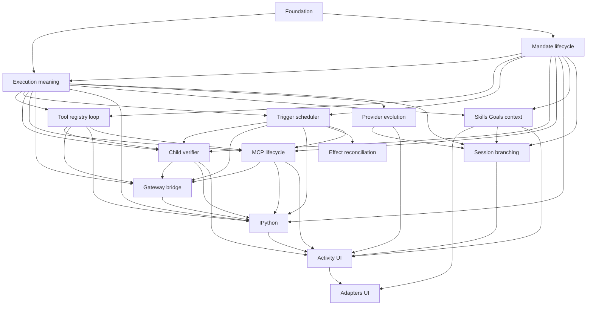

# Ownership and Dependency Map

## Layer ownership

| Layer | Future responsibility | Non-authority |
| --- | --- | --- |
| Domain | IDs, revisions, invariants, lifecycle/value DTOs. | Runtime tasks, storage resources, SDKs. |
| Storage | Atomic persistence contracts, snapshots, events, recovery facts. | Policy selection, external effects, provider/tool objects. |
| Protocol | DTO-only commands, queries, events, replay/negotiation families. | Local business authority or resource ownership. |
| Application/runtime | Admission workflows, lifecycle validation, operational transitions, recovery orchestration. | Concrete provider/tool/storage selection. |
| Mandate lifecycle package | Mandate aggregate, revisions, reasons, lifecycle, admission linearization, uncertainty pause, and fresh-run boundary. | Tool execution, scheduler topology, child/verifier/MCP authority, and adapters. |
| Execution-meaning package | Envelope, canonical identity, digest, decoder and historical compatibility. | Payload owner semantics, SQL/wire implementation, current-state fallback or adapter inference. |
| Tool registry and Mandate-loop package | Registry/descriptor revisions, frozen tool selection, direct Mandate admission, WorkspaceRoot policy, step/group loop, and tool-effect recovery. | Mandate lifecycle, execution-kind selection, child/MCP/verifier, bridge/kernel, provider evolution, scheduler, and adapters. |
| Scheduler and readiness package | Durable candidate reevaluation, typed readiness/capacity evidence, admission handoff, and scheduler recovery gate. | Lifecycle/reason authority, immutable meaning, tool admission, worker topology, child/MCP/verifier, bridge/kernel, provider evolution, and adapters. |
| Child graph and verifier package | Immutable child edges/delegation, direct controls, terminalization, child-local uncertainty, verifier authority/targets/audits, and target mutation. | Lifecycle/reason ordering, envelope/codec, scheduler admission, tool implementation, MCP, provider evolution, general activity/UI, and activation. |
| Mandate MCP capability package | Typed source/discovery, normalization, immutable capability/selection revisions, invocation binding, safe projection, disposal, and MCP recovery. | ToolId/registry creation, generic loop, lifecycle/scheduling, child/verifier/Goal/Skill authority, administration UI, plugins, supervision, and activation. |
| Gateway/RLM bridge package | Typed attachment, ephemeral grants, operation correlation, one-path ingress, safe replay/live delivery, cancellation propagation, and bridge recovery. | Registry/primitive selection, lifecycle/scheduling, child/verifier/MCP authority, kernel lifecycle, provider selection, sandboxing, and activation. |
| Run-scoped IPython kernel package | Private sidecar epochs, cells, checkpoints, safe projection, background-task disposal, kernel readiness, and kernel recovery. | Lifecycle/admission, registry/tool selection, bridge grants/operations, scheduler, child/verifier/MCP authority, sandboxing, and activation. |
| Goals, Skills, context, memory, and compaction package | Scoped Goal evidence, untrusted Skill disclosure, source manifests/model-step projections, typed memory, and immutable compaction. | Lifecycle/admission, scheduler, registry/tools, child/verifier/MCP/bridge/kernel/provider authority, prompt mutation, search/index implementation, and activation. |
| Provider evolution package | Provider kinds/profiles/catalogs, immutable selections/capabilities, driver compatibility, private translation, provider availability, and normalized reasoning. | Lifecycle/admission, scheduler/reason authority, registry/tools, context sourcing, child/verifier/MCP/bridge/kernel/branch/UI authority, remote continuation, and activation. |
| Session branching package | Ordinary Session tree/lineage, closed boundaries, frozen snapshots/context, atomic fork/idempotency, presentation state, and negotiated bounded projections. | Mandate lifecycle/admission, child/verifier authority, provider selection, context sourcing, external-effect rollback, workspace proof, activity/UI implementation, and activation. |
| Activity/UI/adapters package | Activity trees, direct-pair messages, safe journals, notification/acknowledgement projections, negotiated delivery, and adapter mapping. | Lifecycle/admission, child/verifier authority, provider selection, fork lineage, external effects, OS notification, and activation. |
| Continual-harness safe-failure and selection-record detail | Closed `harness_*` safe failures and the `ContinualHarnessSelectionV1` nested record. | Failure taxonomy classification as quotas, harness run-execution meaning, and activation. |
| Autonomous continuation direction | Build-mode Mandate default for Continue autonomously. | Ordinary Plan/Build behavior, old-run resumption, and activation. |
| Accepted deferred directions (activity metadata, content inspection, per-call cancellation) | Tree-level activity metadata, semantic content inspection, and owner-specific per-call cancellation. | Authority creation, raw content exposure, partial cancellation, and activation. |
| Accepted execution directions (control-plane editing, provider-native controls, fork execution, harness autonomy, RLM packaging) | Raw-TOML/configuration editing, model discovery, arbitrary headers, provider-native preservation, server-side parser, fork tool-result/child-agent execution, export, clone/rebind, harness goal mode, post-disconnect work, RLM packaging. | History rewrite, old-work resumption, live-state transfer, credential/raw-content exposure, and activation. |
| Tools/gateway | One typed capability path and descriptor contracts. | A second registry, lifecycle authority, or persistence authority. |
| Daemon | Process/task ownership, identity assignment, publication after commit. | Product decisions reserved to the user. |
| Composition | Concrete provider/tool/storage assembly. | Process hosting or a second runtime. |
| Adapters | Presentation and typed user commands. | Local lifecycle inference, private-resource administration, or bypasses. |

## Future package dependency shape

The graph is a planning dependency graph, not a promise that every node becomes
a crate. Any implementation split must preserve acyclic dependencies,
DTO-only boundaries, composition-only concrete selection, declared test targets,
and coverage/feature policy before activation.

## Effect reconciliation ownership

Effect reconciliation is a cross-cutting contract with one primary lifecycle
owner: architecture 13 owns the Mandate transition and reconciliation
transaction. Architecture 15 and other executor owners classify and report
attempt facts; architecture 17 owns explicit verifier authority; architecture 16
only reevaluates eligibility after reconciliation. The dependency graph edge to
reconciliation is a dependency, never scheduler or executor authority.
