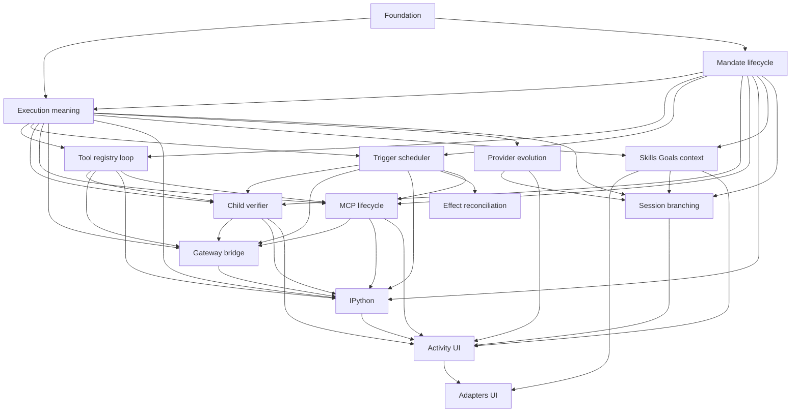

# Ownership and Dependency Map

## Layer ownership

| Layer | Future responsibility | Non-authority |
| --- | --- | --- |
| Domain | IDs, revisions, invariants, lifecycle/value DTOs. | Runtime tasks, storage resources, SDKs. |
| Storage | Atomic persistence contracts, snapshots, events, recovery facts. | Policy selection, external effects, provider/tool objects. |
| Protocol | DTO-only commands, queries, events, replay/negotiation families. | Local business authority or resource ownership. |
| Application/runtime | Admission workflows, lifecycle validation, operational transitions, recovery orchestration. | Concrete provider/tool/storage selection. |
| Mandate lifecycle package | Mandate aggregate, revisions, reasons, lifecycle, admission linearization, uncertainty pause, and fresh-run boundary. | Tool execution, scheduler topology, child/verifier/MCP authority, and adapters. |
| Execution-meaning package | Envelope, canonical identity, digest, decoder and historical compatibility. | Payload owner semantics, SQL/wire implementation, current-state fallback or adapter inference. |
| Tool registry and Mandate-loop package | Registry/descriptor revisions, frozen tool selection, direct Mandate admission, WorkspaceRoot policy, step/group loop, and tool-effect recovery. | Mandate lifecycle, execution-kind selection, child/MCP/verifier, bridge/kernel, provider evolution, scheduler, and adapters. |
| Scheduler and readiness package | Durable candidate reevaluation, typed readiness/capacity evidence, admission handoff, and scheduler recovery gate. | Lifecycle/reason authority, immutable meaning, tool admission, worker topology, child/MCP/verifier, bridge/kernel, provider evolution, and adapters. |
| Child graph and verifier package | Immutable child edges/delegation, direct controls, terminalization, child-local uncertainty, verifier authority/targets/audits, and target mutation. | Lifecycle/reason ordering, envelope/codec, scheduler admission, tool implementation, MCP, provider evolution, general activity/UI, and activation. |
| Mandate MCP capability package | Typed source/discovery, normalization, immutable capability/selection revisions, invocation binding, safe projection, disposal, and MCP recovery. | ToolId/registry creation, generic loop, lifecycle/scheduling, child/verifier/Goal/Skill authority, administration UI, plugins, supervision, and activation. |
| Gateway/RLM bridge package | Typed attachment, ephemeral grants, operation correlation, one-path ingress, safe replay/live delivery, cancellation propagation, and bridge recovery. | Registry/primitive selection, lifecycle/scheduling, child/verifier/MCP authority, kernel lifecycle, provider selection, sandboxing, and activation. |
| Run-scoped IPython kernel package | Private sidecar epochs, cells, checkpoints, safe projection, background-task disposal, kernel readiness, and kernel recovery. | Lifecycle/admission, registry/tool selection, bridge grants/operations, scheduler, child/verifier/MCP authority, sandboxing, and activation. |
| Goals, Skills, context, memory, and compaction package | Scoped Goal evidence, untrusted Skill disclosure, source manifests/model-step projections, typed memory, and immutable compaction. | Lifecycle/admission, scheduler, registry/tools, child/verifier/MCP/bridge/kernel/provider authority, prompt mutation, search/index implementation, and activation. |
| Provider evolution package | Provider kinds/profiles/catalogs, immutable selections/capabilities, driver compatibility, private translation, provider availability, and normalized reasoning. | Lifecycle/admission, scheduler/reason authority, registry/tools, context sourcing, child/verifier/MCP/bridge/kernel/branch/UI authority, remote continuation, and activation. |
| Session branching package | Ordinary Session tree/lineage, closed boundaries, frozen snapshots/context, atomic fork/idempotency, presentation state, and negotiated bounded projections. | Mandate lifecycle/admission, child/verifier authority, provider selection, context sourcing, external-effect rollback, workspace proof, activity/UI implementation, and activation. |
| Activity/UI/adapters package | Activity trees, direct-pair messages, safe journals, notification/acknowledgement projections, negotiated delivery, and adapter mapping. | Lifecycle/admission, child/verifier authority, provider selection, fork lineage, external effects, OS notification, and activation. |
| Continual-harness safe-failure and selection-record detail | Closed `harness_*` safe failures and the `ContinualHarnessSelectionV1` nested record. | Failure taxonomy classification as quotas, harness run-execution meaning, and activation. |
| Autonomous continuation direction | Build-mode Mandate default for Continue autonomously. | Ordinary Plan/Build behavior, old-run resumption, and activation. |
| Accepted deferred directions (activity metadata, content inspection, per-call cancellation) | Tree-level activity metadata, semantic content inspection, and owner-specific per-call cancellation. | Authority creation, raw content exposure, partial cancellation, and activation. |
| Accepted execution directions (control-plane editing, provider-native controls, fork execution, harness autonomy, RLM packaging) | Raw-TOML/configuration editing, model discovery, arbitrary headers, provider-native preservation, server-side parser, fork tool-result/child-agent execution, export, clone/rebind, harness goal mode, post-disconnect work, RLM packaging. | History rewrite, old-work resumption, live-state transfer, credential/raw-content exposure, and activation. |
| Accepted retained-deferral directions (kernel output projection, retention policy, supervision topology, calendar semantics, activity limit classification) | Rich MIME/raw kernel output projection, physical deletion/GC retention policy, worker/process supervision topology, calendar/interval/time-zone/DST semantics, and activity numeric limit classification. | Raw-content/credential exposure, silent history cleanup, second runtime/authority, Mandate quotas, and activation. |
| M5+ complete foundation activation | The complete post-M5 foundation package: shared contract/version ledger, control-plane, harness, and UI-foundation slices; downstream consumers M6-M9. | M6-M9 milestone behavior ownership, second runtime/registry/scheduler/persistence authority, historical contamination, and activation. |
| Tools/gateway | One typed capability path and descriptor contracts. | A second registry, lifecycle authority, or persistence authority. |
| Daemon | Process/task ownership, identity assignment, publication after commit. | Product decisions reserved to the user. |
| Composition | Concrete provider/tool/storage assembly. | Process hosting or a second runtime. |
| Adapters | Presentation and typed user commands. | Local lifecycle inference, private-resource administration, or bypasses. |

## Future package dependency shape

## M5+ Slice 1 contract ownership

| Family | Semantic owner | Codec owner | Tag owner | Storage owner | Wire owner | Test target | Tier |
| --- | --- | --- | --- | --- | --- | --- | --- |
| Canonical meaning and selections | `intention-domain` | `intention-domain` | `intention-domain` | `intention-storage` + `intention-storage-sqlite` | `intention-protocol` | DTO/canonical goldens | Existing declared tiers |
| Public frames and negotiation | `intention-domain` facts | `intention-domain` nested values | `intention-domain` | existing storage owners | `intention-protocol` | negotiation/round-trip fixtures | Existing declared tiers |
| Typed tools and loop | `intention-tools` | `intention-domain` meaning | `intention-domain` | existing storage owners | `intention-protocol` | tool contract fixtures | Existing declared tiers |
| Provider translation | provider crates | provider-private translation | domain registry | existing storage owners | protocol DTOs | provider mapping fixtures | Existing declared tiers |
| Process/publication and assembly | `intention-daemon` / `intention` | domain codec | domain registry | storage owners | protocol | outcome/architecture fixtures | Existing declared tiers |
| Adapters | `intention-client`, then TUI/Tauri | client mapping | domain facts | no adapter authority | protocol client | adapter parity fixtures | Existing declared tiers |

## M5+ Slice 2 control-plane ownership

| Surface | Semantic owner | Codec owner | Tag owner | Storage owner | Wire owner | Test target | Tier |
| --- | --- | --- | --- | --- | --- | --- | --- |
| Provider catalog and capability resolution | `intention-domain` | `intention-domain` | `intention-domain` | `intention-storage` + `intention-storage-sqlite` | `intention-protocol` | `m5_control_plane_canonical`, `m5_catalog_runtime` | Existing declared tiers |
| Provider selection and rejection semantics | `intention-domain` | `intention-domain` | `intention-domain` | existing storage owners | `intention-protocol` | `m5_control_plane_rejections`, `control_plane_contracts` | Existing declared tiers |
| Session defaults and per-turn/fork overrides | `intention-domain` | `intention-domain` | `intention-domain` | existing storage owners | `intention-protocol` | `m5_session_selection_overrides`, `session_selection_client` | Existing declared tiers |
| Configuration reload and editing | `intention-config` | `intention-config` | domain registry | existing storage owners | `intention-protocol` | `m5_control_plane_config` | Existing declared tiers |
| Control-plane runtime (reload, rotation, health, discovery, pricing, raw-TOML/typed editing) | `intention-application` | `intention-domain` | domain registry | existing storage owners | `intention-protocol` | `m5_control_plane_runtime`, `control_plane_client` | Existing declared tiers |
| Reasoning surface (DTO-level) | `intention-model` | `intention-domain` | domain registry | existing storage owners | protocol DTOs | `m6_reasoning_surface` | Existing declared tiers |
| Current storage schema and durable rows | `intention-storage` + `intention-storage-sqlite` | domain codec | domain registry | `intention-storage-sqlite` | protocol | `sqlite_contracts` (current-schema tests) | Existing declared tiers |
| Daemon hosting and degraded gate | `intention-daemon` | domain codec | domain registry | storage owners | protocol | outcome/architecture fixtures | Existing declared tiers |
| Typed client surface | `intention-client` | client mapping | domain facts | no adapter authority | protocol client | `control_plane_client`, `session_selection_client` | Existing declared tiers |
| Composition and facade assembly | `intention` | domain codec | domain registry | storage owners | protocol | outcome/architecture fixtures | Existing declared tiers |

No second authority is introduced: the control-plane surface is served through
the daemon facade with typed commands and queries; health, discovery, and
pricing are non-authorizing; and there is no second runtime, registry,
scheduler, persistence authority, or sandbox. Fork wire commands remain Slice 4
even though the override fields exist on the fork DTOs and the resolution
service is implemented.

## M5+ Slice 3 harness, policy, and Goal ownership

| Surface | Semantic owner | Codec owner | Tag owner | Storage owner | Wire owner | Test target | Tier |
| --- | --- | --- | --- | --- | --- | --- | --- |
| Root-origin rework, typed v4 slots, and Slice 3 contract records | `intention-domain` | `intention-domain` | `intention-domain` | existing storage owners | `intention-protocol` | `m5_slice3_canonical`, `m5_slice3_wire_contracts` | Existing declared tiers |
| Continual-harness rules, triggers, dossiers, checkpoints, and classes (architecture 26) | `intention-domain` | `intention-domain` | `intention-domain` | `intention-storage` + `intention-storage-sqlite` | `intention-protocol` | `m5_harness_domain`, `m5_harness_runtime` | Existing declared tiers |
| Programmatic-caller policy, corridors, and reservations (architecture 27) | `intention-domain` | `intention-domain` | `intention-domain` | `intention-storage` + `intention-storage-sqlite` | `intention-protocol` | `m5_policy_domain`, `m5_policy_admission` | Existing declared tiers |
| Goal tree, lifecycle, and leading-goal selection (architecture 28) | `intention-domain` | `intention-domain` | `intention-domain` | `intention-storage` + `intention-storage-sqlite` | `intention-protocol` | `m5_goal_domain`, `m5_goal_runtime` | Existing declared tiers |
| Verification Mandates, authority, and gates (architectures 28/17) | `intention-domain` | `intention-domain` | `intention-domain` | existing storage owners | `intention-protocol` | `m5_verification_domain` | Existing declared tiers |
| Current storage schema and durable harness/policy/Goal rows | `intention-storage` + `intention-storage-sqlite` | domain codec | domain registry | `intention-storage-sqlite` | protocol | `m5_slice3_repos`, `sqlite_contracts` (current-schema tests) | Existing declared tiers |
| Daemon hosting and Slice 3 recovery | `intention-daemon` | domain codec | domain registry | storage owners | protocol | `m5_slice3_recovery` | Existing declared tiers |
| Typed client surface | `intention-client` | client mapping | domain facts | no adapter authority | protocol client | `m5_slice3_client` | Existing declared tiers |
| Composition and facade assembly | `intention` | domain codec | domain registry | storage owners | protocol | outcome/architecture fixtures | Existing declared tiers |

Slice 3 adds the `intention-domain` modules `slice3_selections.rs`,
`harness.rs`, `programmatic_policy.rs`, `goal_domain.rs`, and
`verification.rs`, the
`intention-storage-sqlite` repositories `harness_repo.rs`,
`programmatic_policy_repo.rs`, and `goal_repo.rs`, and the
`intention-application` services `harness.rs`, `programmatic_policy.rs`, and
`goal_domain.rs`. No new crate, dependency, feature profile, coverage tier, or
exclusion is introduced, and no second runtime, registry, scheduler,
persistence authority, or sandbox exists. The tool-descriptor, tool-registry,
model-tool-loop, bridge-invocation, and MCP-method-catalog behaviors remain
owned by architectures 15/19 (Milestone 11) and architecture 18 (Milestone 12).

## M5+ Slice 5 instruction-source ownership

| Surface | Semantic owner | Codec owner | Tag owner | Storage owner | Wire owner | Test target | Tier |
| --- | --- | --- | --- | --- | --- | --- | --- |
| Instruction source model and profile revisions | architecture 30 | declared by the activating specification (`intention-domain`) | declared by the activating specification (`intention-domain`) | `intention-config` for configuration; existing storage owners for safe provenance | declared by the activating specification (`intention-protocol`) | assembly and revision fixtures | Existing declared tiers |
| Workspace project instructions | architecture 30; boundary rules by architecture 05 | bounded text plus content digest | not applicable | digest only outside the projection | not applicable | boundary and absence fixtures | Existing declared tiers |
| Effective instruction projection and digests | architecture 30 | `intention-domain` | `intention-domain` | fork, plan, and handoff records through existing storage owners | protocol DTOs on the frozen records | freeze, inheritance, and digest fixtures | Existing declared tiers |
| Editing and preview control plane | architectures 30 and 25 | `intention-config` | domain registry | `intention-config` | `intention-protocol` | editing and preview fixtures | Existing declared tiers |
| Request delivery and driver translation | architecture 08 | existing model contract | domain registry | no durable instruction text | existing `system_context` channel | model and provider translation fixtures | Existing declared tiers |
| Primary UI surface | architecture 24 adapter rules | client mapping | not applicable | no adapter authority | protocol client | adapter parity fixtures (Milestone 6) | Existing declared tiers |

The fifth slice's activating specification names the exact crates, contract
versions, tag values, and coverage tiers; this package activates none of them.

The graph is a planning dependency graph, not a promise that every node becomes
a crate. Any implementation split must preserve acyclic dependencies,
DTO-only boundaries, composition-only concrete selection, declared test targets,
and coverage/feature policy before activation.

## Effect reconciliation ownership

Effect reconciliation is a cross-cutting contract with one primary lifecycle
owner: architecture 13 owns the Mandate transition and reconciliation
transaction. Architecture 15 and other executor owners classify and report
attempt facts; architecture 17 owns explicit verifier authority; architecture 16
only reevaluates eligibility after reconciliation. The dependency graph edge to
reconciliation is a dependency, never scheduler or executor authority.
