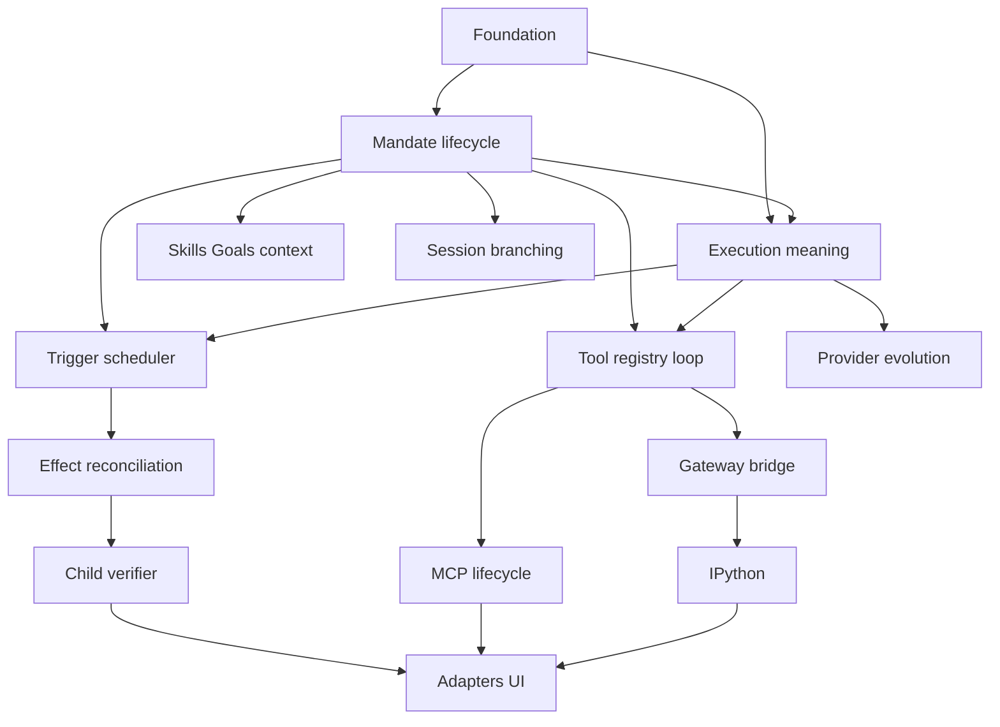

# Ownership and Dependency Map

## Layer ownership

| Layer | Future responsibility | Non-authority |
| --- | --- | --- |
| Domain | IDs, revisions, invariants, lifecycle/value DTOs. | Runtime tasks, storage resources, SDKs. |
| Storage | Atomic persistence contracts, snapshots, events, recovery facts. | Policy selection, external effects, provider/tool objects. |
| Protocol | DTO-only commands, queries, events, replay/negotiation families. | Local business authority or resource ownership. |
| Application/runtime | Admission workflows, lifecycle validation, operational transitions, recovery orchestration. | Concrete provider/tool/storage selection. |
| Mandate lifecycle package | Mandate aggregate, revisions, reasons, lifecycle, admission linearization, uncertainty pause, and fresh-run boundary. | Tool execution, scheduler topology, child/verifier/MCP authority, and adapters. |
| Execution-meaning package | Envelope, canonical identity, digest, decoder and historical compatibility. | Payload owner semantics, SQL/wire implementation, current-state fallback or adapter inference. |
| Tool registry and Mandate-loop package | Registry/descriptor revisions, frozen tool selection, direct Mandate admission, WorkspaceRoot policy, step/group loop, and tool-effect recovery. | Mandate lifecycle, execution-kind selection, child/MCP/verifier, bridge/kernel, provider evolution, scheduler, and adapters. |
| Scheduler and readiness package | Durable candidate reevaluation, typed readiness/capacity evidence, admission handoff, and scheduler recovery gate. | Lifecycle/reason authority, immutable meaning, tool admission, worker topology, child/MCP/verifier, bridge/kernel, provider evolution, and adapters. |
| Tools/gateway | One typed capability path and descriptor contracts. | A second registry, lifecycle authority, or persistence authority. |
| Daemon | Process/task ownership, identity assignment, publication after commit. | Product decisions reserved to the user. |
| Composition | Concrete provider/tool/storage assembly. | Process hosting or a second runtime. |
| Adapters | Presentation and typed user commands. | Local lifecycle inference, private-resource administration, or bypasses. |

## Future package dependency shape

The graph is a planning dependency graph, not a promise that every node becomes
a crate. Any implementation split must preserve acyclic dependencies,
DTO-only boundaries, composition-only concrete selection, declared test targets,
and coverage/feature policy before activation.
